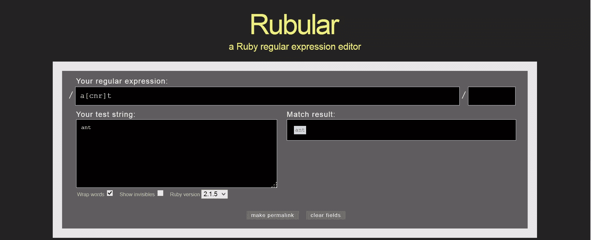
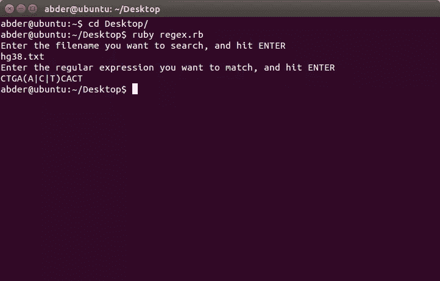

# 医学上的红宝石:寻找基因序列

> 原文：<https://www.sitepoint.com/ruby-medicine-hunting-gene-sequence/>

本系列的前几篇文章关注于处理非常大的文本文件。在某些时候，您可能有兴趣在这些大文件中搜索特定的模式。手动搜索一个大的文本文件是不可行的，所以在今天的文章中，利用开发人员行业中令人难以置信的工具是我们寻求帮助的地方。

## 正则表达式

[正则表达式(Regex)](https://www.sitepoint.com/learn-regex/) 就是为此任务而构建的。它们是编码的文本字符串，主要用于匹配和操作文本中的模式。他们在 20 世纪 70 年代出生于我们的世界。它们非常有用，被认为是强大的文本处理的关键。

更准确地说，正则表达式是包含普通字符和特殊元字符组合的字符串。正常字符的存在是为了匹配它们自己。另一方面，元字符表示字符的数量和位置等概念。

Regex 本身就是一种语言，有特殊的语法和指令来实现。它可以与编程语言(如 Ruby)一起使用，以完成不同的任务，例如:

*   在更大的文本(*即*我们非常大的文本文件)中寻找匹配模式的文本
*   用其他文本替换与模式匹配的文本
*   例如，搜索包含文本 *ant* 的文件，但如果该文本位于单词的末尾(*即* want)，则不搜索

这些只是一些可能的示例任务。这些任务的复杂程度从简单的文本编辑器的搜索命令到强大的文本处理语言不等。

底线是，作为一名 Ruby 程序员，您将拥有一个非常通用的工具，可以用来执行各种文本处理任务。

今天的例子将关注 regex 执行的主要任务类型:搜索(定位文本)和替换(编辑定位的文本)。

## 使用正则表达式搜索

当搜索文本时，尤其是当文本不是直接匹配时，正则表达式很方便。正如我们上面提到的，您可能有兴趣找到 text ==ant==。这很简单。但是当==ant==的位置很重要时，比如您想要*ant*而不是*想要*，regex 是完美的。

## 用正则表达式替换

regex 中的替换是 regex 搜索功能中增加的一项功能。可能需要替换的一个例子是，当您想要用可点击的 URL 替换提取(搜索)的 URL 时，即，具有 [HTML](http://www.w3schools.com/tags/att_a_href.asp) 的 URL。

## Regex 的味道

让我们用 regex 做一些简单的例子来热身。对于我们将要使用的一些元字符，您可以使用这些表作为参考。另外，作为测试正则表达式的一种方法，使用 [Rubular](http://rubular.com/) ，一个基于 Ruby 的在线正则表达式编辑器，用于测试正则表达式。

### 示例#1

让我们以这个正则表达式为例:

```
/a[cnr]t/
```

这个正则表达式告诉我们找到一种模式，其中文本以字母 **a** 开始，以字母 **t** 结束，中间的字母是 **c** 、 **n** 、 **r** 中的一个。

所以，在这种情况下，匹配的单词是 *act* 、 *ant* 和 *art* 。

在 Rubular 中测试如下:



### 实施例 2

让我们以这个正则表达式为例:

```
^Here
```

这个正则表达式匹配任何以**开始的字符串，这里是**。扬抑符(`^`)元字符强制模式从*开始*并跟随其后，在本例中为`Here`。例如，如果你有一个字符串*这是本书* _，它使用上面的正则表达式进行匹配。

### 实施例 3

```
book.$
```

这个正则表达式将匹配以 **book 结尾的字符串。**。美元符号元字符强制模式以其前面的内容作为*的结尾*。例如，这里的字符串*是书。*匹配这个正则表达式。

### 实施例 4

```
book
```

这将匹配包含单词 **book** 的字符串。例如，这个字符串将使用这个 regex *匹配表*中的书。

### 实施例 5

```
^[A-Z][a-z]+\s[0-9]*
```

哇哦。那是什么？？？别担心，这个正则表达式看起来很吓人，但并没有那么复杂。这个正则表达式告诉我们的是找到以一个大写字母(`[A-Z]`)、一个或多个小写字母(`[a-z]+`)、一个空格(`\s`)开头，以一个或多个数字(`[0-9]`)结尾的字符串。方括号(`[]`)表示一个范围，意思是匹配该范围内的任何内容。之后的`+`表示前一个表达式的一个或多个匹配。

这个表达式的匹配字符串的一个例子是 *Ali 2015* 。

当然，编写 regex 的方法有很多很多，这些只是一些例子。

## 寻找基因序列

一个[基因](http://www.medicalnewstoday.com/articles/120574.php)由四个不同的[核苷酸](http://en.wikipedia.org/wiki/Nucleotide)碱基组成，假设我们有成千上万个基因。这四个核苷酸是:

*   腺嘌呤
*   胞嘧啶
*   鸟嘌呤
*   胸腺嘧啶

这些核苷酸的不同组合赋予我们不同的特征。

在我们拥有的大文件中(来自本系列的前几部分)，你会注意到一长串基因序列。这是文件中包含的内容的一个非常小的快照！

```
AGGCTTCGATGCCCCTCCACACCCTCTTGATCTTCCCTGTGATGTCATCT
GGAGCCCTGCTGCTTGCGGTGGCCTATAAAGCCTCCTAGTCTGGCTCCAA
GGCCTGGCAGAGTCTTTCCCAGGGAAAGCTACAAGCAGCAAACAGTCTGC
ATGGGTCATCCCCTTCACTCCCAGCTCAGAGCCCAGGCCAGGGGCCCCCA
AGAAAGGCTCTGGTGGAGAACCTGTGCATGAAGGCTGTCAACCAGTCCAT
AGGCAAGCCTGGCTGCCTCCAGCTGGGTCGACAGACAGGGGCTGGAGAAG
GGGAGAAGAGGAAAGTGAGGTTGCCTGCCCTGTCTCCTACCTGAGGCTGA
GGAAGGAGAAGGGGATGCACTGTTGGGGAGGCAGCTGTAACTCAAAGCCT
TAGCCTCTGTTCCCACGAAGGCAGGGCCATCAGGCACCAAAGGGATTCTG
CCAGCATAGTGCTCCTGGACCAGTGATACACCCGGCACCCTGTCCTGGAC
ACGCTGTTGGCCTGGATCTGAGCCCTGGTGGAGGTCAAAGCCACCTTTGG
TTCTGCCATTGCTGCTGTGTGGAAGTTCACTCCTGCCTTTTCCTTTCCCT
AGAGCCTCCACCACCCCGAGATCACATTTCTCACTGCCTTTTGTCTGCCC
AGTTTCACCAGAAGTAGGCCTCTTCCTGACAGGCAGCTGCACCACTGCCT
GGCGCTGTGCCCTTCCTTTGCTCTGCCCGCTGGAGACGGTGTTTGTCATG
GGCCTGGTCTGCAGGGATCCTGCTACAAAGGTGAAACCCAGGAGAGTGTG
GAGTCCAGAGTGTTGCCAGGACCCAGGCACAGGCATTAGTGCCCGTTGGA
GAAAACAGGGGAATCCCGAAGAAATGGTGGGTCCTGGCCATCCGTGAGAT
CTTCCCAGGGCAGCTCCCCTCTGTGGAATCCAATCTGTCTTCCATCCTGC
GTGGCCGAGGGCCAGGCTTCTCACTGGGCCTCTGCAGGAGGCTGCCATTT
GTCCTGCCCACCTTCTTAGAAGCGAGACGGAGCAGACCCATCTGCTACTG
CCCTTTCTATAATAACTAAAGTTAGCTGCCCTGGACTATTCACCCCCTAG
TCTCAATTTAAGAAGATCCCCATGGCCACAGGGCCCCTGCCTGGGGGCTT
GTCACCTCCCCCACCTTCTTCCTGAGTCATTCCTGCAGCCTTGCTCCCTA
ACCTGCCCCACAGCCTTGCCTGGATTTCTATCTCCCTGGCTTGGTGCCAG
TTCCTCCAAGTCGATGGCACCTCCCTCCCTCTCAACCACTTGAGCAAACT
CCAAGACATCTTCTACCCCAACACCAGCAATTGTGCCAAGGGCCATTAGG
CTCTCAGCATGACTATTTTTAGAGACCCCGTGTCTGTCACTGAAACCTTT
TTTGTGGGAGACTATTCCTCCCATCTGCAACAGCTGCCCCTGCTGACTGC
CCTTCTCTCCTCCCTCTCATCCCAGAGAAACAGGTCAGCTGGGAGCTTCT
GCCCCCACTGCCTAGGGACCAACAGGGGCAGGAGGCAGTCACTGACCCCG
AGACGTTTGCATCCTGCACAGCTAGAGATCCTTTATTAAAAGCACACTGT
TGGTTTCTGCTCAGTTCTTTATTGATTGGTGTGCCGTTTTCTCTGGAAGC
CTCTTAAGAACACAGTGGCGCAGGCTGGGTGGAGCCGTCCCCCCATGGAG
CACAGGCAGACAGAAGTCCCCGCCCCAGCTGTGTGGCCTCAAGCCAGCCT
TCCGCTCCTTGAAGCTGGTCTCCACACAGTGCTGGTTCCGTCACCCCCTC
CCAAGGAAGTAGGTCTGAGCAGCTTGTCCTGGCTGTGTCCATGTCAGAGC
AACGGCCCAAGTCTGGGTCTGGGGGGGAAGGTGTCATGGAGCCCCCTACG
ATTCCCAGTCGTCCTCGTCCTCCTCTGCCTGTGGCTGCTGCGGTGGCGGC
AGAGGAGGGATGGAGTCTGACACGCGGGCAAAGGCTCCTCCGGGCCCCTC
ACCAGCCCCAGGTCCTTTCCCAGAGATGCCTGGAGGGAAAAGGCTGAGTG
AGGGTGGTTGGTGGGAAACCCTGGTTCCCCCAGCCCCCGGAGACTTAAAT
ACAGGAAGAAAAAGGCAGGACAGAATTACAAGGTGCTGGCCCAGGGCGGG
CAGCGGCCCTGCCTCCTACCCTTGCGCCTCATGACCAGCTTGTTGAAGAG
ATCCGACATCAAGTGCCCACCTTGGCTCGTGGCTCTCACTGCAACGGGAA
```

比方说，我们想要的基因序列以 **CTGA** 开始，以 **CACT** 结束。在这两种模式之间，我们想要一个**一个**， **C** ，或者 **T** 。

在关于处理大文件的教程[中，我们解决了打开大文件的问题。因此，您现在可以看到如此大的文件中的内容，但是您可以手动搜索我们的模式吗？我打赌你这样做将会很困难。](https://www.sitepoint.com/ruby-medicine-handling-large-files/)

Regex 来救援了！这将是一个使用正则表达式的简单任务。对于这样的模式，我们可以简单地告诉 Ruby 我们希望检索以下内容:

```
CTGA(A|C|T)CACT
```

## Ruby 和 Regex

Ruby 是一种非常正则表达式友好的语言。匹配我们想要的基因序列的 Ruby 脚本看起来像:

```
puts 'Enter the filename you want to search, and hit ENTER'
filename = gets.chomp
puts 'Enter the regular expression you want to match, and hit ENTER'
regular_expression = gets.chomp
input_file = File.open(filename,'r')
output_file = 'result.txt'
output_file = File.open(output_file,'w')
input_file.each_line do |regex|
  if (regex =~ /#{regular_expression}/)
    output_file.print regex
  end
end
exit
```

这个语句`/#{regular_expression}/`从`regular_expression`的内容中动态创建正则表达式，这些内容是我们从用户那里获取的。`=~`是 Ruby 的模式匹配操作符，Ruby 文档描述为:

> =~是 Ruby 的基本模式匹配操作符。当一个操作数是正则表达式，而另一个是字符串时，正则表达式被用作匹配字符串的模式。(该运算符由 Regexp 和 String 等效定义，因此 String 和 Regexp 的顺序无关紧要。其他类可能有=~的不同实现。)如果找到匹配，运算符返回字符串中第一个匹配的索引，否则返回 nil。

### 运行脚本

下面的快照显示了用于运行脚本的命令:



当程序成功运行时，会创建一个名为 **result.txt** 的文件，其中列出了出现模式匹配的行。你可以在这里查看我版本的 **result.txt** [。](https://www.dropbox.com/s/2nu7w86vpcb4da1/result.txt?dl=0)

## 更多正则表达式…

如果你想更深入地学习正则表达式，我推荐 O'Reilly 的书[掌握正则表达式](http://regex.info/book.html)。

祝你快乐！

## 分享这篇文章