# 在 AWS 上运行弹性灯堆栈

> 原文：<https://www.sitepoint.com/running-an-elastic-lamp-stack-on-aws/>

本文介绍了在云上设置和运行弹性 LAMP 堆栈的最简单的方法之一——在 AWS 上使用 Zend Server。

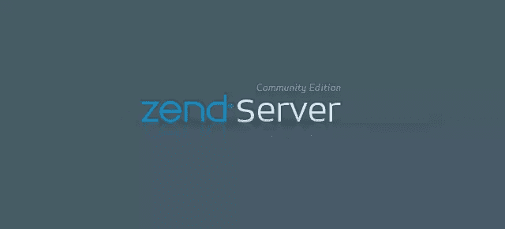

*注意:需要说明的是，这里的弹性不是指[弹性搜索](https://www.sitepoint.com/introduction-to-elasticsearch-in-php/)。*

更具体地说，这里描述的工作流包括启动预先配置的 AWS CloudFormation 模板，该模板设置 LAMP 堆栈的所有组件:Zend Server 的认证 PHP 堆栈加上 Zend Server 的所有附加功能(包括 Z-Ray)、MySQL 数据库、由附加 Zend Server 实例组成的 Zend Server 弹性组、弹性负载平衡器和其他预先配置的安全定义。

这篇文章非常适合那些考虑将他们的生产环境迁移到云的人，或者那些已经在 AWS 上建立了一个生产环境的人。

## 基本概念

[Zend Server](https://www.sitepoint.com/getting-know-zend-server-7/) 是一个面向 web 和移动 PHP 应用的应用平台，它自带了一个高级 PHP 堆栈和一套用于开发、调试、部署和监控应用的工具。如果你不熟悉 Zend Server，可以看看布鲁诺·什科沃茨的[文章](https://www.sitepoint.com/getting-know-zend-server-7/)了解一些背景知识。

[CloudFormation](https://aws.amazon.com/cloudformation/) 支持使用 Amazon EC2、负载平衡、自动扩展和其他 AWS 产品创建和提供 AWS 部署，以在云中构建应用程序。CloudFormation 使用一个模板文件将资源集合创建为一个堆栈，使您能够快速部署 PHP 应用程序，而不必担心创建和配置底层基础设施。

按照这里列出的步骤，你需要的只是一个有效的 AWS 帐户和 30 分钟的空闲时间。

## 步骤 1:启动堆栈

我们将从打开并登录 [AWS marketplace](https://aws.amazon.com/marketplace) 开始。

在页面顶部的搜索框中输入 Zend Server，我们会看到所有可用 Zend Server ami(Amazon Machine Instances)的列表。这个列表包含了各种各样的版本，每个版本都支持不同的 PHP 版本和 Linux 发行版。甚至有一个 PHP 5.3 LTS 实例可用。

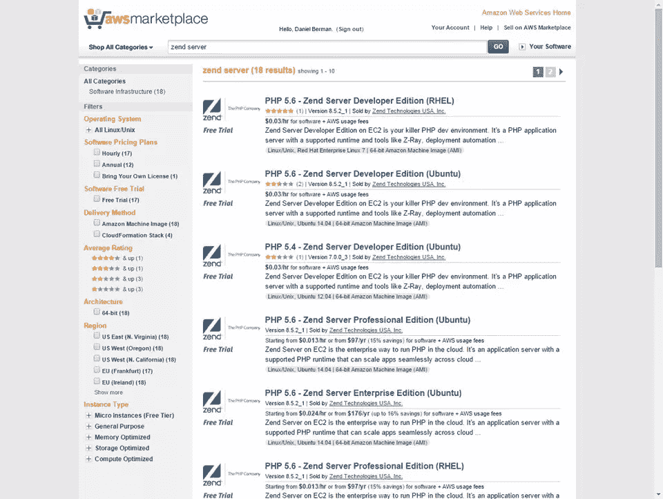

在这种情况下，我们将选择“PHP 5.6–Zend Server Professional Edition(Ubuntu)”实例。

值得注意的是，只有 Zend Server 的专业版和企业版支持集群，所以如果您对建立开发环境感兴趣，Developer edition 将完全满足您的需求。

在 AMIs 页面上，我们现在可以看到一些关于产品的一般信息、支持细节、有用资源列表以及定价细节。

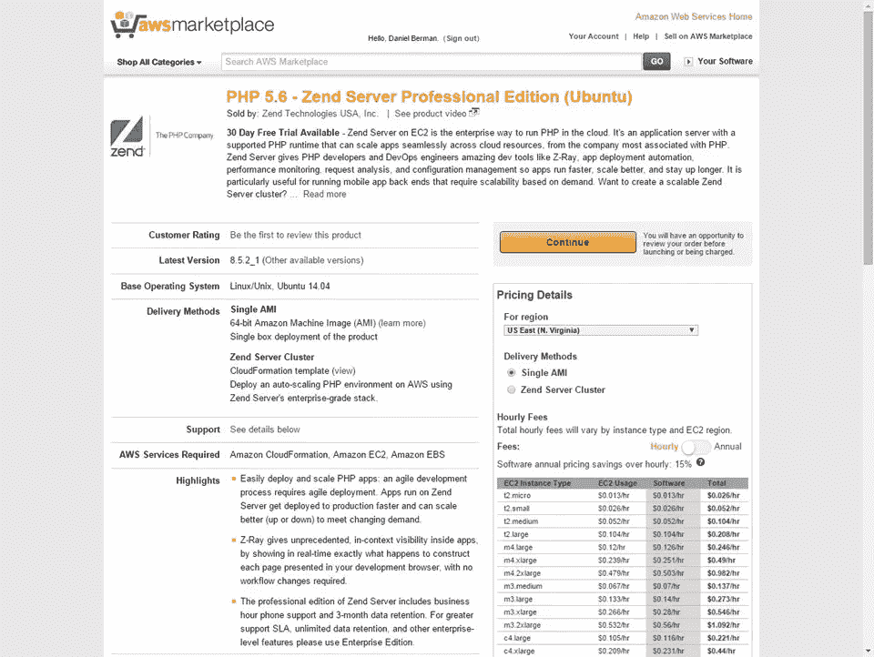

在 Delivery Methods 下，会显示一个 Zend Server cluster 选项，点击 **View** 会给出一个 Zend Server Cluster 的描述，以及 CloudFormation 模板的详细图表。

我们现在面临两种选择。我们可以下载模板文件，然后手动上传到单独的 AWS CloudFormation 向导中，或者我们可以在 CloudFormation Designer 中仔细查看模板。

CloudFormation Designer 是一个相对较新的可视化工具，允许您使用一个非常易用的界面轻松创建和修改 CloudFormation 模板。

我们将选择后一个选项，方法是单击对话框底部的链接。

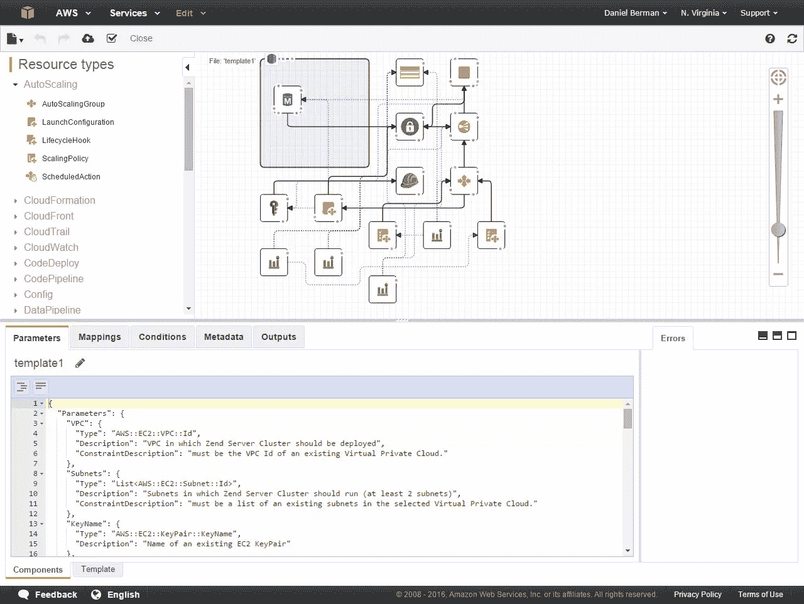

CloudFormation Designer 打开，显示我们预先配置的模板。设计器中间的图表显示了堆栈的各个部分:Zend 服务器、MySQL 数据库、弹性负载平衡器、云警报、VPC 安全组和由其他 Zend 服务器实例组成的自动扩展组。

如果需要，您可以轻松地将其他组件拖放到模板中。或者，您可以更改任何现有组件的设置，只需在图中选择它并编辑下面显示的文本文件。值得指出的是，使用模板应该谨慎，并且只有在您确切知道自己在做什么的情况下。

在我们的例子中，我们将使用默认的模板设置并继续。

下一步是创建堆栈。为此，我们将单击页面顶部的**创建堆栈**图标。

我们现在被发送到 AWS Create a New Stack 向导，我们可以看到在第一页上，我们的 CloudFormation 模板已经被选中。

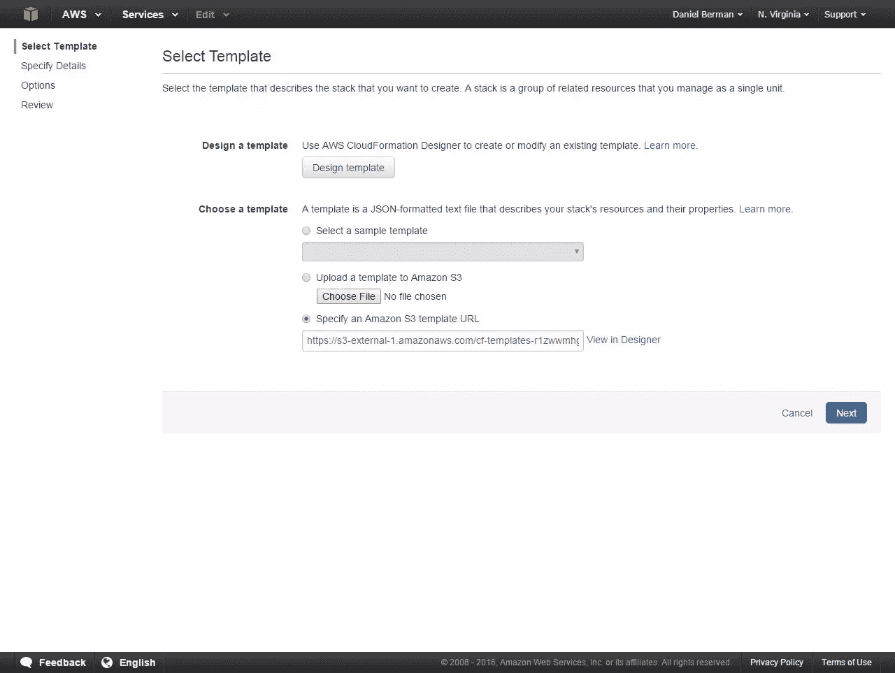

点击**下一个**，我们现在必须指定即将启动的堆栈的详细信息。

首先，我们将为堆栈输入一个名称，用于一般的识别和显示目的。

其次，我们需要配置网络配置。我们必须选择一个运行集群的 [VPC](https://aws.amazon.com/vpc/) 和两个子网。

下一步是配置对集群的访问。

我们需要首先选择一个现有的 EC2 密钥对来访问集群。如果尚未设置，请使用 EC2 控制台进行设置。然后，我们将输入用于访问 Zend Server 集群用户界面的密码(请记下这个集群，因为我们将在本教程的下一步中用到它)，以及用于访问集群数据库的用户名和密码。我们还可以选择输入电子邮件来接收 AWS 关于操作问题的通知。

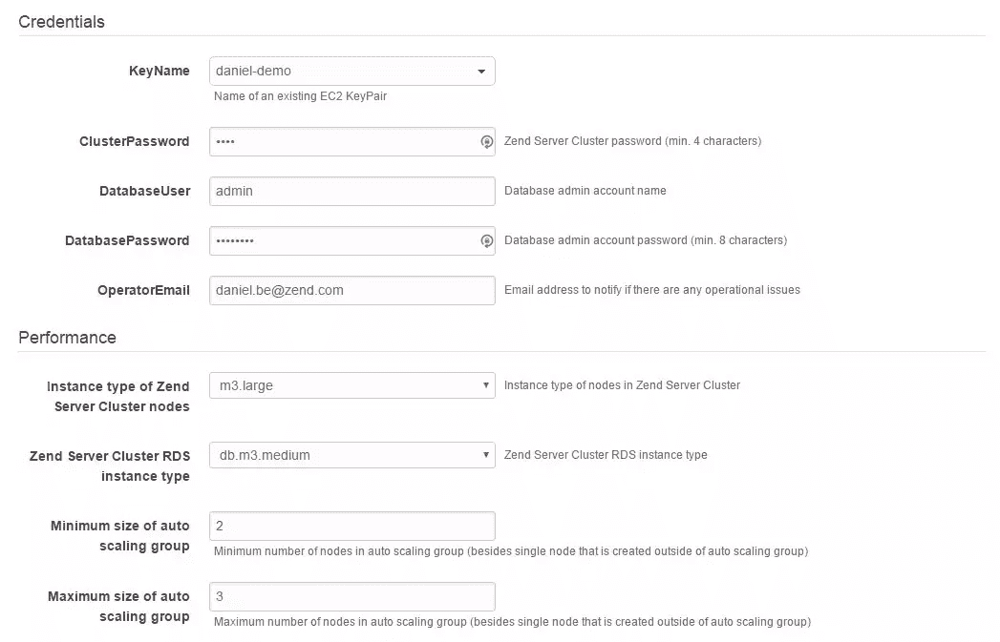

该向导页面的最后一步是为构建集群的 Zend 服务器节点和集群数据库选择实例类型。这些设置决定了这些组件(CPU、内存、存储等)的硬件配置。)，默认设置(分别是 m3.large 和 db.m3.medium)应该足以运行一个具有中等负载(每秒 50-60 个请求)的几个节点(最多 5 个)的集群。每个实例类型都有不同的定价，因此您需要考虑这一点。

在这一步中，我们还需要确定我们的自动扩展组的最小和最大规模，或者换句话说，我们希望群集从多少台服务器开始，以及在流量负载增加的情况下我们的群集可以扩展到多少台服务器。

点击下一个的**进入选项页面。**

在这里，我们可以为堆栈配置标记，这些标记基本上是用于标识堆栈的键值对，用于成本分配等目的，以及一组其他高级选项。

例如，我们可以配置堆栈创建超时前的分钟数，或者我们可以定义您希望在堆栈更新期间防止意外更新的资源。

我们将使用默认值运行，并前进到向导的最后一页——审查页。

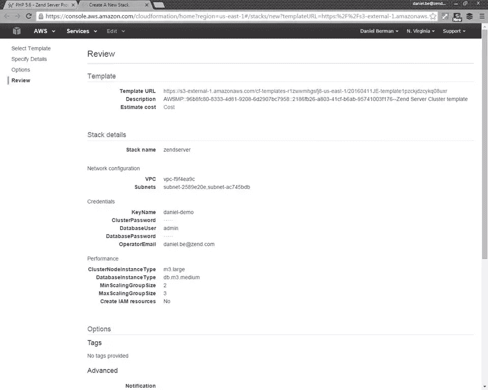

在我们点击启动按钮之前，这是我们最后一次查看整个堆栈的机会。如果我们决定要更改任何配置，现在就是时候了。

这里我们需要采取的最后一步是选中页面底部的复选框–这表示我们知道模板文件将创建一个新的 [IAM](https://aws.amazon.com/documentation/iam/) 配置文件。

既然我们对当前的设置很满意，我们将点击页面底部的**创建**按钮。

将显示 CloudFormation 管理控制台，一两分钟后，我们刚刚启动的堆栈将显示在堆栈列表中。

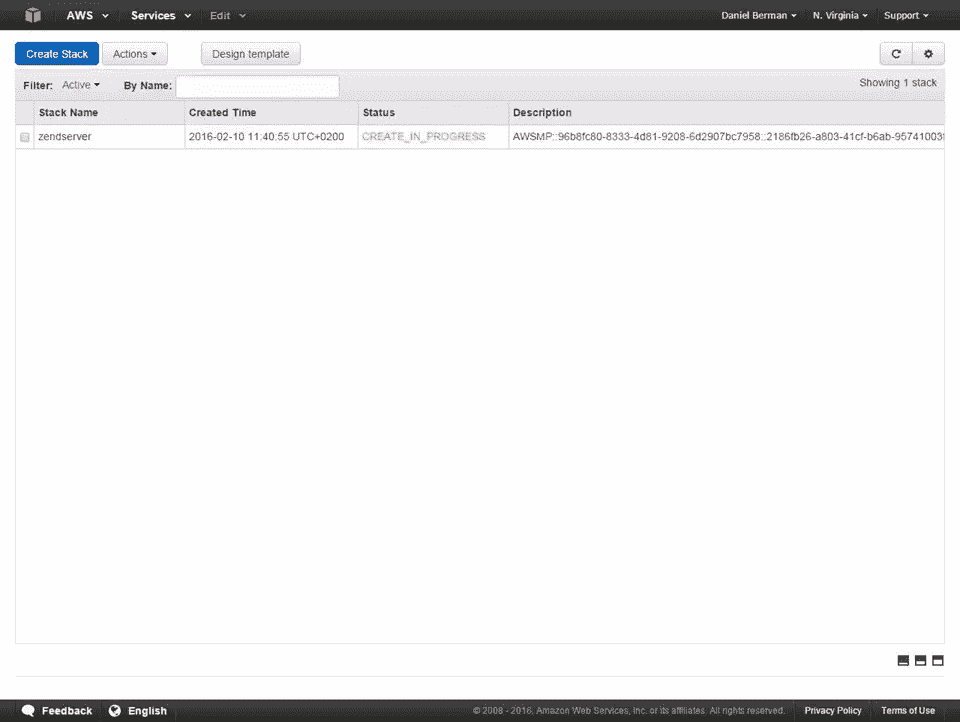

选择它，打开页面底部的显示选项卡，我们可以看到部署正在进行中。

这可能需要几分钟才能完成。同时，我们可以选择 Resources 选项卡，查看正在构建的所有不同的堆栈组件。

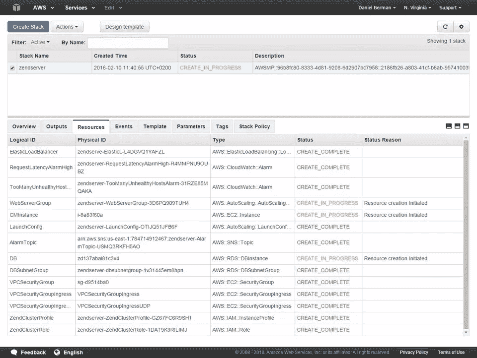

过一会儿，堆栈的状态变为完成，集群的部署过程结束。

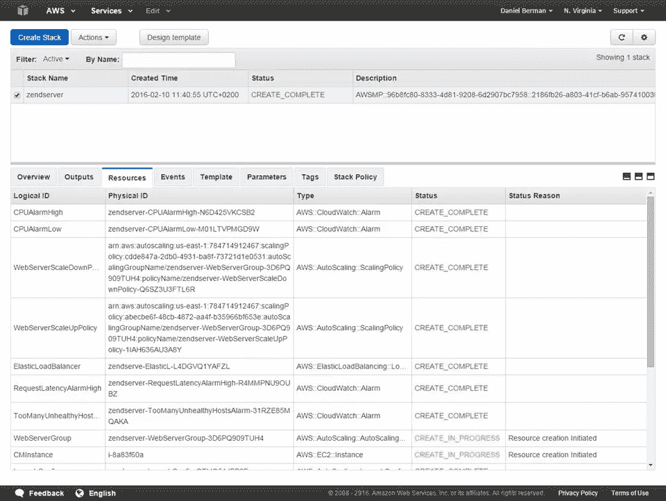

## 步骤 2:管理堆栈

只需点击几下，我们就成功地在云上建立了一个弹性的、自动伸缩的 PHP 集群，它包含了生产级 LAMP 堆栈的所有组件。

我们的下一步是理解如何管理构建堆栈的主要组件:Zend Server、PHP 和我们的 RDS MySQL 数据库实例。

首先，让我们仔细看看我们的 Zend 服务器节点集群。一种方法是在 [EC2 控制台](https://console.aws.amazon.com/ec2)中打开实例列表。

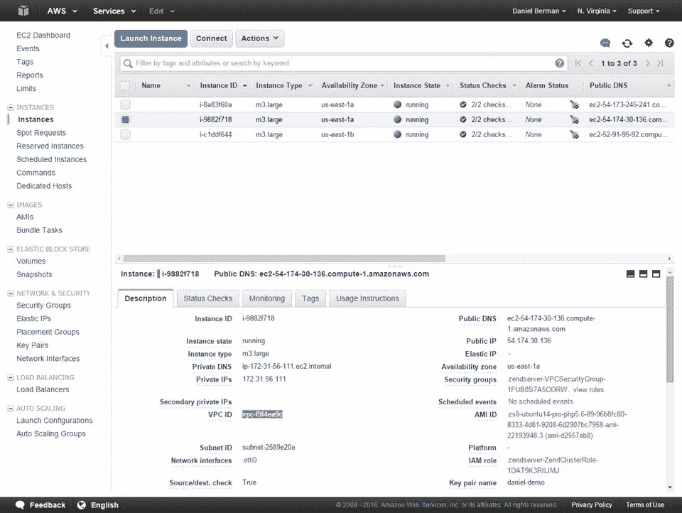

我们在启动堆栈时定义的三个服务器已经启动并运行。在流量增加的情况下，我们可以实际观察到服务器是如何根据我们定义的扩展策略慢慢添加到集群中的。

EC2 控制台也是管理我们的负载平衡器的地方。只需点击左侧菜单中的**负载平衡器**。

其次，我们将打开 [RDS 控制台](https://console.aws.amazon.com/rds)，在这里我们可以查看和管理我们的 MySQL 实例。

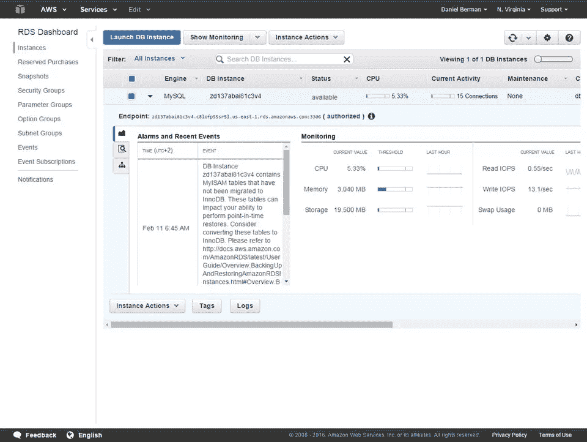

最后但同样重要的是，我们现在要访问 Zend 服务器。为此，回到[云形成控制台](https://console.aws.amazon.com/cloudformation)。

选择 Outputs 选项卡，并单击 Zend 服务器集群的 URL。

然后显示 Zend Server 登录页面，要访问 Zend Server，我们所要做的就是输入我们之前在向导中定义的用于访问集群用户界面的密码，然后单击**登录**。

Zend Server UI 加载完毕，我们看到了 Zend Server Guide 页面。这个页面包含了一些学习 Zend Server 的有用资源和一些可以部署的示例应用程序。我们将在下一步回到这一页。

扩展页面( **PHP | Extensions** )允许我们轻松地为整个集群配置和管理我们的 PHP。我们可以启用和禁用 PHP 扩展和配置指令。最好的方法是使用页面右上角的搜索框来查找特定的指令或扩展。

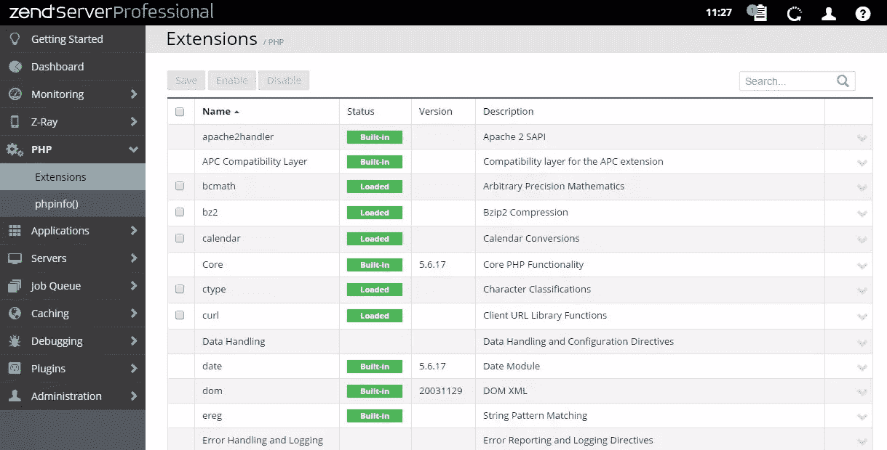

保存后，新配置将在整个集群中传播。这是一个重要的好处，应该理解，因为通常，同步 PHP 的任务。至少可以说，跨集群重新启动 Apache 并不简单。

## 步骤 3:部署应用程序

是时候动手将一些代码部署到集群上了。

为此，我们将使用 WordPress 示例应用程序，它可以在入门页面上找到。如前所述，入门页面是开始了解 Zend Server 中各种可用特性的好地方，并推荐给初次用户。

点击部署示例应用页面中的 WordPress 图标，Zend Server 下载一个现成的 WordPress。ZPK 文件，并将其上载到部署应用程序向导中。

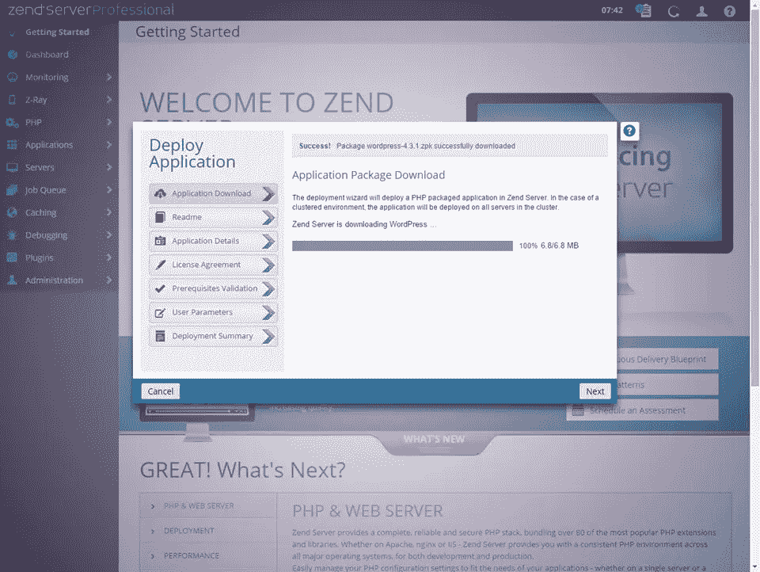

在我们继续之前，就 Zend 部署说几句话。. ZPK 文件(Zend Deployment Package)是一个标准化的应用程序包，它包括应用程序的所有源代码，以及定义部署应用程序所需的参数和先决条件的元数据(例如，数据库凭证、所需的 PHP 扩展)和您希望在部署的各个阶段使用的任何附加钩子脚本。

这个特性对于部署过程的标准化和自动化有很大的帮助，并且用于创建一个无缝的连续交付管道。

我们继续。在向导中，我们看到了 WordPress 自述文件，我们可以看一下并继续。

在 Application Details 页面上，我们需要为我们的应用程序设置一个路径。如果我们已经定义了一个新的虚拟主机，这将是选择它的地方，但是我们现在可以使用默认的服务器主机。

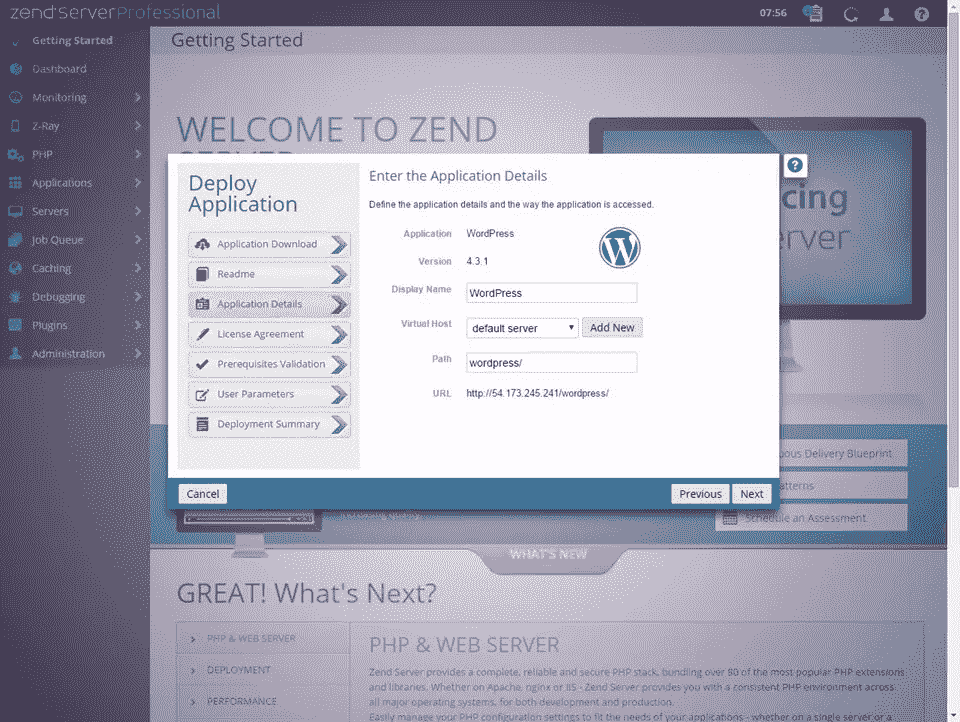

阅读并接受下一页的许可协议后，我们会看到软件包中定义的所有应用程序先决条件的列表。

接下来，我们需要输入部署应用程序所需的所有用户参数。同样，这些是在应用程序包中定义的。要填写这里的字段，我们需要访问我们的 RDS 实例(从 [RDS 控制台](https://console.aws.amazon.com/rds))并输入数据库主机、用户名和密码。我们还需要输入访问 WordPress 管理面板的凭证。

*请注意*，对于实际应用，建议使用第二个单独的 RDS 实例，而不是用于 Zend 服务器集群的同一个数据库。这确保了优化的性能和高可用性。

然后，我们所要做的就是点击 Summary 页面上的 Deploy 按钮，WordPress 应用程序就部署到集群上了。

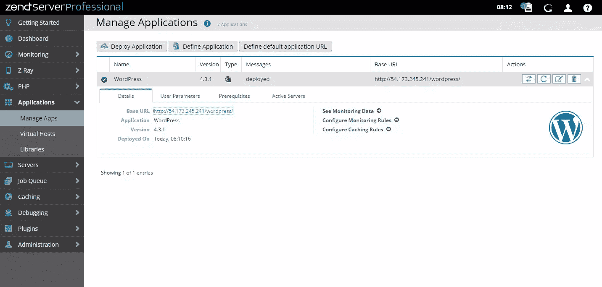

要查看应用程序，请在应用程序列表中选择它，然后点按 URL。

提示:默认情况下，Z 射线是禁用的。要启用它，请转到 **Z 射线|访问**并将其打开。

## 步骤 4:监控堆栈

我们的最后一步是理解 Zend Server 中可用的一些应用程序和服务器监控特性。

在服务器和 PHP 级别，Zend Server 允许您集中检查集群中所有节点的日志文件，从而简化了集群场景中的日志分析。您可以通过用户界面访问日志，而不是手动浏览每台服务器上的每个日志文件。

为此，请转到**监控|日志**。选择要监控的服务器和特定的日志文件。

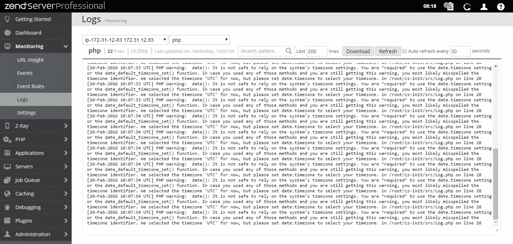

在应用程序级别，Zend Server 提供了一组高级监控功能，当执行过程中出现问题时，这些功能会通知我们。

例如，Zend Monitoring 在超过我们定义的阈值时触发并显示事件。例如，如果一个请求执行时间过长，就会触发一个事件，我们可以通过电子邮件收到事件通知。

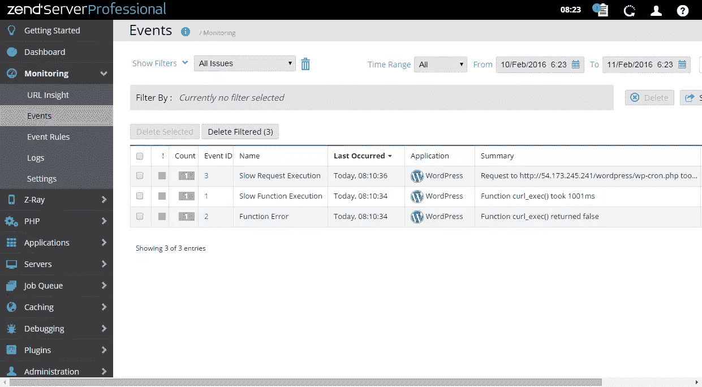

URL Insight 是另一个有用的工具，可以显示关于重要 URL 的报告。例如，我们可以查看 10 个最常访问的网址，或者 10 个最慢的网址。

## 结论

在云上运行 PHP 集群是一项巨大的任务，通常包含一长串挑战。从执行扩展策略，到数据库处理、日志分析、会话共享和 PHP 同步。虽然有许多现有的解决方案来处理这些任务，但大多数包括手工劳动和手持。编写和管理脚本来执行上述所有操作当然是一个有效的选择，但也很耗时耗资源。

AWS 上 Zend Server 提供的弹性灯栈提供了一个非常引人注目的替代方案。这个解决方案简化了集群管理，为运行 PHP 集群所涉及的大多数常见任务提供了一个简单的答案。

希望你喜欢阅读！

## 分享这篇文章