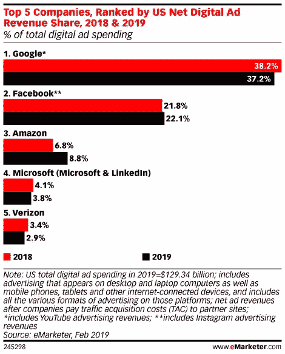

# 2019 年运营数字出版物的不确定性

> 原文：<https://www.sitepoint.com/running-an-online-publication-in-2019/>

*本文是与 [Proper Media](https://proper.io/header-bidding-experts?utm_source=sitepoint&utm_medium=article&utm_campaign=freemonth) 合作创作的。感谢您对使 SitePoint 成为可能的合作伙伴的支持。希望与 SitePoint 合作？在这里获得[更多信息。](https://www.sitepoint.com/advertise/)*

最近，有无数关于出版业衰落的文章和思考。这些文章经常说明出版商如何难以赚钱来维持一个可持续的商业模式。

事实上，独立出版商的广告收入全面下降。越来越多的人使用先进的广告拦截软件，这影响了出版商可以展示的广告数量。此外，房间里还有两头大象——谷歌和脸书。这两个实体加起来几乎占了网络广告总支出的 60%。这种双头垄断利用第三方出版商的内容带来广告收入，但留给出版商自己的收入很少。不管是好是坏，他们也有规模来非常有效地利用他们的用户群，这是一个较小的出版商无法与之竞争的。例如，脸书的平均 CPM 约为 8 美元，而第三方出版商的平均 CPM 为 1 美元。随着在线广告世界的发展，出版商将面临新的障碍来实现其网站的货币化。

来源:eMarketer

为了克服这些困难，出版商都尝试了不同的方法来在这个新的领域创造收入；《纽约时报》和许多其他报纸试图通过将内容隐藏在付费墙后向用户出售付费订阅。另一个基于订阅收入的例子是 Apple News+，它试图将一些订阅收入分配给出版商，尽管是在苹果获得健康分成之后。然而，消费者仍然不太可能为在线内容付费。路透社研究所和牛津大学最近进行的一项研究发现，只有 13%的美国人会为正在进行的新闻解决方案付费。

[//datawrapper.dwcdn.net/HWNsC/2/](//datawrapper.dwcdn.net/HWNsC/2/)

付费墙对《纽约时报》等出版商来说非常有效，他们的付费订阅产品收入逐年增长。但是这对于许多其他人来说是不可行的，他们看到了用户对这个系统的强烈反对。除了对许多出版商无效之外，付费墙本质上与出版商的目标不一致。出版商希望制作教育和告知最大数量的人的内容，这与付费墙的运作方式相反。由于基于订阅的网站货币化的这些限制，传统的展示广告仍然是出版商整体收入的一大部分，包括我们的收入。

一个简单的事实是，广告一直是我们这样的在线出版商不可或缺的一部分——这是我们在 SitePoint 保持一切运转并为我们的作者支付费用以制作有趣的内容供您阅读的方式。像所有其他企业一样，我们必须创收。这些年来，我们面临着同样的挑战，也同样努力在广告创收(为了继续生产大量免费的教育内容)和创造用户体验(让我们的读者能够不受干扰地消化和享受这些内容)之间取得平衡。我们承认，这种平衡并不总是正确的。

目前，我们已经与 [Proper Media](http://proper.io) 合作，作为我们的计划性收入合作伙伴，希望找到这种平衡。它的工作方式是，我们利用适当的标题投标解决方案来货币化我们的文章页面上的广告位。与 Proper 合作可以让我们在所有可用的顶级广告需求中为我们的库存创造竞争，从而获得最高的 CPM(例如亚马逊的 A9、谷歌 Adx 和美国在线的 OATH)。此外，他们还负责广告销售的直接需求。广告商从个体出版商那里购买大型广告块的日子已经一去不复返了——如今，这一切都是通过编程来实现的。

简而言之，Proper 负责货币化，这样我们就可以专注于制作优秀的内容。他们确保我们的广告收入尽可能高。他们拥有持续的数据驱动优化和精确的实时报告，确保我们的广告单元始终获得最佳收益。他们还处理所有应收账款，并以比所有主要交易所更快的条件交付综合付款，这确实有助于像我们这样的小出版商的现金流。

当我们问他们为什么认为 SitePoint 应该与他们合作时，他们是这样回答的，这总结了我们为什么选择他们，并在这个拥挤的市场中作为我们的合作伙伴与他们在一起。

> 作为出版商，我们对如何在这个行业取得成功有着深刻的理解。我们建立了如此紧密的伙伴关系，以至于我们的客户经常把 Proper 的团队视为他们自己的宝贵延伸。

> 与其他广告技术公司不同，Proper 不会将出版商束缚在长期承诺中。在一个不断测试新广告合作伙伴的行业中，Proper 一直能够保持很高的保留率，因为最重要的是让你比其他人赚更多的钱。问问我们目前的出版合作伙伴，他们可能会告诉你，结果不言自明。

目前出版行业的现实是，我们需要通过广告将我们的内容货币化，以便继续生产更多的内容。我们选择与计划性收入合作伙伴合作，这样我们就可以专注于我们最擅长的领域:制作读者想要阅读的内容。我们最初选择适当的媒体作为计划性收入合作伙伴的主要原因是:

1.  **绩效** : Proper 持续提供强劲的 CPM。
2.  **收入份额**:他们拥有业内最低的收入份额，同时保持着最高质量的服务
3.  **付款**:他们整合了来自不同需求合作伙伴的所有付款，并持续、可靠地按时向我们付款。
4.  行业专长:他们实际上是出版商，Salon.com 和 TVtropes.org 在他们的庇护之下，所以他们直接了解我们的需求和困境。

我们留下来的原因是:

1.  出色的客户服务:如果我们有问题，我们可以和真人交谈，他们会和我们一对一地解决问题。
2.  **强大的分析**:报告和仪表板易于使用，并提供强大的洞察力。
3.  **运营效率** : Proper 的团队是我们自己的延伸，经常让我们不必承担大型广告运营和开发团队只专注于盈利的开销。
4.  **额外收入**:在过去的 9 个月里，自从我们与 Proper 合作以来，SitePoint 的广告收入平均增长了 5%。

SitePoint 为我们的内容提供资金的另一种方式是推荐我们自己信任和使用的服务和产品。因此，如果你正在寻找一个新的程序化广告合作伙伴来帮助你的网站赚钱，我们建议看看适当的媒体能提供什么。查看您的网站是否有资格获得这一网站盈利机会:

*   如果你的网站已经产生了至少 10，000 美元的月收入，那么你就达到了适当媒体的最低要求。
*   如果你的网站每月收入少于 10，000 美元，Proper 仍然是一个不错的选择，但是需要考虑最低月费。

如果你正在寻找一个更好的方法来为你的网站创收，我们建议你尝试一下。此外，作为一个 SitePoint 读者，如果你现在注册，适当的媒体将放弃其第一个月的收入份额！[只需在入职时通过合适的媒体在此](https://proper.io/header-bidding-experts?utm_source=sitepoint&utm_medium=article&utm_campaign=freemonth)或参考“**”处报名。**

## **分享这篇文章**