# 在 Raspberry Pi 2 上运行 Windows 10 物联网内核

> 原文：<https://www.sitepoint.com/running-windows-10-iot-core-on-a-raspberry-pi/>

本周，Windows 10 在全球正式发布，Windows 10 有一个方面让我特别感兴趣——物联网(IoT)世界。Windows 10 有一个精简版，名为“Windows 10 物联网核心”，专注于物联网。无论如何，它都不是 Windows 10 的完整版本，而是专注于为嵌入式系统提供动力。我有一个非常强烈的冲动，给这个操作系统一个测试，看看它会是什么样子，所以我拿出我的树莓派，并安装它！

如果你是一名希望参与物联网的开发人员，并且你习惯于微软开发生态系统(C++或 C#、Visual Studio、Win32 控制台、Azure 等)，Windows 10 物联网核心正是你正在寻找的。如果你是一个像我一样习惯于基于 Unix 的系统、JavaScript、Node 和 Arduino 风格的“连接”代码的开发人员，这将是一个学习曲线。

从一个非微软的开发背景来着手这整个工作是一个挑战，但也是一个非常有趣的经历。尝试物联网开发的替代方法很不错。虽然经历了整个过程，但有很多关于如何在 Raspberry Pi 上安装 Windows 10 并开始使用的文档，但各种链接和错误有时会让我误入歧途。简而言之——对新来的人来说，这既混乱又令人困惑。比我预期的要长得多。希望我自己的努力不会白费，我在下面记录了我如何在我的树莓 Pi 上安装 Windows 10 物联网核心以及我面临的各种问题。也许会有像我一样的开发人员偶然发现这篇文章，并获得一两个小时的时间，否则这些时间会花在困惑中！

最后，我们会让我们的树莓派尽情舞动！嗯……就像两个装着管道清洁器的伺服系统会跳舞一样兴奋。

## 你需要什么

要获得 Windows 10 物联网核心的基本设置以及我们的 dancing servo 演示，您需要以下内容:

*   [**一辆树莓 Pi 2**](https://www.raspberrypi.org/products/)——我特别喜欢的是一辆[树莓 Pi 2 B 型](https://www.raspberrypi.org/products/raspberry-pi-2-model-b/)。*这篇文章发表后，我被告知这个过程不适用于最初的树莓派。*
*   **一个 5V 微型 USB 电源**——大多数树莓 Pi 用户都应该有一个这样的。微软表示，它至少需要 1.0A 的电流，或者如果你对它附加很多，则需要超过 2.0A 的电流。我个人只是用了我的 Pi 附带的那个，一切都很好。
*   **8GB 或更大的 micro SD 卡**-这将保存 Windows 10 物联网核心操作系统和您的文件。为了确保卡足够快来运行操作系统，请确保您获得的是 10 类或更好的卡。微软建议[三星 32GB EVO](http://www.amazon.com/gp/product/B00IVPU786) 或[SanDisk 16GB 超微型 SDHC](http://www.amazon.com/SanDisk-Ultra-Micro-SDHC-16GB/dp/9966573445) (我有第二个，非常方便，这是我之前在我的 Pi 上使用的那个，它工作得非常好)。
*   **一台 Windows 10 电脑**——为了进行这些开发，你需要在你的电脑上安装 Windows 10。我是内部预览计划的一部分，因此已经有了一个我可以使用的版本。
*   Microsoft Visual Studio 社区版本 14 . 0 . 23107 . 0 d14 rel–我将很快详细介绍如何获得它。
*   **Windows 物联网核心项目**–我也会提供如何下载这些项目的详细信息。
*   Windows IoT Core ISO-它稍微超过 500MB，所以如果你像我一样有一个 slowish 连接-你可能想尽快下载这个。[在此下载 Windows 物联网核心的 ISO 标准](http://go.microsoft.com/fwlink/?LinkId=616847)。
*   **Putty 或另一个 SSH 客户端**——仅当您想要 SSH 到 Pi 时。您可以改用 PowerShell。
*   **一根 HDMI 电缆和一个显示器将其连接到**-你需要一根电缆来设置安装过程，并在最后看到你的物联网应用程序的运行。
*   **USB 键盘和 USB 鼠标**——当我们不使用树莓 Pi 时，它们将是您的控制器。
*   **一根以太网电缆**–遗憾的是，目前为止，似乎只有官方的 Raspberry Pi Wi-Fi 适配器有潜力与 Windows 10 物联网核心一起工作(我也不能保证，因为我没有那个！)，因此为了连接到您的网络，您需要通过以太网端口将其插入。
*   **微型 SD 卡读卡器**–你需要能够在你的电脑上读取微型 SD 卡。我用一个微型 SD 适配器把它插到我的电脑上。
*   **两个伺服系统**–我在 SparkFun 使用了类似于[的微型伺服系统。大多数伺服将在这里工作，主要的区别将是他们能旋转多远。](https://www.sparkfun.com/products/9065)
*   **六根公母跳线**–这些是我们将伺服系统连接到 Raspberry Pi 的 GPIO 端口所需的东西。如果你不确定这些看起来像什么，[在 SparkFun 网站上有一些可以参考](https://www.sparkfun.com/products/9139)。
*   两个管道清洁器-这些是可选的，如果你想给伺服臂，添加一些[管道清洁器](http://www.amazon.com/Craft-Cleaners-Chenille-Assortment-100-piece/dp/B00PSM92S6%3FSubscriptionId%3DAKIAILSHYYTFIVPWUY6Q%26tag%3Dduckduckgo-d-20%26linkCode%3Dxm2%26camp%3D2025%26creative%3D165953%26creativeASIN%3DB00PSM92S6)！

## 安装 Visual Studio

在安装所有东西时，让我感到困惑的一件事是，由于更新的微软签名，一些微软文档中链接的版本与 Windows 物联网核心项目模板不兼容。您需要确保安装的正确版本是 Microsoft Visual Studio 社区版本 14.0.23107.0 D14Rel。到[Visual Studio 网站](https://www.visualstudio.com/)下载“社区 2015”版本。这应该是兼容版本，而不是文档中直接链接到的任何版本。

如果您已经安装了 Microsoft Visual Studio，并且收到错误“#SignatureDescription 无法为提供的签名算法创建”，那么您已经得到了与我最初下载的版本不兼容的 Visual Studio 版本。我能对你说的是…你并不孤单！喝一杯咖啡和/或参观一下外面的世界，因为这个新的 Visual Studio 会再次运行安装过程。

安装时，选择“自定义”安装。

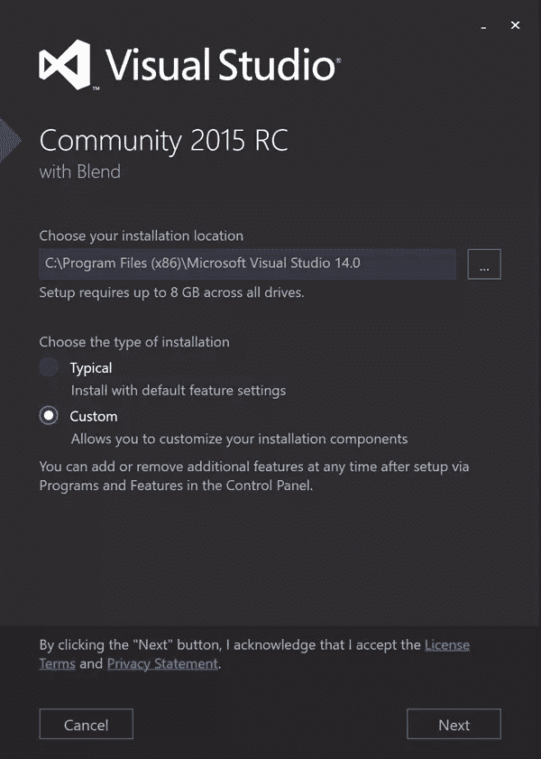

它会问你想安装什么功能。确保您已经检查了 *Windows 和 Web 开发>通用 Windows 应用程序开发工具>工具和 Windows SDK 10.0.10240* ，如下图所示:

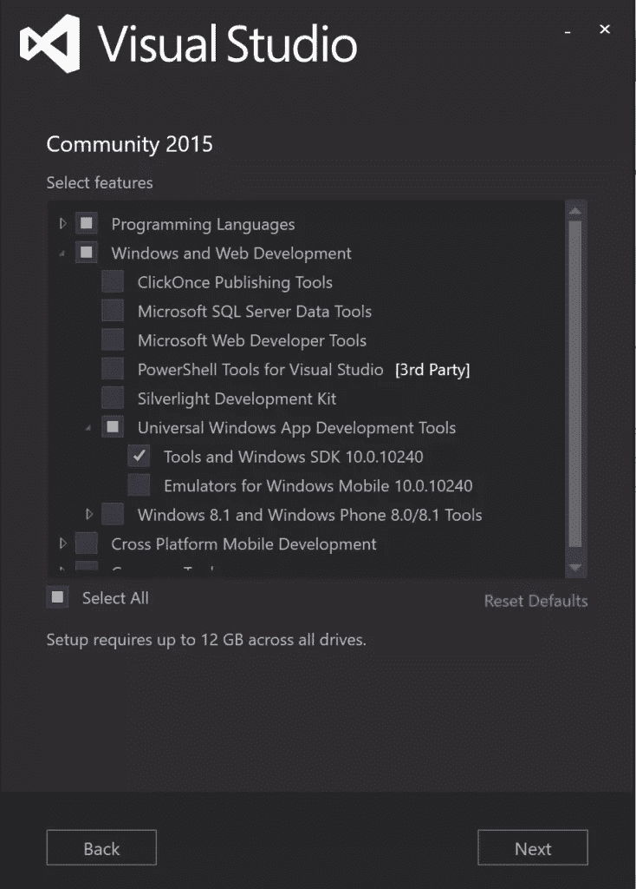

## 正在安装 Windows IoT 核心项目

您可以在 [Windows 物联网核心项目模板 MSDN 页面](https://visualstudiogallery.msdn.microsoft.com/06507e74-41cf-47b2-b7fe-8a2624202d36)找到您需要的 Windows 物联网核心项目文件。只需点击“下载”,您就可以拥有它们:

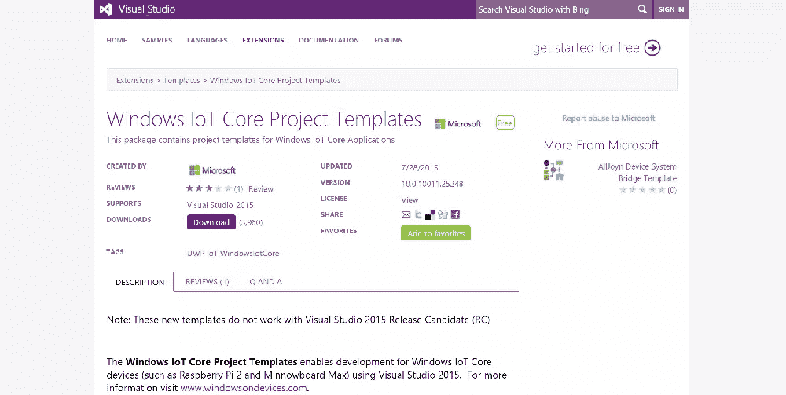

## 在 Windows 10 上启用开发人员模式

如果您现在试图在 Visual Studio 中做很多事情，您会看到以下错误消息:

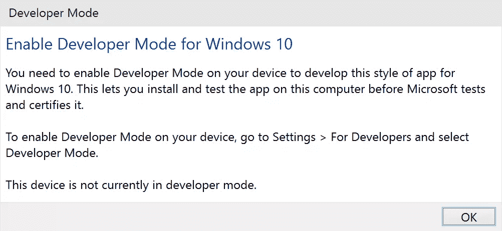

这是另一个让我有点措手不及的领域。我尝试的初始文档引导我进入了 Windows 10 中的“更新和安全”设置。然而，在我的 Windows 10 版本中有一个错误，每当你点击“开发者”链接启用它时，设置窗口就会崩溃并关闭。所以这种方法不是最好的选择。

相反，我必须通过组策略来实现:

1.  首先，用管理员权限打开一个命令提示符窗口。在 Windows 10 中这样做，我发现最简单的方法是在任务栏的 Cortana 字段中输入“命令提示符”，右键单击并选择“以管理员身份运行”:
    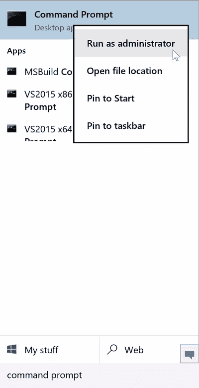
2.  输入`Gpedit.msc`
3.  然后，导航到*本地计算机策略>计算机配置>管理模板> Windows 组件>应用包部署*。
    
4.  打开“允许安装所有受信任的应用程序”的策略，并单击“启用”单选按钮:
    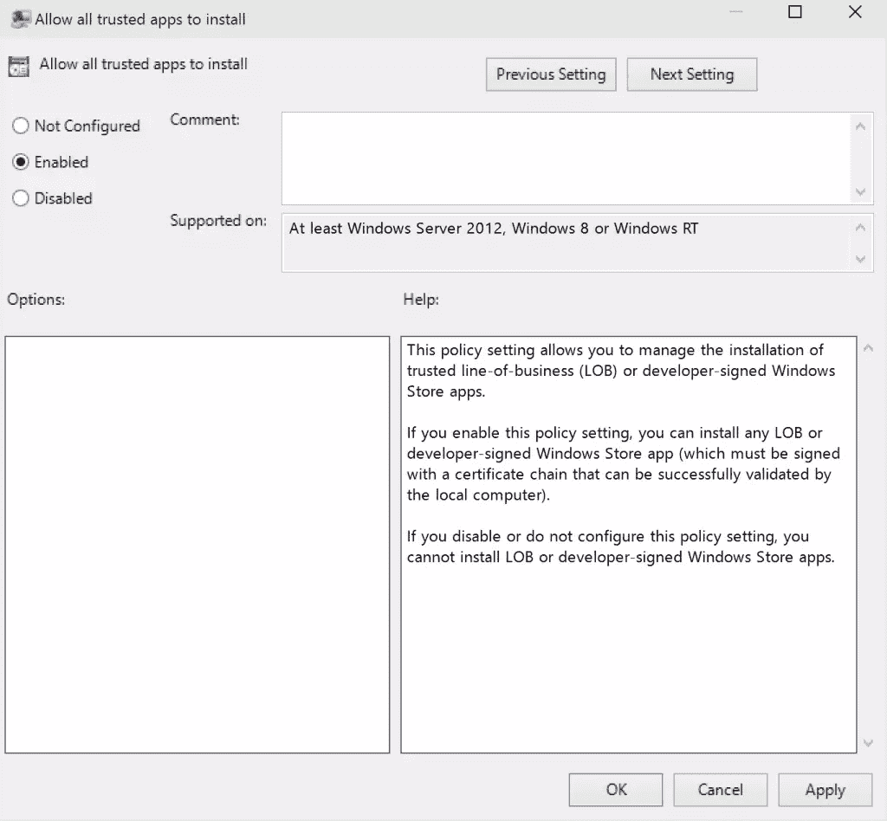
5.  对“允许开发 Windows 应用商店应用并从集成开发环境(IDE)安装它们”的策略执行相同的操作
6.  重新启动计算机以启用这些策略。

如果您对此方法有困难，请查看微软文档中的[启用您的设备进行开发](https://msdn.microsoft.com/library/windows/apps/xaml/dn706236.aspx)页面，了解其他可能的启用方法。

## 在您的 Pi 上安装 Windows 物联网核心

你需要做的第一件事是[下载 Windows 物联网核心的 ISO 文件](http://go.microsoft.com/fwlink/?LinkId=616847)。如果您从本文的前面开始下载它，希望它已经全部下载完毕，您可以开始了！

从那里开始:

1.  双击它，让 Windows 10 将其作为虚拟驱动器挂载(这是 Windows 10 的一个非常好的功能)
2.  转到弹出的新驱动，安装“Windows_10_IoT_Core_RPi2.msi”。
3.  完成后，您可以从系统中弹出虚拟驱动器。
4.  接下来，我们想把 Windows 10 物联网核心放到你的 Raspberry Pi 的 micro SD 卡上。将它放入你的 SD 卡读卡器(或者某种适配器，如果你的电脑没有读卡器的话)。
5.  在任务栏中输入“WindowsIoT”并选择“windows iotimagehelper”:
    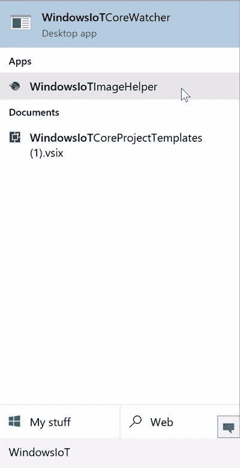
6.  它会弹出一个可爱的亮蓝色窗口，让你选择 SD 卡和 ffu 文件。你要的 ffu 文件是由*Windows _ 10 _ IoT _ Core _ rpi 2 . MSI*程序提取的。你可以在*C:\ Program Files(x86)\ Microsoft IoT \ FFU \ raspberrypi 2 \ flash . ffu*找到你需要的文件。确定这个闪存盘里没有你需要的东西，然后点击“闪存”:
    
7.  完成后，通过 Windows 中的“安全删除硬件”选项弹出驱动器，然后安全删除它。
8.  将它放入您的 Raspberry Pi，连接您的 HDMI 显示器、USB 键盘和鼠标。
9.  当您准备打开 Pi 时，**确保您没有连接任何其他外设**。我的 Pi 起初无法启动，只有在我移除了我的 Raspberry Pi 相机和 USB Wi-Fi 模块后才能启动。
10.  当你把它们都连接上后，给你的树莓派接上电源，它应该开始启动了。

### 怪异的翘曲或拉伸屏幕？

如果你的屏幕显示看起来奇怪地扭曲和拉伸，你需要对 Windows 10 物联网核心的设置进行轻微调整。对我来说，显示器在我的一个屏幕上工作正常，但另一个屏幕变得非常扭曲和怪异。要修复它:

1.  从您的 Pi 中取出电源，将您的 SD 卡插回您的 PC。
2.  在 SD 卡中，会有一个名为 *config.txt* 的文件。打开它。
3.  这个文件中有一行以`hdmi_group =`开头。如果它显示`hdmi_group = 2`，试着切换到`hdmi_group = 1`，反之亦然。其中一个应该能在你的屏幕上工作。
4.  一旦您将 1 更改为 2 或将 2 更改为 1，请安全地将其从您的 PC 中移除，并将其插回您的 Pi。将 Pi 连接到电源，您现在应该能够看到它的全部光彩！

如果还是不行，[树莓派论坛上的这篇文章](https://www.raspberrypi.org/forums/viewtopic.php?t=5851)可能会给你提供更多的信息。

## 通过 SSH 连接到您的树莓 Pi

有两种方法可以通过命令行输入从 PC 远程连接到您的 Pi。无论是通过 PowerShell 还是通过 SSH。大多数文章都是关于 PowerShell 的，但是我更熟悉 SSH，我想为什么不走一条更少人走的路呢？为了保持我访问所有物联网设备和服务器的方式一致，这也是更好的长期选择，因为大多数设备和服务器也是通过 SSH 工作的。

如果您更喜欢使用 PowerShell，请参见[微软 PowerShell 文档](http://ms-iot.github.io/content/en-US/win10/samples/PowerShell.htm)。

为了 SSH 到 Pi，看一下运行您的 Raspberry Pi 的屏幕并获取它的 IP 地址。你需要一个 SSH 客户端，比如 Putty T1。然后打开 Putty 并输入 IP 地址，如下所示:

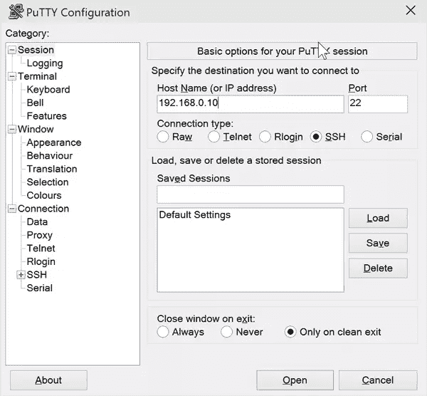

确保选择了 SSH，然后单击“打开”。对于任何弹出的有关服务器主机密钥的安全警报，单击“是”。

如果成功，您将有一个终端窗口，等待用户名和密码。您的 Pi 用户名将是“Administrator”，密码将是“p@ssw0rd”。如果成功了，你会到达 c 盘:

```
C:\>
```

### 更新默认管理员密码

显然，出于安全原因，您不希望管理员密码保持为“p@ssw0rd”。因此，登录后，运行以下命令，用您自己的超级强密码替换[superstrongpassword]:

```
net user Administrator [superstrongpassword]
```

### 重命名您的 Pi 设备

默认的名字有点无聊。请随意将 Pi 重命名为更有趣的名称:

```
setcomputername [yourpreferreddevicename]
```

### 重新启动您的设备

在您重新启动 Pi 之前，不会使用该名称。要通过 SSH 做到这一点，请键入以下命令:

```
shutdown /r /t 0
```

## 将我们的伺服系统连接到 Pi

我已经将我的伺服系统直接连接到我的 Pi，使用我的公母跳线进行快速演示，如下所示:

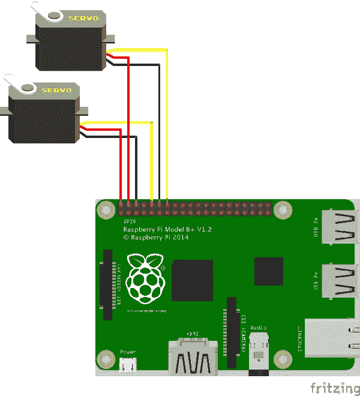

其他人已经通过试验板上的 GPIO 引脚连接器将伺服系统连接到 Raspberry Pi([参见 Adafruit 的示例](https://learn.adafruit.com/adafruits-raspberry-pi-lesson-8-using-a-servo-motor/overview))还有一些人首先将其连接到试验板。选择自己的个人喜好。只要 pin 与应用程序对它们的定义正确对应，这两种方式都可以。

如果你想检查哪个管脚对应哪个输出，微软有一个可爱的页面定义了[Raspberry Pi 2 管脚映射](https://ms-iot.github.io/content/en-US/win10/samples/PinMappingsRPi2.htm)。你在那一页的代码中引用的数字是类似“GPIO 27”的数字。

## 我们的演示代码

我们的物联网演示代码可在 [GitHub](https://github.com/sitepoint-editors/Win10IoTPiDancin) 上获得。如果你已经熟悉了这个过程，并且只是想看看它是如何运行的，就下载它吧。

## 在我们的 Pi 上得到我们的舞蹈演示

我们的树莓派已经准备好了。如果你再次在 Cortana 任务栏搜索框中输入“Windows IoT”，你会看到除了 WindowsIoTImageHelper 之外的一个选项是 WindowsIoTCoreWatcher。

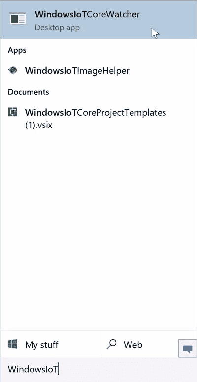

如果您打开它，您将能够看到您的个人计算机是否能够找到您的个人计算机:

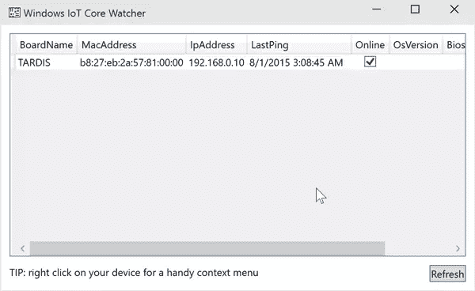

经过前面的所有步骤，您的 Pi 应该会出现。如果它不在这里，你就不能进入它。我指出这个屏幕只是因为如果你的 Pi 在开发过程中由于某种原因超时或失去网络连接，它会很有用。这是一个值得了解的好工具！

### 启动 Windows 10 物联网 Visual Studio 项目

打开 Visual Studio，进入*文件>新建>新建项目*。从那里打开模板并选择*模板>Visual c#>Windows>Windows 物联网核心*。选择“后台应用程序(IoT)”，键入您的应用程序的名称(我选择了“ServoDancin”)，然后单击确定。

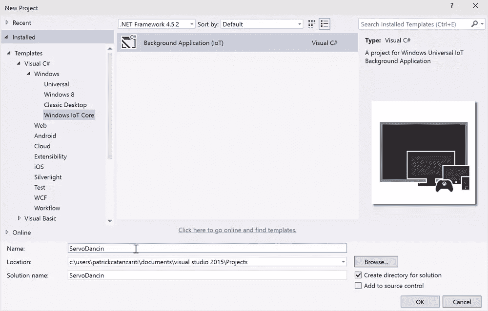

加载后，您需要确保为物联网 Windows 10 功能添加了参考。为此，在“解决方案资源管理器”窗口中，右键单击项目名称下的“引用”部分。选择“添加引用”。

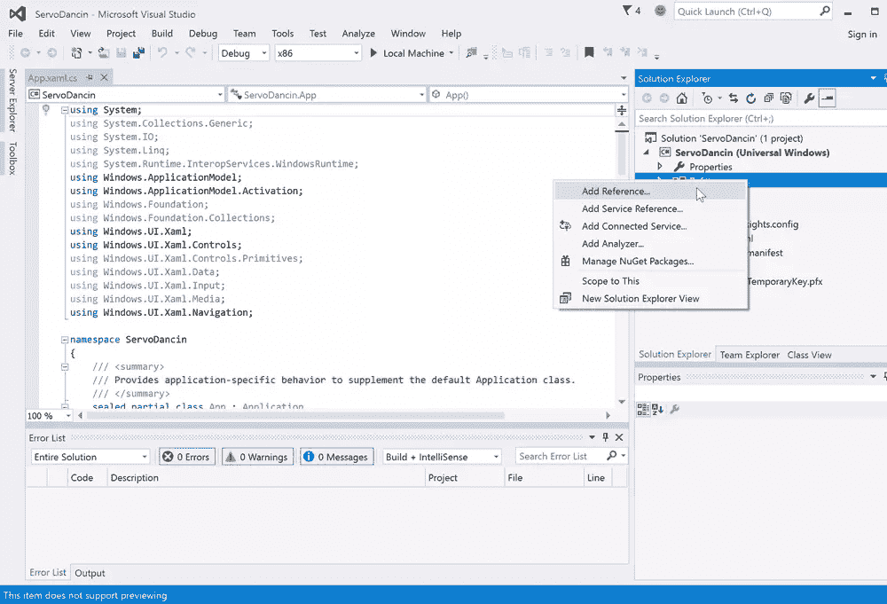

在打开的窗口中，转到“通用窗口”>“扩展”，然后选择“UWP 的 Windows IoT 扩展”。单击确定。现在我们准备添加代码。

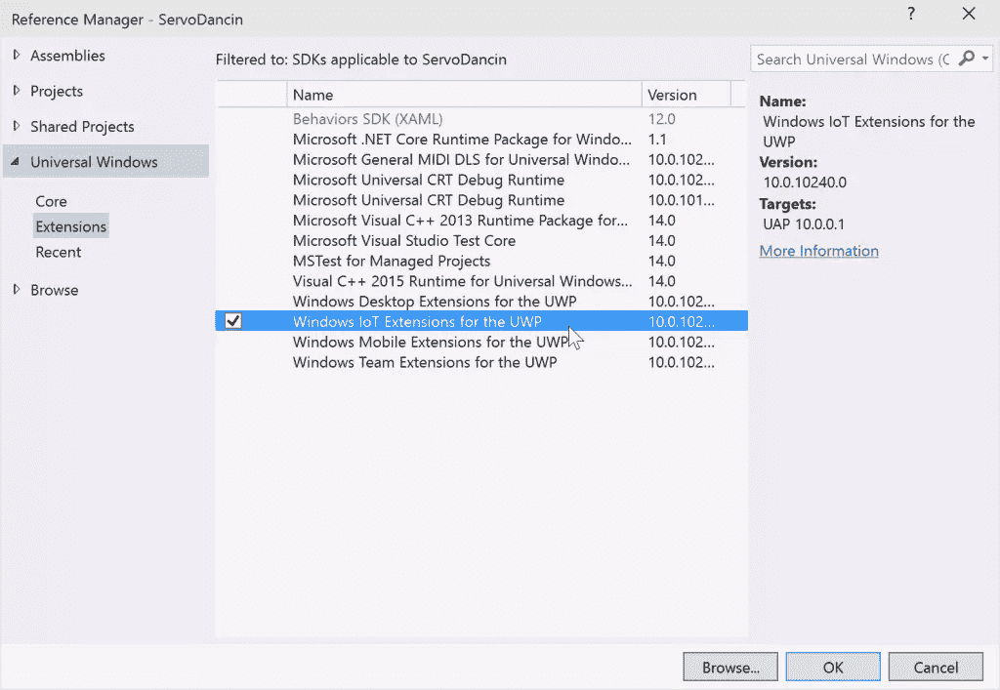

### 编写我们的项目

这个例子是用 C#写的。如果你愿意，你可以用 C++编写代码，但是你需要用 C++重写下面的例子！

在我们的例子中，我们将把两个伺服连接到我们的 Raspberry Pi，并让它们来回跳舞，以庆祝我们对 Windows 10 拥有物联网版本的喜悦！

打开 MainPage.xaml.cs(它将位于 MainPage.xaml 下面)。将 MainPage.xaml 的代码更新为以下内容:

```
using System;
using Windows.Foundation;
using Windows.UI.Xaml;
using Windows.UI.Xaml.Controls;
using Windows.Devices.Gpio;
using System.Diagnostics;

namespace ServoDancin
{
  public sealed partial class MainPage : Page
  {
    private const int SERVO_PIN_A = 18;
    private const int SERVO_PIN_B = 23;
    private GpioPin servoPinA;
    private GpioPin servoPinB;
    private DispatcherTimer timer;
    private double BEAT_PACE = 1000;
    private double CounterClockwiseDanceMove = 1;
    private double ClockwiseDanceMove = 2;
    private double currentDirection;
    private double PulseFrequency = 20;
    Stopwatch stopwatch;

    public MainPage()
    {
      InitializeComponent();
      this.InitDancing();
    }

    private void InitDancing()
    {
      // Preparing our GPIO controller
      var gpio = GpioController.GetDefault();

      if (gpio == null)
      {
        servoPinA = null;
        if (GpioStatus != null)
        {
          GpioStatus.Text = "No GPIO controller found";
        }

        return;
      }

      // Servo set up
      servoPinA = gpio.OpenPin(SERVO_PIN_A);
      servoPinA.SetDriveMode(GpioPinDriveMode.Output);

      servoPinB = gpio.OpenPin(SERVO_PIN_B);
      servoPinB.SetDriveMode(GpioPinDriveMode.Output);

      stopwatch = Stopwatch.StartNew();

      currentDirection = 0; // Initially we aren't dancing at all.

      timer = new DispatcherTimer();
      timer.Interval = TimeSpan.FromMilliseconds(BEAT_PACE);
      timer.Tick += Beat;

      if (servoPinA != null && servoPinB != null)
      {
        timer.Start();
        Windows.System.Threading.ThreadPool.RunAsync(this.MotorThread, Windows.System.Threading.WorkItemPriority.High);
      }

      if (GpioStatus != null)
      {
        GpioStatus.Text = "GPIO pin ready";
      }
    }

    private void Beat(object sender, object e)
    {
      if (currentDirection != ClockwiseDanceMove)
      {
        currentDirection = ClockwiseDanceMove;
        GpioStatus.Text = "Yay!";
      }
      else
      {
        currentDirection = CounterClockwiseDanceMove;
        GpioStatus.Text = "Windows 10!";
      }
    }

    private void MotorThread(IAsyncAction action)
    {
      while (true)
      {
        if (currentDirection != 0)
        {
          servoPinA.Write(GpioPinValue.High);
          servoPinB.Write(GpioPinValue.High);
        }

        Wait(currentDirection);

        servoPinA.Write(GpioPinValue.Low);
        servoPinB.Write(GpioPinValue.Low);
        Wait(PulseFrequency - currentDirection);
      }
    }

    private void Wait(double milliseconds)
    {
      long initialTick = stopwatch.ElapsedTicks;
      long initialElapsed = stopwatch.ElapsedMilliseconds;
      double desiredTicks = milliseconds / 1000.0 * Stopwatch.Frequency;
      double finalTick = initialTick + desiredTicks;
      while (stopwatch.ElapsedTicks < finalTick)
      {

      }
    }
  }
}
```

### 我们的准则解释说

起点是我们的应用程序所需的功能。我相信下面的大部分是运行我们的物联网应用程序和读取我们即将制作的 xaml 文件的核心部分。

```
using System;
	using Windows.Foundation;
	using Windows.UI.Xaml;
	using Windows.UI.Xaml.Controls;
```

然后，该行提供对我们的 Raspberry Pi 的 GPIO 端口的访问:

```
using Windows.Devices.Gpio;
```

最后，这一行让我们可以使用秒表功能:

```
using System.Diagnostics;
```

我们所有的代码逻辑都在这个容器中(如果您为应用程序选择了不同的名称，请确保您更改了“ServoDancin”):

```
namespace ServoDancin
{
  public sealed partial class MainPage : Page
  {
  	// Code will be here
  }
}
```

然后，在那里，我们开始定义我们将在应用程序中使用的变量。第一个定义了我们将在 Pi 的 GPIO 端口上附加伺服的引脚，并定义了我们将引用的引脚对象本身:

```
private const int SERVO_PIN_A = 18;
    private const int SERVO_PIN_B = 23;
    private GpioPin servoPinA;
    private GpioPin servoPinB;
```

接下来，我们定义我们的定时器，它将切换我们的伺服方向，以及它在毫秒内切换的速度:

```
private DispatcherTimer timer;
    private double BEAT_PACE = 1000;
```

然后，我们为将要切换到的伺服系统设置两个位置(1 是顺时针转动伺服系统的 1 毫秒脉冲，2 是逆时针转动伺服系统的 2 毫秒脉冲)。我们使用`currentDirection`来存储我们正在做的当前运动。

```
private double CounterClockwiseDanceMove = 1;
    private double ClockwiseDanceMove = 2;
    private double currentDirection;
```

是我们向伺服系统发送脉冲的频率，以毫秒为单位。对于一个要移动的伺服系统，它期望每 20 毫秒有一个脉冲。我们的`stopwatch`是我们用来为所有脉冲计时的:

```
private double PulseFrequency = 20;
    Stopwatch stopwatch;
```

我们所有的代码都从`MainPage()`函数开始。`InitializeComponent()`初始化我们的 MainPage.xaml，这不是我们在代码中定义的东西，这是 Windows 物联网核心的东西。我们的代码在`this.InitDancing()`内:

```
public MainPage()
    {
      InitializeComponent();
      this.InitDancing();
    }
```

这段代码初始化我们的 GPIO 引脚，如果无法初始化，就会显示一个错误:

```
private void InitDancing()
    {
      // Preparing our GPIO controller
      var gpio = GpioController.GetDefault();

      if (gpio == null)
      {
        servoPinA = null;
        if (GpioStatus != null)
        {
          GpioStatus.Text = "No GPIO controller found";
        }

        return;
      }
```

然后我们定义我们的两个伺服系统:

```
// Servo set up
    servoPinA = gpio.OpenPin(SERVO_PIN_A);
    servoPinA.SetDriveMode(GpioPinDriveMode.Output);

    servoPinB = gpio.OpenPin(SERVO_PIN_B);
    servoPinB.SetDriveMode(GpioPinDriveMode.Output);
```

然后，我们启动秒表，将我们的伺服系统移动的方向初始化为零(这意味着它不会移动)，创建一个新的计时器(这是我们的伺服系统将移动的方向改变的时间)，使用我们之前定义的毫秒计时，并告诉它在每次滴答时运行`Beat()`功能:

```
stopwatch = Stopwatch.StartNew();

	currentDirection = 0; // Initially we aren't dancing at all.

	timer = new DispatcherTimer();
	timer.Interval = TimeSpan.FromMilliseconds(BEAT_PACE);
	timer.Tick += Beat;
```

如果我们的伺服针不为空，我们启动我们的计时器，我们还启动一个后台进程，它以 20 毫秒的间隔 ping 我们的伺服针。正是在这个背景过程中，我们发出了我们希望它前进的当前方向。

```
if (servoPinA != null && servoPinB != null)
	{
		timer.Start();
		Windows.System.Threading.ThreadPool.RunAsync(this.MotorThread, Windows.System.Threading.WorkItemPriority.High);
	}
```

如果 GPIO 引脚初始化一切顺利，那么我们会显示一条消息，表明一切就绪！

```
if (GpioStatus != null)
	{
		GpioStatus.Text = "GPIO pin ready";
	}
```

我们的`Beat()`功能是切换我们的伺服方向。它没有告诉伺服机构具体做什么，它只是切换`currentDirection`变量来改变我们的背景脉冲过程将告诉伺服机构移动的方向。它还可以在应用程序中设置我们的文本来替换消息，增加一点乐趣。

```
private void Beat(object sender, object e)
    {
      if (currentDirection != ClockwiseDanceMove)
      {
        currentDirection = ClockwiseDanceMove;
        GpioStatus.Text = "Yay!";
      }
      else
      {
        currentDirection = CounterClockwiseDanceMove;
        GpioStatus.Text = "Windows 10!";
      }
    }
```

我们的后台进程定期向我们的伺服系统发送脉冲，让它做出响应并跳舞。如果`currentDirection`为 1 或 2，它将向引脚发送高电平消息。然后在发送低脉冲之前，它会等待一到两毫秒(我们的`currentDirection`的时间)。这些高点和低点之间的时间是告诉伺服移动的方向。然后，在重复之前，我们在常规的 20 毫秒脉冲间隔内等待剩余的时间。

```
private void MotorThread(IAsyncAction action)
    {
      while (true)
      {
        if (currentDirection != 0)
        {
          servoPinA.Write(GpioPinValue.High);
          servoPinB.Write(GpioPinValue.High);
        }

        Wait(currentDirection);

        servoPinA.Write(GpioPinValue.Low);
        servoPinB.Write(GpioPinValue.Low);
        Wait(PulseFrequency - currentDirection);
      }
    }
```

为了实际执行那个`Wait()`函数，我们必须定义它，所以作为应用程序的最后一个函数，我们在这里设置这个函数。它使用我们之前设置的`stopwatch`,并保持我们的线程直到毫秒数过去。

```
private void Wait(double milliseconds)
    {
      long initialTick = stopwatch.ElapsedTicks;
      long initialElapsed = stopwatch.ElapsedMilliseconds;
      double desiredTicks = milliseconds / 1000.0 * Stopwatch.Frequency;
      double finalTick = initialTick + desiredTicks;
      while (stopwatch.ElapsedTicks < finalTick)
      {

      }
    }
```

### 我们的 MainPage.xaml 文件

MainPage.xaml 文件设置我们的应用程序在 HDMI 屏幕上的显示方式。如果你正在构建一个根本不需要显示器的应用程序，你可以设置你的 Pi 运行在 *Headless* 模式，这听起来有点吓人，但这只是意味着它不在屏幕上显示任何东西，而是依赖于命令提示符风格的连接。我们的应用程序将是一个*为首的*应用程序，它确实显示在屏幕上。如果你想了解这两者之间的区别以及如何设置它们，[参见微软关于有头和无头模式的文档](http://ms-iot.github.io/content/en-US/win10/HeadlessMode.htm)。

我们的 MainPage.xaml 文件如下所示:

```
<Page
	    x:Class="ServoDancin.MainPage"
	    xmlns="http://schemas.microsoft.com/winfx/2006/xaml/presentation"
	    xmlns:x="http://schemas.microsoft.com/winfx/2006/xaml"
	    xmlns:local="using:ServoDancin"
	    xmlns:d="http://schemas.microsoft.com/expression/blend/2008"
	    xmlns:mc="http://schemas.openxmlformats.org/markup-compatibility/2006"
	    mc:Ignorable="d">

	    <Grid Background="Blue">
	        <StackPanel HorizontalAlignment="Center" VerticalAlignment="Center">
	            <TextBlock x:Name="GpioStatus" Text="Finding GPIO..." TextAlignment="Center" FontSize="40" />
	        </StackPanel>
	    </Grid>
	</Page>
```

大部分都是由 Visual Studio 为我们设置的，所以您可能只需要在这里进行一些调整。首先，你要确保这两行有你的应用程序名称(如果你决定改变它):

```
<Page
		x:Class="ServoDancin.MainPage"
		...
		xmlns:local="using:ServoDancin"
```

其余的都集中在我们的应用程序中显示文本。我们的应用程序将拥有的只是一个名为“GpioStatus”的文本块，它最初会告诉我们 GPIO 引脚是否已初始化，但随后会随着我们跳舞的伺服系统及时显示消息。

在复杂的应用程序布局方面，我们实际上并不怎么使用。我们为我们的应用程序设置了蓝色的背景(我认为是微软！有什么颜色比蓝色更好？):

```
<Grid Background="Blue">
```

然后，我们有一个面板，我们对齐到页面的中心:

```
<StackPanel HorizontalAlignment="Center" VerticalAlignment="Center">
```

最后，我们有我们的文本块，定义它的名称供我们以后参考，初始内容，它的字体大小和对齐:

```
<TextBlock x:Name="GpioStatus" Text="Finding GPIO..." TextAlignment="Center" FontSize="40" />
```

### 把那个应用程序放到我们的 Pi 上

为了将该应用程序放到我们的 Raspberry Pi 上，我们必须设置 Visual Studio 来编译并发送该应用程序到远程机器(您的 Pi)。Raspberry Pi 运行在 ARM 处理器上，因此在“调试”旁边的下拉菜单中，您需要选择“ARM”。如果您没有看到这些选项，请检查您在前面的步骤中创建了正确的项目类型，并且您也在上面的 Windows 10 物联网参考中添加了项目类型。

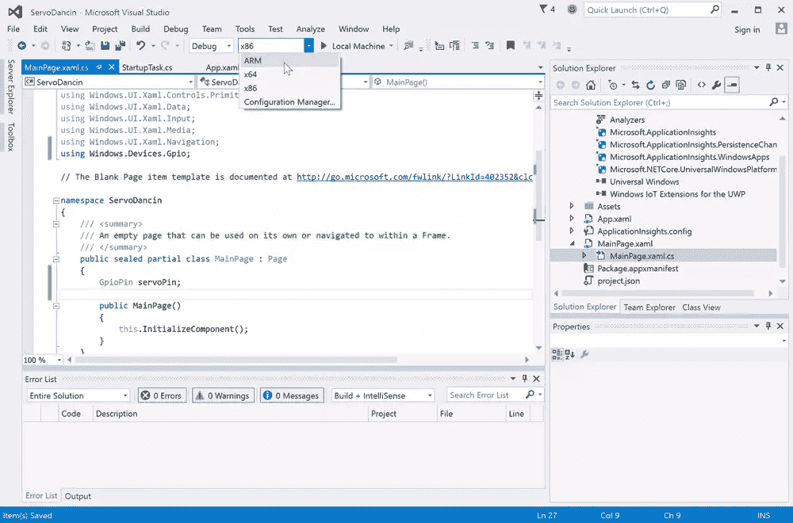

在旁边的下拉列表中，选择“远程机器”。


它应该允许您通过弹出的“远程连接”窗口选择远程机器。从列表中选择您的 Pi，或者如果它没有出现，请尝试输入其 IP 地址:

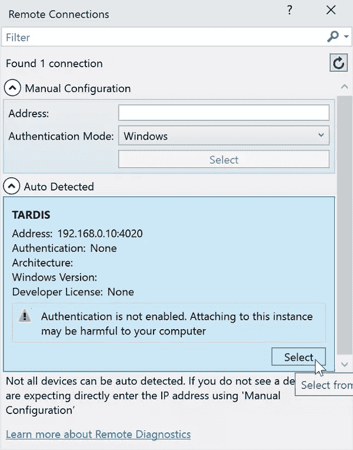

点击“选择”进行选择。然后再一次点击播放按钮选项，现在它显示“远程机器”,它应该把你应用程序放到你的 Pi 上！

如果过一会儿在 Pi 上有任何问题，请尝试重启 Pi。

## 我们的应用程序正在运行

当你的应用程序运行时，它应该是这样的！

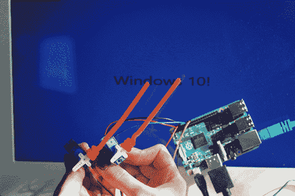

## 结论

那应该涵盖了树莓派和 Windows 10 物联网核心入门的全过程，包括我个人从各种错误和困惑中得到的教训！我希望它有助于加快其他人的进程，并带来一些非常令人兴奋的 Windows 驱动的物联网演示。

如果你确实基于这段代码制作了一个令人兴奋的 Windows powered IoT 演示，请在评论中留言或发推文给我(我是 [@thatpatrickguy](http://www.twitter.com/thatpatrickguy) )，我很乐意看到它！

## 分享这篇文章