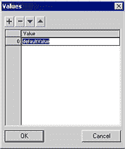

# Flash 脚本–组合框组件

> 原文：<https://www.sitepoint.com/script-combobox-component/>

使用 combobox 组件可能看起来很复杂，但事实并非如此。这是怎么做的。

**1。**按 ctrl+f7 打开组件面板。

**2。**将 combobox 组件拖到舞台上，并选择第 1 帧中的 combobox 组件。该组件的参数将显示在属性检查器中。

**3。**要命名 componenet，请在属性检查器实例名称文本框中键入“combo”。

**4。**确保可编辑参数设置为“假”。这可以防止用户键入自己的文本。

**5。**“标签”参数显示一个值列表，用户可以从中进行选择。单击标签字段，然后单击放大镜打开值弹出窗口。现在，单击加号(`+`)按钮输入一个新值。



**6。**单击默认值字段，然后键入“一”作为第一个值。

**7。**点击加号(`+`)按钮输入下一个值。然后，单击默认值字段，并键入“二”作为下一个值。

**8。**重复此过程，将值“三”、“四”、“五”和“六”相加。

**9。**点击“确定”关闭标签框。

10。数据参数是可选的。它用于指定与盒子中的项目(或标签)相关联的值。在这种情况下，没有必要这样做，所以这次我们不需要考虑数据参数。

**11。**行数参数指定窗口中显示多少行。由于有六个选项，请将值更改为“6”。

**12。**输入点击处理程序名称“f1”。


13。现在，创建两个动态文本字段，如上所示。我给第一个文本字段取了一个变量名“txt1”，给第二个取了一个“txt2”。

**14。从现有层中选择第一个关键帧。按 f9 打开“动作”框，并插入以下内容:**

```
function f1() 

{ 

//to get the selected item label 

txt1.text = combo.getSelectedItem().Label; 

//to get the selected item index 

txt2.text = combo.getSelectedIndex(); 

}
```

您完成了——是测试电影的时候了！

## 分享这篇文章