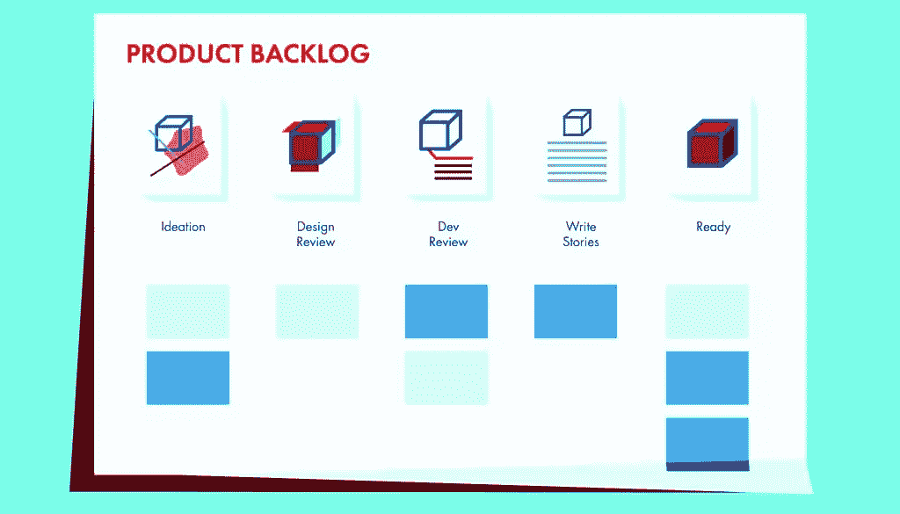

# Scrum 工件:产品积压

> 原文：<https://www.sitepoint.com/scrum-artifacts-product-backlog/>

以下是摘自我们的书《Scrum:新手到忍者，作者是 M. David Green。世界各地的商店都有出售，或者你可以在这里买到电子书。

开发团队的故事来自于产品负责人的 **产品积压** 。产品 backlog 跟踪产品所有者从客户那里获得的关于产品方向的所有输入，以及产品所有者收集的研究、经验测试、设计和工程反馈。

与 sprint backlog 的故事不同，产品 backlog 的项目不需要以任何特定的方式构建。这是因为它们的主要目的是允许产品所有者跟踪所有需要的特性。这些产品待定项可能非常模糊，直到它们明确成为 sprint 待定项的一个清晰的开发故事。当团队致力于当前增量的特定特性时，产品待办事项中的项目应该总是反映产品所有者关于产品的[长期目标的最新想法。](https://www.sitepoint.com/premium/books/the-lean-product-playbook/)

### 注意:产品积压是产品所有者的责任

虽然产品所有者可能选择定期与团队共享整个产品待办事项，但是这里的项目是产品所有者的责任。不断提醒团队产品 backlog 上很长时间没有触及的项目可能不会有什么成效，因为这将转移团队对完成当前增量所必需的工作的注意力。

虽然许多产品所有者更喜欢跟踪产品待办事项列表中的项目，就好像它们将成为最终的故事一样，但是产品待办事项列表中的项目和进入 sprint 待办事项列表的故事之间不一定要一一对应。产品负责人需要跟踪的特性和需求可能会变成多个故事，或者几个项目可能会被组合起来创建一个具有适当规模和开发范围的统一故事。

例如，如果客户需要为一个站点添加一个支付系统，那么对于开发团队来说，这可能是一个单独的故事，也可能是多个故事。可能有一些开发者的故事围绕着创建通过服务接受支付的能力，以及接受信用卡、支票或者甚至维护代币系统的独立故事，以便可以使用虚拟货币进行购买。也许有可能独立开发其中的每一个，并且只用一个来启动系统。无论哪一个先出来，都可能需要承担实现一些核心功能的重担，这些核心功能将由所有其他人共享。

许多产品所有者发现使用分阶段的过程来跟踪产品 backlog 中的项目状态很方便，通过这个过程，项目从构思到设计，再到工程验证，直到它准备好被表述为 sprint backlog 故事，并被添加到即将到来的 sprint 中。产品负责人应该清楚地知道如何将一个产品从一个状态转移到下一个状态，并且应该记录下来，以便在每个故事中保持一致。

### 警告:不要写故事，直到他们准备好工作

对于产品所有者来说，在产品 backlog 中的项目准备好被合并到特定的 sprint 中之前很久就为它们创建开发故事通常是一个错误。产品 backlog 中的项目应该保持足够的模糊性和灵活性，以便它们能够适应 scrum 的迭代敏捷过程中出现的变化。几个星期或几个月没有工作的产品 backlog 项目很容易变得陈旧，并且产品所有者很容易忘记他们在编写故事时的上下文，如果它在编写后不久没有工作的话。过早地编写详细的故事通常会浪费产品负责人的时间，并且会使团队陷入当前可能不需要的工作中。

## 分享这篇文章