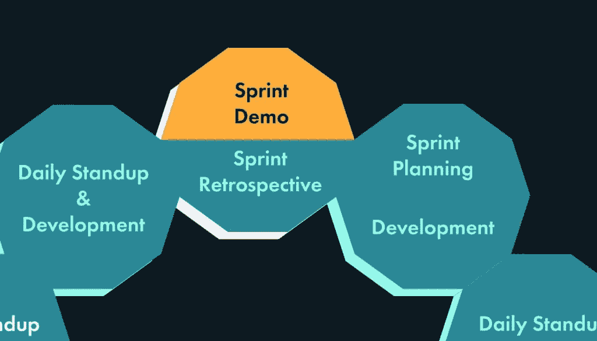

# Scrum 惯例:冲刺演示

> 原文：<https://www.sitepoint.com/scrum-rituals-sprint-demo/>

以下是摘自我们的书《Scrum:新手到忍者，作者是 M. David Green。世界各地的商店都有出售，或者你可以在这里买到电子书。

在 sprint 结束时，为当前 sprint 所做的一切都向团队、产品负责人和任何被邀请观察的人展示了。这个仪式被称为 sprint demo，它给所有的工程师一个机会来展示他们认为已经完成的故事。sprint demo 是产品负责人测试每个故事的机会，看看它是否符合接受标准，然后接受或拒绝它。

 <h3objective h3="">sprint 演示的目标是清楚地了解在 sprint 期间已经完成了多少工作，并了解在整合了 sprint 期间完成的工作之后，产品的当前状态是什么。基于被接受的故事，团队了解了更多关于他们在单个 sprint 中可以持续完成多少点，这提高了他们评估故事和 sprint backlogs 的能力。

### 注意:Sprint 演示中的来宾

sprint 演示通常是一个受客人欢迎的仪式，因为这是一个机会，让 scrum 团队之外的人看到团队一直在做什么，并根据最新产生的工作观察产品在下一次迭代中的状态。但是客人的出现不应该被允许干扰仪式的目标，或者改变时间盒。客人是观察者，不是参与者。除非征求顾客的反馈，否则应要求他们不要对产品或过程发表评论。

### 时间盒

分配给 sprint 规划的时间取决于 sprint 期间完成的故事数量，以及与验收标准相关的复杂程度。如果使用两周的 sprint，大多数团队会分配半天时间进行 sprint 演示。一旦团队决定了他们要在演示上投入多长时间，scrum master 应该负责确保所有需要发生的事情都在这个时间范围内。

### 注意:将演示和回顾安排在一起

团队经常会在演示的同一天安排一次 sprint 回顾(我们很快会谈到)。将这两个仪式安排在同一天的好处是，与仪式相关的生产力中断被最小化。对团队来说，缺点是这些天主要生产 scrum 工件，而不是有形的产品开发。需要考虑权衡，不同的团队会有不同的偏好。

### 准备

sprint 演示是团队展示他们所做的所有工作的机会，并证明他们所做的所有故事都已经完成并准备好包含在产品中(假设它们还没有完成)。该演示涵盖了从 sprint 开始时的所有工作，这些工作将一个故事带到了团队对 done 的定义中，无论这些工作是否已经发布。每个参与过准备演示的故事的人都需要准备好解释他们用这些故事做了什么。

通常在演示之前，工程师会和产品负责人聚在一起，确保每个人都知道将要展示什么。这可能是演示之前有用的最后一步，因为它确保了所展示的故事符合所有的验收标准。它还提醒工程师们做好任何必要的准备，让未发布的故事得以展示。

scrum master 应该会见所有完成了故事的工程师，确保这些故事为演示做好了准备。scrum master 的责任是运行仪式，并确保所有需要演示的东西都能在分配的时间内呈现出来。scrum master 的仪式议程应该包括所有要演示的故事的列表，以及每个故事的负责人。

### 提示:让产品负责人来推动演示

虽然有些团队让工程师演示这些故事，但是一个好的做法是让产品负责人参与进来，现场测试产品。开发新特性的工程师知道代码永远工作的快乐之路。但是产品负责人会寻找边缘案例，并且知道最重要的验收标准。让工程师设置演示，产品负责人在场，让每个人都参与进来，并确保故事的完成让产品负责人满意。

### 演示一个故事

演示每个故事的过程要一致。scrum 主管应该检查列表上的每个故事，并让工程师为团队设置演示。许多团队选择在会议室使用投影仪来实现这一点，尽管也可以通过聚集在大型显示器周围，甚至通过远程会议服务来实现这一点，这取决于故事的性质和团队的偏好。

在 sprint 的这个阶段，这个故事的描述对于房间里的大多数人来说都是熟悉的，但是产品负责人应该在演示开始的时候向团队宣读这个故事，以及任何主要的验收标准。这样，每个人都知道要寻找什么，并会意识到可能出现的问题。

一旦故事建立并准备好演示，产品的状态就是关注的焦点。每个故事都应该是添加到产品中的一个完整的功能片段，并且演示应该在实际产品的上下文中显示该功能片段。演示应该遍历每个验收标准，证明它们已经得到满足。

有时在演示过程中，人们意识到最初编写的验收标准是不充分的，可能没有涵盖产品所有者需要解决的所有情况。如果发生这种情况，请记住，满足所有验收标准的演示——正如在 sprint 规划中估计的故事中指定的那样——应该被认为是被接受和完成的。可能需要的任何进一步的变化都是新的故事。在这种情况下，产品负责人应该准备为未来的 sprint 创建新的故事，这些故事与最初的故事中没有提到的额外的验收标准相关。

### 警告:不要详述遇到的问题

虽然对于从事故事工作的工程师来说，详细讲述开发一个特定故事的困难或新知识可能很有诱惑力和价值，但演示不是这样做的时候。如果谈话转向这些话题，scrum 主管应该鼓励人们记下这些要点，并在回顾会上提出来。否则，演示可能会变成一个关于创建每个故事的细节的长篇对话，而不是一个带有新故事的产品演示。

### 合计分数

在演示结束时，一些故事将被接受，而一些可能被拒绝。scrum master 应该在 sprint 期间合计完成的点数，完全基于分配给被接受为完成的故事的估计点数。只有被接受为完成的故事，以及在 sprint 计划中被分配了分数的故事，才应该包含在这个总数中。冲刺中完成的总点数应该记录为团队在该冲刺中的速度。

一些故事可能已经被拒绝，或者可能还没有准备好进行演示，尽管它们已经包含在 sprint backlog 中。未完成的故事是否会被添加到下一个 sprint 中，或者被搁置等待未来可能的 sprint，这将取决于产品负责人。scrum master 需要跟踪所有的故事，包括已完成的和尚未完成的，并在团队可能使用的任何跟踪工具中更新它们的状态。

通常 scrum master 会生成一组报告，在 sprint 演示结束时发送出去，更新感兴趣的产品状态。如果团队已经决定在同一天同时进行 sprint 演示和 sprint 回顾，scrum master 可能想要安排时间表，以便可以在两个仪式之间收集这些报告的必要数据，从而使它们可供参考。

### 发布故事

发布是将完成的特性集成到实际产品中的过程，这样用户可以立即访问它们，或者可以对它们进行评估以包含在未来的版本中。该过程可能由发布工程师监督，或者在开发人员级别与一组故障保险和回滚程序集成。

网络和移动团队在发布时有很多选择。对于一些团队来说，一完成就向客户发布一个故事——有时在一天内发布好几次——是很有意义的。对于其他人来说，发布过程更复杂，从整个 sprint，甚至多个 sprint 中分组故事，做更大的统一发布更有意义。

**持续集成是一种支持在故事完成时发布它们的方法，而不是等待 sprint 的结束。这通常依赖于一个健壮的测试套件和一组编排好的发布脚本。对于进行持续集成的团队来说，将故事发布到实际产品中已经是故事本身完成的一部分，在演示之后不需要进一步的步骤。**

 **### 注意:使用持续集成

当一个团队选择进行持续集成时，重要的是从事一个故事的工程师不要放弃这个故事，直到它被发布，并被证明不会在实际产品中引入任何问题。虽然这可能会导致工程师停机，但这些时间有时可以用于维护和改进代码库。

对于没有进行持续集成的团队来说，将会有另一个任务需要将 sprint 中的所有故事发布到产品中。与发布过程相关的任务通常被认为是故事完成定义的一部分，但在这种情况下，它们可能需要在演示之后完成。

一些团队定期在每个 sprint 开始时安排发布。其他公司发布的频率更高，或者可能只在一年中的特定时间发布，或者按照时间表发布，以配合与大型组织或市场需求相关的特定事件。弄清楚如何计划和安排发布对团队来说是一个反思和迭代他们的过程的机会，找到最适合他们和最符合产品所有者目标的节奏。

### 注意:按照发布时间表工作

不管实际的发布时间表如何，对于团队中的每个人来说，理解将要发布的只是已经完成的内容是很重要的。Scrum 不是为了满足预定的时间表而匆忙完成特定的故事。Scrum 是关于以可持续的速度工作，学习团队的能力，并在准备好的时候发布已经完成的内容。

团队应该抵制任何为了满足发布时间表而将新故事塞进特定 sprint 的努力。如果日期无法调整，产品负责人应该做好妥协的准备，决定哪些功能需要被排除在预定的发布之外，以便团队有时间完成最关键的功能。**</h3objective> 

## **分享这篇文章**