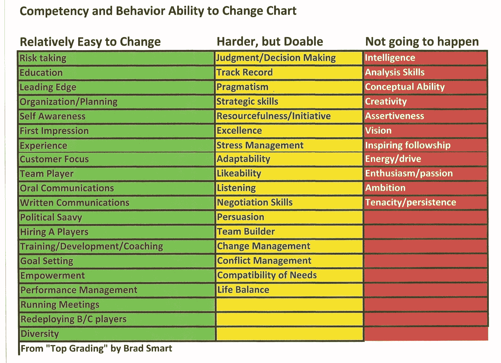

# 赢得其他开发者得不到的提升的秘密策略

> 原文：<https://www.sitepoint.com/secret-strategies-to-win-promotions-other-devs-cant-get/>

获得晋升最简单的方法是什么？努力工作，做好工作，增加价值，对吗？

不对。

问问任何有经验的雇主，他们都会告诉你。他们最不想做的事情就是提升一个工作努力、表现出色的员工。这是通向失败的捷径。

这听起来既残酷又不公平。

如果你作为一名开发人员工作出色，难道你不应该得到晋升作为对你努力工作的奖励吗？

没有。

那么，谁是值得并获得这些令人垂涎的促销活动的人，是什么让这些开发商如此特别？

## 为什么开发人员得不到他们应得的晋升

许多开发商对就业和晋升市场有错误的想法。这些天真(和不正确)的想法包括:

*   跳槽是提升你职业生涯的唯一途径。
*   努力工作，不可或缺，就能升职。
*   你必须认识合适的人。
*   如今，裙带关系或功绩推动着真正的晋升。

请不要误解:我并不是说这些想法本身就很糟糕，或者它们本身就有害。我的意思是这些想法并不是天生就正确的。

如果你相信这些想法呢？

如果你这样做了，你会让自己陷入职业停滞和极度失望。Paul Ingevaldson 在《计算机世界》的一篇文章中分享了工作和晋升市场的隐藏现实。

> 今天的话题是我作为 IT 经理最常收到的问题:“为什么我得不到提升？”
> 
> 一个人做得很好，甚至很出色，应该得到表扬和金钱奖励，但不应该得到提升。商业世界充斥着作为销售经理失败的伟大销售人员，作为工程经理失败的伟大工程师，以及作为 IT 经理失败的伟大 IT 分析师。

事情立刻变得非常清楚。

如果你想得到晋升，你需要在你目前的职位上成为一名优秀的员工，在你想晋升的职位上也是一名优秀的员工。

我说的不是训练或者技能。

我说的是你的核心竞争力。Bradford Smart 博士是 [proven](https://scholarworks.gsu.edu/cgi/viewcontent.cgi?article=1038&context=bus_admin_diss) 招聘方法 **Topgrading** 的创始人，他概述了在任何职位中脱颖而出所需的核心能力。

图片来源:[定位系统博客](https://strategicdiscipline.positioningsystems.com/hs-fs/hubfs/Competency_Ability_to_Change_Chart.jpg)

这是关于核心竞争力的坏消息。上面列出的很多都很难学习或提高。然而，困难并不是不可能的。

这就是问题所在。

这也是为什么大多数开发人员很难得到他们想要的晋升。他们没有为自己想要的特定职位做好准备。

## 开发商需要什么来赢得促销

这个列表并不长，但它确实需要一些前期工作。

1.  希望你被提升的人(或者对这个想法持中立态度的人)的联盟。
2.  你期望的角色所需的能力、技能和才能。
3.  与竞争对手和反对者谈判或避开他们所需的政治敏锐性。
4.  追踪隐性就业市场的能力。
5.  成功和持续表现的保证。

让我们仔细看看其中的每一项。

你需要公司内外的人组成一个联盟。您的联盟将根据您的具体需求而有所不同。以下是您所在团队可能需要的人员和资源的名单:

*   人力资源决策者
*   您期望角色中的决策者
*   在你目前的职位上有影响力的推荐人
*   可量化的价值，你可以用它来证明你的价值
*   你能在你期望的角色中提供的建议价值的例子
*   你需要为你目前的团队提供什么，以确保你的离职和过渡顺利

接下来，你需要一份核心能力、能力、技能和资源的清单，这些都是你在新岗位上表现出色所需要的。

这就是事情变得困难的地方。

无论是在同一家公司还是另一家公司，你都需要描绘出你当前职位和新职位的政治图景。

你需要建议。

你将需要在你的组织中找出那些对社会敏感的人(他们对你开放)，他们能让你对你的组织的政治布局有一个现实的感觉。

你现在的和想要的角色都需要这个。这里有一些你可能需要回答的政治问题。

*   谁是拥王者，谁有权力阻止晋升？
*   谁是影子领导，那些掌握大量间接权力的隐藏员工？
*   在重大变化或提升发生之前，需要安抚哪些群体或团队？
*   哪些人没有获得晋升，为什么？
*   哪些员工是有权力者的最爱、追星族，或者说“宠物”？
*   这些不同的个人和团体在竞争什么？你能帮助他们得到他们想要的吗？
*   在你目前和期望的角色中，朋友和敌人的分类是什么？

你可以从那里扩展开来，问一些适合你情况的问题。这样做能让你思路清晰，告诉你如何在你的目标角色中驾驭政治气候。

保证呢？

你如何向上面的人保证你非常适合你所追求的角色？有三种方法可以做到这一点。

1.  分享你过去作为开发人员的表现。提供定量和定性的证据证明你是超级巨星。如果你不是，那就成为一个。
2.  向决策者和影响者展示你对你期望的角色的明显和隐藏的挑战有深入的了解。(这应该是有研究依据的。)
3.  一个 30 天、60 天或 90 天的计划，开始解决你想要的角色中存在的问题。使用 Ramit Sethi 的[公文包技术](https://www.youtube.com/watch?v=NViqHCrljf8)以赢得人心的方式组织你的计划。

提供保证并不难。只是需要一些前期工作。

## 你可以用三个策略赢得令人垂涎的晋升

这不是一个全面的策略列表。这是一份策略清单，你可以用它来提高升职的可能性。

### 策略 1:监控隐性就业市场

如果你接受了 Indeed、Monster 或 CareerBuilder 等平台上列出的所有工作，那么你在市场上只能找到一小部分工作。

这不是我的观点。

公司专家的前首席执行官和创始人比尔·托德分享了隐性就业市场的细节。

> 给你一个概念，20%到 39%的工作都是公开发布的。我们如何在隐性就业市场找到工作？简单的答案是网络。

你自己看吧。

[https://www.youtube.com/embed/PiWc93UOGek?rel=0](https://www.youtube.com/embed/PiWc93UOGek?rel=0)

 

托德提出了一个令人信服的案例，概述了为什么你应该关注隐性就业市场。

1.  隐性就业市场上有更多的机会。我想说的是，如果开发者知道如何发现和利用机会，他们会有源源不断的机会*。*
2.  隐性就业市场的竞争明显减少。这有道理；大多数人不知道这个市场。通常，会有 100 多名申请者申请发布的职位。在隐性就业市场中，通常会有两到五名求职者竞争同一个职位。
3.  追求晋升更容易，也更愉快。记住，隐性就业市场依赖于人际网络——人们互相帮助。你不太可能像在公开招聘中那样不得不处理戏剧性的事情、小动作、操纵和不正常的行为。

以下是你如何监控隐藏的就业市场。你用 5+50+100 法则。

朱迪·罗比内特(Judy Robinett)是一名害羞内向的社会工作者，住在一个偏僻的地方，她用这条规则与有影响力的人和国王建立联系，所有这些都是基于交换价值。

利用她独特的人际关系网，她成为了一名强大且非常成功的风险投资家。

这就是*适当的*网络的力量。

为什么要费心去建立关系呢？

“其他人有你在这个世界上想要的答案、交易、金钱、门路、权力和影响力。罗比内特说:“要实现任何目标，你都需要别人的帮助。"技巧是好的，天才是杰出的，但是正确的接触比这两者都更有价值."

在她的书《5+50+100 规则 中，罗比内特向读者展示了任何人——甚至是爱达荷州小镇的一名害羞的社会工作者——如何与世界上有影响力的人、权力掮客和联络人建立深厚而持久的关系。罗比内特指出，关系是由“一致的、有弹性的接触”建立的。

这很简单，很容易做到。

### 策略二:服务所有人，照顾对的人

重要的事情先来。

为所有人服务并不意味着你会成为一个受气包。我不是提倡你允许你的经理和同事虐待你。

那是一种可怕的生活方式。

相反，我建议你要*愿意*为每个人服务。

区别就在这里。

有些人只愿意帮助那些能帮助他们或促进他们事业发展的人。从专业角度来说，他们是唯利是图的雇佣兵。其他员工关心他们的团队，无论是他们的直属团队、部门还是整个公司。

他们有更强的使命感。

他们从来不会“太好”去帮助别人。只要他们有能力(时间、资源、知识等)，他们总是愿意帮助有需要的人。)这样做。

这是放大 5+50+100 法则的一个简单方法。这是常识。如果你对周围的大多数人都很优秀，你就能在隐性就业市场上获得更多机会。这不是你乐于助人和善待他人的原因。简直就是福利。

**合适的人呢？**

先照顾好他们。确保你团队中的核心人物——你的老板、同事、顾客等。—总是先受到照顾。

优先考虑你的核心小组；其他人都是第二名。

这为你提供了追求重大晋升机会所需的短期和长期职业发展。

### 策略 3:用你的技能为尽可能多的人解决难题

还记得我在之前的文章[中提到的在不丢掉工作的情况下改变老板想法的价值公式](https://www.sitepoint.com/change-boss-mind/)吗？这里有一个快速回顾:

1.  为他人创造 **X** 美元价值。
2.  捕捉 **X** 的 *Y* 百分比。

你能看出这个价值公式到底是基于什么吗？

这是“不能/不会”原则。

“不能/不会”原则是一种简单的方法，可以为你周围的人增加巨大而持久的价值。这是增加你在任何人眼中的价值的简单方法，即使他们比你更有关系、更有权力或更有影响力。

前提很简单。

通过做其他开发者不能或不愿做的事情来创造价值。这里有几个例子。

*   你的老板需要更多的销售线索？创建一份有价值的问卷，吸引数百名新客户。
*   你们公司最大的竞争对手工作太慢？利用你的编程技能将你公司的生产率提高 3 倍。
*   创建一个开源工具，将生产力提高三倍；与您的公司分享许可收入，以换取法律、软件推广和营销方面的帮助。
*   你的同事会因为忙碌而浪费时间吗？将这种繁琐的工作自动化，然后要求你的公司将服务出售给他们的竞争对手。

可能性是无限的。您可以发现并解决以下问题:

*   你工作的公司
*   你的老板或整个管理团队
*   你的一些或所有同事
*   承包商和自由职业者
*   甚至是竞争对手(如果处理得当)

新的机会总是摆在你面前。

为什么要做这些？为什么要这么麻烦呢？为什么所有这些*都是在*之上的日常工作？

*   你的简历变得经得起竞争:你能够*与 100 多名申请人竞争并赢得*。
*   你掌控你的现金流。如果运用得当，你可以在加薪和薪资谈判中控制加薪的时间和幅度。
*   你获得了强大的杠杆，可以用来建立一个强大的谈判地位。
*   你不再需要乞求让步或过度工作来建立信任。*信任默认*成为常态。
*   你获得了说不或者走开的能力。取得这些成果，如果你现在的雇主行为不端，另一家公司就会伺机而动。

你获得了自由、力量和安全。

## 大多数开发人员不会去找麻烦

他们会把我的话挑出来。

他们会批评这些策略，而不是用 60 天来测试它们的有效性。

这是一个非常好的迹象。

这意味着你有更多的机会。你可以监测隐性就业市场的脉搏。这就是精英和顶级员工如何在公开宣布之前赢得梦寐以求的晋升机会。

这是真正的秘密。

现在，你的周围充满了机会——成长、成功和回报的机会。隐性就业市场充斥着他们。

大多数开发人员不会得到他们应得的晋升。

你会的。

如果你把服务他人和创造价值作为一种生活方式，你会发现升职只是时间问题。

## 分享这篇文章