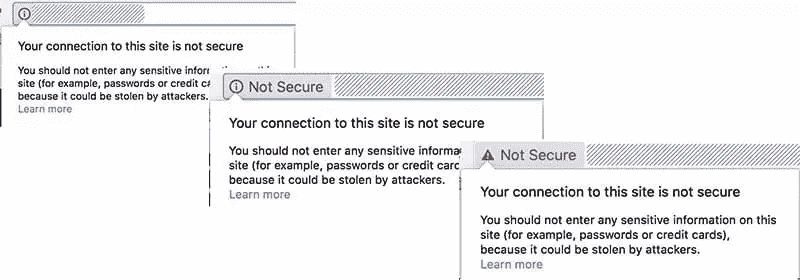
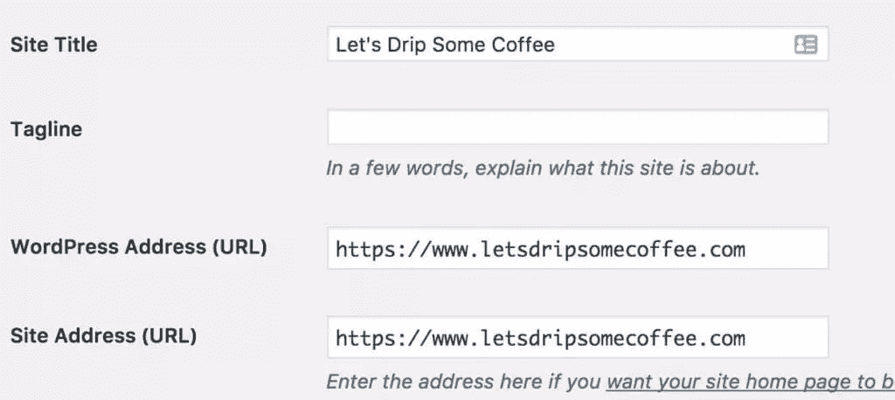

# 如何用 SSL 保护 WordPress

> 原文：<https://www.sitepoint.com/secure-wordpress-with-ssl/>

*这篇文章由[阿德里安·桑杜](https://www.sitepoint.com/author/asandu/)进行了同行评审。感谢 SitePoint 的所有同行评审员使 SitePoint 的内容尽可能做到最好！*

* * *

自从 2014 年[谷歌开始考虑将 HTTPS](https://webmasters.googleblog.com/2014/08/https-as-ranking-signal.html)作为排名因素以来，人们已经慢慢地将他们的网站转向使用加密连接。这可能是设置 SSL 来保护 WordPress-SEO 的一个原因。然而，截至 2017 年 1 月，谷歌让 Chrome 表明仍然使用 HTTP 的网站不安全，这让事情变得更加严重。当一个站点使用一个收集潜在私有用户数据的表单时，比如登录凭证，会有一个更严格的通知显示这个站点不安全。

这些通知仍然是灰色的，但是可能过不了多久我们就会看到所有这些情况的红色通知消息。事实上，当存在 SSL 证书时，这些红色消息已经是可见的，但是无法验证。不仅仅是 Chrome——Safari、Internet Explorer 和 Firefox 等浏览器都有类似的方式来显示网站的安全性或缺乏安全性。

一个额外的好处是让你的网站在 HTTPS 上服务，你可以利用 [HTTP/2，](https://www.sitepoint.com/what-is-http2/)SSL 是一个要求。

所以现在是做出改变的最佳时机。在这篇文章中，我将向你展示获得绿色挂锁的三种方法:

1.  使用 CloudFlare 通过通用 SSL 证书轻松保护您的站点。
2.  使用“让我们加密”获得域级加密。
3.  获得扩展验证 SSL 以获得最高级别的证书，显示您的企业名称，而不仅仅是“安全”通知。

## 保护 WordPress 的简单方法:CloudFlare SSL

使用 [CloudFlare](https://cloudflare.com) 来保护你的站点是最简单的方法，但是它有一些警告。Kray Mitchell 做了一个关于如何安装 CloudFlare 及其通用 SSL 特性的很棒的[教程](https://www.sitepoint.com/premium/screencasts/securing-a-wordpress-site-with-ssl-using-cloudflare)。

流程很简单:[注册 CloudFlare](https://www.cloudflare.com/a/sign-up) ，更改自己站点的 DNS 激活 CloudFlare，在“Crypto”部分开启“灵活 SSL”。

为了更方便，您可以使用 HTTPS 版本让 CloudFlare 覆盖指向不安全 URL 的链接，以防止出现混合内容警告。您可以通过打开“加密”部分底部的“自动 HTTPS 重写”来完成此操作。

如果你安装了 [CloudFlare WordPress 插件](https://wordpress.org/plugins/cloudflare/)，你可以在 WP 管理中指定一些必需的设置。此外，通过修改标题，它有助于克服有时在将 URL 结构更改为 HTTPS 时触发的无限循环。该插件也是设置[服务器推送](https://www.cloudflare.com/website-optimization/http2/serverpush/)的最简单方式，这是 HTTP/2 的主要好处之一。

真的就这么简单！但是有两个要点需要承认:

1.  灵活的 SSL 仅加密浏览器和 CloudFlare 之间的流量。这意味着 CloudFlare 和您的站点(在原始服务器上)之间的流量是未加密的，这仍然为“中间人”攻击留下了空间。当您使用表单获取信用卡数据或密码等敏感信息时，也不允许使用这种方法。明确一点:电商网站不能用这种方法。
2.  CloudFlare 使用共享的 SSL 证书，这意味着您的访问者将无法在幕后验证这是否真的是您。尽管大多数访问者不会花力气去检查证书，但还是要记住这一点。同样，当涉及到电子商务的 PCI 兼容性时(维护 SSL 证书是其中一个步骤)，这是不允许的。

CloudFlare 还提供“完全”和“完全(严格)”SSL 保护。后者还在源服务器上验证证书，这至少缓解了上面的第一点。但是，它仍然是一个共享证书。每月 5 美元，你可以订购一个专用证书，但有更便宜的方法来做到这一点；例如，使用 Let's Encrypt，这将在本文后面讨论。

CloudFlare Flexible SSL 是确保站点安全的一种简单方法，但是，正如您在这里看到的，它给人一种虚假的安全感。虽然这可以防止谷歌采取任何惩罚措施，但这并不总是保护你的网站及其访问者的最佳方式。但是，对于一个基本的信息网站来说，这就够了。

## 免费域名验证:让我们加密

[让我们加密](https://letsencrypt.org/)是一个非盈利的认证机构，在这里你可以获得一个免费的域验证 SSL 证书。这意味着您将获得自己域名的证书，而不是共享的 SSL。由于越来越多的大中型主机提供商的支持，实现它和创建一个更安全的 WordPress 站点的步骤变得越来越简单。

为了让网络更加安全，Let's Encrypt 在域级别(最低级别的保护)自动完成了证书颁发过程。有[手动路线](https://letsencrypt.org/getting-started/)自己拿证。或者你可以请你的主人来帮助你。大多数主机提供商愿意免费提供 SSL 证书安装，或者只收取象征性的费用。最简单的方法是[找到一个提供让我们加密支持的主机](https://community.letsencrypt.org/t/web-hosting-who-support-lets-encrypt/6920)。

让我们加密证书，你必须记住，他们每隔 90 天到期。在他们的 [Why 90 Days](https://letsencrypt.org/2015/11/09/why-90-days.html) 帖子中，该组织解释说，他们这样做的主要原因是因为它限制了密钥泄露和错误发布造成的损害。他们还认为这鼓励了自动化，许多受支持的提供商已经实现了这一点。

虽然他们的理由是有效的，但它要求您要么确保您的证书自动更新，无论是通过您的主机提供商还是通过您设置的流程，要么每 90 天手动更新一次。如果没有，你仍然会得到可怕的“不安全”信息。

像 WPEngine、Dreamhost 和 SiteGround 这样的 WordPress 主机要么已经有了这种自动化，要么让他们的支持人员为你处理。大多数像样的主机不应该收取你的证书或安装费用。

### 处理混合内容

不过，有一点需要注意的是，在本文后面的 EV 证书中，你也会遇到这一点。与 CloudFlare 不同，您必须确保所有资源都通过 HTTPS 加载。否则，您将会看到可怕的混合内容通知。这导致图像和 CSS 脚本不能被加载，这意味着你的布局会被弄乱。

> 最重要的事情是把 WordPress 改成 HTTPS 版本，因为这将改变大部分文件和图片，如果你使用相对路径来调用它们，它们将立刻被加载到 HTTPS。

你不能总是一眼就看出你提供的是混合内容。在某些情况下，挂锁不会变成绿色，而在其他情况下会变成绿色。这主要与您的浏览器缓存有关。有时，一个网站可能会显示一个安全通知，但 Chrome 中的开发者控制台会显示其他内容。幸运的是，控制台的 security 选项卡非常有助于跟踪这些问题。

在这个例子中，只是把 WordPress 的 URL 改成了正确的 HTTPS 版本，之后它就全变绿了。另一个问题是图像的绝对 URL 的使用，这可能仍然是通过 HTTP 提供的。有多种方法可以解决这个问题:

1.  手动将数据库中的 URL 从 HTTP 更改为 HTTPS 或相对 URL。
2.  使用插件来改变链接，例如 [SSL 不安全内容修复程序](https://wordpress.org/plugins/ssl-insecure-content-fixer/)。
3.  逐一浏览你所有的图片，使它们的路径相对。
4.  如果您使用 CDN，请确保将其更改为 SSL，否则您仍然会提供不安全的文件。

## 终极解决方案:扩展验证

扩展验证(EV)证书不仅显示“安全”,还显示您的企业名称，表明您已经通过了一个流程来验证您的企业确实如您所说。

EV 证书提供了最高级别的安全性，因为所使用的域及其背后的组织都经过了审查。如果网站所有者(你)通过欺诈手段获得了证书，并且出了问题，它还会有一个保证来补偿最终用户。虽然这种保证不会让你直接受益，但它有助于让你的访客相信你是值得信赖的。

此外，这个证书所增加的虚荣心是很大的。例如，在移动 Safari 上:

那么如何获得 EV SSL 证书呢？当然，这比使用 CloudFlare 和 Let's Encrypt 需要更多的工作和文书工作，因为它不会无缘无故地被称为“扩展验证”!

涉及以下步骤:

1.  订购证书
2.  文档:这通常包括一份签署的协议，用于请求证书、确定请求者以及法律担保。
3.  商务文件的验证:关于商务的文书工作。
4.  幕后验证:CA 将进行研究，以验证有关您的业务和您的信息。
5.  电话验证:对于证书申请人和业务联系人都是如此。

### 我的扩展验证经验

我为我的一个网站订购了一个扩展验证证书，过程相对顺利。为了让您深入了解这个过程，我在这里简要地记录了所需的步骤。

#### 步骤 1:订购证书

域名验证是整个过程的一部分，NameCheap 有几个步骤来设置它，然后 Comodo 接管。我订购了一个 Comodo EV SSL 证书，您最多可以从更大的注册商那里获得，也可以直接从 Comodo 获得。

#### 第二步:签署的文件

我首先需要手工签署一个证书请求，然后是一个更广泛的证书订阅者协议。第一个表单用于标识我的公司和我，以及所涉及的域。这也是我需要填写我的假名(让我们研磨一些咖啡)，用来代替我的商业名称。

接下来是长达 8 页的订户协议，用于涵盖证书附带的所有法律含义。这两种形式都在步骤 4 中使用，我必须通过电话验证我自己、应用程序和我的业务。

虽然这份文件并不令人担心，但它是用来为认证欺诈设定界限的。所有文件都必须打印、签名、扫描并寄回。

#### 步骤 3:业务文件的验证

由于我的企业是在荷兰注册的，科莫多核查小组无法接触到当地商会的注册。我必须提交我的注册摘要，这是一份有数字签名的文件。

**关于假名的重要注意事项**:如果您打算使用假名，在您申请 EV 之前将该名称注册为商品名是很重要的。如果您没有注册商品名称，您就不能在证书中使用假名。

#### 步骤 4:幕后验证

当然，我不知道作为他们验证的一部分所执行的所有动作。然而，调查人员可以检查社交档案，如 LinkedIn，使用谷歌地图等工具检查你公司的物理位置，甚至可能派人到列出的地址进行检查。

由于我和我的公司都很容易在互联网上找到，这一步没有造成任何真正的延迟，但根据具体情况，它可能比我的情况需要更长的时间。

#### 第五步:电话验证

最后一步是他们打电话给我，核实我的请求，业务细节和域名，并实际上与我交谈。通话持续了几分钟，我不得不回答几个验证问题，比如“*你是 Jacco Blankenspoor 吗？*“，”*您为哪个域名申请此证书？*”。

代理人确认一切都是正确的，我将在一天内收到我的证书。几个小时后，我收到了一封邮件，里面既有我的证书，也有一个 Comodo Trust 的标志，可以显示在我的网站上。

整个过程需要相当多的文书工作。如果您只是对获得一个普通的 SSL 证书感兴趣，只要绿色挂锁而不是您的企业名称，任何普通的域验证 SSL 证书都可以。在这两种情况下，一旦你有了它，你所要做的就是把它上传到你的主机环境，你可以检查你的主机的支持是如何操作的。

## 结论

无论你是获得一个基本的域名认证，还是获得一个扩展的认证来展示你的企业名称，现在建立一个安全的 WordPress 网站比以往任何时候都容易，并且让你的用户感到安全。

最后，归结起来就是:

*   CloudFlare 证书是最方便的流程。它可以，但是考虑到它所有的缺点，这不是我的首选。
*   如果你正在寻找基本的安全性，一个免费的 Let's Encrypt 证书就可以了，而且安装和运行起来应该不会太麻烦。此外，它还能让谷歌不再担心你的网站不安全。
*   如果最大的安全性和最大的客户安心是你所追求的，一个 EV 证书是你所需要的。

如果你有任何问题，请在评论中告诉我，我很乐意帮助你。

## 分享这篇文章