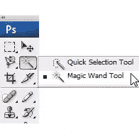
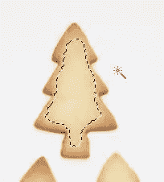
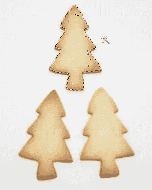
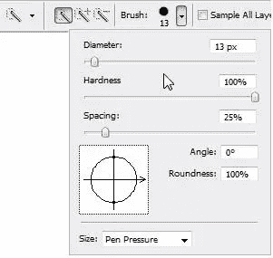
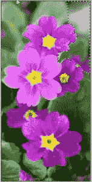
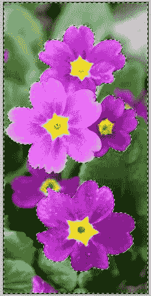
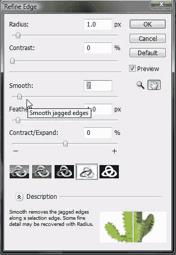
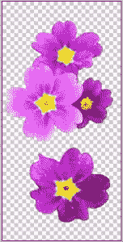

# Photoshop 中的选区，第 3 部分:颜色选择工具

> 原文：<https://www.sitepoint.com/selections-in-photoshop-magic-wand-quick-selection/>

在之前的帖子中，我们看了 Photoshop 中用于选择的[几何工具](https://www.sitepoint.com/photoshop-selections-geometric-tools/)和[手绘工具](https://www.sitepoint.com/selections-in-photoshop-freehand-tools/)。今天轮到了基于颜色的选择工具。

魔棒()根据相邻像素的颜色相似性来选择图像的部分。快速选区()工具(最初在 Photoshop CS3 中引入)通过自动查找并跟随图像中定义的边缘来“绘制”选区。让我们来看看它们各自是如何工作的。

#### 魔术棒工具

魔棒工具绝对是最简单的选择方法之一。当你想选择一个由相似颜色组成的区域，并被一个完全不同的颜色包围时，这是最有用的。

1.选择工具栏中的魔棒工具()或点击 **W** 。

2.在工具选项栏上，在“容差”文本框中键入一个数字，以增加将要选择的相似色调的数量。

“公差”选项设置魔棒工具的灵敏度。这限制或扩展了像素相似性的范围，因此 32(默认容差)选择您点按的颜色加上该颜色的 32 个较亮和 32 个较暗色调。

3.使用魔棒，单击要选择的区域的表面。我用了一些圣诞树饼干的图片。当我点击其中一个饼干时，大部分但不是全部都会被选中。

4.要选择剩余区域并添加到选择中，请按住 **Shift** ，这样魔棒指针会显示一个加号。这表示您单击的任何内容都将被添加到当前选择中。

只需按住 **Shift** +点击，直到你选择整个区域。

如果您意外选择了您想要选择的区域之外的区域，请选取“编辑”>“撤销” **(Ctrl + Z / Cmd + Z)** ，然后再试一次。您也可以在工作时在选项栏中修改公差级别。

#### 快速选择

与许多 Photoshop 工具一样，快速选择工具也是基于画笔的想法。它可以让您使用大小可调的圆形画笔笔尖快速“绘制”选区。它的工作方式类似于魔杖，但更复杂一些。

对于这个例子，我想选择一些彩色的花，并把它们从背景中移除。我使用的图片由 Jana Koll 制作，可以从 Stock Xchng 免费下载。

1.在工具箱中选择快速选择工具()或点击 **Shift W** 在魔棒和快速选择工具之间切换。

2.在工具选项栏中，单击画笔选项卡以临时打开画笔调板。设置刷子的直径和硬度。当你找到合适尺寸的刷子时，你可能会发现需要反复试验。

如果使用多个图层，可以选择对所有图层进行采样选项，从所有可见图层中进行采样，而不仅仅是所选图层。在这个例子中，图像中只有一个层，所以这不是问题。

3.点击部分模糊的绿色背景，并轻轻拖动指针。你会看到快速选择工具非常准确地选择了一大块背景。

继续在花周围拖动。如果你不小心选择了一朵花，按住 **Alt/Option** 键并绘画以取消选择。如果这种情况反复出现，请尝试减小快速选择画笔的大小。

4.继续在花周围拖动，直到完成选择。你会发现这个工具非常直观，你只需要画小区域就可以选择大块。

好了，这就是选择，但是我们还没有完成这个工具。有时选区边缘非常参差不齐，但使用快速选择工具，您可以优化选区。

5.在工具选项栏中，单击细化按钮，这将打开以下对话框；

我不会逐一介绍这些选项，我只想说有大量的滑块供您使用和探索。对于这个例子，我增加了平滑度，这有助于消除一些锯齿边缘。

6.最后，我点击删除来删除背景(记得我们实际上选择了背景，而不是花)。我现在可以很容易地添加不同的背景。

我希望你已经发现这个颜色选择工具的描述是有用的——它们是基于颜色进行选择的两个很好的工具。

明天，我们将用一些额外的技巧和窍门来结束这个系列。我希望你能加入我！

**相关阅读:**

*   [Photoshop 中的选区，第 1 部分:几何工具](https://www.sitepoint.com/photoshop-selections-geometric-tools/)
*   [Photoshop 中的选区，第 2 部分:手绘工具](https://www.sitepoint.com/selections-in-photoshop-freehand-tools/)

## 分享这篇文章