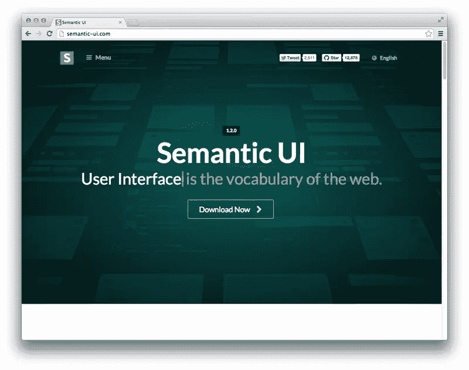

# 语义 UI 1.2:一个有很多新特性的新版本

> 原文：<https://www.sitepoint.com/semantic-ui-new-version-new-features/>

语义 UI 的第一个主要版本已经正式发布。自从我第一次发现这个奇妙的框架——大约一年前——我就一直在仔细观察它，我可以说我对它在结构、外观、功能和定制能力方面的现状非常满意。

有许多令人兴奋的新特性和功能需要提及，但在我们研究它们之前，让我们看看 Semantic 与其他类似框架有什么不同，以及为什么它被称为“Semantic”。

## 关于语义用户界面的结构

顾名思义，语义 UI 的主要目标是*有意义*。有几件事有助于实现这一目标。Semantic 的所有组件被称为 UI 定义，并被分为 5 种不同的类型:元素、集合、视图、模块和行为(参见[这篇文章](https://www.sitepoint.com/introducing-semantic-ui-component-library/)了解更多)。

与其他框架对组件进行分组的方式相比，这种分离使得框架更加清晰、有序，并且易于使用。除此之外，Semantic 的 CSS 类的所有命名约定都是围绕描述元素的自然语言原则构建的——复数、时态和词序——从而使您的代码完全不言自明。

## 新功能和组件

语义 UI 的第一个主要发布版本，[1.0 版](https://github.com/Semantic-Org/Semantic-UI/blob/master/RELEASE-NOTES.md#version-100---november-24-2014)带来了许多新特性和大量改进。在[当前版本 1.2](https://github.com/Semantic-Org/Semantic-UI/blob/master/RELEASE-NOTES.md) 之前也有进一步的改进。让我们看看这些是什么。

### 新的构建工具

在这个版本中[咕噜声](http://gruntjs.com/)被[大口](http://gulpjs.com/)取代。因此，为了充分发挥这个框架的潜力，你需要安装 [Node.js](http://nodejs.org/) 和 Gulp。当你调整你的网站的用户界面时，以及在主题创建/编辑过程中，这是最真实的。

### 新用户界面定义

语义提供了两个新的基础组件:**站点**和**重置**。*网站*包含所有用于定制网站整体外观的全局变量默认值。*重置*用于处理浏览器默认设置的异常。

新元素有**旗帜**、**列表**、**轨道**。 *Flag* 提供带有国旗的图标。*列表*用于对相关内容进行分组。 *Rail* 是一种侧边栏；它将补充内容显示为网站主视图的一部分。

新增视图为**广告**、**卡片**、**统计**。*广告*用于展示第三方推广内容。*卡片*用于显示一张类似游戏卡的内容。*统计数据*用于强调一个属性的当前值，比如账户中超过一百万美元的人数。

新模块有**唠叨**、**粘人**和**视频**。Nag 用于显示一条重要消息，该消息会一直显示，直到用户将其删除。 *Sticky* 帮助您在页面滚动时将一部分内容或特定组件(如导航栏)固定到浏览器视窗中。*视频*允许您显示来自 YouTube 和 Vimeo 的视频文件。

### 新文档资源

除了每个组件的详细文档之外，框架还有一个名为厨房水槽的新部分，展示了所有的界面元素。

但更重要的是，现在 Semantic 为[提供了一个独立的网站](http://learnsemantic.com/)专门用于学习框架。尽管主网站上的标准文档解释了如何使用不同的组件，但它们并没有给出调整和定制 UI 的整体指导方针。新的网站扮演了这个角色，向您展示如何开始使用框架，如何定制其默认外观，以及如何创建主题来彻底改变您的网站的外观和感觉。

## 让你的网站脱颖而出

现成框架的最大问题之一是，我们的网站经常以一个非常容易识别的外观和感觉结束。人们说这只是几秒钟的事情，例如:嘿，我以前见过这个——我打赌这个网站是用 Bootstrap 构建的！

让我们的网站独一无二很重要，但是让它们脱颖而出需要额外的工作和努力。幸运的是，有了新的语义定制系统，这个任务变得容易多了。现在 Semantic 使用一种继承机制，类似于 [Sublime 文本设置文件](http://www.sublimetext.com/docs/3/settings.html)，来修改 [Less 变量](http://lesscss.org/features/#variables-feature)。在 Sublime Text 中，*用户设置*被放置在一个单独的文件中，该文件覆盖了*默认设置*文件。这种分离使默认设置不会被修改，从而最大限度地降低了破坏应用程序功能的风险，并在应用程序更新/升级时保持用户设置不变。要了解这个逻辑在语义中是如何应用的，请看一下他们的主题指南[。](http://learnsemantic.com/themes/overview.html)

简而言之，超过 50 个 UI 组件，3000 多个变量，3 级变量继承，Semantic 给你完全的自由以任何可能的方式改变你的网站设计。

现在 Semantic 附带了几个预构建的主题，旨在让您快速开始使用该框架。致力于第三方主题的独立网站正在建设中。它将提供可以在线下载和分发的打包主题。

## 为什么选择语义 UI？

围绕语义的讨论很棒，但是为什么要选择语义而不是其他呢？嗯，有几个很好的理由:

*   Semantic 是一个现代的框架，提供了几乎所有你需要的现成的构建现代网站的东西。有了这么多组件，对第三方附加组件的需求是最小的。
*   语义正在积极发展中。特性和功能会定期得到改进和扩展。
*   语义是设计者友好的。框架使用的自然语言命名约定，没有简写或缩写，每个人都可以理解。
*   语义组件的结构、分离和命名比其他框架更有意义和有序。
*   语义提供了一个强大而灵活的定制系统。无论你想调整你的用户界面还是完全改变你的网站的外观，语义给了你这样做的可能性。

## 选择语义有什么弊端吗？

我非常喜欢语义，但是本着公平竞争的精神，我应该提到我认为它的一些缺点:

*   尽管语义越来越受欢迎，但该框架还没有在现实世界的网站上得到足够的测试。我不知道有多少网站使用它(两个例子是 [Quirky](https://www.quirky.com/) 和 [New Republic](http://www.newrepublic.com/) )。这并不意味着我们不能在现实世界的项目中成功地使用它；这只是意味着我们没有很多证据表明它在现实世界中有多有效和稳健。
*   语义是一种复杂的框架，对于习惯使用它的新手来说可能有点难以接受。它确实很容易学习和使用，但是需要时间来适应它的基础设施。
*   没有用于修改变量的 GUI 定制程序。这么多变量放在不同的文件中，如果我们能以更简单的方式修改它们，那就太好了。一个很好的例子就是 [UIkit 定制器](http://getuikit.com/docs/customizer.html)。我承认构建这样的定制器并不是一件容易的事情(尤其是，语义有 3000 多个变量和 3 级继承)，但是如果他们在未来的版本中提供一个定制器，那就太棒了。

## 摘要

如您所见，Semantic 是一个现代的、有吸引力的、功能齐全的、易于定制的框架。事实上，它已经成为 2014 年最受欢迎的 CSS 框架之一。

它可以用于各种各样的项目，甚至在许多项目中不需要第三方产品。尽管如此，使用语义的知名项目并不多。所以，如果你对这个框架有一些经验，并且想向我们展示用它构建的东西，请在评论中分享你的想法。

## 分享这篇文章