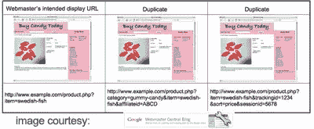

# 谷歌真的希望你优化你的网站

> 原文：<https://www.sitepoint.com/seo-for-google/>

谷歌在乎 SEO 吗？是的，确实如此:从[谷歌的搜索引擎优化入门指南(pdf)](http://www.google.com/webmasters/docs/search-engine-optimization-starter-guide.pdf) 到[谷歌网站管理员帮助论坛](http://www.google.com/support/forum/p/Webmasters?hl=en )提供的帮助，搜索引擎在选择你如何优化你的网站以增加收录方面非常透明。**我们将讨论 URL 结构、信任等级和重复内容问题。**

以一个结论开始:如果你做他们喜欢的事情，你的网站不仅会被收录，而且排名会更好。现在让我们“深入”地看看，一劳永逸地，谷歌如何喜欢你为它的搜索引擎优化你的网站。

本文中的所有问题都是用户在[谷歌版主测试版上问的，问谷歌工程师](http://moderator.appspot.com/#16/e=c9 )。

##### 谷歌真的在乎 SEO 吗？

答案是肯定的，它来自谷歌的搜索传道者亚当·拉斯尼克:

> 就像任何行业一样，有优秀的 SEO，也有烂苹果。当人们让用户和谷歌机器人更容易访问他们的网站时，我们谷歌人很高兴，不管他们是自己做这项工作，还是雇佣有道德、有效率的专业人士来帮助他们。

请注意，当网站为搜索而优化时,**“谷歌人很高兴”**。寓意:了解你的搜索引擎优化！

##### Google 首选的 URL 结构是什么？

谷歌的马特·科茨回答道:

> 我会按照这个顺序推荐
> long-haired-dogs.html
> 长毛 _ 狗. html
> longhaireddogs.html
> 。如果你的网站已经在网上运行了，可能就不值得回头从一种方法改变到另一种方法，但是如果你刚刚开始一个新的网站，我可能会选择优先顺序的 URL。我只能为谷歌代言；你需要进行自己的测试，看看什么最适合微软、雅虎和 Ask。

##### 谷歌使用的是“信任等级”算法吗？

许多 SEO 建议，如果一个坏的邻居站点链接到你的站点，你的站点在 Google 的“信任等级”会降低。

假的。如果这是真的，任何竞争对手都可能为了恶意而损害一个网站。谷歌没有使用“信任等级”来指代任何东西，尽管该公司曾试图将“信任等级”注册为反钓鱼过滤器的术语。谷歌在 2008 年放弃了这个商标。唯一可能使用“信任等级”的公司是雅虎！

Matt Cutts 解释了竞争对手如何伤害另一个竞争对手:

> 我们非常努力地让一个竞争者很难伤害另一个竞争者。(我们并不认为这是不可能的，因为例如有人可能会窃取您的域名，无论是通过身份盗窃还是通过入侵域名，然后在域名上做坏事。)但是我们努力不让一个竞争者在我们的排名中伤害另一个竞争者。

##### 谷歌会学习如何识别付费链接而不使站长使用“nofollow”吗？

答案是肯定的。当然，我们知道技术之一是要求用户“报告付费链接”,但谷歌也依赖于它的算法。根据马特·卡茨的说法:

> 我们肯定已经努力改善我们的付费链接和垃圾链接检测算法。例如，在我们最近的 PageRank 更新(2008 年 9 月 27 日)中，PageRank 有一些不同，因为我们改进了对待链接的方式。
> 
> 链接上的“nofollow”属性是一种粒度方式，网站所有者可以向搜索引擎提供更多关于他们链接的信息，但搜索引擎绝对会继续创新我们如何衡量链接。

##### 我的网站因内容重复而被处罚！

是的，这是一个棘手的问题，在谷歌版主测试版上没有任何谷歌工程师回答这个问题，但是，亚当·拉斯尼克提供了一个链接，链接到谷歌网站管理员趋势分析师苏珊·莫斯克瓦的答案:[揭开“重复内容惩罚”的神秘面纱](http://googlewebmastercentral.blogspot.com/2008/09/demystifying-duplicate-content-penalty.html)

“谷歌会惩罚重复内容吗”的答案是“是和不是”。为了更好地理解这一点，我们首先需要用谷歌术语来“定义”重复内容[。](http://www.google.com/support/webmasters/bin/answer.py?answer=66361 )

通常，重复内容是指与其他内容完全匹配或非常相似的内容块。这种情况有两种类型:域内重复内容和跨域重复内容。

 **谷歌以不同的方式过滤重复的内容。如果你的网站每个页面都有一个普通版本和一个印刷版本，并且没有一个页面在 robots.txt 中被屏蔽或者带有“noindex”元标签，Google 会简单地选择其中一个来列出并删除另一个。

通常由 CMS 管理的电子商务网站，有时可能会通过多个不同的 URL 存储显示的(更糟的是链接的)项目。谷歌会将重复的网址分组，并在搜索结果中显示它认为最好的一个。

点击放大

在多个 URL 上有重复内容的真正负面影响是:

*   淡化链接流行度(不是获得指向预期显示 URL 的链接，而是将链接划分到不同的 URL 中)
*   搜索结果可能会显示“用户不友好的 URL”(带有跟踪 id 的长 URL 等)，这对“网站品牌”不利

“重复内容惩罚”适用于故意复制内容以操纵 SERPs 或赢得更多流量的情况——在这种情况下，谷歌将对相关网站的索引和排名进行调整。
 ***跨域-重复-内容***

这是所有严肃的网络出版商的噩梦:内容抓取。例如，有人可以抓取内容用于“为 AdSense 制作”的网站。或者一些 web 代理可以索引它们通过代理访问的站点的一部分。谷歌表示，这不是担心的理由，尽管许多出版商在 scraper 排名高于原版时遭遇了“惩罚”。

谷歌表示，他们能够确定原来的。显然，如果刮刀排名更高，原因可能在于“受害者”网站为谷歌“准备”的方式。以下是谷歌搜索质量团队的斯文·瑙曼提出的可能的“补救措施”:

> *   Check if our crawler can still access your content. You may have inadvertently blocked access to part of the robots.txt file.
> *   You can check your sitemap file to see if you have made any changes to the deleted specific content.
> *   Check whether your site meets the guidelines of our webmaster.

最有趣的说法来自同一个谷歌搜索专家。你如何“翻译”以下内容:

> 最后，我想指出的是，在大多数情况下，重复内容不会对你的网站在谷歌索引中的出现产生负面影响。它只是被过滤掉了。

让我告诉你我的观点:如果你的网站被一个更受欢迎的网站抓取，你的原创内容会被过滤掉。如果这不是“重复内容罚款”，那我们该叫它什么？或许根除？(!)

幸运的是，谷歌确实提供了一个解决方案:如果你的内容被抓取并且抓取者排名更高，你可以提交一个 [DMCA 请求](http://www.google.com/dmca.html )来要求内容的所有权。祝你好运！

最后但同样重要的是:当你在其他网站上整合内容时，如果你想让原创文章排名，你必须确保这些网站包含一个链接。我们已经看到过这样的情况，尽管有联系，原始的被给予了较少的权重，并且…嗯… **根除了**？

对于需要显示与“母”网站重复或相似内容的联盟网站，谷歌提出的解决方案也很简单:复制一个网站的内容将导致谷歌从结果中“忽略”你的网站，但如果你给你的页面增加额外的价值(更多的内容)，你就有很好的机会在 SERPs 中排名靠前。那么多是多少呢？一段，两段？真不敢相信

我的第二个结论:你能从这篇文章中得到什么？也许就连谷歌也不知道自己想要什么——算法完全掌控着一切——它也不想让人类知道它在做什么。(!)说真的，谷歌喜欢优化的网站，你最好的选择是永远不要复制内容。句号。** 

## **分享这篇文章**