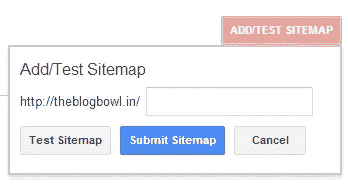
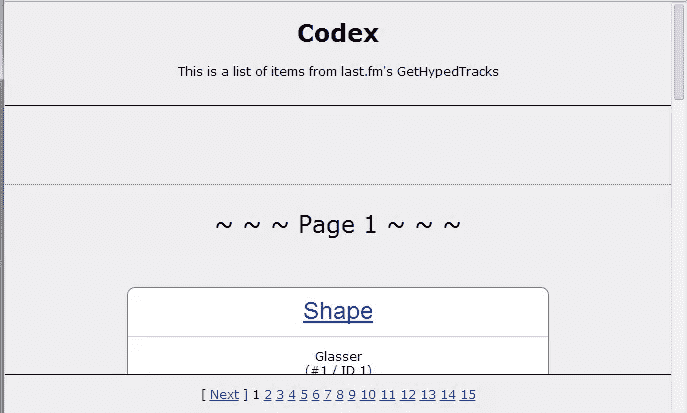

# 搜索引擎友好的无限滚动

> 原文：<https://www.sitepoint.com/seo-friendly-infinite-scroll/>

作为一名开发人员，在某种程度上，你可能不得不在老式的分页和时髦的新无限卷轴之间做出选择，使用最新的技术，受脸书和 Pinterest 等互联网巨头的启发。这取决于你的要求，但也可能归结为你(或你的客户)的个人选择。

无限可能是用户浏览内容的有效方式，但它有很多缺点，在某些类型的网站上可能是错误的选择。

无限滚动的一个主要问题是，它最简单的形式对 SEO 并不友好。当您实现无限滚动时，新内容通过 Ajax 加载。除非你[采取具体措施](https://developers.google.com/webmasters/ajax-crawling/)，否则搜索引擎看不到这些内容。那么，我们如何使无限滚动搜索引擎优化友好？让我们讨论几个方法，包括谷歌在站长中心博客上讨论的[方法。](http://googlewebmastercentral.blogspot.in/2014/02/infinite-scroll-search-friendly.html)

## 包括网站地图

如果你通过 infinite scroll 加载的内容被分成不同的页面或单元，它们有自己的 URL，那么像 Googlebot 这样的搜索爬虫可能找不到这些内容，除非它被链接到你已经被索引的页面上的某个可访问位置。

一个[站点地图](https://support.google.com/webmasters/answer/156184)是一种确保搜索爬虫能找到每一页的方法，包括通过无限滚动功能加载的内容。站点地图是网站中的页面列表，通常是 XML 格式。如果 web crawlers 无法访问您网站的一部分，您可以提供一个站点地图来通知 crawler 完整的页面列表。关于站点地图和如何创建站点地图的更多信息，你可以参考[Tuts+](http://webdesign.tutsplus.com/articles/all-you-need-to-know-about-xml-sitemaps--webdesign-9838)的教程。

如果你在 Google 网站管理员工具上有一个帐户，你可以使用该服务来测试和提交你的站点地图，以确保爬虫不会因为你的站点地图中的错误或其他因素而错过你的站点。

## 使用分页+无限滚动

正如前面提到的，这就是 Google 在最近的博客文章中讨论的方法。有趣的是，它提供了在同一页面内无限滚动的分页选择！让我们来看看细节。

### 使用 HTML5 的历史 API

当你加载新内容时，谷歌建议你使用 [HTML5 的历史 API](http://www.impressivewebs.com/html5-history-api-syntax/) 来改变页面的 URL，以适应用户滚动启动加载新内容时的页码。例如，在加载第 3 页时，当前的 URL 会变成 http://myexample.com/?page=3 的。类似地，在向上滚动查看之前的内容时，URL 会变成 http://myexample.com/?page=2 的。

### 包括分页和无限滚动

除了在内容滚动时改变网址，谷歌建议你在底部提供你的页面列表，这些页面是链接到网址中有页码的相同页面的链接(例如[http://myexample.com/?page=3](http://myexample.com/?page=3))。就像在传统分页中一样，当有人点击一个页面时，页面会刷新，显示第 3 页的内容。在这一点上，无限滚动功能将仍然工作，以及上面概述的 HTML5 历史 API 的变化。因此，如果用户向上或向下滚动，就会显示新的内容，并且 URL 上的页码也会改变。

### 好处

那么这对搜索爬虫意味着什么呢？嗯，当一个爬虫访问你的站点时，第一页的内容在底部显示页码。由于 crawler 无法触发无限滚动，因此不会加载任何新内容。但是，因为分页部分仍然包含在页面中，所以爬行器能够访问所有内容。这也确保了在搜索时，当有人在第 3 页上搜索某个特定的条目时，他们会直接登陆到该内容，而不是其他地方。

这种方法还有一个额外的好处，就是可以轻松地深度链接到无限滚动内容。因此，如果我想与某人分享第 4 页上的某个特定项目，我可以简单地复制 URL(当时它会在第 4 页上)，当某人访问该 URL 时，他们将能够看到我希望他们看到的内容。

## 约翰·穆勒的演示

Webmaster Trends 的分析师 John Mueller 提供了一个实现分页无限滚动的现场演示。

如前所述，你可以在 Google 网站管理员中心博客上阅读 John 演示的完整描述。

## 结论

在我最近的一篇讨论用 jQuery 实现无限滚动的文章中，[有人评论说](https://www.sitepoint.com/implementing-infinite-scroll-jquery/#comment-1308994786)随着越来越多的网站开始使用这种技术，这对那些不使用这种技术的网站来说会更好。这很可能是真的。

谷歌自己的建议，以及我在这里讨论的内容，应该会为那些想使用这种技术但又不想受 SEO 限制的人提供更多的激励。

如果你看过谷歌的建议，或者在你自己的网站或应用上遇到过这种情况，请在评论中告诉我们。

## 分享这篇文章