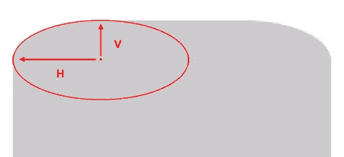

# 使用斜杠语法设置 CSS3 边框半径

> 原文：<https://www.sitepoint.com/setting-css3-border-radius-with-slash-syntax/>

关于 [CSS3 `border-radius`财产](https://www.w3.org/TR/css3-background/#border-radius)我还能说些什么以前没说过的话呢？嗯，我不能说我在这篇文章中将要说的任何东西对于那些经常阅读涵盖前端技术的文章的人来说都是全新的。

然而，有时候，一个特定的 CSS3 属性表面上的简单性可能会让我们看不到这样一个事实，即实际上可能比我们想象的要复杂得多。

这正是这篇短文将帮助建立的——特别是与`border-radius`属性相关的内容。

但是不要担心——我会仔细阅读，首先介绍一些基础知识，以便轻松进入讨论。

在进入正题之前，我很高兴地宣布，我最近有幸与人合著了一部由 SitePoint 出版的激动人心的新书。它被称为现实世界的 HTML5 和 CSS3，计划于五月下旬推出。当然，`border-radius`将在即将出版的书中涉及，但我认为在这里扩展这个主题会很好，并为那些有兴趣深入研究与该属性相关的一些细节的人提供一点额外的帮助。

## `border-radius`的基础知识

是一个使用起来非常简单的属性，在所有现代浏览器中都有 100%的支持，甚至在一些早期版本的浏览器中也有支持。下面是该语法最基本的简写形式:

```
#element {
  border-radius: 10px;
}
```

这将在目标元素的每个角上放置 10px 半径(即，圆形边缘)。如果要为每个角指定不同的值，可以这样做:

```
#element {
  border-radius: 10px 5px 20px 16px;
}
```

这些值从左上角开始，顺时针方向移动。

就像`margin`和`padding`属性一样，您当然可以省略一两个值，现有的值将用于确定被省略的值:

```
#element {
  border-radius: 10px 5px 20px;
}
```

在最后一个示例中，虽然我省略了左下角的值，但左下角将从为右上角指定的值(第二个值)继承其半径值。同样，如果您省略了第三个和第四个值，那么第三个值(右下角)将从第一个值(左上角)继承。

最后，您还可以使用手写语法单独声明每个角，如下所示:

```
#element {
  border-top-left-radius: 10px;
  border-top-right-radius: 5px;
  border-bottom-right-radius: 20px;
  border-bottom-left-radius: 16px;
}
```

很简单。我敢打赌你早就知道这些了，不是吗？

现在，让我们引入一点复杂性，以便我们能够真正了解这个 CSS3 属性。

## 水平和垂直半径的不同值

因为声明`border-radius`值的标准方式(如上所述)已经变得如此普遍，所以您可能不知道该属性的替代语法。

看一下下面的代码示例:

```
#element {
  border-radius: 55px / 25px;
}
```

当我第一次看到两个值之间有斜杠的那种语法时，我的第一反应是:*这不可能是对的！*但确实如此。下面是规格对它的解释[:](https://www.w3.org/TR/css3-background/#border-radius)

> 如果在斜线前后给出了值，那么斜线前的值设置水平半径，斜线后的值设置垂直半径。如果没有斜线，则两个半径的值相等。

下面是使用上述语法的元素的图像，尺寸为 200 像素乘 200 像素，背景为灰色。请记住，要查看 HTML 格式副本，需要一个支持 CSS3 的浏览器。


基于斜杠的语法可能很难理解，所以让我们研究一下语法与该元素上的角的形状之间的关系。



在上面的图像中，我放大了元素，并在角上放置了一个椭圆，使椭圆的上曲线尽可能紧密地与圆角重叠。根据[字典的定义](http://dictionary.reference.com/browse/radius)，半径是“从一个圆或球体的中心延伸到圆周或表面的一条直线。”

根据规范，您给`border-radius`属性的值“定义了四分之一椭圆的半径，该半径定义了外部边界边缘的角的形状。”因此，如果你添加完整的椭圆(正如我上面所做的)，你会看到半径是如何计算的。在图中，我画了指示水平和垂直半径的箭头(标有“H”和“V”)。

请记住，由于像素化(在原始版本和放大版本中)，这不可能是一门精确的科学；在处理基于矢量的形状时，这可能更合适。

## 其他水平/垂直半径选项

当然，基于斜杠的语法不仅限于两个值；如果愿意，可以为元素的每个角设置特定的垂直和水平半径值。

上面的语法也可以这样表达:

```
#element {
  border-radius: 55px 55px 55px 55px / 25px 25px 25px 25px;
}
```

斜线前的值分别代表左上角、右上角、右下角和左下角的水平半径。斜线后的值依次代表相同拐角的垂直半径。

当然，与传统语法类似，您可以省略斜杠前后的一两个值，缺失的值将从现有值继承。

您还可以选择对每个角使用长字语法来声明不同的垂直和水平半径。因此，如果我们想使用手写语法从上面创建相同的形状，我们会这样做:

```
#element {
  border-top-left-radius: 55px 25px;
  border-top-right-radius: 55px 25px;
  border-bottom-right-radius: 55px 25px;
  border-bottom-left-radius: 55px 25px;
}
```

注意，这次没有使用斜线。在这种情况下，每行上的两个空格分隔的值分别表示给定拐角的水平和垂直半径。

## 什么时候应该使用这种语法？

应该注意的是，只有当你希望单个拐角*上的垂直和水平半径值彼此不同*时，才使用该语法来确定每个拐角的垂直和水平半径值。这意味着如果希望每个角的水平和垂直半径值相等，就不需要使用这种语法。

值得注意的是，通过脚本修改半径值时，也可以使用这种语法。因此，如果使用得当，这可以为一些有趣的动画打开大门，这些动画使用[过渡](https://www.w3.org/TR/css3-transitions/)或[基于关键帧的动画](https://www.w3.org/TR/css3-animations/)。

因此，在大多数情况下，如果不是所有情况，您可以坚持传统的语法，只有当您想要一个或多个不对称圆角时，才使用这里描述的语法。

即便如此，这些信息应该足以让您对这个众所周知的 CSS3 属性做进一步的尝试。

让我知道你想到了什么。

## 分享这篇文章