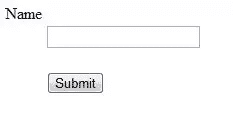
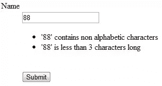

# 为 Zend_Form_Element 设置自定义错误消息

> 原文：<https://www.sitepoint.com/setting-custom-error-messages-for-zend-form-element/>

在本文中，我将展示一个常见问题的解决方案，当开发人员必须创建一个基于 Zend 框架的非英语网站或应用程序时，会出现这个问题。我们如何将一个属于`Zend_Form_Element`的`Zend_Form`字段标记为无效，显示一个或多个自定义错误消息？这个问题主要是由`Zend_Form_Element`类的本机反直觉方法引起的，我将对此进行更详细的解释。(注意这里讨论的问题和解决方案对 Zend Framework 版本 1.12 和更低版本有效。)

## 开发一个例子

假设您有一个包含不同字段的表单，并且只考虑其中一个字段，例如一个用于让用户输入姓名的文本输入字段。您可以使用的验证器是不同的，但是为了举例，我们将限制名称的长度，它只允许字母字符和空格。说到 Zend 框架语言，我们将分别使用`Zend_Validate_StringLength`和`Zend_Validate_Alpha`类。

你可能已经知道，Zend Framework 属于美国公司 Zend，所以它显示的所有消息都是英文的。框架的默认行为是为每个被用户输入破坏的验证器显示一条或多条错误消息。因此，对于那些正在构建非英语网站的人来说，有两种选择可以让所有用户都可以阅读消息:翻译框架的每个错误消息，或者在一条或多条消息中解释输入无效并显示插入可接受值的建议。第一个选项过于复杂，尤其是对于中小型项目，所以我将展示如何使用第二个选项。

为了简单起见，我们将设置一个单独的自定义消息:“输入无效。该值只能包含字母字符和空格，长度必须在 3 到 50 个字符之间。

### 代码

我将展示我们将在本文中使用的代码。首先，这个表单包含姓名的输入字段和检查数据所需的验证器。

```
<?php
class Application_Form_User extends Zend_Form
{
    public function init() {
        // create the field
        $element = new Zend_Form_Element_Text("name");
        $element->setLabel("Name");

        // set the validators
        $element->setValidators(array(
            new Zend_Validate_Alpha(true),
            new Zend_Validate_StringLength(
                array("min" => 3, "max" => 50))
        ));
        $element->setRequired();

        // add the element to the form
        $this->addElement($element);

        // add a submit button
        $element = new Zend_Form_Element_Submit("submit");
        $element->setLabel("Submit");
        $this->addElement($element);
    }
}
```

在控制器中，我们将检查字段是否有效，并采取相应的措施。通常你不会使用`IndexController`并且你可能在一个特定的控制器中有这个验证。无论如何，为了简化示例，我将使用它。

```
<?php
class IndexController extends Zend_Controller_Action
{
    public function init() {
    }

    public function indexAction() {
        $form = new Application_Form_User();

        if ($this->getRequest()->isPost() &&
            $form->isValid($this->getRequest()->getPost())) {
            $this->view->message = "Valid input";
        }
        else {
            $this->view->form = $form;
        }
    }
}
```

使用的视图非常简单；它只显示消息和表单。

```
<?php
if (isset($this->message)) {
    echo $this->message;
}
if (isset($this->form)) {
    echo $this->form;
}
```

上面的源代码，没有任何 CSS 规则，将呈现如下:



此外，如果您在名称字段中插入无效值“88 ”,您将看到以下消息:



## 分析框架的方法

一个很好的问题是，是否已经有方法可以面对这种情况。答案是*差不多*。我的意思是方法是有的，但并不总是如你所愿(至少如我所愿)。管理错误消息的方法有:

*   `setErrors(array $messages)`
*   `setErrorMessages(array $messages)`

方法`setErrors()`只有一个参数，它是一个数组，在输入无效的情况下使用数组元素作为消息显示。其用法的一个例子是:

```
<?php
// set the custom message in the case of an error
$element->setErrors(array("The input is invalid. The value must have only alphabetic characters and spaces and its length must be between 3 and 50 characters."));
```

此方法除了显示给定的字符串之外，还将字段标记为无效。

它可以在应用程序逻辑中使用两次，但是两次都有一个对我们的目标没有用的行为。第一个是在创建表单元素期间(`init()`方法)。在这种情况下，当表单已加载且用户尚未插入任何数据时，会显示该消息。相当不愉快。在这种情况下，代码的相关部分如下所示:

```
<?php
// set the validators
$element->setValidators(array(
    new Zend_Validate_Alpha(true),
    new Zend_Validate_StringLength(
        array("min" => 3, "max" => 50))
));
$element->setRequired();

// set the custom message in the case of an error
$element->setErrors(array("The input is invalid. The value must have only alphabetic characters and spaces and its length must be between 3 and 50 characters."));
```

第二次发生在控制器内通常的数据验证期间信息被发送之后。发生的情况是，当错误发生时，自定义消息被附加到默认消息之后。在这种情况下，`IndexController`的`indexAction()`以这种方式变化:

```
<?php
public function indexAction() {
    $form = new Application_Form_User();
    if ($this->getRequest()->isPost()) {
        // If the input of the user is valid, set the success
        // message. Otherwise, set the custom errors and show
        // the form again.
        if ($form->isValid($this->getRequest()->getPost())) {
            $this->view->message = "Valid input";
        }
        else {
            $form->getElement("name")->setErrors(array("The input is invalid. The value must have only alphabetic characters and spaces and its length must be between 3 and 50 characters."));
            $this->view->form = $form;
        }
    }
    else {
        $this->view->form = $form;
    }
}
```

与`setErrors()`一样，`setErrorMessages()`方法将一个字符串数组作为参数，在无效输入的情况下显示给用户。其用法的一个例子是:

```
<?php
$element->setErrorMessages(array("The input is invalid. The value must have only alphabetic characters and spaces and its length must be between 3 and 50 characters."));
```

这一行代码仍然没有解决问题，因为它要么为每个不满足的条件显示相同的错误消息，要么没有任何效果。如果显示的行用于`init()`方法，与显示用于`setErrors()`的方式相同，在出现错误的情况下，自定义消息将显示用户输入违反的条件数。如果在控制器内的常规数据验证期间插入该行，与前面解释的方式相同，则不会有任何影响。这意味着自定义消息不会显示，框架将只显示默认消息。

## 揭开解决方案

现在的重点是理解*何时*和*如何*插入自定义消息，以便用户可以进行比较并建议接受什么值。毫无疑问,“何时”取决于表单内部字段的创建(`init()`方法),“如何”取决于`setErrorMessages()`方法的联合以及 Zend 框架验证器的一个名为`breakChainOnFailure()`的属性的使用。后者允许我们在第一个失败的条件下停止验证过程。如果我们设置了五个验证器，但是其中的第一个失败了，那么另外四个将不会被使用。

为了利用尽可能少的代码行来使用这个属性，我将稍微修改一下我在开始时展示的代码。我将把使用`setErrorMessages()`方法的代码行添加到`init()`方法中，并且我将利用`setValidators()`接受的一个可能的输入配置，它需要一个数组的数组。主数组中包含的数组最多可以有三个参数，它们是:

1.  向用户指定验证程序的字符串(必需)。
2.  一个布尔值(可选，默认情况下其值为`false`)来指定框架是否必须在第一次失败时中断验证。因此，这个参数设置属性`breakChainOnFailure`的值，这将帮助我们实现我们的目标。
3.  一个选项数组(可选，默认为空数组),对于每个选择的验证器是不同的

对于您想要使用的每个验证器，使用作为 true 传递的第二个参数是非常重要的。

根据我们到目前为止所看到的，结果代码是:

```
<?php
class Application_Form_User extends Zend_Form
{
    public function init() {
        // create the field
        $element = new Zend_Form_Element_Text("name");
        $element->setLabel("Name");

        // set the validators
        $element->setValidators(array(
            array("Alpha", true, array("allowWhiteSpace" => true)),
            array("StringLength", true, array(
                "min" => 3, "max" => 50))
        ));
        $element->setRequired();

        // set the custom message in the case of an error
        $element->setErrorMessages(array("The input is invalid. The value must have only alphabetic characters and spaces and its length must be between 3 and 50 characters."));

        // add the element to the form
        $this->addElement($element);

        // add a submit button
        $element = new Zend_Form_Element_Submit("submit");
        $element->setLabel("Submit");
        $this->addElement($element);
    }
}
```

## 结论

使用上面的代码，当有无效输入时，表单将只显示自定义消息…这正是我们想要的！如果您需要使用更多的消息，例如几个阶段中的建议，只需在用于`setErrorMessages()`方法的数组中添加更多的字符串。

图片 via[Fotolia](http://us.fotolia.com/?utm_source=sitepoint&utm_medium=website_link&utm=campaign=sitepoint "Royalty Free Stock Photos at Fotolia.com")

## 分享这篇文章