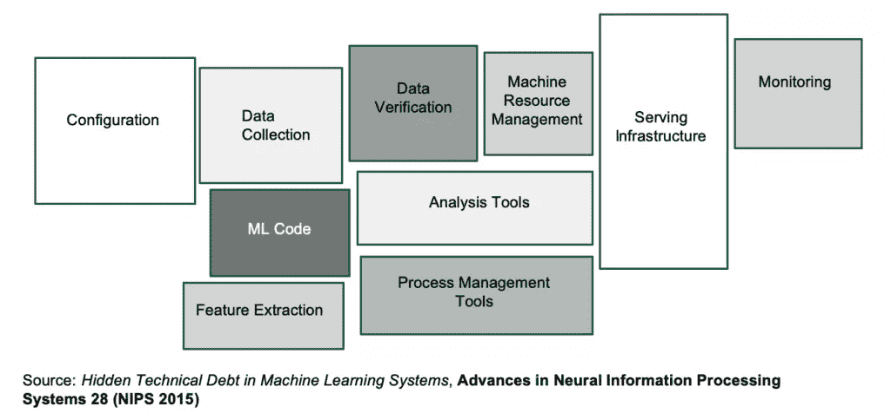
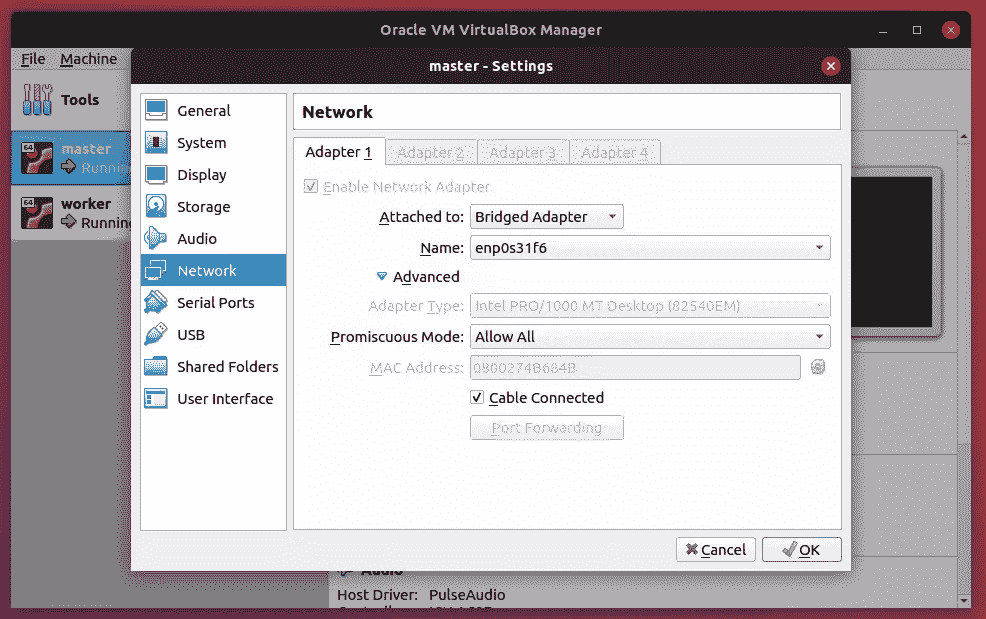
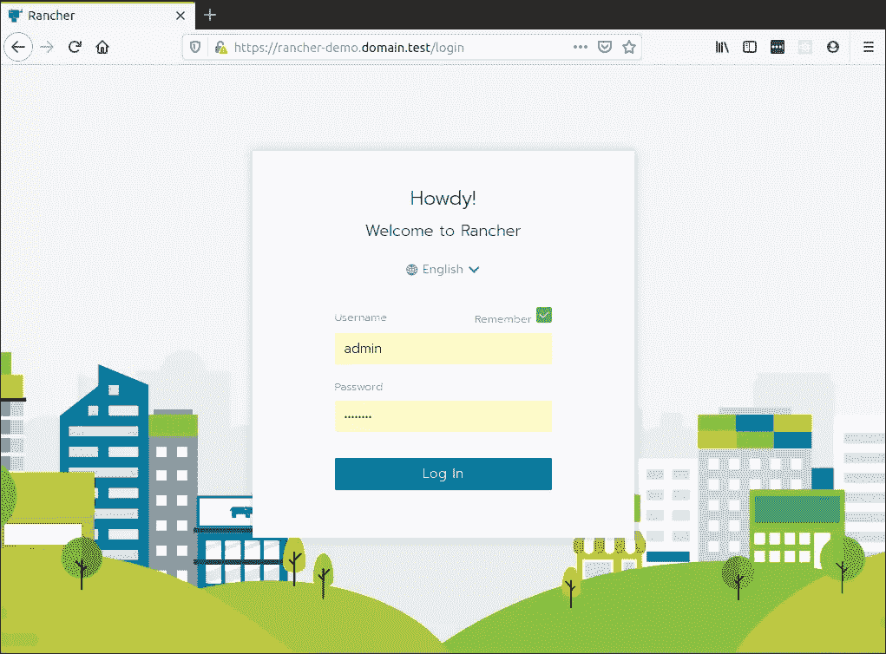
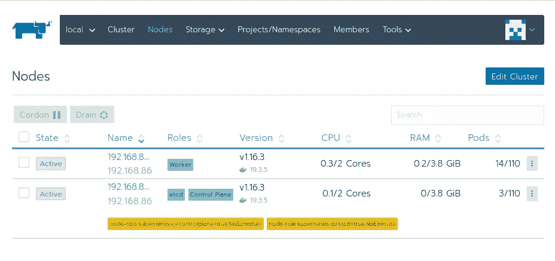

# 机器学习管道:设置内部 Kubernetes

> 原文：<https://www.sitepoint.com/setting-up-on-premise-kubernetes/>

在这个由多个部分组成的系列中，我将带您了解我是如何使用开源工具和框架建立本地机器学习管道的。

## 开场白:模特训练只是*微小的*部分

当大多数人想到机器学习时，他们会想象工程师和数据科学家调整网络架构、损失函数和调整超参数，再加上不断的重新训练，直到结果令人满意。

的确，训练机器学习模型需要付出很多努力。大量的时间和资源花费在研究和实验上。

然而，有一个时间点，你需要开始*生产*你已经精心训练和调整的模型。哦，顺便说一下，该模型预计在下周的一批数据中也能表现良好。

你会慢慢明白，机器学习比模型、超参数和损失函数要大得多。这也是在训练之前、之中和之后发生的事情。这还没有结束，因为你还需要考虑*re*training，尤其是当你得到新数据的时候，因为不能保证这个模型也能推广。

有一个非常著名的图表简洁地说明了这个问题:



简而言之，你需要建立一个机器学习管道，可以在最短的时间内让你从原始数据到训练好的模型。但这里有一个问题:因为你是一家斗志旺盛的初创公司的一部分，没有足够的风险投资资金，你将不得不凑合使用你现有的服务器，而不是依赖亚马逊、微软或谷歌的付费云产品，至少目前是这样。

这是因为你需要一个安全的环境来学习和实验——一个不会在月底用一份讨厌的账单出乎意料地震惊你的环境。

### 你是谁

你可能是一家公司的软件工程师，该公司正开始考虑将其机器学习模型投入生产，或者你可能独自运营，并对“真实世界”的机器学习感到好奇。在这两种情况下，你都需要了解机器学习管道。

### 你需要知道的是

你应该对 Linux 很熟悉。这些例子将假设 Ubuntu Linux 18.04，尽管稍微过时或更新的版本不会引起任何大的问题。

你应该有一些码头工人的工作知识。如果您知道如何在 Docker 中构建图像，以及如何执行容器，那么您应该很容易上手。如果没有，也不要太担心:我会用足够的背景信息来指导你，并且会解释代码示例。

虽然这是一篇关于机器学习管道的文章，但这篇文章不是关于训练模型所涉及的复杂性。

我们要用 Kubernetes。你不需要成为这方面的专家。如果你对 Kubernetes 完全陌生，那也没关系。到本系列结束时，您至少会有一些实践经验。另一方面，我不打算深入 Kubernetes 的细节。为了简洁起见，我不得不忽略一些命令。此外，这里的真正目标是帮助您尽可能高效地部署机器学习管道。

以下是我对你这个精明的读者的一些其他假设:

1.  你对机器学习并非一无所知
2.  您可以访问一些相对强大的服务器(理想情况下不止一个)，这些服务器包含 Nvidia GPUs
3.  你已经有了一个用 Python 写的机器学习代码库
4.  你没有在独角兽初创企业或财富 500 强企业工作，因此没有足够的现金来愉快地组装多个 V100s。

### 我们要做什么？

机器学习管道直到最近才得到更多的喜爱和关注，人们才刚刚开始弄清楚一切。换句话说，有多种方法来建立机器学习管道，因为每个组织都有独特的需求，每个团队都有他们最喜欢的工具。

这个系列的目的是提供一种可能的方法，这在你刚开始的时候尤其重要，因为信息量通常是巨大的。此外，安装 Kubernetes 是一件令人生畏的事情，布满了许多路障。我希望这篇文章有助于铺平道路。

在你学会了*一种*建立机器学习管道的方法之后，你将具备足够的技能和知识去建立一个适合你组织需求的管道。

以下是我将在本系列中涉及的一些工具的列表:

*   码头工人
*   库伯内特斯
*   大牧场主
*   忽必烈/忽必烈管道
*   微型汽车
*   Tensorflow

### 内部部署

通过阅读本系列文章，您会很快意识到，这些工具中的许多都假设您在亚马逊 S3 或谷歌云存储上有存储，说得委婉一点，这不是一个很好的假设。因此，本系列展示了如何在不损失任何功能的情况下解决这些限制。

当然，在某个时间点，你会成长，需要更强大的东西。然而，尤其是当你刚开始工作时(也就是说，你碰巧是团队中的第一个数据工程师)，那么*本地*似乎更具成本效益，最终也是更具*教育性的*选择。

## 使用 Rancher 安装 Kubernetes 的简单方法

让我们立即从最难的部分开始——安装 Kubernetes。

关于 Kubernetes，您需要知道的主要事情是，它是一个用于自动化应用程序部署、伸缩和管理的容器编排系统。

安装 Kubernetes 的方法有很多，这不是一个简单的过程。幸运的是，像 Rancher 这样的工具使安装过程变得更加愉快，并且不容易出错。特别是，我们将使用牧场主 Kubernetes 引擎(RKE)来帮助我们安装 Kubernetes。

到本文撰写之时，`rke`的最新稳定版是`1.0.0`。

### 步骤 0:准备机器

下面的步骤假设您可以访问两台连接到同一个局域网的 Linux 机器。

我们将建立一个由两台机器组成的最小集群，一台名为`master`，另一台名为`worker`。当然，您可以随意命名您的机器，只要您指定一台机器为主机器，其余的为工作机器。

如果您只能访问一台机器，您可以创建两台虚拟机，并确保启用桥接适配器。事实上，为了准备这篇文章，我正在测试 Oracle 的 VirtualBox 的所有功能。以下是我的设置:



注意这里我有两个虚拟机:`master`和`node`。启用`Bridged Adapter`，并将`Promiscuous Mode`设置为`Allow All`。

这样做的缺点是，您将无法访问 GPU，并且您很可能会注意到性能并不理想，因为 Kubernetes 往往对资源要求很高。同样，如果你在家里尝试或者目前只能使用一台机器，这也是可以的。

以下是关于机器的一些重要细节(您也应该准备好它们，以便进行后续的配置步骤):

|  | 掌握 | 工人 |
| --- | --- | --- |
| 互联网协议(Internet Protocol) | 192.168.86.36 | 192.168.86.35 |
| 用户 | 人的本质 | 人的本质 |
| 主机名 | 掌握 | 工人 |
| SSH 密钥 | `~/.ssh/id_rsa.pub` | `~/.ssh/id_rsa.pub` |
| 作用 | 控制平面，Etcd | 工人 |

#### DNS 和负载平衡

在生产环境中，您需要一个主机名来指向您的 Kubernetes 集群。然而，在这篇文章中，我假设你*没有现成的，所以我们将不得不伪造它。*

为了简单起见，我不讨论的另一件事是 Rancher 安装中的负载平衡。

出于我们的目的，我将使用`rancher-demo.domain.test`作为主机名。

在两台机器中，打开`/etc/hosts`文件:

```
sudo vim /etc/hosts 
```

输入以下内容:

```
192.168.86.35 worker
192.168.86.35 rancher-demo.domain.test
192.168.86.36 master
127.0.0.1 localhost 
```

请注意，worker 节点有一个额外的主机名`rancher-demo.domain.test`。在稍微现实一点的环境中，您可以使用类似 NGINX 的东西作为前端，在多个工作节点之间实现负载平衡。

*注意:如果你使用的是虚拟机，那么你最有可能使用的是 Ubuntu 服务器映像，它通常不会随桌面环境一起提供。因此，您在**主机**计算机中也应该有一个条目来包含以下内容:

```
192.168.86.35 rancher-demo.domain.test 
```

这样，您将能够从主机上的浏览器访问 Rancher。*

### 步骤 1:获取`rke`二进制文件

*重要！:该步骤只能在`master`执行。*

前往 [GitHub](https://github.com/rancher/rke/releases) 页面下载`rke`二进制文件。接下来，将二进制文件重命名为`rke`，然后使其可执行。最后，将二进制文件移动到`PATH`中的一个位置，这里的`/usr/local/bin`通常是一个不错的选择。

重要提示:确保您为您的操作系统选择了正确的二进制文件！

```
$ wget https://github.com/rancher/rke/releases/download/v1.0.0/rke_linux-amd64
$ mv rke_linux-amd64 rke
$ chmod +x rke
$ sudo mv rke /usr/local/bin 
```

现在让我们看看是否一切正常:

```
$ rke 
```

这应该会返回:

```
NAME:
   rke - Rancher Kubernetes Engine, an extremely simple, lightning fast Kubernetes installer that works everywhere

USAGE:
   rke [global options] command [command options] [arguments...]

VERSION:
   v1.0.0

AUTHOR(S):
   Rancher Labs, Inc.

COMMANDS:
     up       Bring the cluster up
     remove   Teardown the cluster and clean cluster nodes
     version  Show cluster Kubernetes version
     config   Setup cluster configuration
     etcd     etcd snapshot save/restore operations in k8s cluster
     cert     Certificates management for RKE cluster
     encrypt  Manage cluster encryption provider keys
     help, h  Shows a list of commands or help for one command

GLOBAL OPTIONS:
   --debug, -d    Debug logging
   --quiet, -q    Quiet mode, disables logging and only critical output will be printed
   --help, -h     show help
   --version, -v  print the version 
```

### 第二步。准备 Linux 主机

*重要:这些步骤将在所有*机器的 *上执行。*

#### a)安装 Docker

首先，确保 Docker 19.03 安装在所有 Linux 主机上:

```
$ curl -fsSL https://download.docker.com/linux/ubuntu/gpg | sudo apt-key add -
$ sudo add-apt-repository "deb [arch=amd64] https://download.docker.com/linux/ubuntu $(lsb_release -cs) stable edge"
$ sudo apt-get update
$ sudo apt-get install -y docker-ce 
```

要确保 Docker 服务正确运行，请执行以下命令:

```
$ sudo systemctl status docker 
```

这应该会返回:

```
● docker.service - Docker Application Container Engine
   Loaded: loaded (/lib/systemd/system/docker.service; enabled; vendor preset: enabled)
   Active: active (running) since Sat 2019-12-28 03:01:03 UTC; 27s ago
     Docs: https://docs.docker.com
 Main PID: 4118 (dockerd)
    Tasks: 8
   CGroup: /system.slice/docker.service
           └─4118 /usr/bin/dockerd -H fd:// --containerd=/run/containerd/containerd.sock

Dec 28 03:01:03 master dockerd[4118]: time="2019-12-28T03:01:03.179311453Z" level=warning msg="Your kernel does not support swap memory limit"
Dec 28 03:01:03 master dockerd[4118]: time="2019-12-28T03:01:03.179509363Z" level=warning msg="Your kernel does not support cgroup rt period"
Dec 28 03:01:03 master dockerd[4118]: time="2019-12-28T03:01:03.179608175Z" level=warning msg="Your kernel does not support cgroup rt runtime" 
```

现在执行以下命令，这样您就可以在没有`sudo`的情况下使用`docker`命令:

```
$ sudo usermod -aG docker $USER 
```

让我们试一试:

```
$ docker run hello-world 
```

哎呦！

```
docker: Got permission denied while trying to connect to the Docker daemon socket at unix:///var/run/docker.sock: Post http://%2Fvar%2Frun%2Fdocker.sock/v1.40/containers/create: dial unix /var/run/docker.sock: connect: permission denied.
See 'docker run --help'. 
```

你得到这个的原因是你需要先从注销*:*

```
$ exit 
```

登录后，请重试:

```
$ docker run hello-world 
```

您应该看到这个:

```
Unable to find image 'hello-world:latest' locally
latest: Pulling from library/hello-world
1b930d010525: Pull complete
Digest: sha256:4fe721ccc2e8dc7362278a29dc660d833570ec2682f4e4194f4ee23e415e1064
Status: Downloaded newer image for hello-world:latest

Hello from Docker!
This message shows that your installation appears to be working correctly. 
```

#### b)设置 SSH 密钥

如果您还没有设置 SSH 密钥，请在`master`上执行以下步骤:

```
$ ssh-keygen
$ eval "$(ssh-agent -s)"
$ ssh-add ~/.ssh/id_rsa 
```

然后，将公钥复制到所有工作节点。因为我们只有一个工作节点:

```
$ ssh-copy-id ubuntu@192.168.86.36 
```

您需要确保`$USER`能够 SSH 到节点中。例如，确保您可以从`master`访问`worker`:

```
ubuntu@master:~$ ssh ubuntu@192.168.86.36 
```

在两个节点上，配置 SSH 服务器以允许端口转发:

```
% sudo vim /etc/ssh/sshd_config 
```

取消以下注释:

```
AllowTcpForwarding yes 
```

#### c)关闭交换

要关闭交换:

```
$ sudo swapoff -a 
```

在你最喜欢的编辑器中打开`/etc/fstab`和*注释掉*这个交换文件条目:

```
$ sudo vim /etc/fstab 
```

#### d)应用`sysctl`设置

```
$ sudo sysctl net.bridge.bridge-nf-call-iptables=1 
```

#### Ubuntu 18.04 上的 DNS

在 Ubuntu 的这个版本中，DNS 的设置方式发生了变化。要恢复到以前的行为:

```
$ sudo apt install resolvconf 
```

编辑名称服务器设置:

```
sudo vim  /etc/resolvconf/resolv.conf.d/head 
```

添加以下条目:

```
nameserver 8.8.4.4
nameserver 8.8.8.8 
```

重启`resolveconf`服务:

```
% sudo service resolvconf restart 
```

### 步骤 3:创建集群配置文件

*重要提示:以下步骤只能在`master`进行。*

终于要用`rke`装 Kubernetes 了！

在执行此操作之前，请确保您拥有节点的 IP 和主机名列表。`Step 0`中的表格对这一步很有帮助。

您需要运行`rke config`来创建一个集群配置文件。它将为您提供一系列用于生成配置文件的问题:

```
$ rke config 
```

下面是基于表格的问答示例。记得根据您的用户、主机名、IP 地址和 SSH 密钥位置进行调整。还要注意，`master`节点应该具有`control plane`和`etcd`的角色，而`worker`节点应该具有`worker`的角色。如果您犯了错误，您可以使用`Ctrl` + `C`重新开始，并再次运行该命令:

```
[+] Cluster Level SSH Private Key Path [~/.ssh/id_rsa]:
[+] Number of Hosts [1]: 2
[+] SSH Address of host (1) [none]: 192.168.86.36
[+] SSH Port of host (1) [22]:
[+] SSH Private Key Path of host (192.168.86.36) [none]: ~/.ssh/id_rsa
[+] SSH User of host (192.168.86.36) [ubuntu]: ubuntu
[+] Is host (192.168.86.36) a Control Plane host (y/n)? [y]: y
[+] Is host (192.168.86.36) a Worker host (y/n)? [n]: n
[+] Is host (192.168.86.36) an etcd host (y/n)? [n]: y
[+] Override Hostname of host (192.168.86.36) [none]: master
[+] Internal IP of host (192.168.86.36) [none]:
[+] Docker socket path on host (192.168.86.36) [/var/run/docker.sock]:
[+] SSH Address of host (2) [none]: 192.168.86.35
[+] SSH Port of host (2) [22]:
[+] SSH Private Key Path of host (192.168.86.35) [none]: ~/.ssh/id_rsa
[+] SSH User of host (192.168.86.35) [ubuntu]: ubuntu
[+] Is host (192.168.86.35) a Control Plane host (y/n)? [y]: n
[+] Is host (192.168.86.35) a Worker host (y/n)? [n]: y
[+] Is host (192.168.86.35) an etcd host (y/n)? [n]: n
[+] Override Hostname of host (192.168.86.35) [none]: worker
[+] Internal IP of host (192.168.86.35) [none]:
[+] Docker socket path on host (192.168.86.35) [/var/run/docker.sock]:
[+] Network Plugin Type (flannel, calico, weave, canal) [canal]: flannel
[+] Authentication Strategy [x509]:
[+] Authorization Mode (rbac, none) [rbac]:
[+] Kubernetes Docker image [rancher/hyperkube:v1.16.3-rancher1]:
[+] Cluster domain [cluster.local]:
[+] Service Cluster IP Range [10.43.0.0/16]:
[+] Enable PodSecurityPolicy [n]:
[+] Cluster Network CIDR [10.42.0.0/16]:
[+] Cluster DNS Service IP [10.43.0.10]:
[+] Add addon manifest URLs or YAML files [no]: 
```

这将生成`cluster.yml`，即 RKE 集群配置文件:

```
nodes:
- address: "192.168.86.36"
  port: "22"
  internal_address: ""
  role:
  - controlplane
  - etcd
  hostname_override: ""
  user: ubuntu
  docker_socket: /var/run/docker.sock
  ssh_key: ""
  ssh_key_path: ~/.ssh/id_rsa
  ssh_cert: ""
  ssh_cert_path: ""
  labels: {}
  taints: []
- address: "192.168.86.35"
  port: "22"
  internal_address: ""
  role:
  - worker
  hostname_override: ""
  user: ubuntu
  docker_socket: /var/run/docker.sock
  ssh_key: ""
  ssh_key_path: ~/.ssh/id_rsa
  ssh_cert: ""
  ssh_cert_path: ""
  labels: {}
  taints: []
services:
  etcd:
    image: ""
    extra_args: {}
    extra_binds: []
    extra_env: []
    external_urls: []
    ca_cert: ""
    cert: ""
    key: ""
    path: ""
    uid: 0
    gid: 0
    snapshot: null
    retention: ""
    creation: ""
    backup_config: null
  kube-api:
    image: ""
    extra_args: {}
    extra_binds: []
    extra_env: []
    service_cluster_ip_range: 10.43.0.0/16
    service_node_port_range: ""
    pod_security_policy: false
    always_pull_images: false
    secrets_encryption_config: null
    audit_log: null
    admission_configuration: null
    event_rate_limit: null
  kube-controller:
    image: ""
    extra_args: {}
    extra_binds: []
    extra_env: []
    cluster_cidr: 10.42.0.0/16
    service_cluster_ip_range: 10.43.0.0/16
  scheduler:
    image: ""
    extra_args: {}
    extra_binds: []
    extra_env: []
  kubelet:
    image: ""
    extra_args: {}
    extra_binds: []
    extra_env: []
    cluster_domain: cluster.local
    infra_container_image: ""
    cluster_dns_server: 10.43.0.10
    fail_swap_on: false
    generate_serving_certificate: false
  kubeproxy:
    image: ""
    extra_args: {}
    extra_binds: []
    extra_env: []
network:
  plugin: flannel
  options: {}
  node_selector: {}
authentication:
  strategy: x509
  sans: []
  webhook: null
addons: ""
addons_include: []
system_images:
  etcd: rancher/coreos-etcd:v3.3.15-rancher1
  alpine: rancher/rke-tools:v0.1.51
  nginx_proxy: rancher/rke-tools:v0.1.51
  cert_downloader: rancher/rke-tools:v0.1.51
  kubernetes_services_sidecar: rancher/rke-tools:v0.1.51
  kubedns: rancher/k8s-dns-kube-dns:1.15.0
  dnsmasq: rancher/k8s-dns-dnsmasq-nanny:1.15.0
  kubedns_sidecar: rancher/k8s-dns-sidecar:1.15.0
  kubedns_autoscaler: rancher/cluster-proportional-autoscaler:1.7.1
  coredns: rancher/coredns-coredns:1.6.2
  coredns_autoscaler: rancher/cluster-proportional-autoscaler:1.7.1
  kubernetes: rancher/hyperkube:v1.16.3-rancher1
  flannel: rancher/coreos-flannel:v0.11.0-rancher1
  flannel_cni: rancher/flannel-cni:v0.3.0-rancher5
  calico_node: rancher/calico-node:v3.8.1
  calico_cni: rancher/calico-cni:v3.8.1
  calico_controllers: rancher/calico-kube-controllers:v3.8.1
  calico_ctl: ""
  calico_flexvol: rancher/calico-pod2daemon-flexvol:v3.8.1
  canal_node: rancher/calico-node:v3.8.1
  canal_cni: rancher/calico-cni:v3.8.1
  canal_flannel: rancher/coreos-flannel:v0.11.0
  canal_flexvol: rancher/calico-pod2daemon-flexvol:v3.8.1
  weave_node: weaveworks/weave-kube:2.5.2
  weave_cni: weaveworks/weave-npc:2.5.2
  pod_infra_container: rancher/pause:3.1
  ingress: rancher/nginx-ingress-controller:nginx-0.25.1-rancher1
  ingress_backend: rancher/nginx-ingress-controller-defaultbackend:1.5-rancher1
  metrics_server: rancher/metrics-server:v0.3.4
  windows_pod_infra_container: rancher/kubelet-pause:v0.1.3
ssh_key_path: ~/.ssh/id_rsa
ssh_cert_path: ""
ssh_agent_auth: false
authorization:
  mode: rbac
  options: {}
ignore_docker_version: false
kubernetes_version: ""
private_registries: []
ingress:
  provider: ""
  options: {}
  node_selector: {}
  extra_args: {}
  dns_policy: ""
  extra_envs: []
  extra_volumes: []
  extra_volume_mounts: []
cluster_name: ""
cloud_provider:
  name: ""
prefix_path: ""
addon_job_timeout: 0
bastion_host:
  address: ""
  port: ""
  user: ""
  ssh_key: ""
  ssh_key_path: ""
  ssh_cert: ""
  ssh_cert_path: ""
monitoring:
  provider: ""
  options: {}
  node_selector: {}
restore:
  restore: false
  snapshot_name: ""
dns: null 
```

是时候启动集群了！

```
% rke up 
```

等待`rke`设置 Kubernetes 集群:

```
INFO[0000] Running RKE version: v1.0.0             
INFO[0000] Initiating Kubernetes cluster                
INFO[0000] [certificates] Generating admin certificates and kubeconfig
INFO[0000] Successfully Deployed state file at [./cluster.rkestate]
INFO[0000] Building Kubernetes cluster                  
INFO[0000] [dialer] Setup tunnel for host [192.168.86.35]
INFO[0000] [dialer] Setup tunnel for host [192.168.86.36]
# Many more lines ... 
INFO[0044] Finished building Kubernetes cluster successfully 
```

此时会创建更多的文件:

```
$ ls
cluster.rkestate  cluster.yml  kube_config_cluster.yml 
```

如果需要重新创建群集，应该将这些文件保存在安全的位置。您需要将`kube_config_cluster.yml`复制到 Kubernetes 可以找到的位置:

```
$ mkdir ~/.kube
$ cp kube_config_cluster.yml $HOME/.kube/config 
```

### install kubectl 安装 kubectl

*注意:这一步只能在`master`节点完成。*

接下来，您应该安装 Kubernetes 命令行工具，`kubectl`:

```
curl -s https://packages.cloud.google.com/apt/doc/apt-key.gpg | sudo apt-key add -
echo "deb https://apt.kubernetes.io/ kubernetes-xenial main" | sudo tee -a /etc/apt/sources.list.d/kubernetes.list
sudo apt-get update
sudo apt-get install -y kubectl 
```

一旦这一步完成，我们可以通过列出`rke`创建的所有节点来测试它:

```
% kubectl get nodes
NAME            STATUS   ROLES               AGE   VERSION
192.168.86.35   Ready    worker              53m   v1.16.3
192.168.86.36   Ready    controlplane,etcd   53m   v1.16.3 
```

成功！我们做点别的吧。我们可以检查创建了哪些容器:

```
% kubectl get pods --all-namespaces
NAMESPACE       NAME                                      READY   STATUS      RESTARTS   AGE
ingress-nginx   default-http-backend-67cf578fc4-dk9l4     1/1     Running     0          49m
ingress-nginx   nginx-ingress-controller-bnwlv            1/1     Running     0          49m
kube-system     coredns-5c59fd465f-7gbff                  1/1     Running     0          49m
kube-system     coredns-5c59fd465f-mhzdb                  1/1     Running     0          49m
kube-system     coredns-autoscaler-d765c8497-p2zj4        1/1     Running     0          49m
kube-system     kube-flannel-vkxc6                        2/2     Running     0          54m
kube-system     kube-flannel-xjtst                        2/2     Running     0          54m
kube-system     metrics-server-64f6dffb84-hs99g           1/1     Running     0          49m
kube-system     rke-coredns-addon-deploy-job-kdwxm        0/1     Completed   0          49m
kube-system     rke-ingress-controller-deploy-job-rpvrq   0/1     Completed   0          49m
kube-system     rke-metrics-addon-deploy-job-x2m2j        0/1     Completed   0          49m
kube-system     rke-network-plugin-deploy-job-h5ffz       0/1     Completed   0          55m 
```

在这一点上不要担心豆荚是什么。暂时把它们想象成容器。

### 安装舵 3

*注意:这一步只能在`master`节点完成。*

Helm 是一个 Kubernetes 包管理器，非常便于在 Kubernetes 集群上部署应用程序和服务。我们将使用 Helm 来安装 Rancher 和其他一些支持服务。

```
$ curl https://raw.githubusercontent.com/helm/helm/master/scripts/get-helm-3 | bash 
```

`helm`应安装到`PATH`中:

```
Downloading https://get.helm.sh/helm-v3.0.2-linux-amd64.tar.gz
Preparing to install helm into /usr/local/bin
helm installed into /usr/local/bin/helm 
```

### 使用头盔安装牧场主

*注意:这一步只能在`master`节点完成。*

```
$ helm repo add rancher-stable https://releases.rancher.com/server-charts/stable 
```

为 Rancher 创建一个名称空间:

```
$ kubectl create namespace cattle-system 
```

### 安装`cert-manager`

*注意:这一步只能在`master`节点完成。*

Cert Manager 有助于在 Kubernetes 中自动提供和管理 TLS 证书。例如，可以选择使用来自 Let's Encrypt 的证书，但是现在，我们应该保持简单，使用由 Rancher 生成的默认证书。

*注意:这里我们安装的是稍微过时的`cert-manager`版本，因为最新版本(0.12)似乎有安装问题。*

按照以下步骤将`cert-manager`安装到 Kubernetes 集群上:

```
$ kubectl apply -f https://raw.githubusercontent.com/jetstack/cert-manager/release-0.9/deploy/manifests/00-crds.yaml
$ kubectl create namespace cert-manager
$ kubectl label namespace cert-manager certmanager.k8s.io/disable-validation=true
$ helm repo add jetstack https://charts.jetstack.io
$ helm repo update
$ helm install --name cert-manager \
          --namespace cert-manager \
          --version v0.9.1 \
          jetstack/cert-manager 
```

检查是否一切顺利:

```
kubectl get pods --namespace cert-manager
NAME                                     READY   STATUS    RESTARTS   AGE
cert-manager-5b9ff77b7-x6vgn             1/1     Running   0          44s
cert-manager-cainjector-59d69b9b-nrgkf   1/1     Running   0          44s
cert-manager-webhook-cfd6587ff-8tcgt     1/1     Running   0          44s 
```

请注意，您可能需要等待一段时间(通常只有几分钟)才能让所有的`STATUS`变成`Running`。

#### 安装牧场主

最后，您可以安装 Rancher，它提供了一个很好的界面来管理您的 Kubernetes 集群:

```
$ helm install rancher rancher-stable/rancher \
  --namespace cattle-system \
  --set hostname=rancher.example.com 
```

检查是否一切顺利:

```
kubectl -n cattle-system rollout status deploy/rancher 
```

```
Waiting for deployment "rancher" rollout to finish: 0 of 3 updated replicas are available... 
```

在执行下一步之前，请等待所有复制都已更新。

现在，由于我们没有负载均衡器，我们需要执行一个额外的步骤来访问 Rancher UI。创建以下文件，将其命名为`ingress.yml`，并填入以下内容(根据您选择的内容调整`host`):

```
apiVersion: extensions/v1beta1
kind: Ingress
metadata:
  name: rancher-demo-ingress
spec:
  rules:
  - host: rancher-demo.domain.test
    http:
      paths:
      - path: /
        backend:
          serviceName: rancher-demo
          servicePort: 443 
```

然后运行:

```
$ kubectl apply -f ingress.yml 
```

之后，牧场主应该可以在:

```
https://rancher-demo.domain.test 
```

接受您的浏览器可能会抱怨的安全异常，您应该会看到以下屏幕，提示您创建密码并设置域名(已经预先填充)。去做吧:



给牧场主一点时间来布置。完成后，您应该对您的集群有一个大致的了解:



继续点击，尽情享受你的劳动成果吧！

## 摘要

如果你已经到了这个阶段，你应该祝贺自己坚持下来了。安装 Kubernetes 集群并不适合胆小的人，即使有 Rancher 这样的工具也能在一定程度上简化这个过程。

让我们回顾一下我们所做的。

我们讨论了为什么*训练* ML 模型只是众所周知的冰山一角，并且许多其他支持软件需要一起将这些模型投入生产。

更重要的是，我们用 Rancher Kubernetes 引擎建立了一个重要的 Kubernetes 集群，并安装了 Rancher 来管理集群。这是不平凡的壮举。然而，我们仍然还没有做任何机器学习部署！这将是本系列的下一篇文章，我们将在其中安装 Kubeflow，这是一个开源的机器学习平台。

## 信用

特别感谢 Sebastiaan van Steenis 的文章，这篇文章展示了如何在没有负载均衡器的情况下建立一个 RKE 集群。

## 分享这篇文章