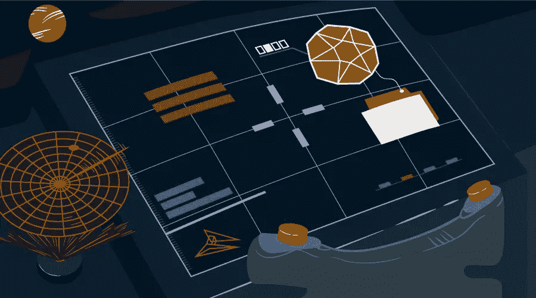
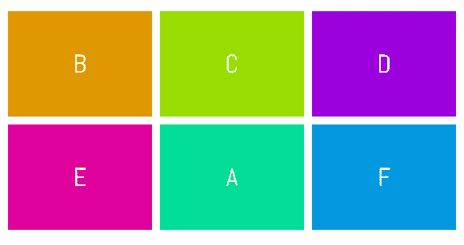

# 使用 CSS 网格布局放置元素的七种方式

> 原文：<https://www.sitepoint.com/seven-ways-you-can-place-elements-using-css-grid-layout/>



*本文更新于 2017 年 3 月 23 日。具体来说:浏览器对 CSS 网格布局的支持。*

在本文中，我们将学习使用[网格布局模块](https://www.w3.org/TR/2016/CR-css-grid-1-20160929/)在网页中放置元素的七种方法。

此前，SitePoint 发布了 [*介绍 CSS 网格布局*](https://www.sitepoint.com/introducing-the-css-grid-layout/) 。最近我还在 CSS 网格布局工作底稿 里写了 [*东西在哪里。*](https://www.sitepoint.com/where-things-are-at-in-the-css-grid-layout-working-draft/)

这里，重点将完全放在使用 CSS Grid 在 web 上布局元素的具体方式上。现在，让我们逐一检查一下。

## 解决浏览器对网格布局的支持

目前，网格布局还没有一致的浏览器支持。然而，截至 2017 年 3 月，Chrome 和 Firefox 浏览器的最新版本都已经默认支持 CSS 网格布局。IE 仍然支持旧的实现，Opera 需要打开实验性 Web 平台标志，Safari 完全不支持。为了正确使用本文中的所有示例，我建议您使用 Chrome 或 Firefox。对于出于某种原因觉得使用这些浏览器有问题的读者，我添加了一个截图来显示每种技术的最终结果。

## #1 指定单个属性中的所有内容



这是我们在以前的文章中用来放置元素的版本。这种方法虽然冗长，但很容易理解。基本上，元素的左/右和上/下边界是使用`grid-column-start` / `grid-column-end`和`grid-row-start` / `grid-row-end`属性指定的。如果一个元素只跨越一行或一列，你可以省略`-end`属性，这样你就可以少写一点 CSS。

在下面的演示中，使用下面的 CSS 将元素 A 放置在第二行第二列中:

```
.a {
  grid-column-start: 2;
  grid-column-end: 3;
  grid-row-start: 2;
  grid-row-end: 3;
}
```

使用以下方法可以达到相同的效果:

```
.a {
  grid-column-start: 2;
  grid-row-start: 2;
}
```

在 [CodePen](http://codepen.io) 上通过 SitePoint ( [@SitePoint](http://codepen.io/SitePoint) )查看笔[指定个人属性](http://codepen.io/SitePoint/pen/LbLjmY/)中的一切。