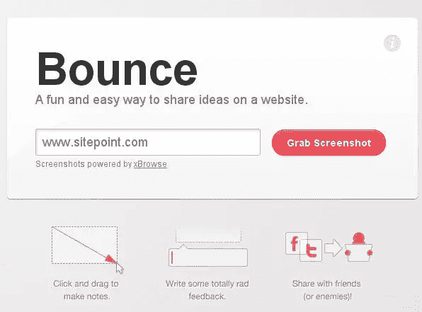
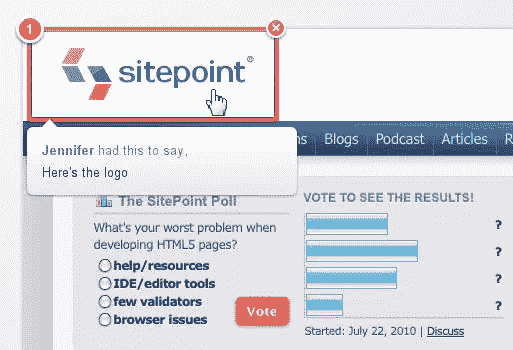

# 通过 Bounce 分享您的设计想法并获得反馈

> 原文：<https://www.sitepoint.com/share-your-design-ideas-get-feedback-with-bounce/>

有几个截图分享应用程序。反弹是我最近偶然发现的一个非常方便的免费应用，由 T2 Zurb T3 创建，它允许你注释屏幕截图。它可以让你对网站进行截图，添加一些注释或反馈，只需点击一下就可以与朋友或客户分享。除了截图，你还可以从你的硬盘上传图片。

该应用程序非常简单易用，界面也同样简单明了。你输入你想要注释的网址，然后点击红色的“截图”按钮。几秒钟后，Bounce 返回了 URL 的截图。

一旦你的屏幕截图被创建，你被要求填写你的名字，并给出一个标题来识别屏幕截图。除此之外，没有涉及注册或登录。要添加注释，您可以添加任意多的注释，只需在您想要评论的图像部分周围画一个矩形。

添加评论后，点击“保存”按钮，会出现一个网址，你可以复制并粘贴到电子邮件中，或者点击脸书和 Twitter 图标，获得这些服务的快捷方式。每个反弹网址是唯一的，每个新的评论创建一个新的网址。

虽然为每个修订创建一个新链接并不是一个坏主意，但将原始链接作为默认链接会更好。我还发现在我尝试的一些屏幕截图中，图像的颜色有一些小的失真。这可能是由于某种图像压缩。除此之外，Bounce 对于设计师和开发人员来说是一个非常快捷易用的交流工具。

你以前用过 Bounce 吗？你觉得它怎么样？你还尝试过哪些类似的反馈和分享 app？

## 分享这篇文章