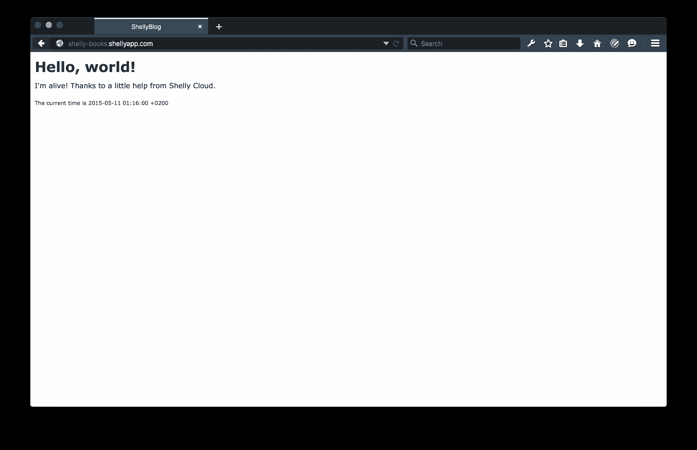

# Shelly Cloud:在不到 5 分钟的时间内部署一个 Rails 应用

> 原文：<https://www.sitepoint.com/shelly-cloud-deploy-rails-app-less-5-minutes/>


两周过去了，1 个应用程序准备好投入生产。现在怎么办？是时候在服务器上部署应用程序了。但是你是一名开发人员，你不可能知道管理 Rails 应用程序 VPS 的所有事情。雪莱·克劳德是来帮忙的。Shelly Cloud 是一个托管开发平台，用于部署 Ruby 或 Ruby on Rails 应用程序。如果你以前用过 [Heroku](https://www.heroku.com/) ，也是同样的概念；只需`git push`你就有了一个部署好的应用程序。

这个概念叫做**平台即服务**(又名**平台即服务**)。与虚拟专用服务器(VPS)托管相比，PaaS 为您配置硬件和部署平台，而您必须使用 VPS 配置自己的平台。使用 VPS，您必须自己扩展应用程序。但是有了 PaaS，这种扩展会随着流量的增长而自动完成。

Shelly Cloud 是一个 PaaS，它为你做了很多事情。基于 git 的部署和各种形式的伸缩是主要的。Shelly 还包括自动为您设置的各种服务(如数据库)。听起来很棒？让我们在 Shelly Cloud 上部署一个应用程序。

和任何服务一样，你需要一个账户。Shelly Cloud 不是免费的，所以如果你想跟进的话，可以看看他们的价格

首先，我们需要部署一些东西。让我们创建一个简单的小应用程序。我不会对代码做太多的解释，因为如果你正在阅读这篇文章，我可以假设你了解基本的 Rails 开发。

```
$ rails new shelly-books
$ rails generate controller pages index
```

现在来看一个简单的页面:

```
# app/views/pages/index.html.erb
<h1>Hello, world!</h1>

<p>I'm alive! Thanks to a little help from <a href="https://shellycloud.com/"></p>

<%= Time.now %>
```

现在将根目录路由到这个页面…

```
# config/routes.rb

Rails.application.routes.draw do
  root to: 'pages#index'
end
```

这只是一个小小的“Hello World”页面，也显示当前时间。让我们看看能否部署它。

在我们部署之前，我们需要向`Gemfile`添加更多的依赖项，然后创建一个`Cloudfile`:

```
# ... other gems for app

gem 'puma' # or thin, if you'd like
gem 'shelly-dependencies', group: :production

# ...
```

[Puma](http://puma.io/) 是 Shelly Cloud 支持的两个 web 服务器之一，另一个是瘦的。您可以根据自己的判断在这两者之间做出选择，但是在本例中，我们将使用 Puma。

*确保您`bundle install`在下一部分之前提交您的更改。*

Shelly Cloud 有自己的命令行应用，可以用 RubyGems 安装:

```
$ gem install shelly
```

现在让我们为 Shelly 准备好我们的应用程序:

```
$ shelly login
Your public SSH key will be uploaded to Shelly Cloud after login.
Email (your@emailhere.com - default):
Password:

$ shelly add
# some options for your app
```

一个新的 remote 被添加到您的 git 存储库中，`shelly`，稍后我们将推送它。您还会注意到现在您的应用程序根中有一个漂亮的`Cloudfile`。这是一个纯粹的 Shelly Cloud 配置文件，因此 PaaS 知道如何处理您推送的应用程序。我添加了一些注释来解释每个选项的作用。

```
shelly-books: # our app name
  ruby_version: 2.2.2
  environment: production # RAILS_ENV
  domains: # a list of all the domains that you might be using
    - shelly-books.shellyapp.com
    # for example:
    # - something.here.com 
    # then point CNAME to shelly-books.shellyapp.com
servers: # you can make as many servers as you want
  app1: # our server name
    size: small # size of this server
    puma: 2 # minimum number of threads

    # other things you want on the server
    # delayed_job: 1
    # sidekiq: 1
    # clockwork: on
    # whenever: on
    # elasticsearch: on

    databases: # DBs to set up
      - postgresql
      # - mysql
      # - mongodb
      # - redis
```

我们现在准备推送应用程序！

```
$ git push shelly master

Counting objects: 123, done.
Delta compression using up to 4 threads.
Compressing objects: 100% (108/108), done.
Writing objects: 100% (123/123), 25.16 KiB | 0 bytes/s, done.
Total 123 (delta 24), reused 0 (delta 0)

 ---> Received push to cloud 'shelly-books'
 ---> Checking Gemfile
 ---> Creating code package... done.
 ---> Push accepted
 ---> Start your cloud using: `shelly start --cloud shelly-books`
To git@git.shellycloud.com:shelly-books.git
 * [new branch]      master -> master
```

我们的应用程序已经*差不多*准备好了，我们只需要启动我们的服务器。Shelly Cloud 的定价基于使用情况，因此您可以根据需要启动和停止服务器。

```
$ shelly start --cloud shelly-books
$ shelly open # your browser should open showing our beautiful page
```

让我们看看我们有什么！



好东西！但这是一个非常无聊的页面，它只是告诉我们时间。让我们加入一些数据库的东西。

**免责声明:**我不太喜欢`rails scaffold`命令，但是为了快速展示如何在 Shelly Cloud 上使用数据库，我们今天将使用它。

```
$ rails scaffold Book title:string author:string
```

您应该对这个输出很熟悉，所以没有必要解释它。(你应该在这里提交。)现在我们需要设置我们的生产数据库配置。

Shelly Cloud 为其数据库提供环境变量。你可以在这里查看这些。

```
# config/database.yml

# ... other DB config
production:
  adapter: postgresql
  database: <%= ENV['POSTGRESQL_DATABASE'] %>
  encoding: unicode
  pool: 16
  host: <%= ENV['POSTGRESQL_HOST'] %>
  username: <%= ENV['POSTGRESQL_USER'] %>
  password: <%= ENV['POSTGRESQL_PASSWORD'] %>
  port: 5432
```

提交这些更改并将应用程序推送到 Shelly Cloud:

```
$ git commit -m "Add database config."
$ git push shelly master
```

您可能想知道迁移是否需要手动运行，答案是“不”。[这篇文章](https://shellycloud.com/blog/2013/06/how-code-is-deployed-on-shelly-cloud)解释了如何在 Shelly Cloud 上部署代码，包括`rake db:migrate`何时运行。答案是，每次推送时，迁移都在第一个部署服务器上运行。

现在让我们再次查看我们的应用程序，但这次是在`/books`路线。


您可以随意使用它来测试数据库功能。效果很好。

你知道了吧！不到 5 分钟就部署到 Shelly Cloud 的数据库驱动型应用。

### 额外:自定义域

要添加自定义域，只需将您的域添加到您的`Cloudfile`中的`domains`列表。然后将你域名的 CNAME 记录指向你的`myappname.shellyapp.com`域名。

## 结论

根据我写这篇文章的经验，我肯定会推荐 [Shelly Cloud](https://shellycloud.com/) 作为主机提供商；但是有很多选择。 [Heroku](https://www.heroku.com/) 是另一个 PaaS 选项，提供除 Ruby 之外的语言——或者你可能想建立自己的 VPS。无论你使用什么样的主机提供商，最终目标都是一样的:通过可靠的主机轻松部署。雪莱·克劳德正好提供了这一点。

## 分享这篇文章