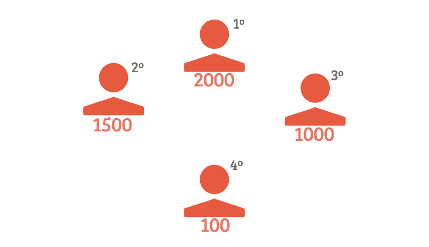

# 适马:排名做对了！

> 原文：<https://www.sitepoint.com/sigma-rankings-made-right/>

如果你错过了，在过去的几个月里，我已经深深地卷入了排名。看[这里](https://www.sitepoint.com/rankings-youre-doing-it-wrong/)，这里[这里](https://www.sitepoint.com/gioco-the-gamification-gem/)，这里[这里](https://www.eventials.com/pt-br/locaweb/rankings-voce-esta-fazendo-errado/)举例。(是葡萄牙语的，不好意思……)

排名可能看起来不那么重要或有趣，但如果我们仔细看看我们周围的应用程序，我们可以看到它是如何以许多不同的方式使用的。

正如我在以前的一篇文章中所说:

> 事实上，大多数排名实现都是错误的，甚至会让你的应用程序不那么吸引人。很难或者完全不可能达到最高位置，你可能永远不会发现对其他用户的真正挑战

这是因为我们使用的排名实现衡量的是历史，而不是用户的技能。我已经介绍了微软针对 XBox 的这个问题提出的解决方案:

> True Skill 是一种贝叶斯排名算法，由微软研究院开发，用于 Xbox 匹配系统，旨在解决 Elo 评级系统中的一些已知缺陷。

TrueSkill 是一个很好的解决方案。问题是它的[专利是](http://www.google.com/patents/US20090227313?dq=trueskill&ei=C7G2ULrGLMrFmQWP4IHoCw)，但是它背后的概念可以用来增强我们的实际实现。这就是**适马**的用武之地。

## 希腊字母表中第十八个字母

适马是 TrueSkill 概念的一个实现，用 Ruby 编写。现有的 [gem](http://rubygems.org/gems/sigma) 面向使用活动记录的 Ruby on Rails 应用程序。

在 **sigma** 背后的思想是评级的概念被分成两个不同的变量:用户的**技能**和系统拥有的**信任度**。这使得有可能以更公平的方式处理意外结果，并比大多数排名实现更快地衡量真正的技能。

### 例子



这里有一个场景，有 4 个玩家已经打了很多场比赛。想象一下，对于一个新玩家来说，获得最高位置有多难。这实际上是测试之一**适马**用户:

```
100.times {
  user_1.won (user_1.rating - user_2.rating)
  user_2.lost (user_2.rating - user_1.rating)

  user_2.won (user_2.rating - user_3.rating)
  user_3.lost (user_3.rating - user_2.rating)

  user_3.won (user_3.rating - user_4.rating)
  user_4.lost (user_4.rating - user_3.rating)
}
```

一旦所有的用户都打了 100 场比赛，我们将有一个统一的排名。一个新玩家出现了，他必须证明自己的技能才能获得竞争地位。

```
2.times {
  user_5.won(user_5.rating - user_2.rating)
  user_2.lost(user_2.rating - user_5.rating)
}

2.times {
  user_5.won(user_5.rating - user_1.rating)
  user_1.lost(user_1.rating - user_5.rating)
}
```

在与顶级玩家进行了 4 场比赛后，我们的新用户排名第一。

```
expect(User.ranking.first).to eq user_5
```

它说明了使用这个新概念处理排名的好处之一。

## 使用

### 设置

适马使用起来非常简单，设置起来更简单。您只需将它添加到您的`Gemfile`:

```
gem 'sigma' 
```

运行 sigma 生成器，回答两个友好的问题:

```
$ rails g sigma
What is your resource model? (eg. user) user
What will be the scale? (default is 50) 100 
```

它将生成一些迁移，向您的资源模型添加一些新属性，并创建一个名为`sigma.rb`的新初始化器。

新属性包括:

*   技能
*   怀疑
*   视窗网际网路名称服务
*   损耗
*   绘制
*   预期

### 方法

**适马**还在模型中增加了一些方法，使得访问排名信息变得简单。这些方法是:

*   **评级**
    *   返回基于技能 x 怀疑的资源评级。
*   **位置**
    *   返回资源在排名中的位置。
*   **匹配**
    *   返回一个整数，包括赢、输和平局的次数。
*   **获得** *【难度】*
    *   为资源注册一个 **win** 并计算其评分和期望值。
*   **输了** *(难度)*
    *   为资源注册一个**损失**并计算它的等级和期望值。

## 截屏

理解西格玛最简单的方法是看它的实际操作。我已经创建了一个截屏，从头开始展示如何设置和使用它。这是我的第一个截屏，如果你全屏高清观看的话，会非常清晰。另外，我的母语不是英语，所以我尽了最大努力……:)

[youtube eFNW61P6hcE]

如果你对适马有任何问题或意见，请告诉我。

## 分享这篇文章