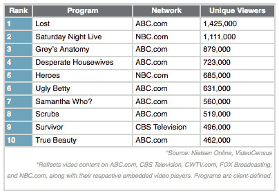

# 时代的标志:电视现在有了网络收视率

> 原文：<https://www.sitepoint.com/sign-of-the-times-tv-now-has-web-ratings/>

衡量电视观众数量的尼尔森公司发布了他们首次公开的网络电视收视率，这显然是媒体格局变化的一个迹象。ABC 电视节目[在排行榜上独占鳌头](http://blog.nielsen.com/nielsenwire/online_mobile/lost-is-found-by-online-viewers/)在前 10 个节目中有 7 个，包括排名第一的在线电视节目*，输给了*。该榜单涵盖 2008 年 12 月，在 ABC.com 失去了 140 万独立观众。

不幸的是，尼尔森的名单只包括网络的官方网站，而不包括第三方网站，如 NBC 和福克斯的 Hulu.com，或 CBS 拥有的 TV.com。该排名也只包括主要的电视网，这意味着有线电视节目，如喜剧中心的每日秀或卡通电视网的成人游泳节目没有被计算在内，这些节目在网上很受欢迎。

根据尼尔森的数据，去年 12 月，Hulu 有 2.16 亿视频流(根据 comScore 的数据，有 2.4 亿)NBC 实际上已经开始在黄金时间在他们的网络上推广 Hulu 而不是 NBC.com，这意味着它显然更希望观众消费它的网络内容。尼尔森表示，Hulu 没有被包括在内，因为它目前没有报告程序层面的浏览量。不包括第三方网站意味着尼尔森的排名描绘了一幅非常不完整的在线电视景观图。但是尼尔森现在觉得有必要出版它们是时代的标志。

NewTeeVee 指出，网络电视要赶上传统广播还有很长的路要走。例如，*《实习医生格蕾》*在整个 12 月份有 879，000 名观众在 ABC.com 观看，而该剧在 12 月 11 日的一集吸引了超过 600 万电视观众。尽管如此，今天来自知识网络的[新研究发现，13 岁至 54 岁的网络用户中有 1/5 现在在线观看完整的电视节目——比 2006 年的 1/10 有所上升。](http://www.knowledgenetworks.com/news/releases/2009/021209_internettv.html)

Knowledge Networks 发现，自去年以来，在线观看视频的用户中使用 Hulu 等第三方网站的人数翻了一番。根据这项研究，人们在网上观看完整长度的电视内容的主要原因是为了补上他们已经喜欢的剧集，尽管 18%的网络电视观众显然是因为“尝试一个新节目”而在线观看电视节目

显然，网络电视要取代电视还有很长的路要走，知识网络公司的研究发现，大多数人都在使用网络电视作为一种追赶服务，这实际上与我们已经知道的人们如何与电视互动相吻合。我们在 8 月份曾报道过，处理网络流媒体内容的电视主管已经注意到，大多数人通常在最大的屏幕上观看节目。或者换句话说，很少有人会在笔记本电脑上看电视节目，也很少有人只在网上看电视。

“互联网几乎不互相蚕食；这实际上激发了人们的兴趣，”NBC 的研究部总裁艾伦·伍尔泽在 8 月份说道。这也是知识网络发现的。根据他们的研究，86%的流媒体用户称自己“更关注”在线和电视节目。

“在流媒体中，对电视网络内容的需求并不短缺，在线完整剧集的可用性增加了他们对在线和传统观看节目的兴趣，”知识网络客户服务副总裁大卫·泰斯说。“这种访问和控制已经成为流媒体的需求，网络和赞助商都从全节目流媒体创造的额外参与中受益。”

## 分享这篇文章