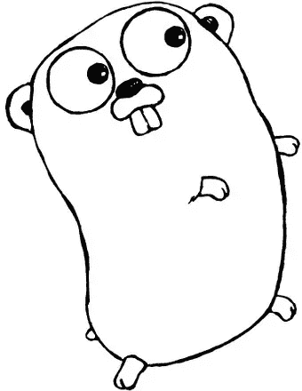

# 使用 Go 进行简单、整洁的编程

> 原文：<https://www.sitepoint.com/simple-clutter-free-programming-with-go/>

GoLang(一般简称为 Go(T3 ))是最新的人人都想学习和使用的 T4 语言。在本文中，我将介绍这种语言，它的特性，它的潜力，以及你是否应该关心 Go。

## 为什么围棋被创造出来



Go gopher，by[Renee French](https://commons.wikimedia.org/wiki/File:Golang.png)

围棋并不像你想象的那么新奇。它起源于 2007 年谷歌内部项目，直到 2009 年公开发布。该项目的转折点是 2012 年 3 月版本 1 的发布，该项目的创建者之一在一篇声名狼藉的博客文章中简洁地传达了该项目的目标。

由于对适合大规模和基础设施级编程的现有语言感到失望，Go 应运而生。没有一个选项将高效的编译、执行和编程容易性结合在一起。语言的选择总是一个或多个方面的妥协。

Go 的核心特性(稍后介绍)有助于它的稳定性和效率，该语言被设计为尽可能简单和整洁——从现代的观点出发，而不是建立在几十年的发展之上。

## 谁在用 Go？

可能感觉大家都在说围棋，但它人气的上升值得商榷。就像 Docker 一样，对可伸缩应用程序日益增长的需求意味着每个人都在谈论一些新的充满流行词汇的技术。这并不意味着它们在生产中被广泛使用。先不说免责声明，Go 是一颗冉冉升起的新星，吸引了很多贡献者和大牌支持者。这绝对是一门值得学习和欣赏的语言，但也许不能把你所有的项目都转换到明天。

对于大规模的应用程序，没有一种语言能统治整个堆栈，但是这里有一些著名的项目和公司大量使用 Go:

*   [码头工人](https://www.docker.com/)
*   [BBC 全球](http://www.bbcworldwide.com/)
*   [一点点](http://bitly.com)
*   [Heroku](https://www.heroku.com/)
*   [音云](https://soundcloud.com/)

## 围棋的特点

大规模、分布式和网络密集型应用选择 Go 的许多原因是由于它的特性集。

### 简约设计

Go 设计了一个实用的、最小的功能集。许多复杂和无关的概念已经从 C 中剥离，并在 Go 中重新实现。例如，这种语言有面向对象的概念，但是它们被剥离到最基本的部分。

尽管如此，Go 已经得到了很好的规划，能够完成复杂的任务——只是没有你可能已经习惯的大量编码开销。

### 静态类型化

为简单起见而设计的语言——比如 JavaScript——允许您动态地创建变量，而不必担心为这些变量分配正确类型的值。语言编译器会在运行时根据你的程序逻辑计算出需要的变量类型。这带来了简单得多的编码体验，但可能导致执行效率低下和错误——不仅仅是因为这种处理开销，还因为偶尔的变量误赋值。

像 Go 这样的静态类型语言迫使程序员显式声明变量类型，并且在编译时检查代码以查看变量是否被正确使用。这可能会导致更长(但更好)的编码过程，但会更早地识别和消除潜在的错误，并通过消除这种动态检查开销来提高效率。

### 碎片帐集

**垃圾收集**是应用程序自动内存管理的一种形式。它的功能是确定应用程序不再需要内存中的哪些对象，并为新对象回收空间。网络套接字和数据库句柄等其他资源仍然是手动处理的。

### 编辑

像 PHP 和 JavaScript 这样的语言是由**解释的**，指令在运行时通过解释器直接执行。Go 是一种**编译的**语言，代码在执行前先编译成机器语言。

编译语言通常运行起来更快更有效，但是查看代码更改是一个较长的过程，并且您的程序支持的所有平台都需要单独的和专门编译的目标。

Go 以其快速的编译时间而闻名，这使得它在开发速度上几乎与解释语言不相上下。

### 大型标准图书馆

标准库是一组跨编程语言可用的库函数。这些函数在库中是独立的，以便在代码需要时导入。Go 有一个[大型包库](https://golang.org/pkg/)，涵盖压缩、I/O、数据库访问等功能。

导入包是一个简单的语句。要导入`image`包的`gif`子包，您只需要:

```
import "image/gif"
```

要导入`image`包及其子包，只需:

```
import "image"
```

### 并发

Go 的并发处理特性旨在支持多个 CPU、复杂的 I/O 管道和分布式基础设施，是它的主要特性之一，也是它优于其他语言的地方。通过使用`channels`概念来控制访问，Go 消除了在其他并发语言中遇到的共享变量的问题。

最简单的方法是，使用关键字`go`启动并发进程:

```
 package main

    import "fmt"

    func PrintGreeting(greeting string) {
        fmt.Println("Hello " + greeting)
    }

    func main() {
      go PrintGreeting("World")
    }
```

这由两个并发运行的函数组成，一个是`main`函数，另一个是在其中调用的`PrintGreeting`函数。这是一个基本的例子，对于并发函数和它们之间的通信，还有很多其他的功能。

## 学习围棋

围棋的学习曲线会取决于你的编程背景。具有 C 背景的开发人员会发现语法是相似的，但是增加了所提到的特性。如果你来自网络语言背景，可能是一个比较难的开始。

Go 的开发人员旨在创建一种语言，它结合了 Ruby 和 JavaScript 等现代解释语言的简单性和 c 等传统语言的可靠性。如果您不熟悉静态类型和基于线程的并发概念，可能需要一个初步的学习曲线。然而，这些范式变化将使您接触到更好的整体编程实践。

### 学习资源

以下是一些很好的资源:

*   [Go 入门](https://www.sitepoint.com/getting-started-go/)(教程)
*   [使用 Go](https://www.sitepoint.com/premium/books/level-up-your-web-apps-with-go) (Book)升级您的网络应用
*   [围棋之旅](https://tour.golang.org/welcome/1)(教程)

如果这些资源对你来说还不够，Go 项目维护了一个全面的学习资源列表。

## 走得更远

当然，这门语言的内容比一篇介绍性文章所能涵盖的要多得多，但是下面是 Go 的一些更重要的特性。

### 模板

没有创建网页的选项，任何现代语言都是不完整的。Go 的`html/template`包是标准库的一部分，允许应用程序逻辑和布局的分离。作为 HTML 和手柄的混合体，模板文件对于任何使用过其他模板系统的人来说都是熟悉的。例如:

```
<h1>{{.Title}}</h1>

<p>{{printf "%s" .Body}}</p>
```

### 结构

当一种新语言变得流行时，人们为它创建框架以减少重复和样板代码。大多数 Go 框架都是针对 web 应用的，包括诸如应用生成器、路由、MVC 和 ORM 支持等特性。选项包括:

*   [比戈](http://beego.me/)
*   [马提尼](http://martini.codegangsta.io/)
*   [狂欢](https://revel.github.io/)

### 移动的

我打算在另一篇文章中进一步讨论这个主题，但 Go 已经被移植到 Android 和 iOS。Android 支持潜在地为将来从 Java 转移奠定了基础，但这纯粹是猜测。如果你不能等我写完我的文章，你可以[在这里](https://github.com/golang/go/wiki/Mobile)找到更多关于移动支持的细节。

## 结论

与其他编程语言相比，Go 是一个年轻的新竞争者。通常，这可能会导致对不成熟产品的不当宣传。多亏了这种语言的创造者做出的谨慎和明智的选择，Go 不负众望，始终如一地兑现了它的承诺。

Go 并不适合你使用的每一个应用程序，对于许多项目来说，它是多余的。但是如果我在这篇文章中介绍的内容吸引了你，那么…开始吧！

抱歉，忍不住说了这个双关语！如果你用过围棋，你的体验是什么？

## 分享这篇文章