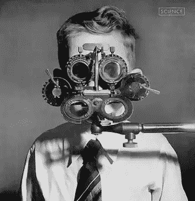
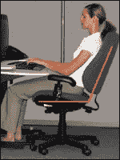
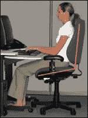
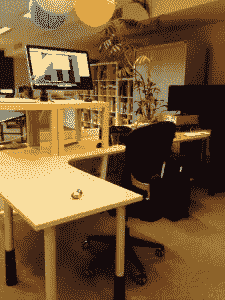
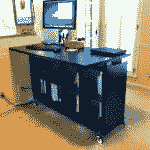
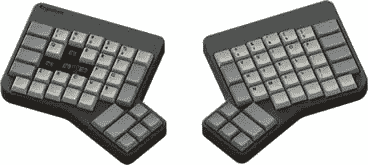

# 办公桌操作员的简单人机工程学提示

> 原文：<https://www.sitepoint.com/simple-ergonomics-tips-desk-jockeys/>

x 射线 _ 增量 _ 一个

人体是一个巧妙但奇怪的设计方案。以动物的标准来看并不快，但我们走得很好。我们有高于平均水平的视力，良好的攀爬能力和优秀的精细运动技能。

有一件事我们实际上 ***而不是*** 设计得非常好，那就是坐着。

事实上，2012 年的一项研究表明，久坐比吸烟对健康的危害更大。

一百年前，这不是什么大问题。我们中的大多数人把时间都花在了拆船、在田间劳作或跨越送货路线上。

不幸的是，作为办公桌前的工作人员和代码猴子，我们醒着的大部分时间都必须呆在电脑前。

舒适性是非常主观的，但是有一些或多或少通用的人机工程学规则，如何安排你的工作环境，以减少创伤和提高生产力。

## 首先，什么是人体工程学？

人体工程学是一个相对较新的术语，最早使用于 1949 年。它来自绿色的“ergon”(工作)和“nomoi”(自然法则)。人体工程学本质上是可用性，自然要引起设计师的共鸣。

根据韦氏词典的定义:

*   ***人体工程学**:一门研究设计和安排事物的科学，以便人们可以轻松安全地使用它们*
*   ***人体工程学**:使某物设计易于使用的部分或品质*

人体工程学的目的是提高你的生产力和保持你的健康。在一些国家，立法强制要求雇主确保工作场所的人体工程学，但并非所有地方都是如此。

职场人体工程学是个大话题，我不是医生也不是人体工程学顾问。但是我可以给你一个清单，列出一些最大的问题:桌子和椅子，显示器，鼠标和键盘，以及其他。

## 桌椅

桌椅是人体工程学的关键，因为它们确保了正确的工作姿势。根据美国劳工部的说法，实际上有几种正确的工作姿势:

**1)。直立坐姿:**
躯干和颈部
近似垂直
并成一直线，大腿
近似水平，
小腿垂直

**2):斜躺坐姿:**使用者的
躯干和颈部是直的
并且从大腿倾斜 105 度
到 120 度

**3)。谢绝坐姿:**使用者的
大腿倾斜
臀部
高于膝盖
大腿
与躯干的
夹角大于 90 度。

显然，你需要一张可以调节高度的桌子和一把可以调节靠背的椅子，为腰部提供支撑。

你的背部是这里的主要问题，但是不正确的姿势也会伤害你身体的其他部位。

例如，脚不是 90 度，会导致膝盖问题。当个子较高的员工在桌子下没有足够的空间让他或她的脚自然休息时，这种情况最常见。

手臂和脖子的位置也很重要。颈部应该笔直垂直，不能向下或向后弯曲。手臂应该与身体成一直线，前臂与身体成 90 度角。手腕和手指不应该向下、向上或向侧面弯曲。

经典的直立设置(#1)被推荐为最佳设置，但是对于我们中的许多人来说，它不如斜躺设置(#2)或站立舒适。

就我个人而言，我发现设置 3 对我的背部压力较小，但离显示器的距离(当没有显示器臂时)成为一个问题。如果你在家工作，你可以直接坐在安乐椅上工作，但在这种情况下，显示器、鼠标和键盘是个问题，因为通常没有合适的地方放它们。

安乐椅最适合所有部件都在一起的笔记本电脑。笔记本电脑的默认配置是一场人体工程学灾难，但您可以使用各种支架来改善显示器和键盘的角度。

### 立式办公桌

在过去的 5 年里，立式办公桌发展势头强劲，这是有充分理由的。尽管它们总是需要调整，但它们燃烧额外卡路里的益处是显著的。

现在，如果成本不是问题，那么 [Up Desk](https://myupdesk.com/updesk/seriesII/maple-large "Website: Up Desk.") 可能是你的最佳选择。

它看起来很棒，功率可调，就像一辆昂贵的奥迪，甚至能记住你最喜欢的设置。在这里，卡利·刘易斯展示了它令人惊叹的美丽。

但是，让我们面对现实:成本**是我们大多数人关心的问题，说服你的老板(或合伙人)在办公桌上花 2000 美元不是一件容易的事——尤其是如果你可能还没有说服自己的话。**

弗里帕被黑的立式办公桌

谢天谢地，许多勇敢的极客花了不到几百美元就“黑”出了一条通往立式办公桌天堂的路。

来自[Flippa.com](https://flippa.com/ "Flippa.com")团队的蒂姆、普雷姆和阿历克斯利用叠放的咖啡桌布置，给自己准备了站立式办公桌，可以快速方便地还原成坐姿。

小桌子每张 50 美元。

来自亚特兰大的杰森[利用一套便宜且随处可见的](http://ageekdad.com/2011/08/30/a-standing-desk/ "A geek dad's instructions on building a stand up desk")[宜家 Expedit](http://www.ikea.com/us/en/catalog/categories/series/09064/ "IKEAs Expedit series") 货架作为基础，建造了这个非常光滑的建筑。他还利用旧 CD 将桌面升高到合适的高度。

功能性和吸引力！

## 班长

除了得到一台画质好的显示器(幸运的是 CRT 显示器已经成为历史了！)，调节显示器垂直和水平位置(高度和与眼睛的距离)的显示器臂是另一个人体工程学建议。

霍尔斯特

当然，没有显示器臂也可以。几块砖头或几本结实的书就够了——我肯定我们都有一些不需要的旧技术手册。

抬起显示器，使其居中于您的自然视线水平。这可以防止你脖子前面的斜角肌缩短，从而防止你弯腰驼背。

不管你的显示器质量和人体工程学纯度如何，给眼睛最好的礼物就是不要一直盯着显示器。

当你思考的时候，把视线从显示器上移开，至少每隔一个小时站起来散散步。

## 鼠标和键盘

不符合人体工程学的鼠标和键盘是各种手腕、手指和前臂受伤的原因。幸运的是，有很多方法可以让你的鼠标和键盘尽可能符合人体工程学。

首先，如果你的桌子足够高，你可能会想要一个滑动键盘托盘——尽管不是每个人都喜欢这样。

Ergodox 分离键盘

其次，还有符合人体工程学的键盘，如微软 Natural Keyboard 的(继任者)可以将你的手腕打开到更放松的位置。你也可以考虑像 [Ergodox](http://www.anandtech.com/Gallery/Album/3013 "Review of the Ergodox keyboard on Anandtech ") 这样的分体式两件式键盘。

理想情况下，你还应该学会用十个手指打字。这将减少你的手腕和手指的运动次数。

对我来说，一个有效的方法是选择一个没有数字键盘的键盘。

我只是偶尔输入数字，数字键盘对我来说用处不大。它走了，老鼠就更近了，我也不用伸右臂了。

另一个有价值的策略是学会用双手使用鼠标并切换它们。

这并没有听起来那么难。我经常这样做，尤其是当设置对于左手鼠标来说更舒适的时候。

精确的动作(像在 GIMP 或 Photoshop 中拖动一个形状)更具挑战性，但并非不可能掌握。

## 其他因素

除了桌椅、显示器、鼠标和键盘之外，还有其他一些人体工程学因素需要考虑，例如:

*   **灯光**。适当的照明对保护你的眼睛尤为重要。光线必须足以照亮显示器和桌面，但不能太亮，也不能直射到显示器上(因为这会引起反射，进一步损伤眼睛)。

    发光照明是眼睛杀手，但如果你的办公室使用它，恐怕你无能为力。

*   保持健康。当你有一个更强壮的核心时，你会有更好的姿势和更少的背部问题。你也不容易疲劳，这减少了无精打采和不良的身体姿势。

*   **衣服**。开发人员和设计师在工作时倾向于穿休闲装，这并不是因为他们缺乏服装品味。t 恤、宽松上衣、牛仔裤比正装要舒服得多。

    很明显，如果你的工作需要你穿正装，那就穿吧，但是要考虑买一件剪裁得体的衬衫，不要太紧，也不要限制肩部或前臂。

*   **减少你在电脑前的时间**。这是解决你眼睛、手腕、背部等问题的最佳方案。但不幸的是，这几乎不可能实现。反正能少花点时间在电脑前，就不要错过任何机会去做。

## 结论

确实有很多事情可以做，让他或她的地方符合人体工程学。例如，这个清单列出了许多需要检查和优化的项目。

然而，很多时候我们并不能应用所有这些规则。此外，很可能你并不需要它们。

你能做的最好的事情就是不要盲目地遵守规则。看看什么对你有用，然后应用它。人体工程学既有普遍性，又有个体性。对一个人有效的不一定对其他人有效。我很想听听你的一些个人工效学窍门。

可能需要一些实验来找到最佳解决方案，但不要放弃——试着找到你个人的人体工程学天堂！

## 分享这篇文章