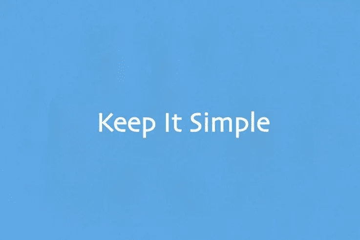
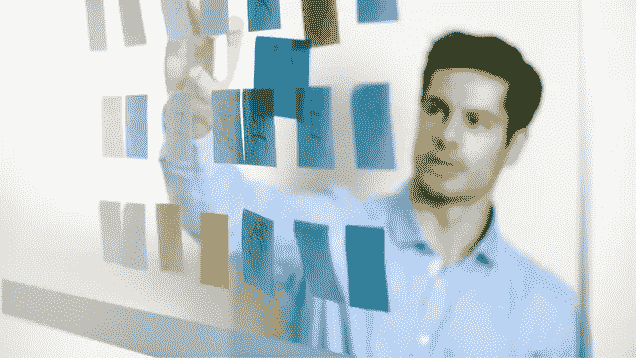
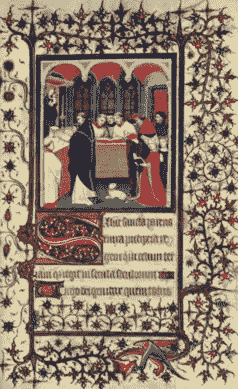
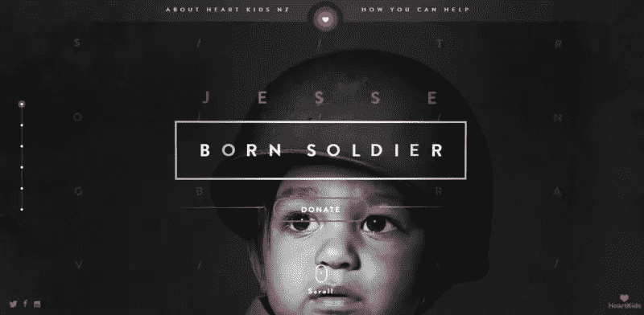
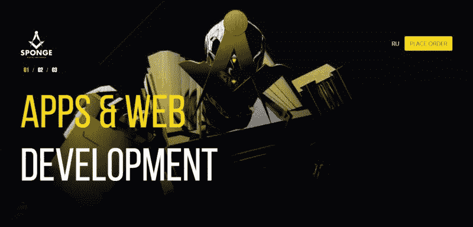

# 单页网站设计的简单基础

> 原文：<https://www.sitepoint.com/simple-fundamentals-designing-one-page-sites/>

如果 2000 年都是关于经典的“[三栏布局](http://alistapart.com/article/holygrail)”，你可以说过去五年是关于“*和单页网站*的崛起。

Squarespace 通过他们的[封面](http://www.squarespace.com/seven/cover/)选项来强调这一点，该选项允许网站建设者为他们需要的任何内容创建一个单页网站。他们不是唯一的一群，因为[一页爱](https://onepagelove.com/)致力于展示一页世界中最好的东西。

那么，让一页纸成名的秘方是什么呢？

今天，我想和大家分享一些基本原则，这些原则可以帮助你为下一个一页纸的项目设计出简单而又杀手级的设计。

## 好的部分

单页网站设计的优势当然是显著的，有些项目会比其他项目更多地受益于这些因素:

*   单焦点友好
*   移动友好
*   降低带宽使用率(通常)
*   更高的转化率(通常)
*   没有重定向
*   能够产生独特的设计

## 不太好的部分

是的，像大多数事情一样，在你决定缩减你的站点之前，你需要考虑一些缺点:

*   通常不支持搜索引擎优化
*   滚动，滚动，滚动
*   不适合内容丰富的利基市场
*   分享内容的困难
*   更难辨别用户的行为和意图
*   你必须专注于一个中心点

## 基本面

当谈到单页网站设计时，最好从基础开始，然后从那里扩展开来。事实上，这个公式应该适用于你正在钻研的任何网站项目。请记住，这是真正的骨架，这取决于你采取额外的步骤，敲你的设计出公园。

### 简单意味着成功

不言而喻，任何网站都很好地珍惜更简单的东西，单页设计也不例外。一页纸的伟大之处在于，将页数*减少到几乎*必然会限制项目范围，所以没有比这更好的时间来确保你遵循 KISS 方法了。

当你在一个封闭的屏幕空间里工作时，你需要确保你所有的内容都有价值。在为这样一种趋势进行设计时，有效极简主义的艺术会浮现在脑海中。记住，使用一页纸，你几乎总是专注于传达**一个**想法和一个单独的想法。没有理由在你的厨房中间引入一个浴室(我希望你不会这样做)，所以在实现一页设计时也不要忘记你的核心目标。

保持你的设计简单的最好方法是首先知道你在设计什么。

*   你在传达一个新的想法吗？(即 Kickstarter)
*   你在建立品牌吗？
*   你在营销产品/服务吗？

做好功课，知道自己想说什么，再去设计。在那之后，你可以给自己一个线框图，画出你想要的东西，在你真正开始工作之前，看看它是否有效。

### 最小化质量

每毫米使用的照明原稿

回到中世纪，纸的生产成本很高，所以很容易理解为什么工匠会在每一页上写这么多内容。同样，当你只有一页纸时，你很容易把那一页纸挤得像一张被照亮的手稿。这就是为什么你需要知道如何小心地管理你的内容——有时要对什么内容是合格的做出艰难的决定。

在设计过程中，留白永远是你的朋友，让你不用创建一堆文字和图像。使用大的休息，图像，彩色面板，甚至视觉分隔符，如线，将使您的访客不会不知所措。每个人都需要休息。

当你创建你的线框时，计划好你的内容。微观管理的最佳实践是首先创建单独的“可视页面”,然后将每个“页面”一个接一个地排列起来。这将允许你把你的内容分成小块，看看你的内容将如何流动。

### 仔细考虑你的导航

[http://www.heartkids.co.nz/](http://www.heartkids.co.nz/)

单页网站增加了你处理无限滚动的可能性——这有它自己的利弊。但这并不意味着你有权忽略你的导航菜单。

的确，一些单页网站甚至没有导航菜单，更不用说当你滚动时跟随你的导航菜单了，但是我坚持认为你应该更好地对待你的网站访问者。单页设计中一个流行的做法是导航菜单，它链接到页面的特定滚动子部分。这种类型的导航是理想的，因为它可以避免访问者不必要地滚动来找到他们想要的东西。

我敢肯定，我们大多数人都曾经迷失在一个导航不良的单页纸上。确保你的导航仍然“坚持”在附近，并提供一个“返回顶部”按钮。

### 全新的设计选择

[http://spongedigital.us/](http://spongedigital.us/)

单页设计是独一无二的，即使你在一个连续的空间工作，你也需要拿出你的设计武器去战斗。因为你在一个有限的空间内工作，你不能仅仅模仿下一个设计师在做什么。

虽然你应该确保你的设计整体简单，但不要觉得你必须坚持一种设计趋势。创造一个个性化的独特混合模式，图像和颜色，以更好地参与。如果你正在处理不同的部分，如果有助于访问者发现那些重要的部分，你可以随意使用对比。

你也可以很容易地创造一个假象，即在一个空间中有多个页面，可以让访问者对你的内容保持兴趣。最终，设计选择是你的，但应该围绕网站的重点。

## 总结

这就是单页网站的基本原理。就像任何趋势一样——flairs、hypercolor、man bun——它被滥用、被糟糕地执行或被简单地选择用于错误的应用只是时间问题。在过去的 6 个月里，我确实发现了对一页纸方法的轻微反弹(就此而言，还有 man bun)。

请记住，要获得有效的单页设计，您需要:

*   专注于保持你的设计简洁，但要确保它有趣且吸引人
*   管理您的内容，就像它是您的孩子，而不是一个不想要的孩子
*   考虑你的导航决定，避免长时间滚动
*   跳出框框，设计独特的体验

就是这样！这个概念很简单，所以现在轮到你去设计房子了。

*你对单页网站设计有什么看法？讨厌？喜欢吗？有喜欢的吗？请留言告诉我们。*

## 分享这篇文章