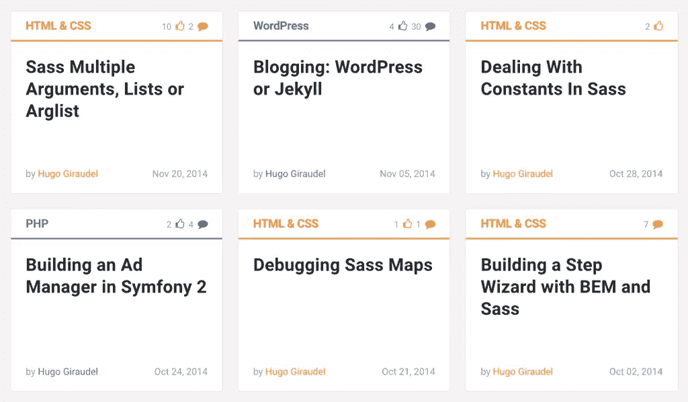

# SitePoint 的 Tiles:组件、主题化和 Flexbox 的案例研究

> 原文：<https://www.sitepoint.com/sitepoints-tiles-a-case-study/>



编辑注:在这篇文章发表后不久，SitePoint 主页就重新上线了。抱歉雨果。

我长期以来一直是 SitePoint 的作者，我总是发现他们的文章从设计的角度来看很有吸引力。它们提供了关于文章的所有必要信息:标题、作者、日期、类别甚至社区指标(评论和喜欢的数量)。

我认为从 HTML 和 CSS 的角度来看，这样的 tile 可能是一个有趣的组件。在这篇文章中，我们将一步一步地构建这个组件，尽我们所能使它做到最好:易访问、可维护、主题化和 SEO 友好。

## 从内容开始

组件应该总是按照这个顺序创建:首先是内容，然后是标记，然后是样式，最后是 JavaScript(如果需要的话)。我们不会偏离这条规则，从我们的内容开始。

```
HTML & CSS

8 comments

A Tale of CSS and Sass Precision

by Hugo Giraudel

May 12, 2016 
```

从那里，我们可以开始用 HTML 包装我们的内容。整个容器将是一个`<article>`元素，因为这似乎是一个正确的用例。在它的内部，我们将有一个用于顶部的容器，一个用于标题的容器(尽管这不是完全强制性的)，以及一个用于元数据的页脚。

```
<article class="c-article-tile">
  <div class="c-article-tile__header">
    HTML & CSS

    8 comments
  </div>
  <div class="c-article-tile__body">
    A Tale of CSS and Sass Precision
  </div>
  <footer class="c-article-tile__footer">
    by Hugo Giraudel

    May 12, 2016
  </footer>
</article>
```

*注意:我们使用一个 [BEM 风格的](http://csswizardry.com/2015/08/bemit-taking-the-bem-naming-convention-a-step-further/)约定来命名类，用[命名空间](http://csswizardry.com/2015/03/more-transparent-ui-code-with-namespaces/)；你想用什么就用什么。*

接下来，我们需要元素的子容器。一个用于类别，一个用于评论计数，一个适当的标题，一个用于作者的容器，一个用于日期。让我们也添加链接。

```
<article class="c-article-tile">
  <!-- Tile header -->
  <div class="c-article-tile__header">
    <a class="c-article-tile__category"
       href="https://www.sitepoint.com/html-css/">
      HTML & CSS
    </a>
    <a class="c-article-tile__comment-count"
       href="https://www.sitepoint.com/a-tale-of-css-and-sass-precision/#comments">
      8 comments
    </a>
  </div>

  <!-- Tile body -->
  <div class="c-article-tile__body">
    <h2 class="c-article-tile__title">
      <a href="https://www.sitepoint.com/a-tale-of-css-and-sass-precision/">
        A Tale of CSS and Sass Precision
      </a>
    </h2>
  </div>

  <!-- Tile footer -->
  <footer class="c-article-tile__footer">
    <span class="c-article-tile__author">
      by
      <a href="https://www.sitepoint.com/author/hgiraudel/">
        Hugo Giraudel
      </a>
    </span>
    <time class="c-article-tile__date"
          datetime="2016-05-12T12:00">
      May 12, 2016
    </time>
  </footer>
</article>
```

看起来不错！需要注意一些有趣的事情:

*   我们没有在顶部使用`<header>`元素，因为一个标题通常包含一个标题，但这里不是这样。
*   我们使用`<span>`元素而不是`<p>`元素，因为这里的 nothing 是每个 sé的一段内容。
*   我们使用适当的 [`<time>`元素](https://developer.mozilla.org/en/docs/Web/HTML/Element/time)及其`datetime`属性，而不是`<span>`来描述日期。

现在让我们用一个合适的易访问图标来替换“评论”这个词。我们不会深入解释，请随意阅读[一个可访问图标的工作 SVG 工作流](https://www.sitepoint.com/a-working-svg-workflow-for-accessible-icons/)来了解更多关于这个方法的信息。

```
<svg style="display: none">
  <symbol id="icon-bubble" viewBox="0 0 32 32">
    <path class="path1" d="M16 2c8.837 0 16 5.82 16 13s-7.163 13-16 13c-0.849 0-1.682-0.054-2.495-0.158-3.437 3.437-7.539 4.053-11.505 4.144v-0.841c2.142-1.049 4-2.961 4-5.145 0-0.305-0.024-0.604-0.068-0.897-3.619-2.383-5.932-6.024-5.932-10.103 0-7.18 7.163-13 16-13z"></path>
  </symbol>
</svg>

<!-- … -->

<a class="c-article-tile__comment-count"
   href="https://www.sitepoint.com/a-tale-of-css-and-sass-precision/#comments">
  8
  <svg class="icon icon-bubble"
       aria-label="comments">
    <use xlink:href="#icon-bubble"></use>
  </svg>
</a>
```

请注意我们如何使用`aria-label`属性使辅助技术用户可以访问图标。

最后，我们可以将[微数据](https://www.w3.org/TR/microdata/)添加到我们的代码中，使其更容易被搜索引擎抓取和索引。随意看看文章的【Schema.org 参考。

```
<article class="c-article-tile"
         itemscope
         itemtype="http://schema.org/Article">
  <!-- Tile header -->
  <div class="c-article-tile__header">
    <a class="c-article-tile__category"
       href="https://www.sitepoint.com/html-css/"
       itemprop="keywords">
      HTML & CSS
    </a>
    <a class="c-c-article-tile__comment-count"
       href="https://www.sitepoint.com/a-tale-of-css-and-sass-precision/#comments"
       itemprop="commentCount">
      8
      <svg class="icon icon-bubble"
           aria-label="comments">
        <use xlink:href="#icon-bubble"></use>
      </svg>
    </a>
  </div>

  <!-- Tile body -->
  <div class="c-article-tile__body">
    <h2 class="c-article-tile__title"
        itemprop="headline">
      <a href="https://www.sitepoint.com/a-tale-of-css-and-sass-precision/">
        A Tale of CSS and Sass Precision
      </a>
    </h2>
  </div>

  <!-- Tile footer -->
  <footer class="c-article-tile__footer">
    <span class="c-article-tile__author">
      by
      <a href="https://www.sitepoint.com/author/hgiraudel/"
         itemprop="author">
        Hugo Giraudel
      </a>
    </span>
    <time class="c-article-tile__date"
          datetime="2016-05-12T12:00"
          itemprop="datePublished">
      May 12, 2016
    </time>
  </footer>
</article>
```

在开始讨论风格之前，我想就组件封装和适当的设计实现说几句话。根据定义，组件应该是可重用的。为了在响应上下文中正确地重用，通常最好不要有固定的尺寸和上下文空间，让它在容器中自然传播。

这意味着容器本身为封装的组件指定了某种边界。在我们的例子中，一个容器可以是一个列表项，一个列表组件的一部分，专门用来显示磁贴(或者卡片，或者其他什么)。

下面是它可能的样子:

```
<ul class="c-tile-list">
  <li class="c-tile-list__item">
    <article class="c-article-tile">…</article>
  </li>

  <li class="c-tile-list__item">
    <article class="c-article-tile">…</article>
  </li>

  <li class="c-tile-list__item">
    <article class="c-article-tile">…</article>
  </li>
</ul>
```

在这个阶段，我们已经完全完成了标记。它是干净的，可访问的和搜索引擎友好的；我们能做的不多了。是时候造型了！

## 应用一些样式

对于 CSS 部分，我们将为所有元素假设一个[合适的盒子模型。我们也会非常依赖 flexbox，为什么不呢？](https://css-tricks.com/inheriting-box-sizing-probably-slightly-better-best-practice/)

### 列表容器组件

我们的列表组件很薄，所以没有太多的样式。它必须为瓷砖提供类似网格的布局，处理瓷砖之间的间距，并确保同一行上的所有瓷砖都是相同的高度。多亏了 flexbox，这应该不会太难。

```
/**
 * 1\. Reset default list styles
 * 2\. Flexbox used for a grid-like layout for the tiles.
 */
.c-tile-list {
  list-style: none; /* 1 */
  margin: 0; /* 1 */
  padding: 0; /* 1 */
  display: flex; /* 2 */
  flex-wrap: wrap; /* 2 */
}
```

现在是列表项目:

```
/**
 * 1\. Flexbox used for equal-height tiles on a same line.
 * 2\. Make sure a time never looks distorded.
 * 3\. Spacing between tiles.
 */
.c-tile-list__item {
  display: flex; /* 1 */
  flex-direction: column; /* 1 */
  flex: 0 0 300px; /* 2 */
  margin: 10px; /* 3 */
}
```

### 文章平铺组件

让我们继续实际的野兽:文章瓷砖组件。风格有很多元素，从瓷砖本身开始。

如前所述，图块不应该有固定的尺寸，而是依赖于其父容器来调整尺寸。我们还将使 tile 本身成为一个 flex 容器，这样就可以在底部对齐它的页脚，而不管 tile 的计算高度如何。

```
/**
 * 1\. Make it possible to bottom align the footer in a tile that has a minimum
 *    height.
 * 2\. Make sure the tile spread across the full height of the parent if inside
 *    a flex container.
 */
.c-article-tile {
  display: flex; /* 1 */
  flex-direction: column; /* 1 */
  flex: 1 0 auto; /* 2 */
  border: 1px solid rgba(0, 0, 0, 0.1);
  background-color: rgb(255, 255, 255);
}
```

我们可以更深入地移动一个级别，并设置磁贴的子容器(标题、正文、页脚)的样式。它们都负责一些水平填充，为了使进一步的定位更容易，我们可以将每个容器都做成 flex 容器。

```
.c-article-tile__header,
.c-article-tile__body,
.c-article-tile__footer {
  display: flex;
  padding-left: 20px;
  padding-right: 20px;
}
```

标题和页脚中的内容略小，本质上是因为它是元信息，从视觉上讲不应该占用太多空间。我们可以安全地减小两个容器的字体大小。

```
.c-article-tile__header,
.c-article-tile__footer {
  font-size: 80%;
}
```

我们已经为我们的集装箱打下了基础。让我们移动到适当的样式，从标题开始。它需要一些垂直间距和标志性的底部边框，使它看起来像一个标题。

```
/**
 * 1\. Rely on the `color` property for the border color by not setting any color
 *    value, making it super convenient for theming.
 */
.c-article-tile__header {
  padding-top: 15px;
  padding-bottom: 10px;
  border-bottom: 2px solid; /* 1 */
}
```

flex 容器的默认方向是`row`，这就是为什么我们没有为子容器明确指定它。要在标题右侧对齐评论数，有两种解决方案。第一个解决方案是在标题上设置`justify-content: space-between`来分隔我们的项目。另一个解决方案，我们将使用的，是将`margin-left: auto`放在柜台上，依靠 [flexbox 最好的保密](https://medium.com/@samserif/flexbox-s-best-kept-secret-bd3d892826b6#.hwuw69tah)。

```
/**
 * 1\. Right align the comment count container in the header.
 */
.c-article-tile__comment-count {
  margin-left: auto; /* 1 */
}
```

收割台现在可以正常工作了。我们可以继续讨论正文和文章标题。正文只需要一点垂直间距，磁贴需要一些印刷样式。

```
.c-article-tile__body {
  padding-top: 20px;
  padding-bottom: 20px;
}

.c-article-tile__title {
  margin: 0;
  color: #333;
  font-size: 150%;
}
```

最后，我们可以整理页脚，如果你问我，这是瓷砖最有趣的部分。首先，页脚应该与磁贴的底部对齐。

其次，它应该总是在一行上。幸运的是，我们可以用`white-space: nowrap`来强制这种行为。然而，我们不能控制作者名字的长度，所以我们需要确保名字太长时布局不会中断。我很清楚“删节不是一种内容上的错误……”，但在这种情况下，我认为两害相权取其轻。

```
/**
 * 1\. Bottom align the footer in the tile.
 * 2\. Prevent any content from the footer from wrapping, effectively forcing it
 *    on a single line at all time.
 */
.c-article-tile__footer {
  padding-top: 10px;
  padding-bottom: 15px;
  margin-top: auto; /* 1 */
  white-space: nowrap; /* 2 */
  color: #949494;
}

/**
 * 1\. Prevent the author and the date from overlapping in case they both don’t
 *    fit on the line; add an ellipsis to the author name.
 * 2\. Visually no effect when both the author and the date fit; however make
 *    sure they are slightly spaced from each other if they meet on the line.
 */
.c-article-tile__author {
  text-overflow: ellipsis; /* 1 */
  overflow: hidden; /* 1 */
  margin-right: 5px; /* 2 */
}

/**
 * 1\. Right align the date container in the footer.
 */
.c-article-tile__date {
  margin-left: auto; /* 1 */
}
```

瓷砖布局到此为止！在结束之前，我们还有最后一件事要完成。

### 合适的主题

你可能已经注意到我们根本没有解决主题化的问题。原因是我认为配色方案应该与组件布局分离:它们没有相同的用途，因此不能(也不应该)以相同的方式处理。

说到主题化，我喜欢依靠[组件不可知的`t-`命名空间类](http://csswizardry.com/2015/03/more-transparent-ui-code-with-namespaces/#theme-namespaces-t-)。因此，让我们首先将一个主题类应用到我们的图块:

```
<article class="c-article-tile t-sass"
         itemscope
         itemtype="http://schema.org/Article">
  …
</article>
```

从那里，我们可以基于这个类将一些样式应用到我们的 tile。我们将一种特定的颜色应用到瓷砖及其所有链接上。这将有效地影响页眉的边框颜色，但不会影响已经有特定颜色(`#949494`)的页脚文本。

```
.c-article-tile.t-sass,
.c-article-tile.t-sass a {
  color: #c69;
}
```

一切都很好，除了标题，它应该是黑色的时候却变成了粉红色，只是在悬停或活动时变成了粉红色。一种解决方案是，当父链接没有被悬停或激活时，强制链接继承其父链接的颜色(`#333`)。为此，我们可以聪明地使用`:not()`伪类:

```
/**
 * 1\. Make the title link inherit the color only when not active / hovered,
 *    effectively making it themed when active / hovered.
 */
.c-article-tile__title:not(:hover):not(:active) > a {
  color: inherit; /* 1 */
}
```

## 包装东西

就是这样！唷，跑了这么远，但我希望你喜欢。我觉得这个小例子非常适合组件封装、主题管理和使用 flexbox。请随意尝试，如果您发现任何可以使它变得更好的方法，请一定要分享！

参见 [CodePen](http://codepen.io) 上 SitePoint ( [@SitePoint](http://codepen.io/SitePoint) )的笔 [SitePoint Tile 概念示例](http://codepen.io/SitePoint/pen/YWZpXB/)。