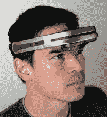

# 小屏幕可用性实验

> 原文：<https://www.sitepoint.com/small-screen-usability-experiments/>

昨晚在[专栏](http://www.thefeature.com)上看到了马克·弗劳恩菲尔德的这篇优秀文章，谈论了小屏幕可用性设计中的实验技术。

最基本的是，许多网站试图帮助小屏幕用户，允许他们的多栏布局在小屏幕上“分解”成更有用的、堆叠的、单列的布局。虽然这肯定是一个开始，但它通常需要用户在设备上做大量的滚动，这些设备通常不会使滚动变得快速或容易。

Patrick Baudish ，一位人机交互研究员，在过去的三年里在这个领域做了很多思考。他的一些替代方案包括:

1) [摘要缩略图](http://patrickbaudisch.com/projects/summarythumbnail/index.html):一个优雅的想法，简单地保持内容区域的相对比例，但将字体放大到可读的大小。显然，要实现这一点，必须对所呈现的内容进行裁剪，但令人惊讶的是，这种裁剪似乎并没有降低太多的意义。
2) [折叠缩放](http://patrickbaudisch.com/projects/collapsetozoom/index.html):这有点像 SitePoint 的折叠导航栏，但允许用户通过简单的笔滑动来折叠任何内容区域。然后，剩余部分中的字体会自动放大，以利用新的空间。没有理由不让所有用户都可以使用这个功能。
3) [速度相关自动变焦](http://www-ui.is.s.u-tokyo.ac.jp/~takeo/research/autozoom/autozoom.htm):这是东京大学开发的一项实验技术。这种方法有点像蜜蜂采集花粉的方式。当蜜蜂站在一朵花上时，它可以完全接近那朵花，也可以舒服地跳到它看到的任何邻近的花上。

然而，为了找到新的、更远的花，他需要向上放大以获得该区域的概览。一旦发现有希望的东西，他就可以放松能量，向下漂移，进行更近距离的观察。正如他们的小 [Java 演示](http://www-ui.is.s.u-tokyo.ac.jp/~takeo/java/autozoom/autozoom.htm)所展示的，这大概就是这种技术的工作方式。

虽然这个概念已经有几年的历史了，但是 PDA 和手机成为真正可行的网络浏览设备可能只是相对最近的事情。再加上手写笔，也许是时候了。

当然，几年后，当每个人都在使用个人平视视网膜投影仪时，这些都将是多余的。

不过，我希望到那时他们会淡化“机械战警氛围”。

对不起，我得走了。某个地方正在发生犯罪。

## 分享这篇文章