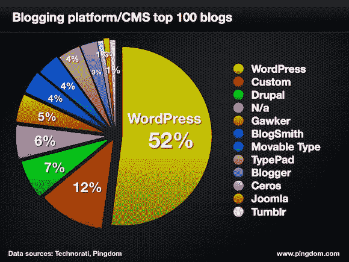

# 你认为你知道如何写一个 WordPress 主题吗？

> 原文：<https://www.sitepoint.com/so-you-think-you-know-how-write-wordpress-theme/>

在这篇文章中，我们将带你开始 WordPress 主题开发，在你考虑编码之前处理你需要学习的东西。

WordPress 已经成为世界上最受欢迎的内容管理系统。根据由 [Technorati](http://http://technorati.com/) 和 [Pingdom](http://royal.pingdom.com/2013/05/07/wordpress-top-100-blogs/) 进行的一项调查，截至 2013 年 5 月，全球 52%的顶级博客都在使用 is。这比 2012 年增长了 4%，因此很明显，该平台的受欢迎程度继续上升。

有超过 6500 万个 WordPress 网站在使用，正如前面提到的，这个数字还在继续增长。因此，对于开发者来说，这是一个明确的机会，为制作 WordPress 主题开拓一片天地，并为他们的技能集创造一个有价值的补充。

## 入门指南

理论上，制作一个主题是很容易的，而且随着时间的推移和支持的加强，这个事情会变得越来越简单。你真正需要开始的是一个 index.php 文件和一个 style.css 文件——但这不会让你鹤立鸡群。如果你打算冒险学习一项新技能，那么你最好尽你所能，对吗？

在我们更进一步之前，如果你想做一个伟大的主题，那么有必要对 HTML 和 CSS 有一个很好的工作知识，最好有编码 HTML5 和 CSS3 的经验。这是一个竞争激烈的市场，WordPress 支持这两种新标准。

如果事实证明你对新标准一无所知，你可以看看 Learnable 上的 [Jump Start HTML5](https://learnable.com/topics/search?q=jump+start+html5) 系列或者 SitePoint 出版的[html 5&CSS3 for the Real World](https://www.sitepoint.com/store/html5-css3-for-the-real-world/)来加快速度。

还有一点需要理解的是，你的主题必须与 WordPress 的最新版本兼容，也可能与一些旧版本兼容，因为潜在的兼容性问题，并不是每个人都会立即升级到最新版本。因为每个人的设置不同，兼容性问题可能不会影响到每个人，所以这可能取决于网站上安装了什么主题和插件，甚至取决于服务器的设置。

## WordPress 市场

WordPress 编码标准相当严格；安全性是必须的，在开始编码之前，有必要研究一下许可、流行插件和 WordPress APIs。换句话说，做你的功课。不要以为你会编码，那就是你所需要的。同样值得考虑的是你将如何支持这个主题。

你有时间:

*   创建更新和补丁
*   回应客户的疑问和安装问题
*   保持主题，继续发展
*   包括代码注释，这对创建主题至关重要

在开始之前，看一下 WordPress 网站上的[文档，这样你就会确切地知道你将进入什么样的环境。任何人都可以成为 WordPress 开发者，但如果你想让主题获得批准并进入](http://make.wordpress.org/themes/)[官方主题目录](http://wordpress.org/themes/)，这是一个严格的过程。

此外，好好浏览一下 WordPress 的编码标准，确保你真的能够胜任之前的任务。这可以帮助你避免以后的挫折。

## 准备好自己

现在你已经知道你要做什么了，并且假设你已经通过复习必要的编码标准做好了准备，看看一些真正好的现有主题的结构。

Themeforest 目前将名为“X”的[主题列为最佳主题。这很复杂，但值得一看。然而，最好的开始是使用当前默认的](http://themeforest.net/item/x-the-ultimate-wordpress-theme)[20 个 14 主题](http://wordpress.org/themes/twentyfourteen)(这是 WordPress 3.8 捆绑的三个主题之一)来很好地了解 WordPress 的基本结构。

当您开始构建过程时，您将处理大约 12 个核心文件。其中包括:

*   header.php
*   index.php
*   sidebar.php
*   footer.php
*   archive.php(针对类别、帖子、作者、日期等)
*   single.php(个别员额)
*   comments.php
*   pages(用于静态页面而非帖子)
*   search.php
*   404.php
*   style.css
*   functionality(允许在不编辑核心文件的情况下更改核心功能)

对于那些过去开发过网站的人来说，以上大部分都是不言自明的。还有一系列 PHP [模板标签](http://codex.wordpress.org/Template_Tags)可以插入到代码中，允许动态内容。当有疑问时，参考法典，看看标签如何工作，哪些适合你想要实现的目标。

## 做正确的事

如果你不遵守 WordPress 的投稿指南，你的主题将不会被接受。一个要求是，你不要用我以外的任何方式拼写 WordPress。这似乎是一个很小的要求，但却很重要；没有小写的 P，没有懒惰，它必须这样拼写，就是这样，否则它不会被接受。

虽然我前面提到了向后兼容性，但这必须最小化到一个主要的先前版本。当前的版本是 3.8，所以这意味着你不应该回到 3.7 以上，当谈到让你的主题兼容以前的版本。

同样至关重要的是，你的编码是干净的，没有错误的。不得有“_ doing _ it _ wrong()”通知，错误涉及。php 或 JavaScript 错误。还建议验证 HTML 和 CSS(虽然不期望无验证代码；例如，默认的 214 主题有 23 个 CSS 验证错误)。更多信息请查看[代码质量指南](http://make.wordpress.org/themes/guidelines/guidelines-recommended/)。

## WordPress APIs

如果你要写一个 WordPress 主题，那么彻底学习 API 是一个很好的主意。它们有很多，它们被分成不同的部分和主题，涵盖了构建主题所涉及和必需的功能。

大多数情况下，您将关注以下内容:

*   选择
*   设置
*   主题定制
*   短代码
*   小工具

然而，还有更多的，所以你应该看看每一个并且在你开始建立主题之前决定你需要什么。

## 下一步是什么？

现在，在开始构建主题之前，您已经了解了一些相关内容，下一步是研究语言、许可和结构。或者你可以继续写代码，尝试一下，看看你是否愿意先继续写。##替代资源

如果你想创建一个主题，但不想经历学习代码、API 和兼容性问题的麻烦，那么你可以随时“作弊”。有几个网站可以让你建立自己的主题，而不需要费很大的劲。其中包括[最后通牒](http://ultimatumtheme.com/)，这是一个无需任何编码知识就可以使用的拖放构建器。当然，这是有代价的，即初级许可 65 美元，专业(终身)会员 125 美元——因此，如果你觉得编写自己的主题太具挑战性，还有其他选择。

### 下次

在以后的文章中，我们将更详细地研究代码结构、提交过程、如果主题被拒绝该怎么办以及语言支持。当涉及到建立一个主题时，有太多的事情要做，如果你想竞争，你需要建立一个伟大的主题。稍后，我们还将进一步了解可以帮助您构建和测试主题的资源。

更新:文章被更新，删除了对 WordPress 3.8 可能存在的权限问题的引用，因为这是不正确的。

## 分享这篇文章