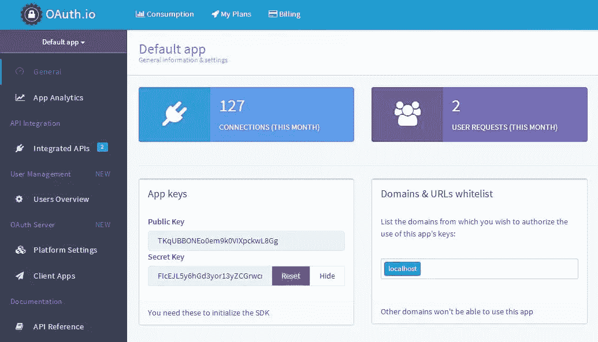
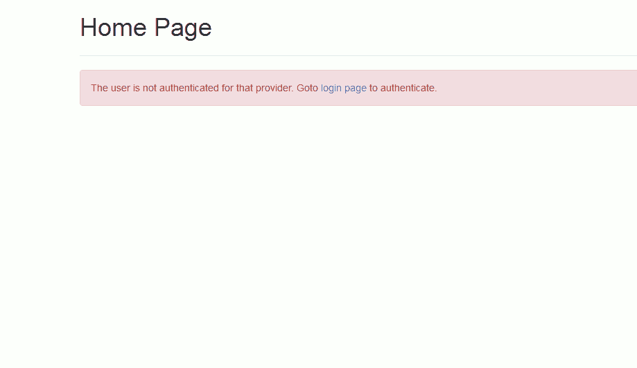

# 使用 Oauth.io 进行社交登录–在任何地方使用任何工具登录

> 原文：<https://www.sitepoint.com/social-logins-with-oauth-io-log-in-with-anything-anywhere/>

*这篇文章由[沃恩·安切塔](https://www.sitepoint.com/author/wancheta)进行了同行评审。感谢 SitePoint 的所有同行评审员使 SitePoint 的内容尽可能做到最好！*

今天的用户通常喜欢使用他们的社交账户点击登录网站的想法。

有鉴于此，今天我们将看看 [OAuth.io](https://oauth.io/) ，这是一个面向 120 多家社交登录提供商的多平台 SDK，如脸书、Twitter 和 Google+。使用这样的 SDK 并不是一项困难的任务，但是使用它有一些先决条件。


## 步骤 1:设置先决条件

第一步是创建:

*   一个在脸书和谷歌(或任何其他你想实现的支持提供商)注册应用程序的开发者账户。
*   一个已注册的 [oauth.io 账户](https://oauth.io/signup)(支持 30 天免费试用)。

要创建脸书应用程序，请转到脸书应用程序入门指南。跟随[这个链接](https://developers.google.com/identity/sign-in/web/devconsole-project)，为谷歌做同样的事情。

如果你遇到困难或需要更多帮助，请在下面留言。

## 步骤 2:安装 OAuth.io

```
composer require oauth-io/oauth 
```

## 步骤 3:在 OAuth.io 中配置 API

关于 OAuth.io 的配置和设置，我们需要做的就是在他们的仪表板中注册提供者的应用程序。这是通过从提供者的应用程序页面复制`Client ID`和`Client Secret`字符串来完成的。

这样做的过程显示在下面的 gif 中，仅适用于谷歌和脸书，但对所有提供商来说都是一样的。


## 第四步:编码

这一步的范围是对合并的社交登录的逻辑进行编码。Oauth.io 提供了一个演示应用程序来演示 SDK 的使用方式。

这个演示应用程序的成品项目具有如下所示的目录结构:

```
|-Demo-OAuth-IO/
|--app/
|--public/
|--src/
|--vendor/
|--composer.json
|--composer.lock 
```

`src`和`vendor`目录是在项目创建时创建的，而`app`和`public`是在创建过程中创建的。

*请注意，这个应用程序只是一个简单的演示——在真实世界的应用程序中，就像我们将在后续文章中构建的应用程序一样，您可能会使用一个框架。*

为了实现这个演示，我们开始使用包含 OAuth.io PHP SDK 的 [Composer](https://www.sitepoint.com/php-dependency-management-with-composer/) 创建一个新项目。

```
composer create-project oauth-io/oauth=0.3.2 Demo-OAuth-IO 
```

然后，我们继续创建`app`目录及其文件。

```
|-app/
|--config.inc.php
|--OAuthIO.php 
```

这个目录包含一个名为 OAuthIO 的类。这个类是一个门面，它简化了 SDK 的使用。它的源代码是:

```
<?php

require_once '../vendor/autoload.php';
require_once 'config.inc.php';

use OAuth_io\OAuth;

class OAuthIO
{

    protected $provider;
    protected $oauth;

    public function __construct($provider)
    {
        $this->provider = $provider;
        $this->oauth = new OAuth();
    }

    /**
     * init: Initialise the OAuth_io
     */
    public function init()
    {
        $this->oauth->initialize(
            PUBLIC_KEY, SECRET_KEY
        );
    }

    /**
     * auth:   Make the authentication process
     * @param: callback => uri to goto after authentication
     * @throw: NotInitializedException
     */
    public function auth($callback)
    {
        $this->oauth->redirect(
            $this->provider,
            $callback
        );
    }

    /**
     * getClient: Get a request_object from OAuth_io
     * @param:  opt => options passed to authenticate process
     * @throw:  NotAuthenticatedException
     * @return: Request object on success
     */
    public function getClient($opt = null)
    {
        if ($opt === null) {
            $client = $this->oauth->auth(
                $this->provider, [
                'redirect' => true,
            ]
            );
        } else {
            $opt['redirect'] = true;
            $client = $this->oauth->auth($this->provider, $opt);
        }

        return $client;
    }
} 
```

如您所见，OAuthIO 类需要并加载两个文件:自动加载类中 OAuth.io SDK 的`autoload.php`文件，以及包含实现和运行应用程序所需的公钥和私钥定义的`config.inc.php`文件。

```
<?php

define('PUBLIC_KEY', 'TKqUBBONEo0em9k0VIXpckwL8Gg');
define('SECRET_KEY', 'FIcEJL5y6hGd3yor13yZCGrwcrE'); 
```

您可以在 OAuth.io 仪表板页面的应用密钥中找到这些密钥。



这个类中定义的函数是自解释的，分别执行认证过程和客户端的创建`auth()`和`getClient()`。

*   认证过程包括将用户重定向到社交提供商的登录页面，并在成功登录后，将他们重定向回 web 应用程序。

*   客户端对象只不过是 SDK 附带的`RequestObject`类的一个实例。它用于向 Oauth.io API 发出请求。它可以通过身份验证过程中获得的凭证轻松创建。通过调用`RequestObject`实例上的`getCredentials()`方法来访问它们。将这些凭证存储在数据库中并再次加载它们并调用`auth()`是重用客户机而无需重新认证的推荐方法。

```
$provider->auth(
    [
        'credentials' => $credentials,
    ]
); 
```

在我们完成了`app`目录之后，我们创建了`public`目录。

```
|-public/
|--tmpl/
|----footer.php
|----header.php
|--index.php
|--login.php 
```

正如您所猜测的,`public`目录包含用户可以从浏览器访问和查看的文件。这些文件执行大部分的社会认证过程。

*   `login.php`实现合并的社交登录页面，如果认证成功，将用户重定向到索引页面，否则停止并打印错误消息。

    ```
    <?php

    session_start();

    require '../app/OAuthIO.php';

    if (isset($_SESSION['oauthio']['auth']) &&
        count($_SESSION['oauthio']['auth']) > 0
    ) {header('Location: /index.php');
    exit();

    }
    if (isset($_GET['p']) &&
        empty($_GET['p']) == false
    ) {
    $provider_name = $_GET['p'];
    $provider = new OAuthIO($provider_name);
    $provider->init();

    try {

        // Execute authentication process
        $provider->auth('/index.php');

    } catch (Exception $e) {
        die($e->getMessage());
    }

    } 
    ```

*   `index.php`检查用户是否通过了身份验证，尝试使用来自 OAuthIO 的`getClient()`方法获取 RequestObject 的实例。如果失败，它将打印出错误消息和登录页面的链接，否则它将打印出与成功消息相连的提供者名称。

    ```
    <?php

    session_start();

    require '../app/OAuthIO.php';

    $provider_name = '';
    $errors = [];

    if (isset($_SESSION['oauthio']['auth']) &&
        count($_SESSION['oauthio']['auth']) > 0
    ) {reset($_SESSION['oauthio']['auth']);
    $provider_name = key($_SESSION['oauthio']['auth']);

    }
    $provider = new OAuthIO($provider_name);
    $provider->init();
    try {
    $client = $provider->getClient();

    } catch (\Exception $e) {
        $errors[] = $e->getMessage();
    } 
    ```

以及消息打印部分:

```
if (count($errors) > 0) {

    print '<div class="alert alert-danger" role="alert">' .
        $errors[0] . '. Goto <a href="login.php">login page</a> to authenticate.</div>';

} else {

    if ($client !== false) {

        $me = $client->me();
        print '<div class="alert alert-success" role="alert">' .
            sprintf(
                'Well done %s! You have authenticated using %s.',
                $me['name'], ucfirst($provider_name)
            ) . '</div>';

    }
} 
```

`public`目录包含另一个名为`tmpl`的目录。在这个目录中，我们可以找到应用程序主模板的静态页眉和页脚。它们不包含任何逻辑，所以它们的源代码不会在本教程中显示，包含在 public 文件夹中是安全的。

这就是我们所要做的——如果我们现在测试，我们会看到下面的结果。



## 结论

在这篇短文中，我们学习了如何使用 OAuth.io 实现一个合并的社交登录。

随着使用用户名/密码组合的愿望减少，类似这些或[神奇链接](https://www.sitepoint.com/lets-kill-the-password-magic-login-links-to-the-rescue/)的替代方案变得越来越普遍——如果你未来的应用程序将依赖于社交网络登录，请考虑应用这一过程，为自己节省一些麻烦。

要了解如何对提供者进行更多的 API 调用，请查看[文档](http://docs.oauth.io/)。在本教程中创建的应用程序的源代码可以在 Github 的[中找到。](https://github.com/sitepoint-editors/Demo-OAuth.io)

## 分享这篇文章