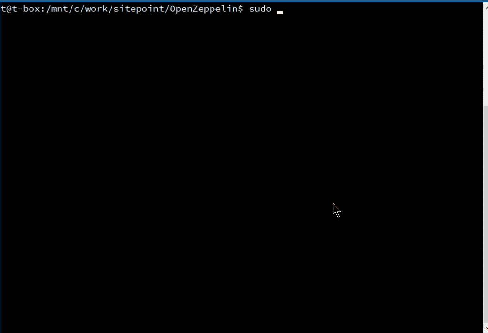
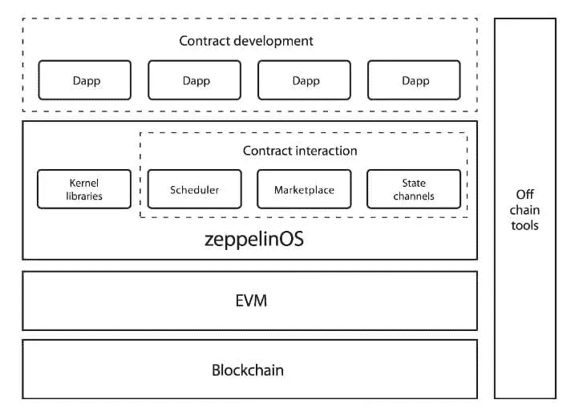
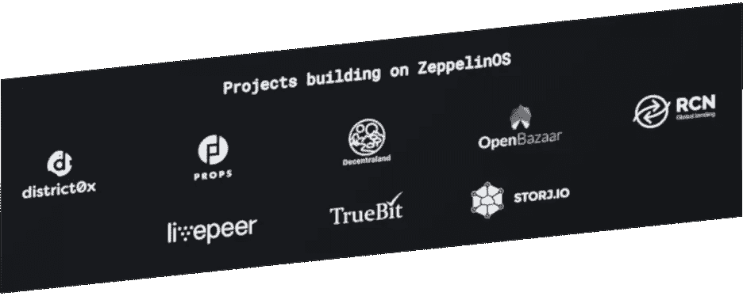

# OpenZeppelin 和朋友的质量可靠性代码

> 原文：<https://www.sitepoint.com/solidity-openzeppelin/>

**鉴于以太坊的所有[T2 计算都需要在网络中的所有](https://bitfalls.com/2017/09/19/what-ethereum-compare-to-bitcoin/)[节点](https://bitfalls.com/2017/11/26/whats-bitcoin-node-mining-vs-validation/)上重现，以太坊的计算天生成本高昂且效率低下。(事实上，以太坊的开发者在 GitHub 上的文档指出，我们不应该期望以太坊比 1999 年的手机有更多的计算能力。)**

因此，以太坊虚拟机的安全性——也就是部署在以太坊区块链上的智能合约的安全性——至关重要。它上面的所有错误都花了真金白银——无论是写得不好的合同引发的错误，还是黑客利用合同中的漏洞，就像众所周知的道黑客事件，这导致了社区分裂，并催生了以太坊经典区块链。

图灵完整性和一系列其他设计决策让以太坊变得更加强大和复杂，但这是有代价的。以太坊的丰富性使得它更容易受到错误和黑客的攻击。

雪上加霜的是，部署在以太坊上的智能合约无法修改。区块链是一种不可变的数据结构。

[这篇](https://medium.com/loom-network/how-to-secure-your-smart-contracts-6-solidity-vulnerabilities-and-how-to-avoid-them-part-1-c33048d4d17d)和[这篇](https://medium.com/loom-network/how-to-secure-your-smart-contracts-6-solidity-vulnerabilities-and-how-to-avoid-them-part-2-730db0aa4834)文章更深入地探讨了智能合约的安全性，以及帮助我们确保智能合约安全的工具和库生态系统。

让我们看看对我们的工具集的一些惊人的升级，我们今天可以使用*来利用 Solidity 环境可以提供的最佳实践。*

 *## 助手工具

以太坊开发者工具集中最酷的工具之一是 OpenZeppelin 的库。这是一个由许多 Solidity 代码模式和智能契约模块组成的框架，以安全的方式编写。作者本身是 Solidity 审计员和顾问，你可以在这里阅读第三方对这些模块的审计。来自 Zeppelin Solutions 的 Manuel Araoz 概述了主要的可靠性安全模式和考虑事项，Zeppelin Solutions 是 OpenZeppelin 背后的一家阿根廷公司，[。](https://blog.zeppelin.solutions/onward-with-ethereum-smart-contract-security-97a827e47702)

OpenZeppelin 正在将自己确立为 Solidity 代码的可重用和安全开源(MIT)基础的行业标准，Solidity 代码[可以使用 Truffle](https://blog.zeppelin.solutions/how-to-create-token-and-initial-coin-offering-contracts-using-truffle-openzeppelin-1b7a5dae99b6) 轻松部署。它由智能合同组成，一旦通过 npm 安装，就可以很容易地导入并在我们的合同中使用。

Truffle 框架[发布了一个将 OpenZeppelin 与 Truffle 和 Ganache](http://truffleframework.com/tutorials/robust-smart-contracts-with-openzeppelin) 一起使用的教程。

这些契约应该被导入，它们的方法应该根据需要被覆盖。文件本身不应该被修改。

## ICO 模式

OpenZeppelin 的库包含一组在以太坊平台上发布令牌的合同——针对 [ERC20](https://en.wikipedia.org/wiki/ERC20) 令牌，包括一个 BasicToken 合同、BurnableToken、CappedToken。这是一个具有固定上限的可生成令牌，mintable token，PausableToken，使用它可以暂停令牌传输。然后是象征性归属，这是一种*合同，可以像典型的归属计划一样逐渐释放其象征性余额，有悬崖和归属期*，等等。

还有一套针对 ERC721 令牌的[合同——或不可替代的、CryptoKitties 类型的唯一令牌。](https://openzeppelin.org/api/docs/token_ERC721_ERC721Token.html)

[https://www.youtube.com/embed/ZIziLaP68Dw](https://www.youtube.com/embed/ZIziLaP68Dw)

[ERC827 令牌](https://github.com/ethereum/EIPs/issues/827)合同，与交易令牌一起发送数据的标准，[也包括在内](https://openzeppelin.org/api/docs/token_ERC827_ERC827.html)。

还有一套 *[众筹合同](https://openzeppelin.org/api/docs/crowdsale_Crowdsale.html)*——进行首次硬币发行的合同。这些可以[记录购买](https://openzeppelin.org/api/docs/crowdsale_Crowdsale.html#TokenPurchase)、[向买家交付/发出代币](https://openzeppelin.org/api/docs/crowdsale_Crowdsale.html#_deliverTokens)、[转发 ETH 资金](https://openzeppelin.org/api/docs/crowdsale_Crowdsale.html#_forwardFunds)。有验证和处理代币购买的功能。

最终确定的众筹销售合同规定了售后执行的一些逻辑。 [PostDeliveryCrowdsale](https://openzeppelin.org/api/docs/crowdsale_distribution_PostDeliveryCrowdsale.html) 允许冻结取款，直到众筹结束。 [RefundableCrowdsale](https://openzeppelin.org/api/docs/crowdsale_distribution_RefundableCrowdsale.html) 是众卖合同的一个*扩展，增加了一个融资目标，以及如果目标没有实现，用户获得退款的可能性*。

[可销毁的合同](https://openzeppelin.org/api/docs/lifecycle_Destructible.html)可以被所有者销毁，并且将所有资金发送给所有者。还有[合同实现*贫*到子合同](https://openzeppelin.org/api/docs/lifecycle_Pausable.html)。

OpenZeppelin 为管理 ICO 提供了许多助手和实用程序——比如一个[契约，它能够恢复错误发送到 ICO 地址而不是 ETH 的 ERC20 令牌](https://openzeppelin.org/api/docs/ownership_CanReclaimToken.html)。[可继承合同](https://openzeppelin.org/api/docs/ownership_Heritable.html)规定在某些情况下将所有权转让给另一个所有者。[可拥有契约](https://openzeppelin.org/api/docs/ownership_Ownable.html)有一个拥有者地址，并提供基本的授权/许可和所有权转移。

RBAC 契约为基于角色的访问控制提供了工具。我们可以为不同的地址分配不同的角色，角色数量不限。

Zeppelin 还提供了一个尚未经过审计的样本 crowdsale starter Truffle 项目，因此最好将其作为使用 OpenZeppelin 的介绍。这使得众筹和代币快开始变得容易。

## 齐柏林诺斯

ZeppelinOs 是*一个基于 EVM 之上的开源、分散的工具和服务平台，用于安全地开发和管理智能合约应用*。

实际上，这是一种基于 EVM 之上的中间件层，比当前的 OpenZeppelin 框架更进了一步。Zeppelin Solutions 在这里承诺的是*允许开发人员通过[可升级性模式](https://blog.zeppelinos.org/proxy-patterns/)* 选择他们部署的代码的可变性。那些为 EVM 编写智能合同的人知道，其中一个问题/限制是已部署合同的不变性:一旦在区块链，合同就不能更改。这也是 ZeppelinOs 的承诺有趣的原因之一。

到目前为止，为了“更新”一个契约，必须部署两个契约——一个作为接口的代理，另一个作为实现。将调用代理的函数，将请求转发给实现。然后，如果需要更改，则在代理中切换出实现(另一个实现被重定向，并且可选地使用`suicide`函数终止原来的实现),并且新的实现无缝地激活。

我们正在等待社区对 ZeppelinOs 未来的采用。Zeppelin Solutions 已经将 OpenBazaar、district0x、storj.io 等知名公司列为使用 ZeppelinOs 的公司。

## 块菌盒

[Truffle Framework](http://truffleframework.com) 是以太坊的开发环境、测试框架和资产管道。这是最完整的工具集，在以太坊开发者中最受欢迎。Truffle 的生态系统包括许多[Truffle box](http://truffleframework.com/boxes/)——样板文件，包括前端 JavaScript 代码、Solidity 合同和工作流实用程序，如样板文件 webpack 项目及其工具集——迁移、测试、构建管道等。块菌盒可以包含整个开胃菜 dapps。

一些官方支持的盒子是:

*   毛毛雨:一组基于 React/Redux 的前端库，使得 dapp 前端的创建更加容易。

*   React box:一个从 React 前端应用程序开始与智能合约交互的[裸机应用程序](http://truffleframework.com/boxes/react)。

*   [React Auth box](http://truffleframework.com/boxes/react-auth) :带来一组由智能合约支持的认证所需的组件。

*   [React-Uport](http://truffleframework.com/boxes/react-uport) :该认证盒连接前端与 Uport 区块链认证系统。

*   然后是我们之前提到的 [webpack 项目样板](http://truffleframework.com/boxes/webpack)框。

社区创建的盒子也带来了用于将合同与移动应用/状态 IM 整合的样板文件，或者提供 Angular 和 Vue.js 样板文件，等等。

这些盒子与 Truffle 集成在一起，所以我们通过运行类似于`truffle unbox react`的命令开始使用它们——这将下载 *React* 盒子并在本地安装它的依赖项。

## TokenMarket

[TokenMarket](https://tokenmarket.net/about) 是另一家发布了管理代币销售/ico 的 Solidity 合同和工具库的公司。这是一家在直布罗陀注册的有限公司，从事 ICO 咨询。在[加密货币世博会柏林峰会 2018](https://cryptocurrencyworldexpo.com/) 上被授予“最佳 ICO 顾问”。

Tokenmarket 在 GitHub 上的 ICO 知识库称[其设计目标](https://github.com/TokenMarketNet/ico#features-and-design-goals)/原则之一是使用或构建现有的 OpenZeppelin 合同，称其为可靠性合同的黄金标准。因此，TokenMarket 的许多 ICO 代码库都是基于 OpenZeppelin 的代码库，然后在此基础上进一步构建(以 OOP 方式继承)。

TokenMarket 定期(试图)更新其上游代码库 OpenZeppelin。但是，它增加了更多功能，例如:

*   [AMLtoken 合同](https://github.com/TokenMarketNet/ico/blob/master/contracts/AMLToken.sol):这种*让所有者有机会在参与者未能通过漫长的 AML 流程*后，在令牌发布之前从参与者处收回令牌。
*   [Gnosis 钱包](https://github.com/TokenMarketNet/ico/blob/master/contracts/GnosisWallet.sol):基本上是一个多 sig 钱包，对于某些交易需要多方的共识。
*   一份[集中发行的代币](https://github.com/TokenMarketNet/ico/blob/master/contracts/CentrallyIssuedToken.sol)合约。
*   KYCCrowdsale:一种只允许非匿名投资者进入的合同。
*   [重新启动众筹合约](https://github.com/TokenMarketNet/ico/blob/master/contracts/RelaunchedCrowdsale.sol):恢复之前的众筹，允许修改一些参数。
*   [里程碑定价](https://github.com/TokenMarketNet/ico/blob/master/contracts/MilestonePricing.sol):该合同规定了基于里程碑的定价和预 ICO 交易。

尽管我们在这里讨论的库中有很多代码，但是 EVM 是完整的，所以所有这些不同的契约不会耗尽它的全部能力，即使是远程的。只要以太坊系统能够生存下来并继续保持竞争力，网络上有足够多的人，我们就可以期待这些区块链合同试图解决的问题有更大的通用性。

## 共识；一致

Consensys Ventures 是一家瑞士风险投资公司，它将自己定位为分散化领域的天使/种子投资公司，这尤其意味着以太坊领域。除了提供给他们的被保护公司的其他资源，他们已经为以太坊智能合同整理出了一个[漂亮的小概要。虽然严格来说这不是代码，但它仍然包含了相当多的关于可靠性代码的好的和坏的例子。](https://consensys.github.io/smart-contract-best-practices/)

它主要是关于 Solidity smart 合同的最佳安全实践。

完整的主题列表超出了本文的范围，因为该资源非常全面，值得一读，甚至可以提醒聪明的契约开发者在为 EVM 编写软件时需要记住的所有内容。如果一个人从零开始写程序(不依赖于像 OpenZeppelin 那样已经制作和审查过的代码)，这个*特别是*会发生。

一些文章涉及外部调用，避免外部调用后的状态改变，处理外部调用中的错误，支持外部调用的 pull over push，注意抽象契约和接口之间的权衡，不要假设契约是在零平衡的情况下创建的，区分函数和事件，多继承警告，关于时间戳依赖性和此类结构的可游戏性的警告(例如，使用块)，以及许多其他类似的技巧和大量代码示例。

然后是特定于令牌的警告，与令牌标准、软件工程技术、安全工具相关的警告——针对静态分析、测试、linters 等。

他们还列出了已知的攻击，包括调用外部代码和契约，在这种情况下可以重复调用的函数，可重入性问题，跨函数竞争条件，在这里他们分析了一系列问题，其中一些表现在[DAO hack](https://en.wikipedia.org/wiki/The_DAO_(organization))中。

他们还提到了交易顺序依赖性、时间戳依赖性、整数溢出和下溢、DoS 攻击的不同可能性/点，如具有 block gas 限制的 DoS，然后强行向合同发送以太网；他们还分析历史和不赞成的攻击。一定要看一下他们的文件。

## 结论

在这个生态系统介绍中，我们浏览了一些在以太坊虚拟机上编写好的、生产就绪的智能合同的可用资源。这包括重用已经审核过的代码(OpenZeppelin 声称他们的合同中有超过 40 亿美元的加密货币)到实用资源，以学习编写自己的安全、生产就绪的软件。

我们很确定这份名单还不完整。我们错过了什么值得一提的吗？让我们知道！

## 分享这篇文章*