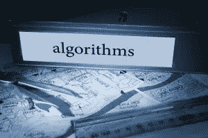

# Ruby 中的排序算法

> 原文：<https://www.sitepoint.com/sorting-algorithms-ruby/>



有时候，我觉得 Ruby 让我们太容易了。仅仅做`[1,18,4,72].sort`就给了我们一个很好的排序列表。但是 Ruby 实际上是做什么的呢？

理解排序算法的意义与排序的实际行为没有多大关系。相反，不同的算法是可以应用于大量问题的各种技术的很好的例子。在本文中，我们将看看这些算法和基本思想，以及用 Ruby 实现的方法。

## 问题是

在我们开始之前，让我们就我们试图解决的问题达成共识。我们算法的输入将是一个由整数(不一定是正数)组成的任意长度的数组。我们的算法应该返回一个按升序排序的数组版本。如果我们想要降序，我们可以反转得到的数组，或者稍微改变一下算法(例如使用的比较运算符)。

## 冒泡排序

让我们先来看一个非常简单(也相当慢)的排序算法，叫做“冒泡排序”。这个想法非常简单:遍历列表，将两个相邻的元素按降序排列。但是，这里有一个难题:我们必须重复遍历列表，直到不再有任何交换，这意味着列表已经排序。

Ruby 实现可以很容易地从手写的描述中编写出来:

```
def bubble_sort(array)
  n = array.length
  loop do
    swapped = false

    (n-1).times do |i|
      if array[i] > array[i+1]
        array[i], array[i+1] = array[i+1], array[i]
        swapped = true
      end
    end

    break if not swapped
  end

  array
end
```

我们维护一个名为`swapped`的变量，如果在通过数组的过程中进行了任何交换，这个变量就是真的。如果在遍历数组的最后，`swapped`是`false`(即没有执行交换)，我们就完成了，并返回一个排序列表。本质上，`swapped = true`是永久循环的终止条件。

我在一开始提到 BubbleSort 是一个相当慢的算法，但是我这样说到底是什么意思呢？BubbleSort 在缩放方面很糟糕，也就是说，让我们的输入大小稍微大一点会导致算法的运行时间大大增加。输入大小和关系到底是什么关系？嗯，让我们考虑一下。

对于 BubbleSort 来说，最糟糕的情况可能发生在输入数组为降序时，因为这意味着我们必须执行最大数量的交换。事实上，在最坏的情况下，如果我们在输入数组中有`n`个元素，我们必须执行\[ c * n^2 \]交换，对于某个正实常数`c`(即`c`不变而`n`变)。假设每次交换花费的时间不变(即执行一次交换所花费的时间不受输入大小的影响)，BubbleSort 的运行时间相对于输入大小成二次方增加。所以，我们可以说我们可以说 BubbleSort 是\[O(n^2)\],这相当于说运行时间的平方。

为了执行排序，我们还可以考虑内存的大小。因为排序是“就地”进行的，所以我们不需要分配任何额外的内存。因此，我们说 BubbleSort 的空间复杂度是\[O(1)\]即最多是常数。

## 合并排序

事实证明，在分类方面，我们可以做得更好。一种叫做“分而治之”的技术将原始问题转化为小问题的解决方案，然后将这些小问题组合在一起，形成最终的解决方案。在我们的例子中，这是问题陈述:

> 对长度为 n 的数组 A 排序

如果我们这样做呢:

> 将 A 的左半部分和 A 的右半部分排序，然后将它们合并。

我们实际上可以将每一半分成更多的一半(原始部分的四分之一)并递归继续。结果是，我们最终会到达一个大小为 1 的数组，它是自动排序的。然后，将所有的部分组合起来，得到等同于`A.sort`的结果。然而，合并过程有点复杂。

假设我们有两个有序数组，比如[1，3，5]和[2，4，6，7]，我们想把它们组合成一个有序数组。在这种情况下，应该这样做。看一下两个数组的第一个元素，将较小的一个放入 result 最终结果中。运行一次后，我们得到了最终结果:

```
[1]
```

重复这个过程，只是沿着数组移动，使下一个元素成为“第一个元素”。在这种情况下，将 3 作为[1，3，5]的“第一个元素”，并将其与[2，4，6，7]中的 2 进行比较。我们一直这样做，直到我们用完其中一个列表。此时，最终结果如下所示:

```
[1, 2, 3, 4, 5]
```

然后，只需推动第二个列表的其余部分，就可以得到一个合并的、排序良好的列表:

```
[1,2,3,4,5,6,7]
```

我们可以使用示例中描述的过程作为我们的“合并”或“组合”步骤。因此，这里有一个长度为`n`的数组`A`的 mergesort 的概要:

```
Mergesort(A):
1\. return A if n == 1
2\. left = left half of A
3\. right = right half of A
4\. sorted_left = Mergesort(left)
5\. sorted_right = Mergesort(right)
6\. return merge(sorted_left, sorted_right)
```

让我们来看看 Ruby 对它的翻译:

```
def mergesort(array)
  def merge(left_sorted, right_sorted)
    res = []
    l = 0
    r = 0

    loop do
      break if r >= right_sorted.length and l >= left_sorted.length

      if r >= right_sorted.length or (l < left_sorted.length and left_sorted[l] < right_sorted[r])
        res << left_sorted[l]
        l += 1
      else
        res << right_sorted[r]
        r += 1
      end
    end

    return res
  end

  def mergesort_iter(array_sliced)
    return array_sliced if array_sliced.length <= 1

    mid = array_sliced.length/2 - 1
    left_sorted = mergesort_iter(array_sliced[0..mid])
    right_sorted = mergesort_iter(array_sliced[mid+1..-1])
    return merge(left_sorted, right_sorted)
  end

  mergesort_iter(array)
end
```

这里感兴趣的主要过程是`merge`。本质上，沿着两半移动，同时将较小的值加到`res`的末端，直到我们用完其中一半。在这一点上，简单地堆上其他列表的剩余部分。这是给你的合并排序！

## 有什么意义？

那么，实现一个比传统的 BubbleSort 复杂得多的算法有什么好处呢？一切都在数字里。

在不深入细节的情况下(它们涉及到求解一个递归)，我们会说 mergesort 是\[ O(n log_2{n}) \]事实证明这比\[O(n^2)\好得多]让我们做另一个简化。假设 MergeSort 使用\[n /log_2(n)\]操作，BubbleSort 使用\[n^2\]操作对长度为`n`的数组进行排序。如果我们设置`n = 1,000,000`，则 MergeSort 大约需要\[6 \cdot 10^7\]操作，而 BubbleSort 在\[1 \cdot 10 ^ {12}\]操作上要差 17，000 倍。

## 各个击破

MergeSort 向我们展示了一个不错的策略:分而治之。事实证明，有很多问题可以通过将它们分解成子问题，然后组合得到的“子解”来解决。确定可以分而治之的情况需要技巧和实践，但是 MergeSort 是一个很好的例子，可以作为跳板。

要点是:如果你有一些琐碎的基本情况(在 MergeSort 中，长度为 1 的列表),或者以某种方式能够将你的问题分解到这个基本情况，并有一些想法来组合解决方案，分而治之可能是一个探索的途径。

## 浪费记忆就像没有明天

但是等等，我们可以做得比 MergeSort 更好！但是，这一次我们将不得不花费，嗯，多一点内存。我们就直奔红宝石:

```
def mark_sort(array)
  array_max = array.max
  array_min = array.min
  markings = [0] * (array_max - array_min + 1)
  array.each do |a|
    markings[a - array_min] += 1
  end

  res = []
  markings.length.times do |i|
    markings[i].times do
      res << i + array_min;
    end
  end

  res
end

p mark_sort([3,2,19,18,17])
```

我们有一个名为`markings`的数组，代表某个数字在`array`中出现的次数。`markings`的每个索引对应于`array.max`和`array.min`范围内的一个数字，包括 T3 和。我们用 0 初始化`markings`,遍历数组，当我们看到数组中出现一个数字时，就增加这个数字的标记。最后，只要打印出看到正确次数的数字。我们对数组进行了几次遍历，但是我们从来没有进行过“一次遍历中的一次遍历”，即嵌套循环。因此，我们的算法对长度为`n`的数组中的某个常数`c`执行\[ c * n \]运算

我们可以说它是\[O(n)\]换句话说，速度极快。但是，它并不总是有用的，因为我们必须使用一个潜在的巨大的内存块。例如，如果给我们一个`[1,1000000]`作为输入，我们必须分配一百万个元素数组！但是，如果我们知道我们的范围会很小或者有很多内存要浪费，这个算法就可以派上用场了。

## 包装它

我希望你喜欢这个 Ruby 排序算法之旅。请在下面的评论中提出问题！

## 分享这篇文章