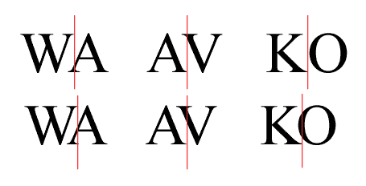
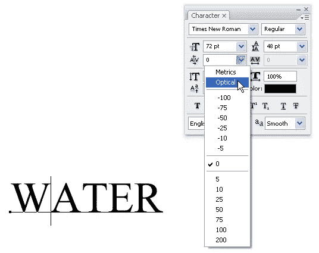
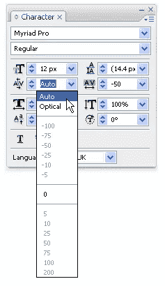
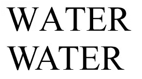
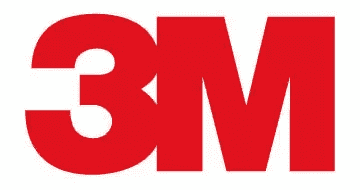

# 隔开(第二部分):印刷术中的字距调整

> 原文：<https://www.sitepoint.com/spaced-out-part-2-kerning-in-typography/>

上周，我们看了一下[跟踪](https://www.sitepoint.com/spaced-out-tracking-in-typography)，这是字母之间的空间量，以及它如何成为字体设计的重要部分。今天，我们来看一个叫做**字距微调**的亲密跟踪伙伴。字距是整体字母间距，而字距是成对字母之间的选择性字母间距。

某些字母放在一起会产生尴尬的空间。我们使用字距调整来增加或减少间距，以使文本更具可读性和视觉吸引力。这里有几个字母不能很好地放在一起的例子。

这些字母之间留有很大的空隙。通过成对调整字母间距，我们可以减少字母之间的间距。

**Photoshop 和 Illustrator 中的字距调整**

Photoshop 和 Illustrator 都允许您使用度量(也称为自动字距调整)或视觉字距调整来调整字距。应用字距调整；

1.在 Photoshop 或 Illustrator 中打开字符调板。
2。选择文字工具，并在要调整字距的字母之间单击。
3。在下拉菜单的字距字段中选择公制、光学或数值。如果愿意，您可以在此字段中键入自己的值。

*Illustrator 字符调板中的自动字距调整*

**光学字距调整**根据相邻字符的形状调整它们之间的间距。

**度量字距调整**使用字距对。许多常用字距字符对(如 LA、p、To、Tr、Ta、Tu、Te、Ty、WA、Wa、We、Wo、Ya 和 Yo)的字距信息内置于高质量字体中。一些高质量的字体可以定义多达 1000 个不同的字距对，自动字距调整无需干预。

当文本设置为全大写时，最常需要字距调整。看看下面的例子。顶部的文本是没有字距调整的默认文本。字母 W 和 A 之间以及 A 和 t 之间的下方文本应用了光学字距调整。底部的文本看起来更好。

大多数情况下，您会试图使字母之间的间距看起来均匀，但是也有极端的字距调整或故意过度字距调整会产生特殊效果，使字符间距紧密或重叠。印刷徽标在很大程度上依赖于良好的跟踪和字距调整。下面是一些使用极端字距调整的徽标示例:

你还见过其他人吗？

## 分享这篇文章