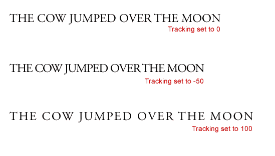
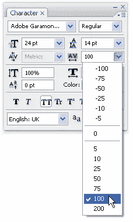
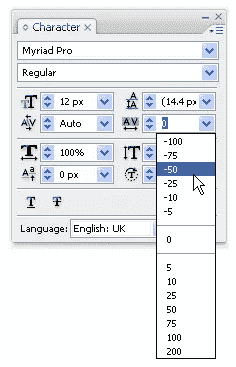

# 间隔:排版中的跟踪

> 原文：<https://www.sitepoint.com/spaced-out-tracking-in-typography/>

当我们阅读文本时，我们阅读短语。如果字母和单词总是离得太近或太远，我们的阅读模式就会被打乱。

我们可以使用**跟踪**和**字距调整—**这两个经常混淆的术语来调整字母之间的间距。今天我们来看跟踪。

**跟踪** 跟踪(也称为字母间距)是对字母组和整个文本块的间距进行调整。它可以使文本看起来更轻盈或更密集，并影响文本的外观和可读性。跟踪可以一次应用于一小部分文本或整个块。

例如[脚本字体](https://www.sitepoint.com/the-script-typeface/)通常需要紧密的字母间距，因为字母应该连接，但它们也需要单词之间的额外空间，否则它们键入的内容难以阅读。

在上面的示例中，当字距设置为 100 时，字母之间的间距太大，当字距设置为–50 时，间距太窄，使得文本难以阅读。当设置为 0 时，字母正确地相互接触。这并不意味着所有跟踪类型都应该设置为 0。使用 Adobe Garamond 查看相同的跟踪设置。

在本例中，文字在 0、–50 和+100 处跟踪清晰可见。每种字体都不一样，你可以通过调整字母之间的间距来获得一些不错的效果。

**在 Photoshop 中追踪&插画**

要在 Photoshop 和 Illustrator 中更改文字的跟踪，请打开字符调板。在 Photoshop 中选择**窗口>人物**，在 Illustrator 中选择**窗口>类型>人物**(或者 Ctrl + T / Cmd + T)。在跟踪字段中，您可以选择一个预设值，也可以简单地键入您自己的数字，或者在跟踪图标的顶部左右拖动光标。减号减少字母之间的间距。

 

*Photoshop(左)和 Illustrator 字符调色板。*

 ***CSS 中的跟踪** 要调整你的网页文字上的跟踪，你可以使用字母间距规则。下面我给 H1 标签中的一些文本应用了一种样式，并改变了字母间距。

正如你所看到的，调整跟踪可以完全改变标题的外观和感觉。没有涵盖每种字体跟踪的规则。最好的指导方针是用你的眼睛。一般来说，如果字母看起来靠得太近，那就可能是这样。大量的实践和实验是你真正学会在设计中使用跟踪的方法。

下周我们将看看字距调整以及如何和在哪里应用它。* 

## *分享这篇文章*