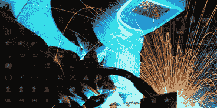
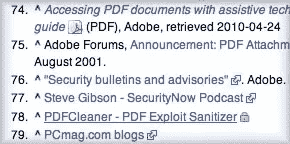

# 我们能做更好的链接吗？

> 原文：<https://www.sitepoint.com/sparkicons-can-we-make-better-links/>

大约在去年的这个时候，马克·博尔顿提出了一种新的在线交流链接内容信息的方式

他将自己的想法命名为 sparkicons，建立在爱德华·塔夫特对迷你图的描述之上，并指出了一些内容丰富、链接密集的大型网站的例子:维基百科和英国广播公司。他也创造了一些自己的例子。

> Mark Boulton:我将 Sparkicon 定义为一个小的内嵌图标，带有额外的链接元数据来描述内容和/或用户点击链接时的行为。

现在，一年过去了，我想看看这些在今天的网络上是如何工作的会很有趣。

维基百科上的火花图标

一年中发生了很多事情。例如，长篇内容在网上变得越来越受欢迎，所以这个想法有越来越多的机会进行实验。另一方面，我们看到的内容格式也在发展，这将增加 sparkicon 使用的复杂性。

从我们今天的角度来看，火花图标在文本中能有多好？它们会让用户感到困惑，还是补充整体信息？最终的底线是:为什么我们没有看到它们被更多的使用？

## 交流意义

博尔顿的想法的潜在目的是传达更多关于链接内容的信息，而不是仅仅通过文本就能合理传达的信息。

很高兴地说，好的链接文本应该能够告诉你你需要知道的一切，以衡量你是否想点击一个链接。但是看一看博尔顿创造的火花图标的细节，就会发现这是多么的不可能。

举例来说，如果你想坚持雅各布·尼尔森(Jakob Nielsen)旧的但仍然有效的建议，即每个文本链接最多四到五个单词(这是我在本书中遇到的)，那么显示一个文本链接导致一个 1 分 32 秒时长的视频是不可能的。

即使你决定包含所有的信息，包含这些信息可能会比这些小图标更进一步降低用户体验。

但这是决定性因素:它们必然很小。他们需要这样，原因有二:

1.  以免过多地扰乱阅读的流程
2.  表明它们传达的信息比文本本身传达的信息次要。

但这给有视觉障碍的用户带来了问题(即使是轻微的障碍——我必须非常努力地集中精力，才能算出博尔顿提供的“哑猫”视频时长 sparkicon 示例中的数字)。

所以火花图标真的只对那些有远见的人有用。我会更进一步说，当链接没有指明媒体格式时，它们只对那些有伟大远见的人有用。

在显示文章链接的 sparkicon 示例中，链接文本传达了链接媒体(文章)的格式，因此图标本身实际上是该传达的两倍。在这种情况下，可能会有很多内容创建者删除链接文本的格式，而不是删除 sparkicon。

我认为这将降低用户的整体体验。它肯定会优先考虑有远见的用户，而不是没有远见的用户。在大多数情况下，如果可能的话，我认为文本比依靠图标来传达链接的媒体更好。为什么？

*   文本更容易扫描。
*   它更有可能脱离上下文(例如，当从一个链接浏览到另一个链接以找到你想要的链接时)。
*   已经开发了辅助技术，以确保那些有视觉障碍的人仍然可以使用文本。

## 标准的视觉词汇

我感觉为 sparkicons 建立一个标准的视觉词汇表对于他们对用户体验的贡献是至关重要的。

博尔顿在他的文章中给出了一些很好的例子，但即使如此，它们也可能是误导性的。他在文章示例中给出的评论图标让我很好奇。是链接到文章本身，还是带我去评论？它是否表明文章的受欢迎程度是对我点击的一种鼓励？难道我不想在评论前看链接的文章吗？

其他类型的媒体——视频、图像——也会收到评论，所以这个图标可能会与包含单词“视频”或“图像”的链接文本配对。类似地，文章 sparkicon 可以显示链接文章的阅读时间。

如果没有一个标准的视觉词汇来描述交流的信息和它的使用情况，我认为事情会很快失控。而且，如果不是图标本身，可能会大大降低阅读体验。但是网络是一个相当保守的地方，主要趋势由大众而不是前卫的创新者来主导。

我们不仅仅需要创建一个 sparkicons 的标准词汇表来让它们工作；他们还需要被用户立即理解(并最终接受)。

## 单词呢？

视觉词汇是一回事；创建一个需要在文本中无止境的变化中始终如一地工作的工具是另一回事。

我们是否应该创建一些不管文本如何都可以应用和工作的火花图标？还是只有在文本本身没有传达某些信息时才使用它们？我认为第一个任务会是一个相当大的要求，而第二个可能会在某种程度上挫败 sparkicons 的目的。任何与用户打交道的人都知道，一致性是关键。

博尔顿指出，sparkicons 对于那些想在轻触之前知道他们正在访问什么媒体(以及潜在的持续时间，如果是视频的话)的移动用户来说有着特殊的潜力。但是，至少第一个问题可以通过精心构建的链接文本来解决。

他还提供了两个用例作为例子，都是链接内容的列表。在这些情况下，链接文本反映了链接媒体的标题，因此 sparkicon 的应用程序可以帮助用户了解如果他们点击这个链接或那个链接，他们会得到什么。

但在普通的散文中，包括长篇内容，链接可能更稀疏，可能更有分量(也就是说，它们不只是给你接下来要看什么的选项，而是实际上增加了你正在阅读的文章的叙述)，图标可能没有什么意义。

当然，这并不意味着他们在网上没有强大的潜力和未来；这仅仅表明它们可能有特定的用途。你怎么想呢?我很想在评论中听到你的想法。

## 分享这篇文章