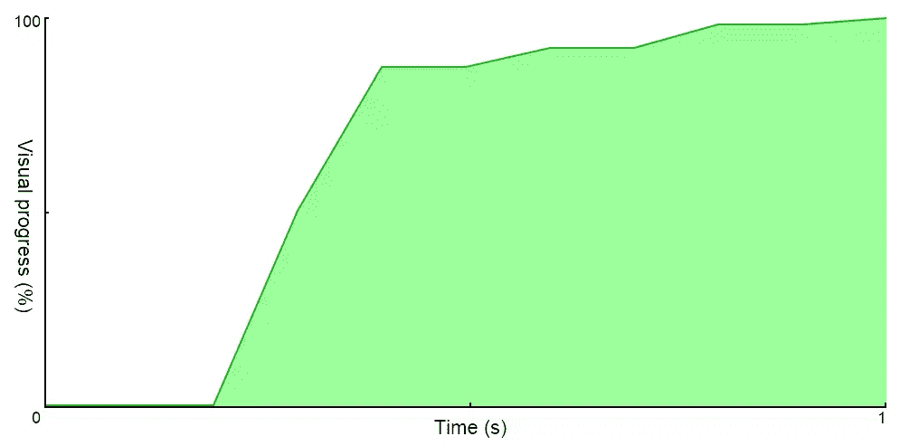
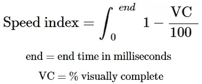
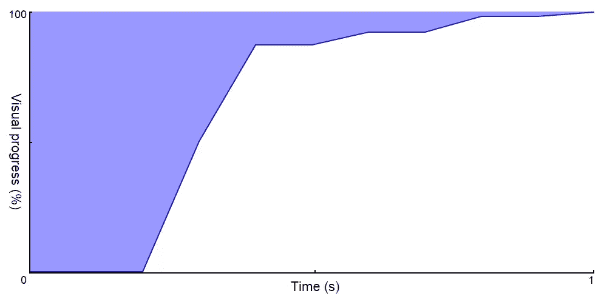

# 速度指数:用不同的方式测量页面加载时间

> 原文：<https://www.sitepoint.com/speed-index-measuring-page-load-time-different-way/>

很长一段时间以来，测量 web 性能都是为了最小化各种浏览器事件触发的时间，例如 [`window.onload`](https://developer.mozilla.org/en-US/docs/Web/API/GlobalEventHandlers.onload) 或 [`loadEventEnd`](https://www.w3.org/TR/navigation-timing/#dom-performancetiming-loadend) 导航计时。但是这些计时从来没有真正地捕捉到*实际的*用户体验。这就是速度指数的用武之地。

速度指数是一种相对较新的衡量网页性能的方法，最初是为 WebPagetest.org 的 T2 开发的。它的工作原理是测量随着时间的推移，折叠上方的*内容有多少在视觉上是完整的，直到 100%完整(最初加载时用户可以看到的部分)。*

速度指数之所以是一个如此好的指标，是因为它在衡量用户如何感知页面性能方面做得更好。以我的博客为例，我花了很长时间对它进行优化，以尽可能降低速度指数，然而由于 [MathJAX 的](http://www.mathjax.org/)大量请求和它所做的工作，大多数页面实际上需要 2-3 秒才能完全加载。除非有实际的数学加价，否则这些额外的工作将被速度指数完全忽略。从用户感知的角度来看，忽略这一点是有意义的，因为当用户向下滚动到使用数学的页面部分时，它很可能已经加载了。速度指数的优化通常也会改善移动体验，因为它们关注的是尽可能快地获得可用的东西。

## 计算速度指数

为了测量页面[的速度指数，需要对页面负载](https://www.sitepoint.com/page-speed-soon-visitors-see-content/)进行视频捕获。将每个帧与最终加载的帧进行比较，以确定它们的完成百分比。


绘制一个页面随时间变化的视觉进度会得到一个类似这样的图表:



曲线下的区域代表视觉上的完整进度，但是因为它是无界的，所以它不是一个很好的测量分数，因为它会不断增加。相反，速度指数是在曲线上方的区域*，当页面变得更快时，该区域将接近 0。*





## 测量视觉完整性

测量视觉进步的简单方法是将每个位置的像素与完整帧中的相应像素进行比较。不过，这也有一些问题，特别是在新元素触发布局时会移动其他元素。使用这种方法，如果照片的位置偏离最终位置一个像素，就会将整个扇区标记为不完整。

WebPagetest 通过获取颜色直方图并计算与最终帧的差异来测量视觉进度。虽然这本身也有问题，但它解决了上述问题。

### 每秒帧数

WebPagetest 目前每秒捕捉 10 帧，但这在未来可能会改变。测量的帧数越多，结果就越准确。

### 绘画事件

还有另一种更新的计算视觉进度的方法，它使用通过[远程调试协议](https://developer.chrome.com/devtools/docs/debugger-protocol)发出的浏览器绘制事件。这消除了创建页面加载的视频记录的需要，该视频记录可能潜在地负面影响页面加载本身。这种方法只适用于 Chromium 浏览器，因此不能应用于所有浏览器。

## 遥感勘测

Chromium 团队开发了一个用 Python 编写的测试框架，名为[遥测](http://www.chromium.org/developers/telemetry)，负责在 [Chrome 性能仪表板](https://chromeperf.appspot.com/)上生成所有结果。它还可以用来在你选择的 URL 上运行页面负载测试，以生成速度指数和其他有价值的指标，如[导航计时](https://www.w3.org/TR/navigation-timing/)。

遥测技术与 Chromium 驱动的浏览器一起工作，并逐渐增加对实现 [WebDriver API](https://www.w3.org/TR/webdriver/) 的浏览器的支持(参见 [CR 实现 IE 支持](https://codereview.chromium.org/20672002/))。

### 设置铬

获得 Chromium 源代码的说明可以在 Chromium 网站上找到，你不需要运行`gclient sync`来同步子模块或构建项目，因为我们只对遥测感兴趣，这些都包含在主存储库中。

### 创建遥测页面集

遥测技术通过在*页面集*上运行*测量*来工作。度量决定了页面如何运行以及收集什么*度量*，页面集是要运行的页面的集合以及运行它们的配置。

您需要在`./tools/perf/page_sets/`创建一个包含您感兴趣的 URL 的页面集。下面是一个测量我博客上两个 URL 的例子:

```
from telemetry.page import page as page_module
from telemetry.page import page_set as page_set_module

class GrowingWithTheWebPageSet(page_set_module.PageSet):
  def __init__(self):
    super(GrowingWithTheWebPageSet, self).__init__(
        # Forces Math.random to use the same seed to improve result consistency
        make_javascript_deterministic=True,
        # Sets the browser to use the generic desktop user agent
        user_agent_type='desktop')

    urls = [
        'http://www.growingwiththeweb.com',
        'http://www.growingwiththeweb.com/2014/06/fibonacci-heap.html']

    # Add the pages to the page set
    for url in urls:
      self.AddPage(page_module.Page(page_set=self, url=url))
```

### 运行遥测

下载完存储库后，以下命令将运行页面集:

```
# arguments
# use the page_cycler measurement
# use our custom page set
# use the system browser
# repeat the pageset 5 times
# allow testing of live sites (not the default)
# tell page_cycler to record and report speed index

./tools/perf/run_measurement \
  page_cycler \
  ./tools/perf/page_sets/growing_with_the_web.py \
  --browser=system \
  --pageset-repeat=5 \
  --use-live-sites \
  --report-speed-index
```

### 结果

这将在您的页面集上运行测量，并报告各种指标，以及包含这次运行和以前运行结果的 HTML 文件。下面是运行结果的一个片段(warm 表示站点资源被缓存):

```
RESULT cold_speed_index: http___www.growingwiththeweb.com= [1062,799,666] ms
Avg cold_speed_index: 842.333333ms
Sd  cold_speed_index: 201.525019ms
RESULT cold_speed_index: http___www.growingwiththeweb.com_2014_06_fibonacci-heap.html= [626,794,656] ms
Avg cold_speed_index: 692.000000ms
Sd  cold_speed_index: 89.599107ms
...
RESULT warm_speed_index: http___www.growingwiththeweb.com= [422,456] ms
Avg warm_speed_index: 439.000000ms
Sd  warm_speed_index: 24.041631ms
RESULT warm_speed_index: http___www.growingwiththeweb.com_2014_06_fibonacci-heap.html= [462,500] ms
Avg warm_speed_index: 481.000000ms
Sd  warm_speed_index: 26.870058ms
```

这个框架非常强大，提供了网络速度模拟和记录页面集等功能，以便以后重放，从而完全消除网络噪音。在[官方网站](http://www.chromium.org/developers/telemetry)或通过运行`./tools/perf/run_measurement help list`探索更多功能。

## 多快才算够快？

谷歌 Chrome 开发者倡导者保罗·爱尔兰(Paul Irish)，[建议](http://timkadlec.com/2014/01/fast-enough/#comment-1200946500)将速度指数控制在 1000 以下，并在页面的前 14kb 中提供超过两倍的内容。

## 包裹

我已经介绍了速度指数和可以用来测量它们的工具。我建议你从今天开始通过查看[网页测试](http://www.webpagetest.org/)和[遥测](http://www.chromium.org/developers/telemetry)来跟踪你网站的速度指数和其他重要指标。

## 分享这篇文章