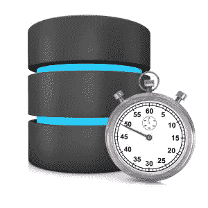
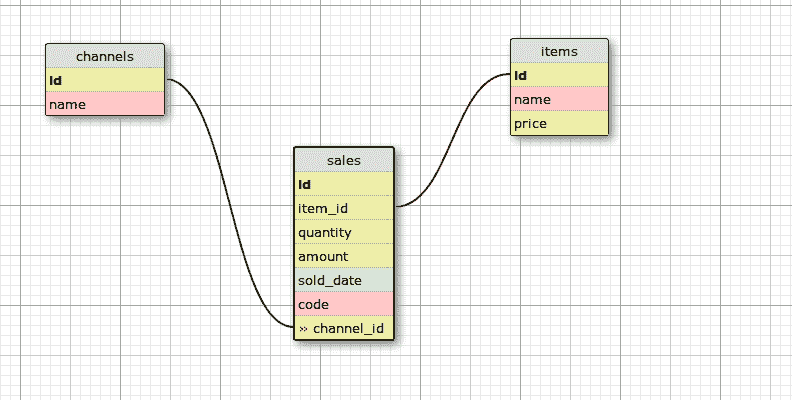

# 使用 PostgreSQL 和 Rails 上的物化视图加速

> 原文：<https://www.sitepoint.com/speed-up-with-materialized-views-on-postgresql-and-rails/>



今天我想谈谈如何在 PostgreSQL 中实现物化视图，并在 Ruby on Rails 应用程序中利用它们。

[PostgreSQL](http://postgresql.org/) ，俗称 Postgres，是一个多平台、开源的 SQL 数据库系统。它是世界上最流行的数据库系统之一，也是第二大使用的开源数据库。Postgres 的开发是在 PostgreSQL 全球开发小组下进行的。如果你从未用过 Postgres，我建议你在下一个项目中试试，它真的很酷。

本教程分为以下三个部分:

1.  什么是数据库视图。
2.  什么是物化视图。
3.  如何向 Rails 应用程序添加物化视图？

## 什么是数据库视图？

视图基本上是针对底层表的一组存储的查询。每当调用一个视图时，它将对底层数据执行一系列预存查询，返回结果数据。与表不同，它不占用物理空间，而是从内存中存储和访问视图的模式。

当构建视图的基础数据发生变化时，它会反映在视图的后续调用中。

视图提供的一些优势有:数据抽象——视图可以用来从底层表中抽象出一组数据。
2。优化——一个视图，就像任何查询一样，经过一个优化器，该优化器根据对视图结果执行的操作尽可能地改进它。
3。简单性——如上所述，视图可以抽象出数据，同时简化对多个表的查询。视图通常由表之间的一个或多个连接组成，使得这些连接的数据看起来像一个简单的表。

几乎所有主要的数据库提供商都有视图功能，这是查询某些 NoSQL 数据库的唯一方式。

### 什么是物化视图？

物化视图也称为“matview”，是 Oracle 中首次引入的一种数据库视图形式。此后，它被许多主要数据库采用。

来自维基百科，

> 物化视图是包含查询结果的数据库对象。

基本上，物化视图类似于数据库视图，除了它被物理地存储在磁盘上并被手动更新。matview 将查询结果存储到自己的类似表格的结构中，可以从该结构中查询数据。不能添加或删除行，但在其余时间，它的行为就像一个实际的表。

此外，当物化视图背后的数据发生变化时，必须手动刷新 matview，然后新数据才会包含在存储的 matview 中。这既是积极的，也是消极的。存储生成实体化视图的查询结果使其可以像表一样工作。查询速度更快，matview 本身可以被索引。然而，由于组成结果的数据基本上是快照，所以它可能是陈旧的，您必须知道何时刷新数据。

在撰写本文时，matviews 在 [Oracle DB](http://docs.oracle.com/cd/B10501_01/server.920/a96567/repmview.htm) 、 [PostgreSQL](http://www.postgresql.org/docs/9.3/static/rules-materializedviews.html) 、 [Sybase](http://infocenter.sybase.com/help/index.jsp?topic=/com.sybase.infocenter.dc00269.1571/doc/html/bde1279401694270.html) 、 [IBM DB2](http://www.ibm.com/developerworks/data/library/techarticle/dm-0509melnyk/) 和[微软 SQL Server](https://msdn.microsoft.com/library/ms191432.aspx) 中是本地可用的。遗憾的是，MySQL 不提供对 matviews 的原生支持，但是有开源的替代方案。

#### PostgreSQL 中的 Matviews

物化视图是在 Postgres 版本中引入的。在 9.4 版本中，引入了并发刷新 matview 的选项(也就是说，不锁定视图)。

在 Postgres 中创建 matview 的语法类似于创建表格:

```
CREATE MATERIALIZED VIEW ex_matview AS SELECT col1, col2 FROM mytable WHERE col3 = condition; 
```

### 向 Rails 应用程序添加物化视图

对于我们这个简单的例子，我已经创建了一个 Rails 应用程序，并在应用程序使用的数据库中生成了 1M 的行。该代码可在 [Github](https://github.com/sitepoint-editors/matviewdemo) 上获得。该应用程序有三个名为`channel`、`item`和`sales`的表格，模拟零售商的销售数据。示例应用程序的模式如下:



假设我们有一个仪表板页面，提供去年的销售信息，以及以下详细信息:

1)渠道在每个项目基础上完成的销售额，我们可以这样查询:

```
Sale.joins(:channel).joins(:item).where('channels.name = ?', 'web').group('items.name').sum(:amount) 
```

2)每个渠道的总销售额:

```
Sale.joins(:channel).group('channels.name').sum(:amount) 
```

3)每天的销售额:

```
Sale.group("DATE_TRUNC('day', sold_date)").sum(:amount) 
```

这些查询并不复杂，但即使经过多次优化，它们也很昂贵。此外，数据可能会越来越多。这是物化视图的一个很好的候选，因为数据不必是实时的，我们只是抽象了数据的一个子集。

首先，让我们创建一个迁移:

```
rails g migration CreateSalesMatview 
```

将下列行添加到迁移文件中: