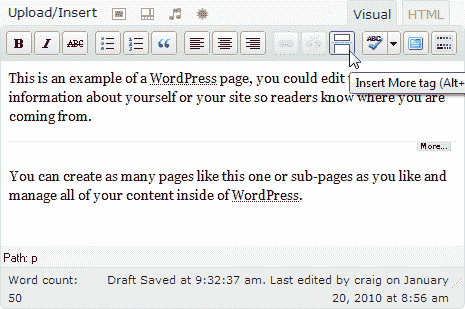

# 如何将 WordPress 内容分成两栏或多栏

> 原文：<https://www.sitepoint.com/split-wordpress-content-into-multiple-sections/>

WordPress 是一个伟大的 <acronym title="Content Management System">CMS</acronym> ，但是在你的主题中实现一些功能需要一点横向思维。页面或文章的内容通常由主题代码使用一个函数调用输出:

`the_content(*args*);`

但是，如果您需要将内容分成两个或更多的块，该怎么办呢？如果你的主题需要在页面上有多个栏目或部分，这可能是必要的。WordPress 提供了一个`get_the_content()`函数以 PHP 变量的形式返回内容，但是如何确定在哪里进行分割呢？网上有一些解决方案，但大多数都涉及以下两种情况之一:

1.  在 HTML 标签处拆分内容，如`h2`标题。不幸的是，这要求内容作者了解一点 HTML，而且它不是很通用——你不能允许一列中有两个标题。
2.  使用 WordPress 短代码。这更加灵活，但是它仍然让内容编辑器有责任记住和使用正确的代码。

标签可能会提供一个更好的解决方案。它通常用于将一篇长文章分成两页或更多页，但不是所有的主题都使用这种工具，它默认只适用于 WordPress 帖子(不是页面)。使用`<!--more-->`标签有几个好处:

*   “更多”工具栏按钮在可视和 HTML 编辑窗格中都可用。
*   分部可以放在内容的任何地方。
*   非技术用户很容易理解内容将如何拆分。



要分割你的内容，找到你的主题文件夹(wp-content/themes)，编辑或创建一个**functions.php**文件，并在一个<中添加以下功能？php …？>屏蔽:

```
 // split content at the more tag and return an array
function split_content() {

	global $more;
	$more = true;
	$content = preg_split('/<span id="more-d+"></span>/i', get_the_content('more'));
	for($c = 0, $csize = count($content); $c < $csize; $c++) {
		$content[$c] = apply_filters('the_content', $content[$c]);
	}
	return $content;

} 
```

你现在需要在 [WordPress 循环](http://codex.wordpress.org/The_Loop)中找到调用`the_content()`的主题文件。你应该在**single.php**和**page.php**找到它，因为它们分别用于显示单个帖子和页面。它也可以在**index.php**、**archive.php**和**search.php**中找到，然而，这些通常显示不止一篇文章，所以要小心如何处理多个内容块。

找到相关代码后，注释掉`the_content()`并调用`split_content()`函数。它以数组的形式返回内容；每个元素包含一个在`<!--more-->`标签处分割的内容块，例如$content[0]，$content[1]，$content[2] …等等。然后可以根据需要输出 HTML，例如

```
 < ?php
// original content display
// the_content('<p>Read the rest of this page &raquo;</p>');

// split content into array
$content = split_content();

// output first content section in column1
echo '<div id="column1">', array_shift($content), '</div>';

// output remaining content sections in column2
echo '<div id="column2">', implode($content), '</div>';
?> 
```

希望你觉得有用。

## 分享这篇文章