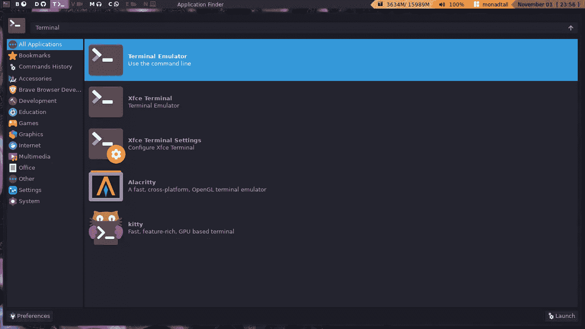
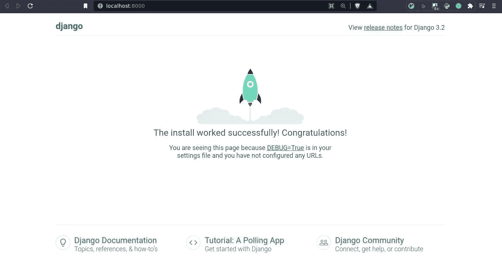

# 如何快速启动 Django 项目和 Django App

> 原文：<https://www.sitepoint.com/start-django-project-app/>

在本教程中，我们将了解 Django 项目和 Django 应用程序之间的区别，以及如何开始一个新的 Django 项目。

Django 是构建 web 应用程序的首选 Python web 框架。这是一个成熟的、功能全面的、灵活的开源框架，让你可以构建任何东西，从简单的 CRUD 应用程序到更复杂的多应用程序项目，如照片共享应用程序。

## 要求

建立 Django 项目不需要以前的知识。但是 Django 是一个 Python 框架，所以要使用它，你应该有使用 Python 的坚实基础。

开始之前，请确保安装了 Python 3.6 或更高版本的终端或命令提示符。

大多数 macOS 和 Linux 系统默认安装了 Python 3，但如果你使用 Windows，你需要下载并安装 [Python](https://www.python.org/downloads/) 。你可以从[官方 Python 网站](https://docs.python.org/3/using/windows.html)跟随这个指南。

您可以通过打开操作系统的应用程序查找器并搜索*终端*，或者在 Windows 上搜索 *cmd* 来打开终端。



一旦设置好终端，就该确认您的 Python 版本了。为此，请键入以下命令:

```
python --version

Python 3.9.7 # My result 
```

如果没有得到 Python 3.x 格式的结果，不要惊慌。有两种选择:

*   如果`python --version`返回一个 Python 2.x 版本，那么您需要将`python3`与本教程一起使用。这通常发生在一些 macOS 系统，以及一些 [Linux 发行版](https://www.sitepoint.com/anonymous-linux-distros/)如 Ubuntu 上。尝试运行以下命令:

    ```
    python3 --version

    Python 3.9.7 # Again, my result 
    ```

*   如果你得到一个`Unknown command`错误，尝试运行`python3`，仍然得到另一个错误，你需要从官方网站下载并安装 Python。

现在您已经知道了在终端中运行什么 Python 命令，让我们深入到 Django 项目中。

## 什么是 Django 项目？

Django 项目是使 web 应用程序工作所需的 Python 包。它包含了构建网站后端(服务器端开发，用户看不到的)所需的一切。Django 项目的正常功能决定了如何与数据库交互、认证、如何检索数据等等。

你也可以把它想象成一个设置的集合，以及名为 apps 的小 Python 模块。我们稍后会谈到它们，但作为一个前概念，应用程序是解决应用程序特定任务的另一组 Python 文件。

通过本文，您将了解 Django 项目的复杂结构。但是从一开始我想让你知道 Django 项目可以缩小到一个文件，类似于一个 [Flask](https://www.sitepoint.com/flask-masses/) 项目。

这方面的一个快速演示就是 [Minimal Django](https://github.com/rnevius/minimal-django) 项目。这是一个有 23 行代码的文件，它允许我们用 Django“Hello，World！”项目到生活:

```
import sys

from django.conf import settings
from django.urls import path
from django.core.management import execute_from_command_line
from django.http import HttpResponse

settings.configure(
    DEBUG=True,
    ROOT_URLCONF=sys.modules[__name__],
)

def index(request):
    return HttpResponse('<h1>A minimal Django response!</h1>')

urlpatterns = [
    path(r'', index),
]

if __name__ == '__main__':
    execute_from_command_line(sys.argv) 
```

现在，Django 项目可以走得更远。Instagram 就是一个很好的例子，它有数千个 Django 端点，并且仍然使用这个框架来实现关键功能。

## 如何建立 Django 项目

如果下面的一些命令看起来很复杂，不要太担心。在你创建了几个项目之后，你会对它们了如指掌。

首先你要知道 Django 是一个外挂包。换句话说，它不是 Python 内置的，所以您需要用 PIP 安装它。

PIP 是 Python 的一个包管理器，一个允许你从 [Python 包索引](https://pypi.org/) (PyPI)安装 Python 包的工具。

现在，在安装实际的 Python 包之前，您需要创建一个虚拟环境。为您构建的每个 Django 项目创建一个虚拟环境是一个很好的实践，这样您就可以跟踪依赖关系。

也许你在 Django 2.6 项目中的代码不能在 Django 3.0 中使用。虚拟环境让您对每个项目都有特定的要求。

您可以用下面的命令创建一个名为`.venv`(或者任何您想要的名字)的虚拟环境:

```
python -m venv .venv 
```

现在，如果您列出当前目录中的文件，您会看到一个名为`.venv`的新文件夹，其中同时包含独立的 Python 二进制文件:

```
$ ls -lah .venv/
Permissions Size User   Date Modified Name
drwxr-xr-x     - daniel 10 nov 23:13  .
drwxr-xr-x     - daniel 10 nov 23:13  ..
drwxr-xr-x     - daniel 10 nov 23:13  bin
drwxr-xr-x     - daniel 10 nov 23:13  include
drwxr-xr-x     - daniel 10 nov 23:13  lib
lrwxrwxrwx     3 daniel 10 nov 23:13  lib64 -> lib
.rw-r--r--    69 daniel 10 nov 23:13  pyvenv.cfg 
```

要激活您的虚拟环境，您需要使用以下命令激活它:

```
source .venv/bin/activate 
```

这只适用于 bash shells(在 macOS 和 Linux 上可用)。如果您使用的是不同的 shell，可以看看下面的激活`venv`表:

| 平台 | 壳 | 激活虚拟环境的命令 |
| --- | --- | --- |
| 可移植性操作系统接口 | bash/zsh | $ source。venv >/bin/激活 |
|  | 鱼 | $ source。venv>/bin/activate.fish |
|  | csh/tcsh | $ source。venv>/bin/activate.csh |
|  | PowerShell 核心 | $ .venv/bin/Activate.ps1 |
| Windows 操作系统 | cmd.exe | C:\ >。venv\Scripts\activate.bat |
|  | PowerShell | PS C:\ >。venv\Scripts\Activate.ps1 |

检查 shell 是否被激活的一种方法是查看提示符的变化。在我的情况下，我看到的是下图。


现在，安装 Django 包。您可以安装 Django 的最新版本或特定版本:

```
pip install django # Latest version
pip install django==2.2 # Specific version 
```

### 开始项目

一旦安装了 Django，要启动一个新项目，可以调用 [django-admin](https://docs.djangoproject.com/en/dev/ref/django-admin/) 命令行实用程序并运行:

```
django-admin startproject <project_name> 
```

值得一提的是，有些名字是为 Django 保留的— `django`或`django-admin`。如果您遇到错误，请不要担心。请尝试使用不同的项目名称:

```
django-admin startproject django
# CommandError: 'django' conflicts with the name of an existing Python module and cannot be used as a project name. Please try another name.
django-admin startproject django-admin
# CommandError: 'django-admin' is not a valid project name. Please make sure the name is a valid identifier. 
```

一种常见的做法是将您的项目命名为`config`，这有一些好处。首先，它是一个您可以在所有项目中保持一致的名称，其次，通常“项目”文件夹只存储与配置相关的文件。你可以在官方 [Django 论坛](https://forum.djangoproject.com/t/project-naming-conventions/339)上了解更多信息:

```
django-admin startproject config 
```

### Django 项目结构

一旦您启动了一个 Django 项目，您将看到一个新文件夹，该文件夹以您选择的项目的名称命名，其结构如下所示:

```
.
├── config
│   ├── config
│   │   ├── asgi.py
│   │   ├── __init__.py
│   │   ├── settings.py
│   │   ├── urls.py
│   │   └── wsgi.py
│   └── manage.py
└── .venv 
```

让我们深入分析每一部分:

*   `config/`是项目的外部文件夹。这对 Django 来说无关紧要，所以你实际上可以把它改名为任何你想要的名字。
*   `config/config/`是实际的 Django 项目文件夹。它包含项目的设置文件。
*   `manage.py`是一个 Python 脚本，具有与 [`django_admin`](https://docs.djangoproject.com/en/dev/ref/django-admin/) 相同的功能，但使用您项目的设置。
*   `__init__.py`使`config/config`成为一个 Python 包。
*   `settings.py`是你项目的核心文件。您可以添加、修改或删除变量来更改项目的行为。
*   `urls.py`是定义项目 URL 的文件。
*   `asgi.py`和`wsgi.py`允许您将项目部署到服务器上。

我知道 Django 的项目结构在开始时可能有点复杂，但随着时间的推移，它开始变得有意义。每个文件都有目的，开发过程变得真的很愉快。

一种常见的快捷方式是省略外部文件夹的创建。这很有用，因为在部署到 Heroku 这样的项目时，您不必修改项目结构:

```
django-admin startproject <project_name> . 
```

例如，对于您启动的每个 Django 项目，您可以运行以下命令:

```
django-admin startproject config . 
```

自己尝试每个命令，并决定哪一个最适合你。

为了完成这一部分，我们将启动 Django 开发服务器，并检查项目设置是否成功。

转到项目的根文件夹(`manage.py`所在的位置)并使用以下命令启动服务器:

```
python manage.py runserver 
```

现在，进入你的浏览器，输入 [localhost:8000/](http://localhost:8000/) ，你应该会看到 Django 的默认页面。



## 如何设置 Django 应用程序

正如我之前告诉你的，Django 项目不同于 Django 应用程序。

从官方文件来看:“一个应用程序是做一些事情的网络应用程序”。这是一个特定的功能，如用户应用程序、评论应用程序、聊天应用程序。

你的应用程序功能越多，效果越好。

Django 应用程序是自包含的，这意味着它可以在项目之间重用。这就是为什么你可以安装一个外部应用程序，比如 [Django-allauth](https://django-allauth.readthedocs.io/en/latest/installation.html) ，并在你的项目中使用它，只需将它添加到`INSTALLED_APPS`变量中。

你将花大部分时间使用应用程序，因为它们一个接一个地构建你的项目的所有特性。

从现在开始，您将使用`manage.py`实用程序，因此要创建一个应用程序，请转到项目的根文件夹并运行以下命令:

```
python manage.py startapp <app_name> 
```

尽可能详细地描述你的应用程序名称。如果你想创建一个应用程序来整合 PayPal 或 Stripe 的支付，就简单地命名为`payments`:

```
python manage.py startapp payments 
```

让我们深入了解 Django 应用程序的结构:

```
.
├── config
│   ├ ...
├── manage.py
└── payments
    ├── admin.py
    ├── apps.py
    ├── __init__.py
    ├── migrations
    │   └── __init__.py
    ├── models.py
    ├── tests.py
    └── views.py 
```

*   `payments/`是你的 app 的文件夹。
*   `admin.py`用于将模型注册到 Django 的管理界面。
*   `apps.py`定义应用配置。
*   `models.py`用于存储模型，模型是我们创建来存储和控制数据的对象。
*   `migrations/`是包含应用程序迁移脚本的文件夹。您运行迁移来将我们模型的更改应用到数据库中。
*   `tests.py`用于测试 app。
*   `views.py`是我们定义应用视图的文件。视图是一个 Python 可调用对象，它接收 HTTP 请求并返回 HTTP 响应。

在您的应用程序中，您可以创建其他文件和文件夹，甚至构建模板，这是 Django 在网页上动态显示数据的方式。

## 命令备忘单

我们在本教程中使用了很多命令，所以这里总结了每个命令的用途。

| 命令 | 描述 |
| --- | --- |
| `python -m venv (name_of_venv)` | 创建虚拟环境 |
| `source (venv)/bin/activate` | 激活虚拟环境 |
| `django-admin startproject (project_name)` | 开始一个 Django 项目 |
| `django-admin startproject (project_name) .` | 在同一目录中设置项目 |
| `python manage.py runserver` | 运行 Django 服务器 |
| `python manage.py startapp (app_name)` | 创建 Django 应用程序 |

## 结论

Django 是一个全电池的 web 框架，可以让你构建任何类型的应用程序。建立一个 Django 项目既快速又简单，您可以马上开始工作。

通过本教程，您学会了:

*   创建虚拟环境
*   安装特定的 Django 版本
*   启动 Django 项目
*   运行 Django 服务器
*   创建 Django 应用程序
*   区分 Django 应用程序和 Django 项目

要进一步了解这一点，请查看“[用 Django](https://www.sitepoint.com/django-photo-sharing-app/) 构建一个照片共享应用程序”。

## 分享这篇文章