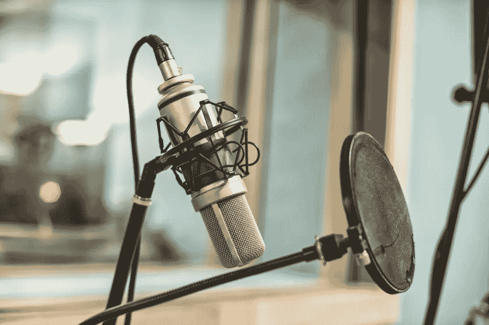

# 播客广告创业指南

> 原文：<https://www.sitepoint.com/startups-guide-podcast-advertising/>

尽管和普通母亲一样时髦(也就是说，不太时髦)，但当谈到酷的新创业产品时，我妈妈绝对是内行。

哈利剃刀？她给我爸爸买的。卡斯帕床垫。她从来没有睡得这么好。有声订阅？听着*逝去的女孩*为她的通勤工作增添趣味。

如果你听播客，你就会知道我妈妈是如何了解所有这些公司的。播客广告正在起飞；以至于在 2015 年 4 月，互动广告局发布了一份 27 页的[“数字音频购买者指南”](https://www.iab.com/wp-content/uploads/2015/05/IAB_Digital_Audio_Buyers_Guide_v6.pdf)。仅在一年内，[广告商将在播客上花费 3400 万美元](http://www.cbsnews.com/news/podcasting-is-finally-attracting-real-money/)(这是一个较低的估计)。

当然，广告的增长源于播客行业本身的增长。根据爱迪生研究公司的调查，[三分之一的美国人听过播客](http://www.edisonresearch.com/wp-content/uploads/2015/06/The-Podcast-Consumer-2015-Final.pdf)——自 2006 年以来增长了 300%。

所以，如果你正在寻找一个好方法来宣传你的创业，你绝对应该考虑播客赞助。

## 为什么播客是如此伟大的广告媒体

毫无疑问，你知道，大多数人很少关注传统广告——如果他们没有完全忽略它们的话。从网站上的横幅广告(99.8%的人不接触这些广告)到电视广告(37%的人忽视这些广告)，大多数媒体的互动率都很低。

最近广告拦截的增加让广告商更加紧张。

播客则不同。人们不仅听广告，他们实际上还享受 T2 的 T3。

首先，大多数人根本无法忽视广告。超过 25%的播客消费者在早上通勤时收听。其他受欢迎的播客活动包括遛狗、做家务和健身。这些活动不允许你快进广告，也不允许你在广告结束前专注于其他事情。

但是绝大多数人都不愿意。播客广告被认为有趣且吸引人。其中许多符合播客的整体基调；例如， [PC 的回复所有人](https://gimletmedia.com/episode/45-the-rainbow-pug/)(一个受欢迎的互联网主题播客)广告，展示了回复所有人主持人和一对年轻夫妇之间迷人的交流，他们同意宁愿保存他们的笔记本电脑，而不是他们的结婚照。

大多数广告是由主持人自己阅读的，这让你感觉好像是从一个朋友而不是一个自私的陌生人那里听到的，比如说，Stamps.com。

正如广告网络 Midroll 的首席执行官亚当·萨克斯(Adam Sachs)对快速公司(Fast Company)说的那样，“被动代言真的很强大。”

## 该设置

在你做任何决定之前，了解行话是有帮助的。

**预演**:这个 15 秒的插播节目开启了播客。通常，它比中置广告更有传统的音频广告的感觉，可以更随意。

中段:这些 30 到 60 秒的片段在整个剧集中周期性出现。

提供代码:大多数播客广告为听众提供一个独特的推广代码，这使得赞助商可以跟踪他们获得了多少转换。

原生广告:标准的播客广告包括主持人对着麦克风朗读脚本。然而，你也会偶尔听到广告公司制作的广告，有音乐、音效、被采访者等等。

**Outro** :播客的最后一部分，在此期间，主持人可以再次敦促听众尝试该公司(“不要忘记使用优惠代码 Take30，以获得首次购买韦恩产品的 20%折扣”)或简单地提醒他们赞助(“感谢韦恩赞助这一集。”)

直接回应:由于大多数播客提供可链接的展示说明或标题，你现在可以提供到你的网站或产品页面的直接链接。

**Podcatcher** :一个播客播放器。iTunes 仍然是至高无上的，但像 Stitcher、bottom 和 Castro 这样的应用程序正在取得进展。

## 查找播客

任何营销策略的第一步都是找到合适的销路。

你可以用两种方法处理这个项目。

第一种方法是确定你的目标受众正在收听的节目，联系这些节目，并要求赞助它们。

假设你的公司为千禧一代提供简单易用的银行软件。经过一番研究后，你决定走近《夜谷》和《公鸡牙齿》，这两部剧在千禧一代中很受欢迎。

优点:这种方法成本很低。此外，它可以让你找到直接吸引你的核心市场的利基播客，而不是像每个人都听的*系列*这样的超受欢迎的节目。

反对意见:这是一种非常不科学且耗时的方法。

第二种选择是与播客网络合作，如 [Midroll](http://www.midroll.com) 或 [Archer Avenue](http://archeravenue.com/) 。他们充当中间人，在他们的花名册中为你匹配多个节目。

优点:几乎所有的繁重工作都外包出去了。此外，你还可以接触到顶级播客(如果你单独接触他们，他们可能会忽视你)。

**缺点**:比较贵。

虽然你的决定将取决于你能负担的支出和你所追求的受众规模，但一般来说，我建议从第一种方法开始，看看效果如何，重复你的方法，然后转向第二种方法。

## 最佳实践

### 时机

平均而言，用户[每期播客](http://www.cision.com/us/2015/04/7-podcasting-best-practices/)听 22 分钟——如果你选择在 90 分钟播客的结尾做广告，你可能不会接触到这一集的所有听众。取而代之的是，买一个前 20 分钟播放的插播广告或中间插播广告。这些广告会更贵，但也更有效。

### 长度

你也应该保持事情简短有力。十五秒或更少是一个很好的基准。[根据社交音频平台 Clammr](http://www.slideshare.net/clammrapp/20150617-future-of-podcasting-2015-clammr-v-f) 的数据，82%的人使用苹果的播客应用来收听他们的节目，这一点值得注意，因为这款应用允许你一次快进 15 秒。所以，如果你制作一个 30 秒的广告，听众会比 10 秒的广告更容易跳过。

### 风格

说到广告本身，我非常赞成现场朗读。让主持人(一个已知的、可信的实体)谈论你的产品是一个隐含的推荐。是的，你可以在自己的工作室预先录制广告，但你会失去主持人的亲切感。虽然你显然需要为他们准备一个剧本，但是给他们自由即兴表演，用他们自己的话来说。当主持人可以自由地播放广告时，现场听起来会自然有趣得多。

内衣公司麦克·魏尔东在雇佣沃尔夫波普的《我也在那里》节目的主持人马特·古利时，绝对牢记了这一原则。魏尔东让它的播客“以他们想要的方式谈论产品”于是[古利发布了一则充满脏话、绝对搞笑的广告](http://www.midroll.com/matt-gourley-cusses-up-a-brilliant-ad-for-mack-weldon/)。

### 用户化

一些广告商(如 Blue 围裙和 Squarespace)为主持人提供免费赠品，这样主持人可以谈论他们对产品的个人体验。

“当主持人亲自阅读广告并用她自己的话讲述产品的故事时，它会以一种不同的、比传统广告更真实的方式吸引观众，”MailChimp 的营销总监 Mark DiCristina 告诉《纽约时报》 。

## 潜在问题

在最近的一集《创业公司》中,《回复所有》的主持人 PJ 和亚历克斯告诉他们的老板，他们对明确支持产品感到不舒服。

这一切都是从他们结束微软 Outlook 应用程序的广告开始的，他们说，“如果你想成为像马特·利伯和一个非常著名的无名科技记者以及我和 PJ 一样的早期采用者，现在是时候迈出这一步了；免费下载 iOS 或 Android 版应用。”

广告播出后，PJ 和亚历克斯开始感到不安。毕竟，[他们推断](https://gimletmedia.com/episode/bonus-but-wait-theres-more/)，如果他们说微软 Outlook 是一个神奇的工具，然后下周他们发现了一些他们“真的讨厌”Outlook 应用程序的东西呢？

因此，从那时起，他们决定讨论他们对产品的一般体验，而不是说，“我们使用这个，并喜欢它。”

让问题变得复杂的是， [FCC 没有监管播客广告信息](http://current.org/2015/05/as-podcast-revenues-climb-npr-board-questions-effects-on-radio-sales/)。美国联邦贸易委员会只是说，原生广告必须贴上标签。

我建议你向 NPR 学习。它也决定禁止明确的认可，但是[组织允许“定性术语”](http://current.org/2015/05/as-podcast-revenues-climb-npr-board-questions-effects-on-radio-sales/)，比如“设计得易于使用”

## 将播客纳入你的营销预算

大多数播客广告每 1000 次收听的费用在 18 美元到 25 美元之间，这取决于你的广告长度、播放时间，当然还有播客的受欢迎程度。

作为参考，从 Slate 的网络(拥有 15 个播客，每月超过 650 万次下载)购买播客广告，每 1000 次收听需要 20 美元。

不幸的是，众所周知，很难获得播客广告消费的指标。苹果只提供了总下载量和用户数的数据。如果没有进一步的信息，这些数字可能会产生误导。也许有 10，000 人下载播客，但只有 3，000 人真正去听。在这 3000 人中，假设只有 1000 人完成这一集。

有一些好消息:一些公共电台组织刚刚走到一起决定“下载”意味着什么。希望这个协议是客观和规范标准的开始。

与此同时，有几个不同的选项来跟踪您的广告结果。

## 量化您的投资回报率

首先:优惠券代码。主持人为播客听众提供了一个独特的、令人难忘的促销代码，这样每当有人使用该代码在你的网站上购物时，你就可以假设他们来自播客。大约 80%的播客广告商使用这种方法来衡量投资回报率。

当然，这种方法是极不完善的。如果有人在播客上听说了你的产品，并决定尝试一下，但忘记了代码，该怎么办？(毕竟，播客消费的移动性意味着听众可能要到稍后才会购买任何东西。)

此外，由于像 RetailMeNot 和 Coupons.com 这样的网站，促销代码有了一种在网络上传播的方式。

第二种选择:在显示注释中添加一个独特的链接。这种方法会给你更好的数据——如果你想要真正具体的统计数据，我建议为每集使用不同的链接，这样你就可以运行不同的广告，并找出哪个吸引更多的线索。

然而，许多主持人可能不愿意在他们的节目笔记中给你这么多的不动产。此外，你需要让听众去寻找链接。

## 好消息是

播客广告肯定有其复杂性。但是有一些好消息:现在，你没有太多的竞争。事实上，[三分之一的播客没有任何赞助商](http://www.marketplace.org/2015/05/01/tech/inside-weird-world-podcast-advertising)，另外三分之二只卖出了 30%的时段。如果你现在开始做广告，你就会领先一步。

## 分享这篇文章