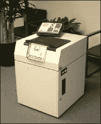
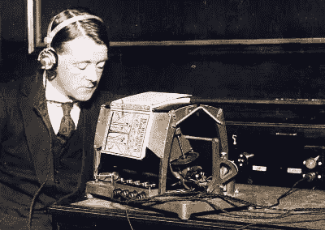
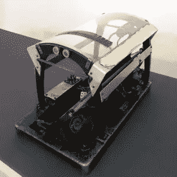

# 斯蒂维·旺德和机器阅读器的兴起

> 原文：<https://www.sitepoint.com/stevie-wonder-rise-machine-readers/>

我喜欢看早期的技术，看人们如何解决问题

 *原载于 [SitePoint 设计简讯](https://www.sitepoint.com/newsletter/)* 。  早在 80 年代初，我记得我们六年级的老师带我们去看一个‘新的神奇装置’—[一台库兹韦尔阅读机器](http://www.kurzweiltech.com/kcp.html)。

这不完全是一个性感的设计。它看起来像一台复印机，但更接近家用洗衣机的大小。你把一本打开的书放在上面，它大声朗读，甚至在需要时翻页。声音合成器听起来有点刺耳，但是，嘿，那是 1981 年，这个东西的英语说得比 R2-D2 好，所以很难超级挑剔。

我们都认为这很酷——但当机器试图将插图作为文本“阅读”时，我们也感到好笑。 ***时期，……三通，……。欠，欠，句号…连字符，…连字符，欠..、杰、欠*** 。

很有趣。相信我。

这些机器在当时是非常重要的。沃尔特·克朗凯特曾用它来结束他的国家电视新闻节目，斯蒂维·旺德非常喜欢它。人们很容易忘记阅读隐私是视觉障碍用户每天都会失去的奢侈品。本发明将这一点还给他们。

## 这是第一台阅读机器吗？

不完全是。

一个盲人用光电话。

这是[光电话](https://en.wikipedia.org/wiki/Optophone)，一种在第一次世界大战前的 1913 年发明的阅读机器。

这怎么可能呢，对吧？

这是在电视、晶体管和真空管出现之前——飞机看起来仍然像腾空而起的风筝。在家庭用电还是一件新鲜事物的时候，甚至很难考虑应对这一挑战。

但是有人做到了。他的名字叫埃德蒙·爱德华·福涅尔·德阿尔比，是一名爱尔兰物理学家、发明家和文艺复兴时期的多面手。

## 光电话是如何工作的？

光电话

像库兹韦尔的机器一样，读者将书放在玻璃顶上，下面的阅读头左右摇摆，通过耳机向用户播放音频。

Fournier d'Albe 的发明依赖于使用硒电池将页面上的反射光转化为不同的音乐音调。

用户将学会将特定的声音与字母联系起来，并以这种方式构建单词和句子。

这当然不是一个完美的系统。即使是最熟练的盲人用户也只能达到每分钟 60 个单词左右的阅读速度。大多数视力正常的读者阅读速度接近 300。尽管如此，它肯定胜过零。

但对用户来说，最大的障碍可能是它产生的所谓“音乐”。不幸的是，它发出的声音非常难听。

不相信我？今天我们仍然可以在这个音云录音中听到它们。

光电话一直使用到 20 世纪 20 年代，但在 30 年代逐渐失宠。听到那些刺耳的声音，这并不奇怪。用那些单调的嘎嘎声表达出来的美丽词汇也很难让人欣赏。

对我来说，奇怪的是，在 1913 年，技术的高点可能仍然是高精度的钟表。数百年来，钟表匠们一直在制造令人难以置信的复杂装置，这些装置带有令人惊叹的美丽钟声。我想知道，如果 Fournier d'Albe 能够与一位优秀的钟表匠合作——将文字转化为微妙的旋律而不是放电——光电话可能会有更长、更长的工作寿命？

尽管有这些问题，我们直到 20 世纪 70 年代才做出更好的东西。

*原载于 [SitePoint 设计简讯](https://www.sitepoint.com/newsletter/)* 。

## 分享这篇文章