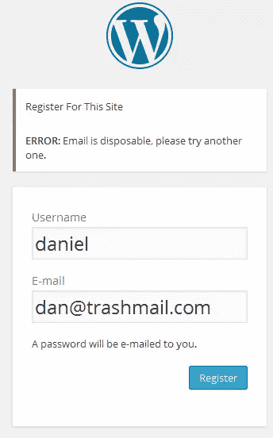

# 停止使用 WordPress 中的一次性电子邮件地址

> 原文：<https://www.sitepoint.com/stop-the-use-of-disposable-email-addresses-in-wordpress/>

垃圾邮件制造者无处不在，他们使用自动软件在网络上搜索网站(如 WordPress 网站)，目的是提交和注册成千上万的帐户和垃圾邮件评论。

在我的一个 WordPress 支持的网站上，我发现了 50 多个新注册的垃圾邮件账户，都是用**个一次性电子邮件地址**创建的。为了防止这种情况再次发生，我不得不创建一个插件来阻止用一次性电子邮件地址注册账户。



在本教程中，我们将学习可任意使用的电子邮件地址的含义，它们是如何工作的，最后，它们如何在 PHP 应用程序中被停止——尽管重点是 WordPress。

## 一次性电子邮件地址简介

DEA 是一次性电子邮件地址(有时也称为一次性电子邮件、临时电子邮件或自毁电子邮件)的缩写，是一种允许注册用户在特定时间段过后过期的临时地址接收电子邮件的服务。简单地说，它们是为了实现短期目标而创建的电子邮件帐户。

一次性电子邮件提供商的例子包括:[【mailinator.com】](http://mailinator.com)【YOPmail.com】[等等。](http://w3guy.com/disposable-email-address/)

### 好人

一次性电子邮件地址背后的初衷是保护自己免受不可信网站的攻击，通常是为了避免垃圾邮件。

### 坏的和丑的

维基百科对一次性电子邮件有一个很好的解释——我应该说它不好还是难看？

> 许多论坛和维基管理员不喜欢 DEAs，因为它们混淆了成员的身份，使得维护成员控制变得困难。例如，可能已经被禁止的网络流氓、破坏者和其他用户可能会使用一次性电子邮件地址来绕过禁令。使用 DEA 提供者只会使这变得更容易；一个人可以创建一个 DEA 来过滤垃圾邮件，这种便利同样适用于 trolls。因此，论坛、wiki 管理员、博客所有者以及任何需要用户名的公共网站都有理由禁止 DEAs。

因为垃圾邮件发送者可以使用一次性电子邮件来实施他们的邪恶活动，我们真的需要认真考虑如何才能阻止 DEAs。

## 检测一次性电子邮件地址

没有算法(据我所知)来检测电子邮件是否是一次性的。

要检测一次性电子邮件地址:
–首先，您必须创建并维护一个一次性电子邮件域的列表/数据库。
–检查电子邮件的域部分(例如在“hi@trashmail.com”中，“trashmail.com”是域部分)是否在数据库中。

下面是一个 PHP 函数，它接受一个电子邮件地址作为参数，如果它是一次性的，则返回 true，否则返回 false。

```
<?php

/**
 * Check if an email is disposable or not.
 * 
 * @param $email string email to check
 *
 * @return bool
 */
function detect_disposable_email( $email ) {

	$disposable_list = array(
		'drdrb.net',
		'upliftnow.com',
		'uplipht.com',
		'venompen.com',
		'veryrealemail.com',
		'viditag.com',
		'viewcastmedia.com',
		'viewcastmedia.net',
		'viewcastmedia.org',
		'gustr.com',
		'webm4il.in',
		'wegwerfadresse.de',
		'wegwerfemail.de',
		'wetrainbayarea.com',
		'wetrainbayarea.org',
		'wh4f.org',
		'whyspam.me',
		'willselfdestruct.com',
		'winemaven.in',
		'wronghead.com',
		'wuzup.net',
		'wuzupmail.net',
		'www.e4ward.com',
		'www.gishpuppy.com',
		'www.mailinator.com',
		'wwwnew.eu',
		'xagloo.com',
		'xemaps.com',
		'xents.com',
		'xmaily.com',
		'xoxy.net',
		'yep.it',
		'yogamaven.com',
		'yopmail.fr',
		'yopmail.net',
		'ypmail.webarnak.fr.eu.org',
		'yuurok.com',
		'zehnminutenmail.de',
		'zippymail.in',
		'zoaxe.com',
		'zoemail.org',
		'inboxalias.com',
		'koszmail.pl',
		'tagyourself.com',
		'whatpaas.com',
		'emeil.in',
		'azmeil.tk',
		'mailfa.tk',
		'inbax.tk',
		'emeil.ir',
		'crazymailing.com',
		'mailimate.com'
	);

//extract domain name from email
	$domain = array_pop( explode( '@', $email ) );

	if ( in_array( $domain, $disposable_list ) ) {
		return true;
	} 

	else {
		return false;
	}

}

//extract domain name from email
	$domain = array_pop( explode( '@', $email ) );

	if ( in_array( $domain, $disposable_list ) ) {
		return true;
	} 

	else {
		return false;
	}

}
```

一次性电子邮件提供商的数量与日俱增，因此很难随时更新我们的 DEAs 列表。

有许多服务保存着可任意处理的电子邮件的更新列表，并公开了用于检测它们的 API，例如 [NameAPI](http://www.nameapi.org/en/live-demos/disposable-email-address-detector/) 和【block-disposable-email.com】T2。我们将使用后者来编写一个插件，阻止用户试图在 WordPress 中用一次性邮箱创建一个账户。

## 停止 WordPress 中的一次性电子邮件注册

如前所述，我们将使用[block-disposable-email.com](http://www.block-disposable-email.com)。在我们深入研究插件开发之前，用一个不可丢弃的电子邮件在网站上注册一个账户(当然)来获得一个免费的 [API 密匙](http://www.block-disposable-email.com/cms/manage/credits/)。

**注意:**免费账户每月最多可申请 200 次。要增加配额，请参见[定价页面](http://www.block-disposable-email.com/cms/about/pricing/)。

说到这里，让我们开始插件开发。

首先，包括插件头。

```
<?php

/*
Plugin Name: Stop Disposable Email Sign-ups
Plugin URI: https://www.sitepoint.com
Description: Stop users from registering a WordPress account with disposable emails.
Version: 1.0
Author: Agbonghama Collins
Author URI: http://w3guy.com
License: GPL2
*/
```

创建一个 PHP 类，其属性将存储 API 密钥。

```
class Stop_Disposable_Email {

	/** @type string API key */
	static private $api_key = 'd619f9ad24052ad785d1edf65bbd33b4';
```

类构造器方法将由一个过滤器组成，该过滤器将一个方法(`stop_disposable_email_signup`)与 [registration_errors](https://codex.wordpress.org/Plugin_API/Filter_Reference/registration_errors) 挂钩，以验证电子邮件地址并确保它不是可任意使用的。

```
public function __construct() {
		add_filter( 'registration_errors', array( $this, 'stop_disposable_email_signups' ), 10, 3 );
	}
```

接下来，我们使用一个助手`is_email_disposable()`方法，它将通过`wp_remote_get`向 block-disposable-email.com API 发送一个 GET 请求，使用 [WordPress HTTP API](https://www.sitepoint.com/the-wordpress-http-api/) 来检查电子邮件的状态——也就是说，它是否是一次性的。

```
/**
	 * Check if an email is disposable or not.
	 *
	 * @param $email string email to check
	 *
	 * @return bool true if disposable or false otherwise.
	 */
	public static function is_email_disposable( $email ) {

		// get the domain part of the email address
		// e.g in hi@trashmail.com, "trashmail.com" is the domain part
		$domain = array_pop( explode( '@', $email ) );

		$endpoint = 'http://check.block-disposable-email.com/easyapi/json/' . self::$api_key . '/' . $domain;

		$request = wp_remote_get( $endpoint );

		$reponse_body = $body = wp_remote_retrieve_body( $request );

		$response_in_object = json_decode( $reponse_body );

		$domain_status = $response_in_object->domain_status;

		if ( $response_in_object->request_status == 'success' ) {

			if ( $domain_status == 'block' ) {
				return true;
			} elseif ( $domain_status == 'ok' ) {
				return false;
			}

		}

	}
```

下面是`stop_disposable_email_signups()`的代码，它将阻止一次性电子邮件地址的用户创建帐户。

```
/**
	 * Stop disposable email from creating an account
	 *
	 * @param $errors WP_Error Registration generated error object
	 * @param $sanitized_user_login string sign-up username
	 * @param $user_email string sign-up email
	 *
	 * @return mixed
	 */
	public function stop_disposable_email_signups( $errors, $sanitized_user_login, $user_email ) {

		if ( self::is_email_disposable( $user_email ) ) {

			$errors->add( 'disposable_email', '<strong>ERROR</strong>: Email is disposable, please try another one.' );
		}

		return $errors;

	}
```

最后，我们关闭插件类。

```
} // Stop_Disposable_Email
```

### 插件改进建议

我创建了一个类属性，并手动添加了我的 block-disposable-email.com API 键。理想情况下，插件的设置页面应该已经创建了一个表单字段，该字段将密钥保存到数据库中供插件重用。

让我们把这作为你的一项任务。这是你如何做到这一点的一种方法。

*   为插件创建一个设置页面，带有一个将密钥保存到数据库的输入字段，[这里有一个很好的指南](https://www.sitepoint.com/wordpress-options-panel/)。
*   用 [get_option](https://codex.wordpress.org/Function_Reference/get_option) 函数从数据库中检索 API 密钥并使用。

## 摘要

在这篇文章中，我们了解了 DEAs 的含义、工作方式以及一次性电子邮件地址系统的优缺点。我们学习了如何停止 DEAs，并最终创建了一个插件来阻止用户在 WordPress 支持的网站上注册一个可任意使用的邮箱地址。

如果你想在你的网站上使用它或者进一步扩展它，你可以在 GitHub 上找到这个插件。

如果你有任何问题或贡献，请在评论中告诉我们。

## 分享这篇文章