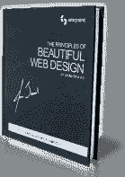
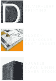
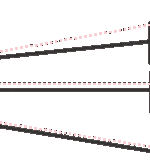

# 带有 HTML 和 CSS 的弹性图像

> 原文：<https://www.sitepoint.com/stretchy-images-with-html-and-css/>

在发布时，我注意到 IE7 允许您使用 CSS 将图像宽度设置为一个百分比(例如，30%)，但如果您调整浏览器的大小，它无法重新计算该百分比，并且需要完全刷新以强制图形调整大小。

常驻 CSS 大师和我们新的 CSS 参考资料的合著者 Paul O'Brien 指出了一个很好的解决这个 bug 的方法，我将在下面详述。

* * *

有时候，网络最大的优势也可能是它最大的致命弱点。

尽管网页内容可以灵活地根据不同的设备和屏幕尺寸进行重新格式化，但有一个布局问题是我一直在努力解决的——流动网站的布局可以伸展，而图片却不能。

虽然布局可以拉伸和收缩，文本可以流动和换行，但图像在出生时就被分配了一个像素大小，这正是它们在出生后的显示方式，而不管它们的环境如何。

在大多数典型的文章或博客文章布局中，这并不是一个大问题。在一个真正的大屏幕上，图像可能看起来有点小，但只要文本正确地围绕图像流动，它通常看起来只是文本很轻，而不是明显的错误。

我认为这个问题主要出现在图形网站标题和图片过多的宣传片中(如下图)。通常，他们在较小的浏览器宽度上看起来越平衡和沉稳，在宽屏幕上看起来就越拖沓和杂乱。

那么，你有什么办法来调整这些布局的大小呢？

1)Adobe Flash:Vectors graphics 将永远是调整大小的理想工具，Flash 本质上一直是一个矢量工具，所以如果您的原始图像主要是矢量，那么有一些令人信服的理由将整个东西嵌入到 SWF 中。

**2)Canvas:**[Canvas 元素是新的 HTML5 规范](http://en.wikipedia.org/wiki/Canvas_%28HTML_element%29)的一部分，目前令人惊讶地受到大多数主流浏览器的良好支持。canvas 标签(`<canvas>`)本身只不过是一个等待我们填充的空白绘图空间，但是您将需要一些 JavaScript voodoo 来很好地利用它。

现在我们不去管 canvas，但是它看起来提供了一些非常有趣的选项，所以我们将在不久的将来回到它的设计视图中。

智能图像大小调整/Seam Carving: Seam carving 可能是*2007 年的热门词汇，如果你近几个月一直关注 [SitePoint 博客](https://www.sitepoint.com/the-future-of-imagery-content-aware-image-resizing)和论坛，你可能已经知道这个想法了。这正是缝雕会发光的那种情况。*

不幸的是，尽管这个概念很棒，但在这个阶段，在页面中部署它的方法至少还需要几个月的时间，并且很可能依赖于 Flash。

然而，当我们等待更好的技术时，我想到了一个在某些情况下调整图像大小的替代方法。它当然不适用于大多数情况，但如果你在计划你的图像时牢记这一点，它可能是一个不错的锦囊妙计。

首先，让我们来看看这个有弹性的图像。右边是显示拉伸的动画。几乎相同的代码在 [SitePoint 主页](https://www.sitepoint.com/)上运行(轮流运行)，但是为了简单起见，我把它分离到一个独立的页面上。

正如你所看到的，当你将浏览器拉得更宽时，三个“功能框”会远离图书图像，而“连接臂”会保持*连接*。虽然这种效果最终在超宽和非常低的分辨率下失败，但它肯定比标准图像更优雅地处理了可用空间——所有这些都不需要任何特殊技术或复杂的脚本。

## 该方法

当然，浏览器*可以*并且总是能够动态调整图像大小。只是他们总是在这方面做得很糟糕，所以我们设计师倾向于忽略这种能力。

这个技巧的关键是限制图形中最不重要的部分的伸缩性——在这个例子中，是连接臂。


我们的图像由三个较小的重叠图形组成，每个图形都被设置为`**position:absolute**`，这只是简化了重叠它们的整个过程。包含它们的包装 DIV 被设置为`**position:relative**`,以将它们保存在它们的盒子中。

 **图文 1:书**

这本书本身是一个透明的 PNG8，并设置为`**left:55%**`——这将确保它总是位于容器 DIV 的中间位置，而不管它的宽度。我还将其设置为`**top:-1em**`,这样书的上边缘就会伸出盒子。我们根本不想让这个图像失真，所以我们给它自然的尺寸——139 x197px。

最后，我通过将 z-index 设置为 99 来确保图书图片总是在其他所有图片的前面。这将确保连接臂总是消失在书本图像的后面。

 **图形 2:三个特征框**

由于这些封面宣传片只有几周的寿命，我在这里采取了最简单的选择，将三个功能框设置为一个图形，尽管在理想情况下，我会将它们列为一个列表。

我希望这个图像留在容器的右边，所以我把它放在了`**right:2%**`的位置。

像书的图像一样，我已经把它移到了堆栈的前面(`**z-index:90**`)，并把它的图像尺寸设置为默认值(111x160px)以保持清晰。

**图形 3:连接臂**

这当然是我们的弹性图形。它只不过是一个透明的 PNG8，带有一些粉红色的虚线。我添加了一些假的软阴影，让它看起来更有深度。

重要的一点是从一开始就保持这个图形相对简单和原始。如果我们一开始就把它做得有点粗，把它拉长变形也不会对它造成太大的损害。

首先，我已经定位了这个`**left:56%,**`，所以它的左侧应该总是隐藏在图书图像的后面(这是`**left:55%**`)，不管页面宽度如何。我还将这个图形的 z-index 设置为 85，所以它不应该出现在书或盒子的前面。

接下来，我将这个连接图形的宽度设置为`**width:30%**`。这是包含 DIV 的 30%,所以图形会像它的容器一样拉伸和收缩。图形的右边缘很好地隐藏在功能框后面。

没有什么神奇的方法可以计算出这个百分比(30%)——只需要一点点的试错。当我调整它的时候，我在有弹性的图形上设置了一个临时的边界，这有助于让事情变得更清楚。

正如你所看到的，连接臂在伸展时当然会扭曲，但这似乎不会破坏整体效果——至少在我看来是这样。

## 总结

如果你喜欢这种效果，在我看来，有两个挑战你必须与之抗衡。第一个挑战是技术性的。

IE7 很乐意在页面加载时将图像宽度设置为 30%，但如果你调整浏览器窗口的大小，它坚决拒绝自动重新计算宽度。重新加载页面*将会*重置宽度，但是我不知道有什么方法可以强迫 IE7 动态地重新计算宽度。

奇怪的是，对于所有其他问题，IE6 将正确缩放图像，所以这显然是一个新的错误。

第二个挑战是简单地找到使用这种技术的合理情况。我当然很想看到你可能提出的主题的任何变化。

Paul O'Brien 建议修复 IE7 刷新错误。他写道:

> 关于你的弹性图像文章，IE7 的解决方法是简单地将图像包裹在一个跨度中，并对跨度进行测量，使图像的宽度和高度为 100%。我总是这样做，它似乎没有问题:)
> 
> 例如

```
 div#promo-b div span#stretch {
 position:absolute;
 top:.5em;
 left:56%;
 z-index:85;
 width:30%;
 height:150px
}
div#promo-b div span#stretch img {
width:100%;
height:100%;
} 
```

```
 <span id="stretch"  >
</span> 
```

## 分享这篇文章