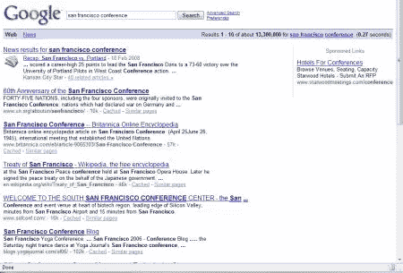
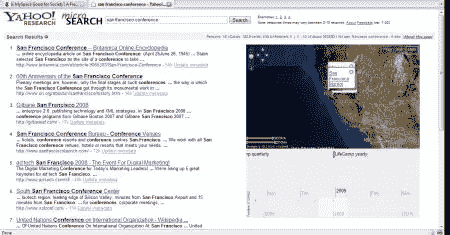

# 结构化数据——准备挑战谷歌

> 原文：<https://www.sitepoint.com/structured-data-set-to-take-on-google/>

昨晚发布雅虎微搜索条目后，我有了一个想法。谷歌已经掌握了 web 1.0 风格的搜索。我一直在使用它(即使我并不总是对结果感到兴奋)，当我只是想快速搜索时，我很少使用微软或雅虎或其他任何东西。那么别人怎么竞争呢？即使微软和雅虎合并了，Microhoo 出现了，他们怎么能挑战谷歌。嗯，用基本搜索，我不认为他们可以。

这是当[雅虎微搜索](https://www.yr-bcn.es/demos/microsearch/)跳起来，开始挥舞手臂……“为什么在谷歌上搜索旧金山[会议](https://www.google.com/search?q=san+francisco+conference)，得到这个:

“当你可以在 [me](https://www.yr-bcn.es/demos/microsearch/search.do?p=san+francisco+conference) 上做同样的搜索时，微搜索得到这个:“(不确定为什么微搜索用第一人称说话)

注意地图、时间线和它上面的小条。它显示了提取的元数据的数量——真正有用的部分。在上面的搜索中，它提取了 16 个 vCards 和 182 个事件。如果你点击位于左上方的小框图标，它还会使所有这些元数据以 RDF 的形式可用。

当然，没有什么能阻止谷歌提供这种服务(我肯定他们已经在考虑了)，这将会很棒。公平竞争的是嵌入式结构化数据(微格式、RDF、RDFa、eRDF)。这些语义数据给出了不需要惊人猜测的重要信息。搜索引擎不再需要*猜测*是什么意思，作者可以*明确地*说出他们的意思。这是一个重要的区别。一个关键的区别。

我知道这为垃圾邮件打开了一个巨大的蠕虫罐，但有了社交网络和信任系统(FOAF、OpenID、OpenAuth)，它可以被 T2 抵消。所有嵌入的数据都将被索引，但是新的、未来的网络搜索引擎将把信任算法作为他们的秘密武器。一个新的“我信任这个吗？”或者“我的网络信任这个”过滤器将位于大量信息之上。

谷歌的秘方在处理大量非结构化信息方面做得很好，但当这些信息的重要性开始下降时，谷歌又该何去何从呢？我不会为他们流泪，现在还为时尚早，但雅虎微搜索正朝着正确的方向前进。

典型的先有鸡还是先有蛋的综合征似乎最终会自行解决；如果没有人使用或要求结构化数据，就没有人会去努力嵌入结构化数据。让这些数据成为一等公民将会回答这个问题。微格式和语义 web 元数据格式可以轻松愉快地共存，事实上可以利用彼此的优势，使 Web 成为每个人更有用的地方。

## 分享这篇文章