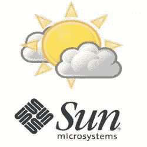

# 太阳微系统公司预报:我们部分多云

> 原文：<https://www.sitepoint.com/sun-partly-cloudy/>

今天，Sun Microsystems 宣布了其“虚拟化数据”的变体。据[新闻](http://www.google.com/hostednews/ap/article/ALeqM5hSHyn7EtmsUDsHinRkCq-X0iMMRAD97075NG1)报道，Sun 将发布一套面向开发者、学生和网络创业公司的开放应用编程接口。在这场关于可行的虚拟计算的持续战斗中，术语和技术一样多，Sun Microsystems 遵循了亚马逊 T4 和谷歌开辟的道路。

与竞争对手谷歌和亚马逊相比，Sun 的“云计算”战略似乎是由灵活性驱动的。相比之下，亚马逊 EC2 系统主要是一个基于 Linux 的平台，而新的 Sun 变种可以在 OpenSolaris、Linux 或 Windows 上运行，并且也与亚马逊 S3 API 兼容。添加拖放简单性进一步描绘了 Sun 的界面，并努力给开发者一个真正的开发数据中心。通过 Sun 开源软件的预打包虚拟机映像(via Sun 的方法似乎简化了 Sun 云服务矩阵中的开发部署。

Sun 在纽约举行的 CommunityOne East 开发者大会上发布的声明进一步凸显了该领域的竞争。Sun 与谷歌和亚马逊的较量，加上思科与 IBM、戴尔和惠普的硬件合作，以及他们周二在发布的统一计算系统(T3)，显示出以前的合作者在各个层面上展开竞争。

Sun 和许多其他公司一样，发现销售他们的服务器硬件越来越困难。随着思科和许多其他大公司在硬件领域走自己的路，Sun 唯一合理的策略就是用他们自己的云服务来应对。在美联社的新闻中，Sun 的技术主管卢·塔克讽刺地描述了他们的策略，暗示了我们前几天提到的一个策略:

> Sun 认为，将这项技术出售给希望自己提供云服务的公司，或希望为员工提供云服务但拒绝交出最敏感的专有数据的大公司，会有更大的利润。

事实是，所有这些公司都有平衡、完全集成的应急方案，甚至根本没有与云集成。不管系统或动机如何，作为开发人员，我们应该关心的是为处理数据的人提供新的工具和服务，至于更大的可行性问题，我认为市场将决定这一点，而不是我们的思考。然而，很明显，即使在可能被认为是投机性的市场中，前合作者之间的竞争也在升温。

## 分享这篇文章