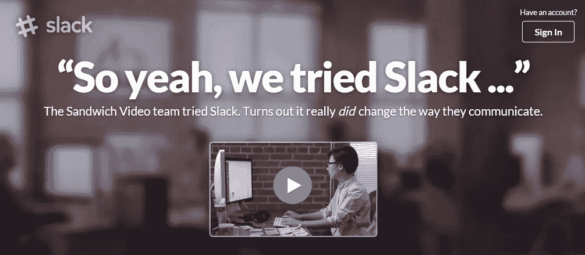
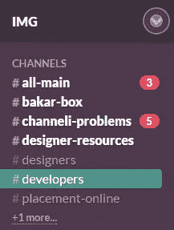
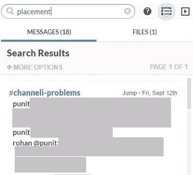
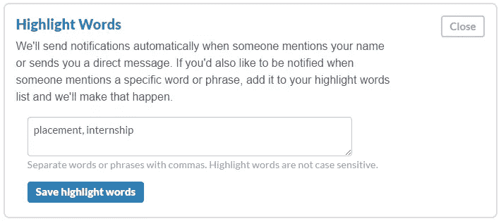
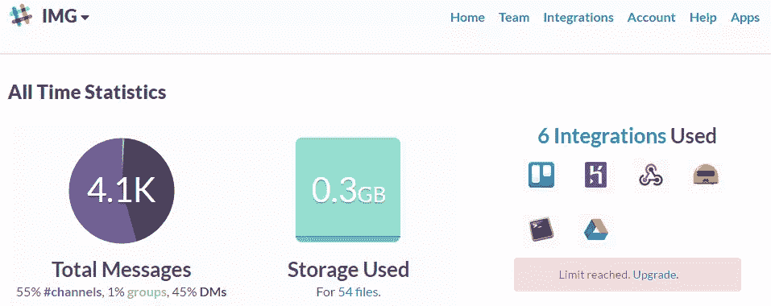
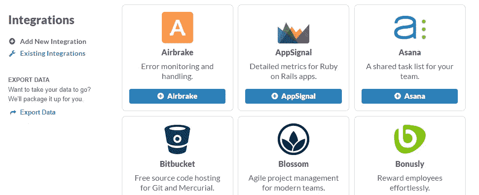
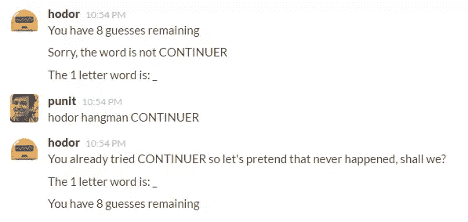
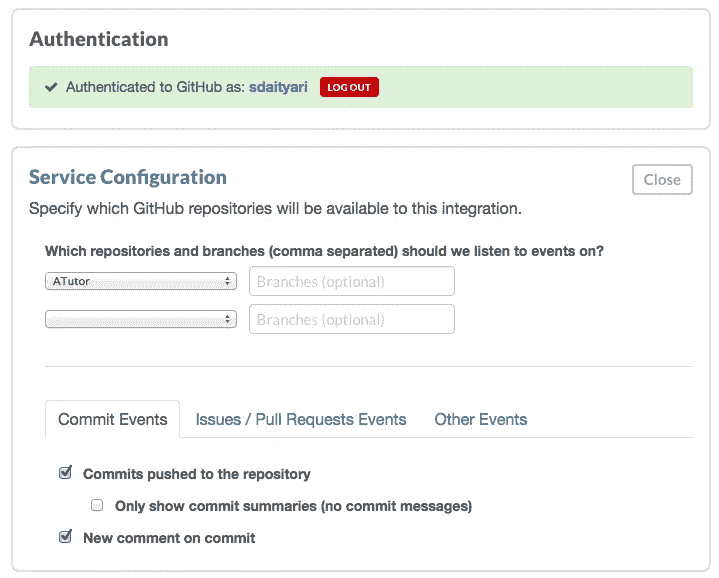

# 如何为强大的工作场所协作增压 Slack

> 原文：<https://www.sitepoint.com/supercharge-slack-powerful-workplace-collaboration/>

几年前，团队沟通的主要方式是通过邮件列表(例如，那些旧的 Python mailman 列表——还记得吗？)随着时间的推移，谷歌团队来帮忙了，管理团队交流的线索变得容易多了。世界各地的团队开始使用它，大多数人对它的特性感到满意。

然而，近年来，像 Redmine 和 Trello 这样的工具出现了，提供了对项目的更大控制——其项目管理功能比论坛领先一步。

在 IMG，IIT·罗克，我们使用谷歌群组作为我们的主要交流方式，直到我们意识到是时候把它带到下一个层次了。那时我们决定用 [Slack](https://slack.com/) 。

Slack 是一个聊天室的集合，有公开的也有私人的。它有助于将所有团队通信限制在一个地方。如果这就是它所做的一切，它仍然非常有用，但是它做得更多！如果你感兴趣，这里有一篇关于这个应用程序背景故事的优秀文章。

## 入门指南

如果你是团队领导，就去 Slack 创建你的团队。然后，您可以邀请您的团队成员。

您可以创建公共或私人聊天室，也可以选择一对一的消息。有移动和 iOS 应用程序，让你在旅途中保持联系。

这里有一个好处——你几乎可以定制任何东西。例如，这是我们在应用程序加载时定制的消息。

“通道 I”是我们内部网门户的名称，因此有了这个消息。

## 搜索

相比其他电子邮件，我更喜欢 Gmail 的一个原因是它强大的搜索功能。有了谷歌群组，所有的交流都被限制在我的收件箱里——搜索东西非常容易。

我把这篇文章的一部分献给搜索，因为 Slack 的搜索功能非常有用。只需一个搜索框，您就可以搜索对您可见的所有内容，包括附件。

## 自定义通知

当有人提到你的名字，或者有人提到某个频道的所有成员(`@channel`)时，你会收到通知，但你可以更进一步，为关键词设置通知。

一个缺点是，这可能会创建大量的通知，尤其是当你使用智能手机应用程序时。但是，您可以通过降低“帐户首选项”中的通知级别来降低它们的音量。

## 使用统计

如果您是团队的管理员，您可以访问团队的使用统计数据。

不幸的是，如果你需要详细的统计数据，你需要升级到付费计划。但是免费版给你的足够一个小团队用了。

## 第三方集成

让 Slack 更上一层楼的是[添加第三方服务](https://slack.com/integrations)的能力。Slack 认识到它只是一个交流工具，团队的日常活动将依赖其他服务(如 GitHub、Asana、Buildbot 或 Dropbox)。通过支持这些第三方集成，Slack 帮助您从一个地方连接到所有这些服务。

这里有三个我最喜欢的。

### 1.聊天机器人 Hubot

在 IMG，我们集成了 GitHub 制造的可编程聊天机器人 Hubot。Slack 支持 Hubot，你需要知道一点点 [CoffeeScript](http://coffeescript.org/) 来定制命令。

您需要将 Hubot 部署到 Heroku，然后在 Slack 上添加第三方集成。这里有一个你可以遵循的步骤列表。你可以看看 [GitHub 的文档，把它部署到 Heroku](https://github.com/github/hubot/blob/master/docs/deploying/heroku.md) 。我们称我们的机器人为“阿多”。

你可以让你的机器人做一些简单的事情，比如列出 HackerNews 上的前 x 篇文章。

或者给某人加个小胡子。

你可以让你的机器人做一些有趣的事情。还记得 iRobot 吗？

只工作不玩耍，聪明的孩子也变傻。我们现在来玩刽子手，好吗？

### 2.GitHub——通过 Slack 跟踪您的存储库

通常，开发人员将邮件列表与他们的 Git 存储库集成在一起，这导致每次新提交都会有一封邮件。使用 Slack，您可以将其与应用程序集成。您所需要做的就是指定要监控的存储库，并选择链接到更新的通道。

在 Slack 的 Integrations 下激活 GitHub，并连接一个 GitHub 帐户。

连接 GitHub 帐户后，您可以将存储库(也可以选择分支)链接到通道，并选择触发消息的事件。在这种情况下，我们使用默认事件。以下是更新的显示方式:

### 3.Google Drive —轻松共享文件

另一个有用的第三方集成是基于云的文件共享系统。在你的团队成员之间共享文件是必要的，如果你的团队使用 Slack，为什么要为共享文件打开一个不同的服务呢？

集成 Google Drive 很容易。所有你需要做的是激活集成和连接一个谷歌帐户。

一旦你成功地集成了它，你需要做的就是粘贴一个链接到文件，任何人都可以访问它。

Slack 也可以与 Dropbox 集成，适用于那些更喜欢 Dropbox 而不是 Drive 的团队。

### 更多第三方集成

在写这篇文章的时候，Slack 提供了超过 60 个第三方集成，而且他们还在继续增加！因此，涵盖所有这些是不可行的。然而，我将再提几个对你们团队的运作可能很重要的问题。

许多开发人员使用 Travis CI 来检查推送到中央存储库的任何代码。这有助于持续部署的过程。Slack 提供了一个集成，将一个频道链接到 Travis CI，并在每次推送时发布检查消息。

Sentry 是一项记录应用程序错误的服务。这种集成有助于报告 Slack 中的实时错误。

Pingdom 是一个检查网站正常运行时间的工具。您可以配置 Slack 来获取 Pingdom 报告并在通道上发布它们。

许多组织(包括 SitePoint)使用 Trello 进行项目管理。您可以添加这个第三方集成来将您的板链接到 Slack。Trello 的替代者 Asana 也在 Slack 上有售。

## 最后的想法

Slack 是一个很棒的工具。如果你不使用它的所有功能，它可以作为一个伟大的聊天应用程序，但在其全部权力，它只是这么多。现在说这个可能还为时过早(因为 Slack 一年多前才推出)，但 Slack 似乎会一直存在下去。

你可能还在使用 Google Groups 或者古老的邮件列表，但是我希望我已经让你毫不懈怠的意识到了你所缺少的东西。那你什么时候试一试？

你使用 Slack 吗？你最喜欢的集成和定制技巧是什么？

## 分享这篇文章