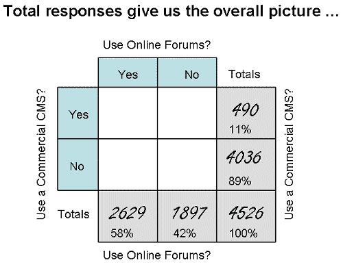
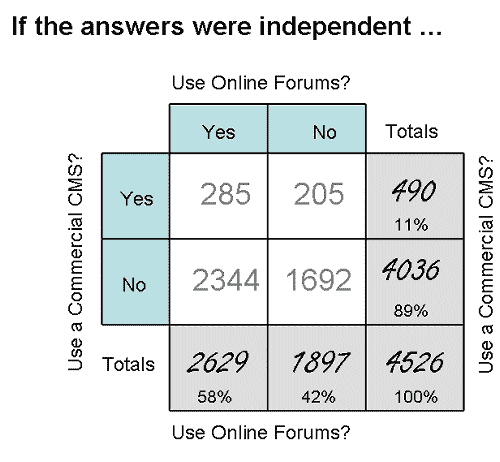
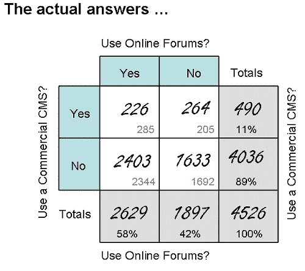

# 调查揭示了网络开发的四种模式——你是哪一种？

> 原文：<https://www.sitepoint.com/survey-web-dev-stereotypes/>

早在 6 月，Ektron 和 SitePoint 联合发起了 2006 年 Web 开发状况调查，对实际构建 Web 的人进行调查，以发现社区使用的技术和实践的真相。该调查询问了人们的工作，他们使用的工具，他们开发的平台，以及他们应用于设计和开发任务的实践。在本文中，我们将概述调查、收集的数据以及通过更深入的分析可以从数据中提取的各种信息。

##### 该调查

调查取得了巨大的成功:超过 5000 人参与了调查，这可能是有史以来对 web 开发人员进行的最全面的调查。有一项大奖-赢得戴尔 20 英寸宽屏平板显示器的机会-每个受访者都可以访问调查揭示的信息。

如果你没有参加，你肯定错过了赢得奖品的机会(祝贺杰里·沙利文，马萨诸塞州南雅茅斯 NavillusWebWorks 的校长！).但是，你可以得到[调查结果](https://www.sitepoint.com/survey-web-dev-stereotypes/)；它们是免费的，由 Ektron 和 SitePoint 提供。

该调查提出了 15 个问题:

1.  什么最恰当地描述了你对网络的最初参与？

3.  你的主要开发环境是什么？

5.  您为哪个(些)服务器平台开发？

7.  您不打算开发什么服务器平台，但希望在未来 12 个月内开发？

9.  你在布局中使用 CSS 有多广泛？

11.  你验证你的标记了吗？

13.  你在你的网页开发工作中练习哪一个？

15.  对于您的 web 项目，您使用的主要内容管理系统类型是什么？

17.  您或您的组织在当前的 web 项目中使用了哪些技术？

19.  您或您的组织计划在未来的 web 项目中使用哪些技术(在接下来的 12 个月内)？

21.  你个人维护博客吗？

23.  你使用什么资源来保持你的技能和知识的及时性？

25.  你希望哪种技术能在网上和印刷品上获得更多的资源？

27.  除了具体的技术之外，在接下来的 12 个月里，您还想了解什么？

29.  网络上的下一件大事是什么？

有些结果是可以合理预测的。例如:

*   68%的 web 开发人员说他们在其他服务器平台中为 PHP 开发，33%的人说他们只为 PHP 开发。
*   40%的 web 开发人员使用 Dreamweaver 作为他们的主要开发环境。
*   46%的 web 开发人员计划在未来 12 个月内将 AJAX 技术引入他们的 web 项目。

结果也有一些令人惊讶的地方。例如:

*   24%的 web 开发人员希望在未来 12 个月内开始开发 Ruby on Rails，但只有 8%的人希望开始使用 Python。
*   37%的 web 开发人员主要使用自主开发的内容管理系统，这比使用商业(11%)或开源(24%) CMS 工具的人数总和还要多。

##### 深入挖掘

当我们这些 SitePoint 的人意识到调查实际上收集了多少数据时，我们想知道是否有一种方法可以更深入地挖掘反馈，以获得对 web 开发社区思维方式的新见解。

我们中的几个人花了一个多月的时间筛选数据，寻找模式，并记录我们的发现。我们在人们的工作方式、使用的技术以及获取信息的来源方面发现了一些明确的趋势。我们已经以 PDF 格式发布了这项研究的结果，可以从 sitepoint.com 购买。

我们采取的方法不仅仅是查看单个问题的答案，而是将给出的答案与问题组合联系起来，从而找到“隐藏”的关系。

让我们看一个例子来看看这是如何工作的。考虑以下两种说法:

*   "我主要使用商业内容管理系统."
*   “我用来保持技能敏锐和知识及时的资源之一是在线论坛。”

调查结果显示:

*   11%的受访者使用商业 CMS。
*   60%的受访者将在线论坛作为学习资源。

你愿意猜猜这两种说法之间是否有任何联系吗？不明显吧？让我们来了解一下！

我们可以将答案写在一个简单的网格中，如下所示，这样总数就代表了对每个问题的总体回答。总数实际上与之前引用的数字略有不同，因为不是每个人都回答了每个问题，因此，我们不得不在分析的某些部分删除一些数据。

现在，如果我们假设这两个问题的答案是完全独立的，我们就可以计算出我们期望在网格的每个单独的单元格中找到的数字。由于 11%的人使用商业 CMS，58%的人使用在线论坛，我们预计大约 58 x 11/100 = 6.4%的人两者都使用。假设两个问题的答案是独立的，将同样的推理应用于其他单元格(并忽略一些舍入问题)，我们可以预测网格中每个剩余单元格的预期数字。

这就是我们期望看到的。但是实际数据说明了什么呢？这个问题的答案是通过简单地计算每个人的回答，并将结果记录在网格的适当单元格中。

你马上就能看出这些数字是不同的。但是在我们给这种差异赋予任何意义之前，我们必须回答一个重要的问题:这种差异可能仅仅是由于偶然吗？毕竟，如果你扔一枚硬币 10 次，你可能会得到 5 个正面和 5 个反面，但你不会因为你得到 6 个正面和 4 个反面就断定这枚硬币是有偏差的；这种结果很有可能是偶然的。(如果你把硬币扔 1000 次，得到 600 个头像，情况就完全不同了。)

幸运的是，有标准的统计显著性测试可以用在这种情况下。在此分析中，我们应用了耶茨 X2 ( [卡方](http://en.wikipedia.org/wiki/Chi-square_test))检验，这使我们可以得出结论，实际数据和预期值之间的差异极不可能是偶然发生的(远小于 1000 分之一的几率)。因此，我们可以确信，调查中收集的这两个问题的答案根本不是独立的:它们在某种程度上是相关的。

请注意，说两个答案不是独立的并不等于说一个导致另一个，两个统计数据都可能是由其他因素导致的。说某样东西在统计学上有意义并不意味着它在现实世界中对我们真的很重要。

既然我们知道这两个问题的答案之间存在统计上的显著关系，那么我们如何解读这些数据呢？显然，数据显示，使用商业 CMS 的人不太可能依赖通过在线论坛收集的信息。在使用商业内容管理系统的受访者中，使用在线论坛的比例为 46% (226/490)，而不使用商业内容管理系统的受访者比例为 60% (2403/4036)。

(请注意，在已发表的分析中，我们实际绘制了表示正相关的是-是/否-否对角线与表示负相关的是-否/否-是对角线的比率。在那里，我们更感兴趣的是强调趋势的方向和强度。)

这个信息有用吗？那要看你的情况了。如果你打算通过在线论坛销售商业 CMS，这可能是非常重要的知识。(提示:考虑其他渠道，如会议、用户组，以及在较小程度上，杂志。)

这就是我们应用于从 2006 年网络发展状况调查中收集的数据的分析类型:我们将问题配对，并观察给出的答案之间是否存在统计上的显著相关性。仅举几个例子，我们了解到:

*   为 PHP 开发的人有:

*   可能正在使用或计划开始使用 Python 和/或 Ruby on Rails
*   不太可能打算开始使用 ASP。网(去图！)
*   更有可能使用自制或开源的 CMS
*   使用商业 CMS 的可能性非常小

*   说他们把杂志作为学习资源的人是:

*   更有可能从书本中学习或参加用户组/会议
*   不太可能成为论坛的用户
*   更有可能使用 Dreamweaver 或 Visual Studio
*   不太可能用 PHP 开发

在公布的调查数据分析中，我们列出了一千多个这种关联的陈述——其中一些相当明显，另一些更有趣——以及趋势的强度及其统计相关性。我们还发布了原始数据(当然，删除了个人信息)和中间分析产品，供那些想要自己进行分析的人使用。

##### 解释模式

分析发现，各种问题的答案之间有如此多的强相关性，以至于我们开始寻找可能解释它们的原因。警告:在这一点上，我们离开统计分析的领域，进入意见和有根据的猜测！

一种理论认为，人们使用的技术和实践往往会形成自然集群。例如，如果你已经用 PHP 做了很多工作，理论表明你会倾向于使用开源工具，因此，你可能更倾向于考虑尝试 Python 或 Rails，而不太可能考虑 ASP.NET。而且，由于开源工具通常是通过论坛和博客等社区工具来支持的，所以使用这些工具会更舒服。

这不是一个特别激进的想法，但调查数据实际上让我们确定了一些相关实践的集群。当我们研究这些数据时，我们发现最清晰的聚类代表了不同类型的 web 开发人员的刻板印象，所以我们给它们起了名字:

*   “大师”有强烈的追求技术卓越的动机，积极跟踪新的技术趋势，并对学习如何使用它们来提高网站的质量和功能感兴趣。
*   **“企业家”对建立和留住受众有强烈的动机，对使用新技术不太感兴趣，因为它们是新的。**
***   “设计者”对于及时交付满足客户业务需求的视觉上吸引人的网站有着强烈的动机。*   **“企业”**强烈追求可靠、稳定的绩效；“公司在一个更大的组织中工作，面临着公司环境所提供的限制和机会的独特组合。**

 **我们无法对这些不同群体的想法做出绝对的预测，但我们可以确定明确的趋势。例如，我们的“企业家”最有可能说他或她:

*   经营电子商务业务
*   想了解电子邮件营销和搜索引擎优化
*   使用 Dreamweaver 开发
*   正计划进入博客和播客领域

同一个人最不可能说他或她:

*   为设计公司工作或管理公司网站
*   实践版本控制、MVC 或 OOP
*   使用文本编辑器、Visual Studio 或 Zend 开发
*   使用 AJAX、wikis 或微格式

为了记录在案，我们之前作为例子使用的相关性可以通过注意到商业内容管理系统的使用和不依赖在线论坛的趋势来解释，这两者都是“公司”刻板印象的特征。

在已发布的分析中，包含了每种定型的完整概况，以及:

*   Excel 电子表格中的调查原始数据(删除了个人信息)
*   统计相关数据，也作为 Excel 电子表格
*   相同的相关数据以更易于阅读的 HTML 文件的形式呈现

##### 结论

Ektron-SitePoint“网络发展状况”调查之旅到此结束。尽管我们只有时间讨论几个重点，但我们希望这篇文章已经展示了调查结果中包含的大量有价值的信息。

如果你想拿一份 2006 年的调查结果，你可以[免费下载](https://www.sitepoint.com/survey-web-dev-stereotypes/)。

如果你想深入了解，你可以[购买完整的调查数据](https://www.sitepoint.com/blog/)(受访者的个人信息已被删除)，以及我们对数据的分析。这份报告附有深刻的评论，以及用于执行您自己的分析的工具——我们相信它是对当今 web 开发状态的最全面的快照。** 

## **分享这篇文章**