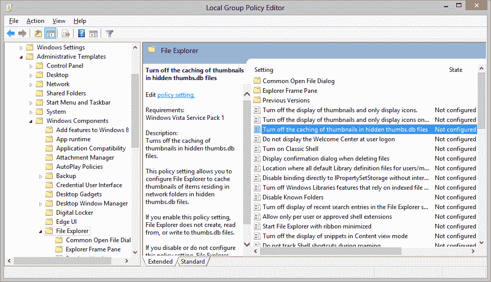
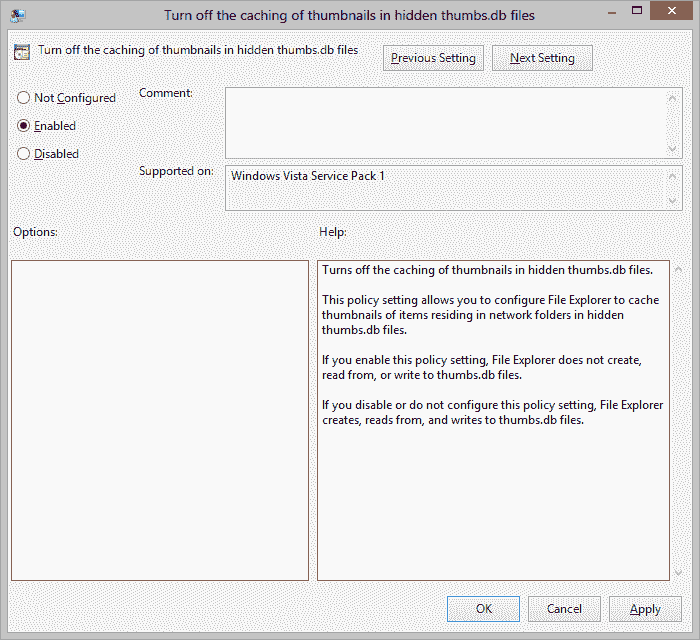

# 如何在 Windows 中关闭 Thumbs.db 图像缓存文件

> 原文：<https://www.sitepoint.com/switch-off-thumbs-db-in-windows/>

很抱歉这篇令人讨厌的文章，但它解决了许多使用 Windows 作为主要操作系统的 web 开发人员遇到的一个问题。Thumbs.db 是一个图像缓存，可以加快缩略图查看速度。在 Windows Vista、7 和 8 中，只要在文件夹中遇到图像，就会自动创建该文件。它通常是隐藏的，但可以出现，消失，而且往往无法删除。

我理解 Thumbs.db 的观点，但这并不能阻止一些令人恼火的事情:

*   它影响版本控制。如果你使用的是像 [TortoiseGit](http://code.google.com/p/tortoisegit/) 或[tortoisevn](http://tortoisesvn.net/)这样的系统，当你没有修改任何文件时，Thumbs.db 会显示“已更改”图标。
*   它们经常被上传到没有意义的服务器上。
*   除非你的电脑速度很慢，否则你可能不会注意到速度有任何提高。
*   我不想让自动生成的文件塞满我的系统，谢谢！

幸运的是，有一个简单的方法来防止更多的拇指。db 麻烦:

1.  确保您使用管理员帐户登录。
2.  点击 Win+R，在运行窗口中键入 **gpedit.msc** 并点击 OK。将启动**本地组策略编辑器**。
3.  Navigate through the tree to User Configuration > Administrative Templates > Windows Components > then either **Windows Explorer** (Windows Vista/7) or **File Explorer** (Windows 8).

    

4.  在右侧窗格中，双击*“关闭隐藏 thumbs.db 文件中缩略图的缓存”*。
5.  Select **Enabled** (don’t make my mistake of choosing “Disabled” — you’re enabling the switching off of Thumbs.db. Not particularly intuitive, Microsoft!)

    

确定您的出路，它的工作已经完成-你永远不会再被拇指. db 文件困扰了！

对本文的评论已经关闭。有关于 Windows 和服务器的问题吗？为什么不在我们的[论坛](https://www.sitepoint.com/forums/forumdisplay.php?140-General-Web-Development-amp-Application-Design-Issues?utm_source=sitepoint&utm_medium=link&utm_campaign=forumlink)上问呢？

## 分享这篇文章