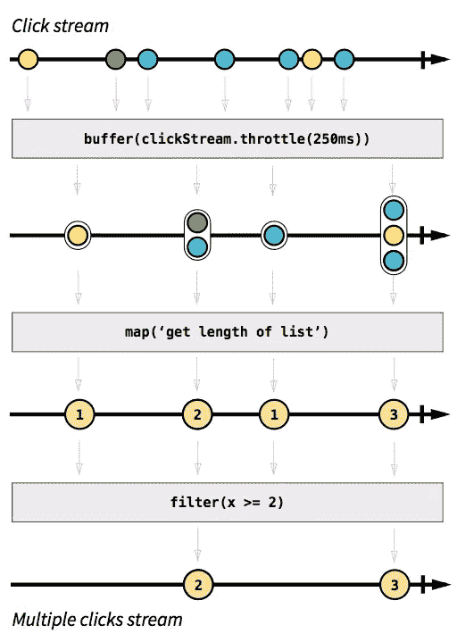
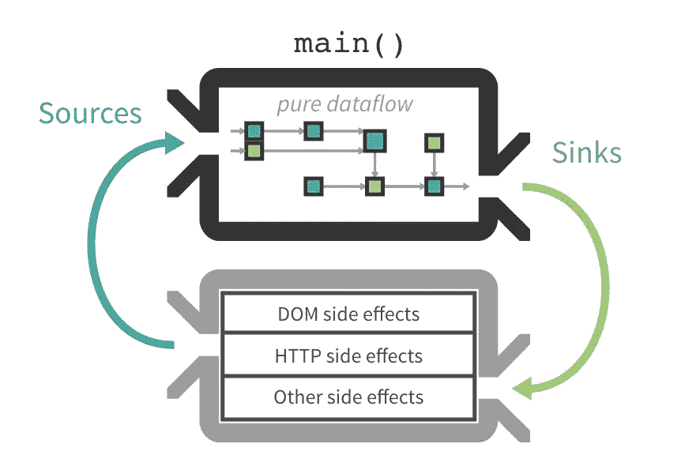

# 为什么我要从 React 切换到 Cycle.js

> 原文：<https://www.sitepoint.com/switching-from-react-to-cycle-js/>


我猜现在大多数开发者都在使用某种框架来开发应用程序。框架可以帮助我们构建复杂的应用程序并节省我们的时间。每天我们都能看到很多关于哪个框架最好，应该先学哪个框架等等的讨论。所以今天，我想分享我的经验，以及为什么我要从 React 转到 Cycle.js。

React 可能是目前最流行的前端框架，它有一个很棒的社区。我是它的忠实粉丝，它真的帮助我改变了我对网络应用的看法和开发方式。有的开发者爱它，有的认为它没有大家说的那么好。

大多数人开始使用 React，却没有想到可能有更好的方法来构建 web 应用程序。这个想法让我尝试了 Cycle.js，这是一个新的反应式框架，越来越受欢迎。在这篇文章中，我想解释什么是反应式编程，Cycle.js 是如何工作的，以及为什么我认为它比 React 好。所以我们开始吧！

## 什么是反应式编程？

反应式编程(RP)是用异步数据流编程。如果你已经开发了一个 web 应用，你可能已经做了很多反应式编程。例如，点击事件是异步数据流。我们可以观察它们并产生一些副作用。RP 背后的想法是让我们有能力从任何东西创建数据流并操纵它们。然后，我们对所有副作用有了同样的抽象，这更容易使用、维护和测试。

你可能在想“为什么我需要这种新的反应式编程？”答案很简单:反应式编程将帮助你统一你的代码，使之更加一致。你不需要考虑事情应该如何工作，以及如何正确地实现它们。不管你处理什么数据(点击事件、HTTP 调用、web 套接字……)，都用同样的方式写代码就行了。一切都是数据流，每个数据流都有许多函数可以使用，比如`map`和`filter`。这些函数将返回可以使用的新流，等等。

反应式编程为你的代码提供了更大的抽象。它将赋予你创造交互式用户体验和关注业务逻辑的能力。


*图片取自*

## JavaScript 中的反应式编程

在 JavaScript 中，我们有几个非常棒的库来处理数据流。最知名的是 [RxJS](http://reactivex.io/rxjs/) 。它是[react vex](http://reactivex.io/)的扩展，这是一个使用可观察流进行异步编程的 API。您可以创建一个可观察对象(一个数据流)，并用各种函数操纵它。

第二个是 [Most.js](https://github.com/cujojs/most) 。它有最好的性能，他们可以用一些数字来证明:[性能对比](https://github.com/cujojs/most/tree/master/test/perf)。

我还想提一个小而快的库，它是由 Cycle.js 的创建者专门为它开发的。叫做 [xstream](http://staltz.com/xstream/) 。它只有 26 个方法，大约 30kb，是 JS 中反应式编程最快的库之一。

在下面的例子中，我将使用`xstream`库。Cycle.js 被做成了一个小框架，我想给它附加一个最小的反应库。

## 什么是 Cycle.js？

Cycle.js 是一个功能性和反应性的 JavaScript 框架。它将您的应用程序抽象为一个纯函数。在函数式编程中，函数应该只有输入和输出，没有任何副作用。在 Cycle.js 的`main()`函数中，输入是来自外部世界的读取效果(源)，输出(汇)是对外部世界的写入效果。使用驱动程序来管理副作用。驱动程序是处理 DOM 效果、HTTP 效果和网络套接字等的插件。


*图片取自 Cycle.js 网站*

Cycle.js 帮助我们构建用户界面，测试它们并编写可重用的代码。每个组件只是一个可以独立运行的纯函数。

核心 API 只有一个函数`run`。

```
run(app, drivers); 
```

它有两个参数，`app`和`drivers`。`app`是主要的纯功能，`drivers`是需要处理副作用的插件。

Cycle.js 将附加功能分成更小的模块。它们是:

*   [@ cycle/dom](https://github.com/cyclejs/cyclejs/tree/master/dom)–一组使用 DOM 的驱动程序；它有一个 dom 驱动和 HTML 驱动，基于 [snabdom](https://github.com/snabbdom/snabbdom) 虚拟 DOM 库
*   [@周期/历史](https://github.com/cyclejs/cyclejs/tree/master/history)–历史 API 的驱动程序
*   [@ cycle/HTTP](https://github.com/cyclejs/cyclejs/tree/master/http)–HTTP 请求的驱动程序，基于 [superagent](https://github.com/visionmedia/superagent)
*   [@ cycle/isolate](https://github.com/cyclejs/cyclejs/tree/master/isolate)–一个用于制作作用域数据流组件的函数
*   [@ cycle/jsonp](https://github.com/cyclejs/cyclejs/tree/master/jsonp)–通过 JSONP 进行 HTTP 请求的驱动程序
*   [@ cycle/most-run](https://github.com/cyclejs/cyclejs/tree/master/most-run)–用`most`制作的 app 的一个`run`功能
*   [@循环/运行](https://github.com/cyclejs/cyclejs/tree/master/run)–用`xstream`制作的应用的`run`功能
*   [@ cycle/rxjs-run](https://github.com/cyclejs/cyclejs/tree/master/rxjs-run)–用`rxjs`制作的 app 的`run`功能

## Cycle.js 代码

来看看一些 Cycle.js 代码？我们将创建一个简单的应用程序，应该演示它是如何工作的。我认为一个好的旧计数器应用程序应该是这个例子的理想选择。我们将看到如何在 Cycle.js 中处理 DOM 事件和重新呈现 DOM。

让我们创建两个文件，`index.html`和`main.js`。`index.html`将只服务于我们的`main.js`文件，我们的整个逻辑将在那里。我们还将创建一个新的 package.json 文件，因此运行:

```
npm init -y 
```

接下来，让我们安装我们的主要依赖项:

```
npm install @cycle/dom @cycle/run xstream --save 
```

这将安装`@cycle/dom`、`@cycle/xstream-run`和`xstream`。我们还需要`babel`、`browserify`和`mkdirp`，让我们安装它们:

```
npm install babel-cli babel-preset-es2015 babel-register babelify browserify mkdirp --save-dev 
```

为了使用 Babel，创建一个包含以下内容的`.babelrc`文件:

```
{
  "presets": ["es2015"]
} 
```

我们还需要向 package.json 添加脚本来运行我们的应用程序:

```
"scripts": {
  "prebrowserify": "mkdirp dist",
  "browserify": "browserify main.js -t babelify --outfile dist/main.js",
  "start": "npm install && npm run browserify && echo 'OPEN index.html IN YOUR BROWSER'"
} 
```

为了运行我们的 Cycle.js 应用程序，我们将使用`npm run start`。

仅此而已。我们的设置已经完成，我们可以开始编写一些代码。让我们在`index.html`中添加一些 HTML 代码:

```
< !DOCTYPE html>
<html lang="en">
<head>
    <meta charset="UTF-8"/>
    <title>Cycle.js counter</title>
</head>
<body>
    <div id="main"></div>
    <script src="./dist/main.js"></script>
</body>
</html> 
```

我们已经创建了一个 id 为`main`的 div。Cycle.js 将连接到该 div，并在其中呈现整个应用程序。我们还包含了`dist/main.js`文件。这是将从`main.js`创建的传输和捆绑的 JS 文件。

是时候写一些 Cycle.js 代码了。打开`main.js`文件并导入我们需要的所有依赖项:

```
import xs from 'xstream';
import { run } from '@cycle/run';
import { div, button, p, makeDOMDriver } from '@cycle/dom'; 
```

我们包括了`xstream`、`run`、`makeDOMDriver`和帮助我们使用虚拟 DOM 的函数(`div`、`button`和`p`)。

让我们写我们的`main`函数。它应该是这样的:

```
function main(sources) {
  const action$ = xs.merge(
    sources.DOM.select('.decrement').events('click').map(ev => -1),
    sources.DOM.select('.increment').events('click').map(ev => +1)
  );

  const count$ = action$.fold((acc, x) => acc + x, 0);

  const vdom$ = count$.map(count =>
    div([
      button('.decrement', 'Decrement'),
      button('.increment', 'Increment'),
      p('Counter: ' + count)
    ])
  );

  return {
    DOM: vdom$,
  };
}

run(main, {
  DOM: makeDOMDriver('#main')
}); 
```

这是我们的`main`功能。它得到`sources`并返回`sinks`。源是 DOM 流，汇是虚拟 DOM。先来一部分一部分解释。

```
const action$ = xs.merge(
  sources.DOM.select('.decrement').events('click').map(ev => -1),
  sources.DOM.select('.increment').events('click').map(ev => +1)
); 
```

这里我们将两个流合并成一个名为`action$`的流(在包含流的变量名称后面加上一个`$`是惯例)。一个是一连串点击`decrement`，另一个是点击`increment`按钮。我们将这两个事件分别映射到数字`-1`和`+1`。在合并结束时，`action$`流应该是这样的:

```
----(-1)-----(+1)------(-1)------(-1)------ 
```

下一个流是`count$`。它是这样创建的:

```
const count$ = action$.fold((acc, x) => acc + x, 0); 
```

[`fold`](http://staltz.com/xstream/#fold) 函数非常适合这个目的。它接受两个参数，`accumulate`和`seed`。`seed`首先发出，直到事件到来。下一个事件基于`accumulate`功能与`seed`结合。基本上是`reduce()`流。

我们的`count$`流接收 0 作为起始值，然后对于来自`action$`流的每个新值，我们将其与`count$`流中的当前值相加。

最后，要让整个循环工作，我们需要调用`main`下面的`run`函数。

最后一件事是创建虚拟 DOM。下面是实现这一点的代码:

```
const vdom$ = count$.map(count =>
  div([
    button('.decrement', 'Decrement'),
    button('.increment', 'Increment'),
    p('Counter: ' + count)
  ])
); 
```

我们正在映射`count$`流中的数据，并为流中的每一项返回一个虚拟 DOM。虚拟 DOM 包含一个主 div 包装器、两个按钮和一个段落。如你所见，Cycle.js 使用 JavaScript 函数来处理 DOM，但是 [JSX 也可以被实现](https://cycle.js.org/getting-started.html#getting-started-coding-consider-jsx)。

在`main`函数的结尾，我们返回我们的虚拟 DOM:

```
return {
  DOM: vdom$,
}; 
```

我们正在传递我们的`main`函数和一个连接到 ID 为`main`的 div 的 DOM 驱动程序，并从该 div 获取事件流。我们正在封闭我们的圈子，打造完美的 Cycle.js 应用。

它是这样工作的:


就是这样！这就是你处理 DOM 流的方式。如果你想了解 HTTP 流在 Cycle.js 中是如何工作的，我已经写了一篇文章(在我的博客上)[HTTP://Ivan jov . com/working-with-HTTP-streams-with-cycle-js/]

我已经将所有代码推送到一个 [Github repo](https://github.com/IvanJov/cycle-js-counter) 中。检查它并尝试在您的本地机器上运行它。

## 为什么我要从 React 切换到 Cycle.js？

既然您已经理解了反应式编程的基本概念，并且已经在 Cycle.js 中看到了一个简单的例子，那么让我们来谈谈为什么我会在我的下一个项目中使用它。

我在设计 web 应用程序时遇到的最大问题是如何处理大型代码库和来自不同来源的大量数据。我是 React 的粉丝，我已经在许多项目中使用了它，但是 React 没有解决我的问题。

当渲染一些数据和改变应用程序状态时，React 工作得非常好。事实上，整个组件方法论是惊人的，它真的帮助我写出了更好的、可测试的和可维护的代码。但是那里总是缺少一些东西。

让我们来看看使用 Cycle.js over React 的一些利弊。

### 赞成的意见

#### 1.大型代码库

当你的应用变大时，React 会有一些问题。想象一下，在 100 个容器中有 100 个组件，每个组件都有自己的风格、功能和测试。在许多目录下的许多文件中有许多行代码。你明白我的意思，很难浏览这些文件。

Cycle.js 在这里帮助了我们。它通过将项目分割成独立的组件来处理大型代码库，这些组件可以被隔离和测试而不会产生副作用。没有 Redux，没有副作用，一切都是纯数据流。

#### 2.数据流

我在 React 遇到的最大问题是数据流。React 在设计时并没有考虑数据流，这不是 React 的核心。开发人员试图解决这个问题，我们有许多库和方法来处理这个问题。最受欢迎的是 Redux。但它并不完美。您需要花一些时间来配置它，并且需要编写一个代码来处理数据流。

对于 Cycle.js，创建者希望创建一个框架来处理数据流，因为你不应该考虑它。你只需要写一些对数据和 Cycle 做一些操作的函数，js 会处理其他的一切。

#### 3.副作用

React 在处理副作用方面有问题。React 应用程序中没有处理副作用的标准化方法。有很多工具可以帮助你解决这个问题，但是这也需要一些时间来设置和学习如何使用它们。最受欢迎的有[还原传奇](https://github.com/redux-saga/redux-saga)、[还原特效](https://github.com/redux-effects/redux-effects)、[还原副作用](https://github.com/gregwebs/redux-side-effect)和[还原循环](https://github.com/redux-loop/redux-loop)。你明白我的意思吗？有很多…你需要选择库并在你的代码库中实现它。

Cycle.js 不要求这样。简单地包括你想要的驱动程序(DOM、HTTP 或其他)并使用它。驱动程序会把数据发送给你的纯函数，你可以修改它，然后把它发送回驱动程序，驱动程序会渲染它或者做其他的事情。最重要的是，它是标准化的；这是 Cycle.js 自带的，你不需要依赖第三方库。这么简单！

#### 4.函数式编程

最后但同样重要的是，函数式编程。React 的创建者声称 React 使用函数式编程，但事实并非如此。如果使用不当，有很多 OOP、类和关键字`this`的使用会让你头疼… Cycle.js 是在考虑函数式编程范式的情况下构建的。一切都是不依赖于任何外在状态的函数。还有，没有上课之类的。这样更容易测试和维护。

### 骗局

#### 1.社区

目前，React 是最流行的框架，它被广泛使用。Cycle.js 不是。它仍然不是很流行，当你遇到一些计划外的情况，并且找不到代码中问题的解决方案时，这可能是一个问题。有时候在网上找不到答案，就剩下自己了。当你在做一些副业项目并且有充足的空闲时间时，这不是问题，但是当你在一个时间紧迫的公司工作时，会发生什么呢？您将会损失一些调试代码的时间。

但这种情况正在改变。许多开发人员开始使用 Cycle.js，谈论它，谈论问题，并一起努力解决它们。Cycle.js 也有很好的文档，里面有很多例子，到目前为止，我还没有遇到过任何难以调试的复杂问题。

#### 2.学习新的范式

反应式编程是一种不同的范式，你需要花一些时间来习惯事情是如何完成的。在那之后，一切都会变得容易，但是如果你有一个很紧的截止日期，那么花时间学习新的东西会是一个问题。

#### 3.有些应用程序不需要被动

是啊，有些应用真的不需要反应。博客、营销网站、登陆页面等互动性有限的静态网站不需要反应式。没有实时通过应用程序的数据，没有那么多的表格和按钮。使用一个被动的框架可能会降低我们在这个网站上的速度。您应该能够评估一个 web 应用程序是否真的需要使用 Cycle.js。

## 结论

一个理想的框架应该帮助你专注于制作和交付特性，而不应该强迫你写样板代码。我认为 Cycle.js 向我们展示了这确实是可能的，并迫使我们寻找更好的方法来编写代码和提供功能。但是请记住，没有什么是完美的，总有改进的余地。

你试过反应式编程或者 Cycle.js 吗？我说服你试一试了吗？请在评论中告诉我你的想法！

*本文由[迈克尔·万约克](https://www.sitepoint.com/author/mwanyoike)进行同行评审。感谢 SitePoint 的所有同行评审员使 SitePoint 的内容尽可能做到最好！*

## 分享这篇文章