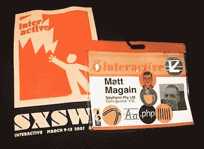

# SXSW 互动 2007:最后总结

> 原文：<https://www.sitepoint.com/sxsw-interactive-2007-final-wrap-up/>

(阅读 SXSW 节[第一天](https://www.sitepoint.com/sxsw-interactive-2007-day-one/)、[第二天](https://www.sitepoint.com/sxsw-interactive-2007-day-two/)、[第三天](https://www.sitepoint.com/sxsw-interactive-2007-day-three/)的报道。)

所有节日之母就这样结束了。以下是最后一天的一些亮点:

*   [Web Typography Sucks](http://2007.sxsw.com/interactive/programming/panels/?action=show&id=IAP060264)

    英国打字爱好者马克·波尔顿和 T2·理查德·鲁特联手评选出了 SXSW 的最佳版面，捕捉到了网络排版的现状，并提供了一大堆建议，每个在网络上工作的人都可以改进它。我原以为内容会相对简单，但事实上它是全面的、实用的，并且充满激情和权威——这是一个强有力的组合。

    以下是一些要点:

    *   许多页面无法保持垂直节奏。理查德用音乐做了类比——音乐被分成等长的小节，因此文本也应该努力达到相似的节奏。他介绍了一个公式，可以遵循该公式来帮助在 ems 中实现正确的行高(详情请参见[演示幻灯片](http://webtypography.net/sxsw2007/))。
    *   马克谈到了空白，以及空白是任意的而不是任意的。(不幸的是，他没有详细说明这如何转化为设计受浏览器窗口大小影响的流动布局，但总的来说，这些指导方针似乎是合理的。)为了说明这一点，他给出了一个网格布局的例子，展示了一个分成固定大小网格的页面。
    *   演讲者讨论了我的一个大问题，实体在网络上被误用和滥用的事实。Mark 哀叹列表缩进的趋势——这种做法随着 Microsoft Word 的出现而变得流行(是的，我意识到我在缩进列表中告诉你这一点是一种讽刺)。

    这次演讲的最后一点是，印刷世界的出版商对细节的关注与网络出版商截然不同。无论我们是文案、设计师、开发人员还是其他人，我们都应该关心这些东西。

*   [Design Aesthetic of the Indie Developer](http://2007.sxsw.com/interactive/programming/panels/?action=show&id=IAP060141)

    苹果工程师迈克尔·洛普召集了[薄荷](http://haveamint.com/)创造者[肖恩·因曼](http://shauninman.com/)、[FeedDemon](http://www.feeddemon.com/)/[top style](http://www.newsgator.com/NGOLProduct.aspx?ProdID=TopStyle)/[HomeSite](http://www.adobe.com/products/homesite/)创造者[尼克·布拉德伯里](http://nick.typepad.com/)和[约翰·格鲁伯](http://daringfireball.net/)，他们都曾是相对成功的独立软件开发人员，他们就设计过程和一个人团队开发产品时面临的问题进行了炉边谈话。

    讨论中出现了一些金块，包括:

    *   做好失败的准备(或者至少挠挠痒或者顺藤摸瓜)可能是生产一个伟大产品的必要条件——Shaun 的 ShortStat 就是创造 Mint 的一个例子。
    *   如果你的产品很好，你不应该被谷歌的到来所吓倒，因为它会免费提供一些与之竞争的东西。如果用户喜欢你所做的——即使是因为它看起来更好或者使用起来更直观——他们会为此付费。
    *   倾听那些讨厌的人:那些提供刺耳的、侮辱性反馈的人通常是那些能够提供如何改进产品的最敏锐洞察力的人。

    所有小组成员都承认，在家工作与在办公室工作面临着不同的问题，包括缺乏明确的“下班”时间，以及必须应对孩子打扰的潜在要求。但是对于每个小组成员来说，能够花更多的时间和家人在一起并实现自己的梦想已经足够了。

*   [Can Social Networking Build Your Brand?](http://2007.sxsw.com/interactive/programming/panels/?action=show&id=IAP060132)

    这个演讲是由 Jason Schwartz 做的，尽管我最初持怀疑态度，但它传达了对想要建立在线业务的营销者的相当深刻的见解。杰森的演讲围绕着一场在社交网站上创建虚假用户档案的营销活动，包括 [Flickr](http://flickr.com/) 、 [YouTube](https://www.youtube.com/) 、 [del.icio.us](http://del.icio.us/) 和 [MySpace](http://myspace.com/) 。

    他对结果进行了剖析，并提出了一些建议，包括该活动在哪些方面取得了成功(产生了流量)，在哪些方面失败了(一旦发现这些账户不属于一个真实的人，所有的账户都会被删除)，他们本可以采取哪些不同的做法(作为品牌档案的合作伙伴，而不是不提供任何披露)，以及此类活动的道德规范(不多)。

    理查德·麦克马努斯为《莎尔玛·海雅克日历》撰写了一篇关于坎帕里酒店“红色激情”活动的综合报道，杰森的演讲正是基于此。

    有一点没有提到的是，这种流量可能更多地与实际产品的性质有关——一组超级模特的性感照片——而不是社交网络的建立。贾森*做得好的是*向观众中的非极客(有很多)描述了如何利用像[simicio . us](http://similicio.us/)和 [Technorati](http://technorati.com/) 的相关标签这样的工具来定位潜在的网站，在这些网站上做广告*不是*最明显的。

我们对 2007 SXSW 互动节的报道到此结束。

我们登上了 16 个小时的飞机回家，心中充满了新的想法，我们的头因为缺乏睡眠而跳动，我们的肝脏受到了严重的冲击。如果你已经读到这里，喜欢你所读到的，并且在网上工作，但是从来没有去过 SXSW，那么我敦促你——恳求你——在你的一生中至少尝试去朝圣一次。刮，存，借，求。不惜一切代价。

毫无疑问，这是你应该努力参加的*活动——甚至不是为了小组讨论(我很喜欢我所看到的，但其中一些肯定很一般),而是为了社交机会。没有其他地方能让你有如此多的机会向网络上的思想家和实干家请教，并与他们分享一品脱啤酒。你在这样的活动中建立的关系不仅是有益的，而且是无价的。*

 *去吧，你不会失望的。我在那里等你。* 

## *分享这篇文章*