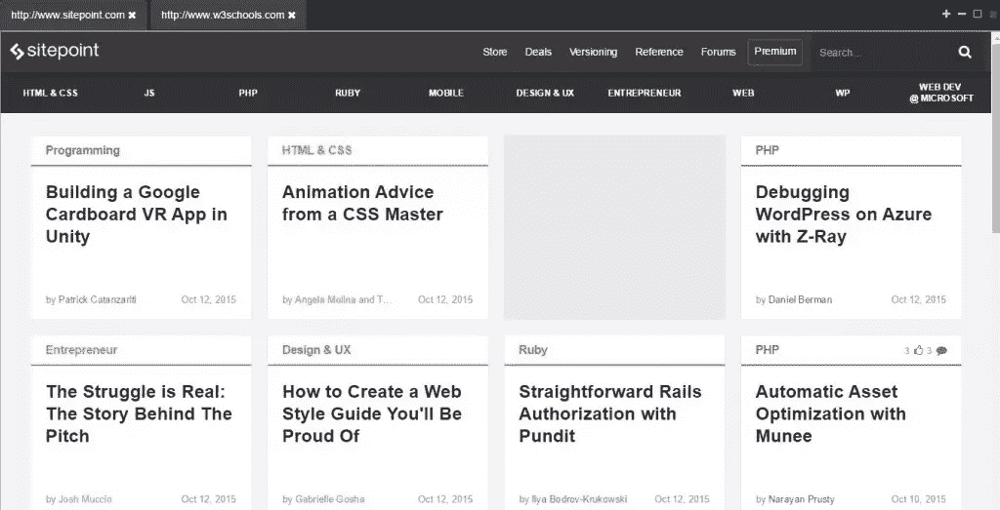
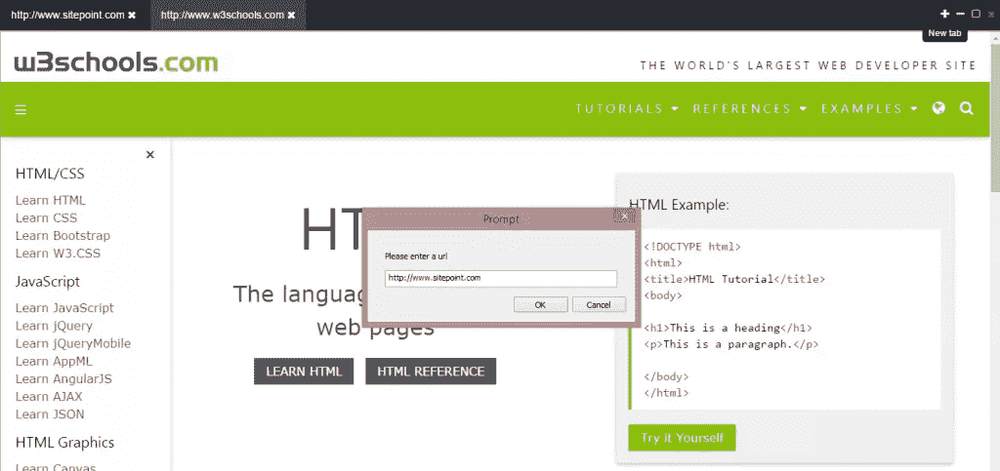

# 使用 Node-Webkit 和 AngularJS 创建选项卡式浏览器

> 原文：<https://www.sitepoint.com/tabbed-browser-node-webkit-angularjs/>

*这篇文章由[埃德温·雷诺索](https://www.sitepoint.com/author/ereynoso/)、[蒂姆·塞韦里恩](https://twitter.com/TimSeverien)和[迪威·托利亚](https://twitter.com/designMoreWeb)进行了同行评议。感谢 SitePoint 的所有同行评审员使 SitePoint 的内容尽可能做到最好！*

在过去，跨平台软件开发通常意味着为不同的操作系统用不同的语言编写相同的应用程序。可以想象，对于项目经理、开发人员和客户来说，这都是一个困难的局面。

然后，在 2011 年， [Roger Wang](https://twitter.com/wwr) 推出了一个叫做 [Node-Webkit](https://github.com/nwjs/nw.js) 的东西。Node-Webkit(后来更名为 NW.js)是 Node.js 和嵌入式 Webkit 浏览器的组合，允许开发人员使用 web 技术(即 HTML、CSS 和 JavaScript)开发本地应用程序。对，没错！我们可以编写本地应用程序，使用现代浏览器支持的所有好东西。例如，CSS3 动画、WebGL、WebRTC、视频、音频等等都可以合并到一个本地应用程序中。

在本教程中，我将演示如何利用 NW.js 的能力来制作一个选项卡式浏览器，它可以部署在所有主要的操作系统上。一如既往，本教程的代码可以在我们的 [GitHub repo](https://github.com/sitepoint-editors/sitepoint-browser) 上找到。

## 初始设置

顾名思义，NW.js 是基于 Node 的，所以您需要在您的操作系统上安装它。我们还将利用 npm(节点包管理器)。如果你需要帮助来设置这些东西，那么看看我们的教程:[NPM 初学者指南](https://www.sitepoint.com/beginners-guide-node-package-manager/)。

接下来，我们的项目需要一个文件夹:

```
mkdir sitepoint-browser && cd sitepoint-browser 
```

我们还需要一些应该在全球范围内安装的依赖项(即 Yeoman、Grunt 和 Bower):

```
npm install -g yo grunt bower 
```

其中， [Yeoman](http://yeoman.io/) (又名 Yo)是一个动态搭建日常项目的工具，从而避免了总是必须手动创建可重用项目结构的障碍。 [Grunt](http://gruntjs.com/) 是约曼使用的任务跑者。它还使用 npm 和 [Bower](http://bower.io) 来安装所需的依赖项。

接下来，我们将安装 Yo 的[发电机断网](https://github.com/christiannwamba/generator-wean)。您可以在全局或本地完成此操作。在这里，我将在全球范围内进行:

```
npm install -g generator-wean 
```

NW.js 本身有一些生成器，但是 generator-wean(由我编写)与 ExpressJS 和 AngularJS 捆绑在一起，这减轻了安装和配置它们的压力。WEAN 代表 Webkit、Express、Angular 和 Node，就像流行的[表示](https://en.wikipedia.org/wiki/MEAN_%28software_bundle%29)一样。

现在，我们的框架应用程序可以通过一个命令生成:

```
yo wean 
```

Yo 是一个交互式的家伙，生成器会问你一些问题，以便帮助你制作一个最适合你想要的项目。在这里，您可以接受默认值。

### 文件夹结构

文件夹结构将如下所示:

```
.
├── app
│   ├── app.js
│   ├── index.html
│   ├── public
│   │   ├── css
│   │   │   └── app.css
│   │   ├── js
│   │   │   └── app.js
│   │   ├── libs
│   │   │   ├── angular
│   │   │   ├── bootstrap
│   │   │   └── jquery
│   │   └── partials
│   │       └── header.html
│   ├── routes
│   │   └── index.js
│   └── views
│       └── index.ejs
├── node_modules
├── bower.json
├── Gruntfile.js
├── package.json
└── README.md 
```

对于这个项目，我们主要对`public`目录的内容感兴趣。生成器会用一堆样板文件(一个非常简单的 Angular 应用程序)填充这些文件，但是我们会在进行过程中解决这个问题。

我们现在可以使用以下代码运行 skeleton 应用程序:

`grunt run`或者仅仅是`grunt`

在应用程序开发的任何阶段都可以使用该命令来预览更改。它执行 NW.js 项目，该项目反过来使用 Express 进行路由，就像您在创建 web 应用程序时一样。这是一个很好的例子，说明了我们如何在初始化后将节点模块注入到`app/index.html`中来使用 NW.js 中的节点模块。

NW.js 也有开发者工具和工具栏，我们可以在那里找到刷新、调试、检查、记录等控件，就像我们在 Chrome 中构建 web 应用程序一样。你可以通过点击 skeleton 应用程序中的汉堡图标来访问它们。

## 处理用户界面

本教程最重要的方面是能够从我们的本地应用程序上网冲浪。[网页视图](https://developer.chrome.com/apps/tags/webview)和`iframe`标签是我们计划的完美候选。标签`webview`是有效的，但对游戏来说很新，因为它[最近才被添加到 NW.js](https://github.com/nwjs/nw.js/issues/1030#issuecomment-70971589) 中。然而,`iframe`标签从 HTML 4 开始就存在了，并得到了广泛的支持。我们将使用它，因为它为大多数开发人员所熟知。

引导程序将作为我们 UI 的基础。我们将使用来自 [Bootswatch](https://bootswatch.com) 的名为 [Slate](https://bootswatch.com/slate) 的自定义引导主题。[下载 Slate](https://bootswatch.com/slate/bootstrap.css) 并将其放置在`app/public/css/bootstrap.css`中。

对于我们的图标，我们将使用[字体牛逼](https://fortawesome.github.io/Font-Awesome/)。从项目根运行:

```
bower install --save fontawesome 
```

这将把字体 Awesome 下载到我们的`libs`文件夹，就像其他 bower 依赖项一样。这是因为我们在项目根目录的`.bowerrc`文件中指定了下面一行(否则默认为`bower_components`)。

```
{
  "directory" : "app/public/libs"
} 
```

幸运的是，Bootstrap 将处理大多数 UI 任务，但我们需要调整一些组件和内容，以实际制作一个看起来不错的浏览器。为了实现这一点，我们将编写一些简单而简短的 CSS 并将其放在`app/public/css/app.css`中:

```
html,
.tab-content,
.tab-pane,
body > div {
  height: 100%;
}

iframe {
  background: white;
}

.controls {
  position: fixed;
  top: 10px;
  right: 8px;
}

.controls > i {
  padding: 0 3px;
}

.controls > i:last-child {
  color: red;
}

.controls > i:hover {
  color: white;
  cursor: pointer;
}

.close-tab:hover {
  color: red;
  cursor: pointer;
} 
```

将`html`、`body`、`tab-content`和`tab-pane`的高度设置为 100%，以确保无论我们的浏览器 app 大小如何，内容都应该填满窗口的高度。默认情况下，宽度为 100%，因此不需要明确指定。我们也给了我们的浏览器控件一个最小化的风格，我们将会看到。

为了确保我们所有的 CSS 文件都被加载，将下面的内容复制到`app/views/index.ejs`的 head 部分。这应该取代已经存在的两个样式表。

```
<link rel="stylesheet" href="css/bootstrap.css">
<link rel="stylesheet" href="libs/font-awesome/css/font-awesome.css">
<link rel="stylesheet" href="css/app.css"> 
```

## 安装我们的依赖项

如上所述，我的 WEAN 生成器与 [AngularJS](https://angularjs.org/) 捆绑在一起，我们将在我们的浏览器应用程序中使用它。我们还将利用 [Bootstrap 的标签组件](http://getbootstrap.com/components/#nav-tabs)来显示我们浏览器的标签。然而[在尝试将引导 JavaScript 组件引入 Angular 项目时有一个已知的问题](https://scotch.io/tutorials/how-to-correctly-use-bootstrapjs-and-angularjs-together)，这就是 Angular 团队创建 [Angular 引导 UI](https://angular-ui.github.io/bootstrap/) 的原因。

让我们把它加入到我们的项目中。从根目录运行:

```
bower install --save angular-bootstrap 
```

AngularJS 在安全方面很好，并且对被认为是潜在有害的东西进行限制。在我们的应用程序中，当 Angular 遇到可信的 HTML 被注入到我们的代码中时，我们将不得不清理我们的 HTML 并阻止它抛出错误。处理这种情况的一个模块是 [ngSanitize](https://github.com/angular/bower-angular-sanitize) (我们很快就会遇到)。这也应该使用 Bower 安装:

```
bower install --save angular-sanitize 
```

如果 Bower 要求您选择库的版本，请选择解析为 angular#1.4.6 的版本。

正如我们对 CSS 文件所做的那样，让我们在`app/views/index.ejs`中的`body`结束标记之前包含 JS 依赖关系:

```
<html ng-app="browser">
  ...
  <body ng-controller="main">
    <script src="libs/jquery/dist/jquery.min.js"></script>
    <script src="libs/angular/angular.js"></script>
    <script src="libs/angular-sanitize/angular-sanitize.js"></script>
    <script src="libs/angular-bootstrap/ui-bootstrap-tpls.js"></script>
    <script src="js/app.js"></script>
  </body>
</html> 
```

请注意，`ng-app`属性已被设置为`browser`，而`ng-controller`属性已被设置为`main`。现在也是清除剩余样板代码的好时机。

在设置过程中要做的最后一件事是将我们刚刚下载的依赖项注入到我们的 Angular 应用程序`app/public/js/app.js`:

```
angular.module('browser', ['ui.bootstrap', 'ngSanitize'])
  .controller('main', function(){}); 
```

至此，我们已经有了应用程序的框架。我们的 CSS 文件(库和自定义)已经安装和/或创建。JavaScript 文件及其依赖项也已经可用并添加到应用程序中。如果您此时运行`grunt`，您应该看到的是一个空白窗口。激动人心吧。

现在，开发过程中剩下的就是充实标记的剩余部分，并在`app.js`中创建行为。

## 加价

NW.js 的视图使用 HTML。我们已经用生成器(`app/views/index.ejs`)创建了一个，并在其中加载了一些文件。我们现在需要添加标记，帮助我们在本地应用程序中启动网页。

```
<uib-tabset>
  <iframe-tab tabs="tabs">
  </iframe-tab>
</uib-tabset> 
```

标签`uib-tabset`是由 Angular Bootstrap UI 库提供的角度指令[来帮助实现一个 tabs 组件，而`iframe-tab`将在我们的应用程序中创建，以定制 Bootstrap 的 UI `tab`指令来适应我们。将使用作为属性出现在`iframe-tab`标签上的`tabs`范围来配置`iframeTab`指令。](https://angular-ui.github.io/bootstrap/#/tabs)

## 执行指令

像 Chrome 和 Firefox 这样的标签式浏览器更容易导航，提高了用户的工作效率。我们自己的浏览器不应该被遗漏。在`app/public/js/app.js`文件中，我们将创建一个最小的指令来实现跳转。

```
.directive('iframeTab', function () {
  return {
    restrict: 'E',
    scope: {
      tabs: '='
    },
    replace: true,
    template: '<uib-tab ng-repeat="tab in tabs" active="tab.active">' +
    '<uib-tab-heading>{{tab.url}} <i class="fa fa-times close-tab"' +
    'ng-click="closeTab($index)"></i></uib-tab-heading>' +
    '<iframe src="{{trustSrc(tab.url)}}"' +
    'style="width:100%; height:100%" nwdisable nwfaketop></iframe>' +
    '</uib-tab>'
  };
}) 
```

我们在这里做的是创建一个可重用的模板，可以使用 Angular 动态创建。在`iframe` src 属性上的`trustSrc()`方法将在我们的控制器中创建。

解释 Angular 中的指令如何工作超出了本文的范围。如果你需要复习，看看:[AngularJS 指令实用指南](https://www.sitepoint.com/practical-guide-angularjs-directives/)。

## 一些支持服务

Angular 使用服务进行代码组织、可重用性、与 API 通信以及在其控制器之间共享逻辑。我们需要为自己创建三个:一个(`prompt`)使用提示来获取 URL 输入，另外两个(`GUI`和`Window`)与 NW.js' [GUI](https://github.com/nwjs/nw.js/wiki/API-Overview-and-Notices#overview) 和[Window](https://github.com/nwjs/nw.js/wiki/window)API 通信，这样我们就可以创建自定义的最小化、全屏和关闭按钮:

```
.factory("prompt", function ($window, $q) {
  function prompt(message, defaultValue) {
    var defer = $q.defer();
    var response = $window.prompt(message, defaultValue);
    if (response === null) {
      defer.reject();
    } else {
      defer.resolve(response);
    }
    return (defer.promise);
  }
  return (prompt);
})
.factory('GUI', function () {
  return require('nw.gui');
})
.factory('Window', function (GUI) {
  return GUI.Window.get();
}); 
```

### 控制器终于出现了

顾名思义，控制器将控制应用程序中的数据流。我们将注入以下依赖:`$scope`、`$sce`(一个为 AngularJS 提供严格上下文转义服务的服务)、prompt、Window(我们上面创建的两个服务)。

```
.controller('main', function ($scope, $sce, prompt, Window) {
  //implementation here
}) 
```

我们将首先创建一个信任资源 URL 的方法(我们已经在指令中实现了该方法):

```
$scope.trustSrc = function (src) {
  return $sce.trustAsResourceUrl(src);
} 
```

让 SitePoint 成为我们的主页会很棒，所以我们将为我们的指令创建一个数组`tabs`,以 SitePoint 的 URL 作为第一个值进行循环。

```
$scope.tabs = [
  {
    url: 'https://www.sitepoint.com/'
  }
]; 
```

我们现在可以使用提示服务从用户那里获取 URL 来启动新的选项卡。我们将`active`属性设置为 true，这样新的选项卡就会获得焦点:

```
$scope.newTab = function () {
  prompt("Please enter a url", "http://www.sitepoint.com")
  .then(function (url) {
    var tab = {url: url, active:true}
    $scope.tabs.push(tab);
  },
  function () {
    alert("Error opening site!");
  });
}; 
```

关闭标签包括使用`Array#splice`函数从标签数组中删除值，如下所示:

```
$scope.closeTab = function (index) {
  $scope.tabs.splice(index, 1);
}; 
```

控制器的其余部分用于向控件添加行为，这些控件用于最小化、启用/禁用全屏和关闭窗口:

```
$scope.minimize = function () {
  Window.minimize();
};
$scope.toggleKioskMode = function () {
  Window.toggleKioskMode();
};
$scope.close = function () {
  Window.close();
}; 
```

尽管我们已经添加了实现，但我们还没有将这些控件添加到标记中。所以让我们现在就去做(在`app/views/index.ejs`):

```
<div class="controls">
   <i class="fa fa-plus" tooltip-placement="bottom"
   uib-tooltip="New tab" ng-click="newTab()"></i>
   <i class="fa fa-minus" ng-click="minimize()"></i>
   <i class="fa fa-square-o" ng-click="toggleKioskMode()"></i>
   <i class="fa fa-times" ng-click="close()"></i>
<div> 
```

就是这样！现在，您可以从终端使用`grunt`命令启动浏览器。





## 为平台而建

如果您回想一下文章的开头，我提到过在所有主流操作系统上部署 NW.js 应用程序是可能的。在 NW.js 项目页面上有大量关于如何做这个的[说明，或者你可以使用 generator-weane 的预配置`build`任务(我现在将演示)。](https://github.com/nwjs/nw.js/wiki/How-to-package-and-distribute-your-apps)

从项目根目录运行`grunt build`将为构建应用的操作系统构建应用，而`grunt build:all`将为所有平台构建应用。命令`grunt build:{platform}`(例如`grunt build:mac`)将为特定的操作系统构建。可能的选项有`win`、`osx`、`linux32`、`linux64`。更多信息，请参考[发电机-断奶自述](https://github.com/christiannwamba/generator-wean/#building)。

举例来说，如果您在 64 位 Linux 系统上运行:

```
grunt build 
```

这将生成一个包含可执行文件的`builds/test/linux64`目录，对应于您的项目名称。

## 结论

至此，我希望展示的不仅仅是 NW.js 的力量，还有 web 技术在制作原生应用程序方面的力量。我们不仅学习了如何制作一个原生浏览器，还看到了 NW.js、Yeoman 和其他工具在发挥作用。别忘了，[本教程的源代码在 GitHub](https://github.com/sitepoint-editors/sitepoint-browser) 上——我鼓励你下载它并进行实验。

你用的是 NW.js 吗？你认为这会给本地应用带来严重挑战吗？我很想在下面的评论中听到你的想法。

## 分享这篇文章