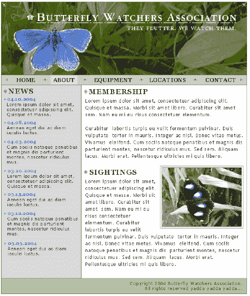
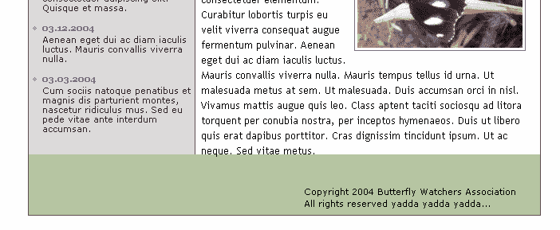
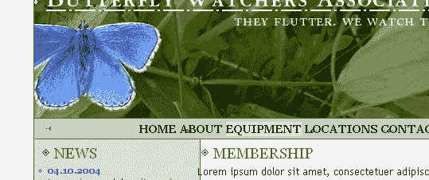
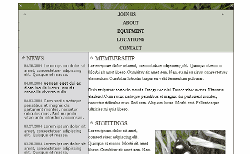
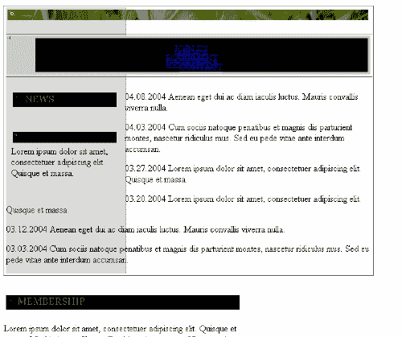

# 表格与 CSS——生死之战

> 原文：<https://www.sitepoint.com/tables-vs-css/>

我第一次上网是通过一个哑终端。过了一会儿，它的单色屏幕从明尼苏达州的一台服务器上喷涌出巨蟒剧团《圣杯》的完整剧本。这简直不可思议。我们没有鼠标，没有花哨的界面，当然也没有 24 位的颜色。地鼠统治一切。为了搜索，我们使用了阿奇和维罗妮卡[。没有人听说过万维网。有一段时间，这似乎就足够了。](http://www.netlingo.com/more/gopher.html)

过了一段时间，奇怪的代码开始污染我所有的搜索。我可以通过它阅读页面，但它仍然很烦人。当有人向我解释这是 HTML，一种“互联网的图形语言”时，我已经学会了将它作为背景噪音过滤掉。我被带到一台可以显示多达 256 种颜色的电脑前，展示了第一个版本的[马赛克](http://archive.ncsa.uiuc.edu/SDG/Software/Mosaic/NCSAMosaicHome.html)。一切都不再一样了。

自那时以来，我们已经走过了漫长的道路。技术有了令人难以置信的进步，网络的面貌已经被革新、反思和重塑了无数次。自从我开始从事网页设计以来，我经历了基于表格的设计、JavaScript 困境、CSS 成长的烦恼以及最重要的，网页标准的出现和广泛采用。

极客互联网的问题在于，它是在极客的想法下创建的。没有背景颜色和花哨图像的位置，只有内容。甜蜜的内容。很难反驳这种理想，但事实是，我们都喜欢在冲浪时有点活力。桌子的出现解决了我们的困境。最后，我们有了一个可控的方式来制作布局！这就敲定了这笔交易。我们开始想办法欺骗系统。不能有纯色 1 像素线？只要扔一个间隔 GIF，背景颜色和更多的表格单元格在那里，你就设置好了！控制不了排版？使用另一个`<font>`标签！

当 CSS 和标准出现的时候，我已经这样设计了很多年。它与众不同，高效，性感。我深深地、强烈地接受了这种哲学。这是一些吸引我的程序员的东西，产生精简的、平均的代码，将布局从内容中分离出来，同时仍然为漂亮的设计留出空间。我就这样单纯的爱上了它，从此再也没有回头。

直到现在。

关于标准和 CSS 已经说了很多了。像每一个好的流行语一样，它们被誉为下一个大事件。它始于道格拉斯·鲍曼对《T2》和《连线》的重新设计。2003 年，泽尔德曼写了《用网络标准设计 T4》，我们都明白了。各地的设计师都在拥抱这一新方向。这是句法上的。这是语义上的。它又快又轻。

话又说回来，还是有很多人把间隔 GIF 称为自己的朋友。他们仍然和桌子打交道。有些甚至使用了`<font>`标签。他们说这更容易，更好的支持和更快的发展。谁是对的？这里有没有一个合适的立场？

我决定自己进行一个小实验，看看事情是如何变化的，以及我们是否因此变得更好。

挑战:

1.  在图像编辑程序中为一个假想的网站设计制作一个构图。

3.  使用 [HTML 4.01](https://www.w3.org/TR/html4/) 匹配设计。使它符合标准(因为我们应该为这个高度主观的实验提供某种度量)。用桌子做。不用 CSS 做。

5.  用 [XHTML 1.0 Transitional](https://www.w3.org/TR/xhtml1/) 匹配设计。可用性和可访问性代码。使用 CSS。避开表格(除非设计有表格数据)。

7.  通过步骤 1 至 3 记录印象。

9.  审视利弊。我们得到了什么？我们失去了什么？我们的立场是什么？

11.  达到涅槃！

##### 阶段 1:设计你的网站

我开始为我的设计制作假人。我在为一个名为蝴蝶观察者协会的虚构组织工作。他们可能是我遇到的最好的客户，因为他们没有参与设计过程。虽然这可能不切实际，但我正试图想出一些确实能吸引这样一群人的东西，所以——对我的目标受众进行定型——我选择了带有经典字体的保守布局。

我希望这是一个紧凑的小数字，有效且切中要点。而且，我希望它有蝴蝶。没有蝴蝶在里面我什么也做不了，所以我开始寻找一个形象来带路。我很快就在 [stock.xchng](http://sxc.hu/browse.phtml?f=view&id=19566) 找到了。叶子上的蓝色蝴蝶实际上决定了网站的调色板。经过一些裁剪、对比度增强和选择性蒙版，这个图像就可以作为我们的页眉了。

我心中的编码者总是在设计过程中加入一些可访问性的预见，所以我试图将最终产品中的图像保持在最少。因此，在使用 Garamond Smallcaps 一段时间后，我决定使用 Georgia 进行导航，接受它作为合适的替代品(最坏的情况是:如果客户机没有 Georgia，Times New Roman 全部大写看起来足够好了)。不过，我将 Garamond 留在了标题中，因为标题将是一个图像，并且因为我发现 Georgia 的“C”[spur](http://desktoppub.about.com/cs/typeanatomy/g/spur.htm)对于设计的这个特定部分来说完全是攻击性的。

我用深灰色的 Trebuchet MS 做文字，用 Verdana 做新闻，因为小尺寸看起来很棒。关于在同一个设计中使用四种字体，有成文和不成文的规定。他们中的大多数人都同意你不应该这样做，但是我今天觉得很鲁莽。

以我对蝴蝶和观赏蝴蝶的人极其有限的知识，我认为在主页上突出稀有蝴蝶观赏点是一件有趣的事情。这个团体也需要更多的蝴蝶观察者，所以我们会加入会员信息。对于任何足够大的组织来说，新闻板块也是*的必要条件*，所以我增加了一个。接下来，一个版权声明(因为客户对这些东西很挑剔)，一些定制的像素子弹和装饰品，一个时髦的口号(*他们飘动。我们看着他们。*)，标题下有水平导航的两列布局，我们已经搞定了这一点。最后，我突出显示了菜单的“About”部分，以显示鼠标经过时的样子。这是它的样子。



很好。现在，关于代码。

##### 第二阶段:“在我年轻的时候，我们用了大量的间隔 gif，我们很喜欢！”

如果你是一个网页设计师，你可能会痛苦地熟悉下面的结构:

```
<table bgcolor="#ffffff" cellspacing="0" cellpadding="0" border="0" align="center" width="200"> 

  <tr> 

    <td colspan="3" bgcolor="#545454"></td> 

  </tr> 

  <tr> 

    <td bgcolor="#545454"></td> 

    <td width="100%" align="center">Content goes here.</td> 

    <td bgcolor="#545454"></td> 

  </tr> 

  <tr> 

    <td colspan="3" bgcolor="#545454"></td> 

  </tr> 

</table>
```

在餐桌上，那是一个盒子。习惯它，因为那是我们的基本构件。所有常见的疑点都在那里:间隔 gif、表格属性的无端使用、宽度属性和列跨度的强力规范。关于这个盒子有一点要说:它是实心的。他们不再这样做了！这个婴儿可能是向下兼容性的海报男孩！没有一个微不足道的 CSS 盒子能抵挡住这家伙从浏览器渲染引擎中滥用的那种行为…

但是，我言过其实了。让我们继续详细描述设计复制过程:

***小时 1***

哇哦。这几乎就像回到过去。在没有 CSS 的情况下，如何指定背景颜色呢？哦，是的… `bgcolor`。感谢代码自动完成。好的。制作盒子。预览。你的意思是我可以指定 align=center，这个东西实际上在所有浏览器中都是居中的？嗯，那很简单！

桌子毕竟还不错。感觉找到了久违的朋友。如果感觉这么好，我有点想重新开始吸烟。一个间隔 GIF，我是我自己设计的主人和指挥官…是的，先生，它很可爱。工作速度加快了。我喜欢桌子！

标题和菜单之间难看的空白是从哪里来的？


我没把它放在那里！哦，是的…当图像后的代码中有空白时，Explorer 的渲染引擎会这样做。


好的。删除代码中的空白…这很简单。

***小时 2***

我有多久没用 JavaScript 做翻车了？这就像不用蓝屏重拍《诺斯费拉图》一样。不过，诱惑还是存在的。[马科斯·夏瑞克](http://www.imdb.com/name/nm0775180/)在搬运棺材时，如果没有停止运动抖动，肯定会看起来更好……哦，好吧。为了历史的准确性我们来做一下。

```
<td ... onMouseOver="chBg(this);" onMouseOut="chBg2(this);" >...</td>
```

至于 JavaScript:

```
function chBg(obj) { 

    obj.bgColor = "#E1E5DB"; 

} 

function chBg2(obj) { 

    obj.bgColor = "#CBD1C3"; 

}
```

那就行了。

考虑到我有点生疏，这进展得很快。不过，我希望我有一种比嵌套表更好的制造衬垫的方法。这段代码开始看起来有点复杂。我应该添加一些评论，这样我们就可以在那里找到我们的位置。

不使用 CSS 我无法消除链接的下划线是什么意思？那不可能是对的！让我们谷歌一下这个东西。

***小时 3***

那不可能。那时候我们是怎么制作无下划线链接的呢？一定有办法的！

***小时 4***

好的。这糟透了。我不会因为不能去掉下划线就把该死的菜单变成图像。我也不是因为这个才进行 JavaScript 重定向。谷歌讨厌 JavaScript 重定向。它厌恶他们。我会让机器人看不到网站的大部分，我们不能这样。这个实验的规则是我定的，所以我可以打破它们。此外，自从 soup 发明以来，这种特殊的 CSS 就一直存在。就这样…让我们把`style="text-decoration: none;"`放在链接里，我们就有了无下划线的菜单。耶！

哦，好吧，我们快好了。很高兴看到我们可以制作真正的双柱，一直向下延伸。接招吧 CSS！如果能有一种不用两张桌子就能框住图像的方法就好了，尽管…

这里是我们现在所处的位置。

我不想告诉蝴蝶观察者，他们必须用相框预先格式化他们的蝴蝶照片。毕竟，这将是一个不断变化的形象。

刚刚意识到我已经有四个多小时没有在除了 Explorer 6 之外的任何游戏中预览了。这将会很难看…我点击了预览按钮，在 Firefox 中一切正常。那不可能。我推出歌剧。看起来很棒。我忘记了这一点！这太美了！而且在网景里面还能用！

***小时 5***

所以…很多…代码。保持…失去…位置。

在处理新闻部分时，我意识到用于文本大小的`<font>`标签控件非常有限。我就是找不到和我在比赛中用的一样的尺寸。`<font>`标签是邪恶的。它应该死去。

新闻上的文字出血如果没有某种形式的表格欺骗是无法实现的。填充又是一个问题…但是通过在里面放更多的桌子，没有什么是我们不能解决的。

最后，我在文本中的蝴蝶图像周围插入了更多的表格来模拟浮动。我觉得很脏。

***小时 6***

设计完成。它看起来与 comp 非常相似，正如你在这里看到的。

想看看里面有多少张桌子吗？检查一下这个。见出处。这是手工编码的。用桌子的时候干净的不能再干净了。

##### 第三阶段:桌子？我们不需要臭桌子！

这就是了。我们将看到基于标准的 CSS 编码是如何设计的。我将从标记内容开始。我尽力使这在语义上正确(每个元素都应该被标记)，并尽量避免额外的标记。

主标题是一个图像，但它仍然是一个标题，所以我将这样标记它:

`<h1>Butterfly Watchers Association. They flutter. We watch them.</h1>`

稍后我会担心如何正确显示(这里的理想是尽可能多地考虑内容，尽可能少地考虑布局)。其他标题(新闻、景点和会员)将被标记为`<h2>`。

菜单最终是一个无序列表，所以它将被标记为无序列表。段落没有类(我们将使用后代选择器将它们“挂”在包含它们的 div 上)。我将保存原始文档的一个版本，当设计完成时，我将检查我必须在布局中添加多少额外的标记(我们应该努力避免这种情况)。

完成的文档是[这里的](https://www.sitepoint.com/examples/cssvtables/css1.html)。看一下出处。是有效的 XHTML 1.0 过渡版。请注意，所有元素都被包含在适当命名的`<div>` s 中。新闻中的日期被包含在带有类`"date"`的`<span>` s 中。如您所见，代码非常简单。我们会努力保持这种状态。

***小时 1***

将“容器”边框设置为 1px。必须把东西放在中间。对于 Explorer，我设置了 text-align:center；到身体风格。对于其余的浏览器，“容器”样式上的`margin: 0 auto;`(翻译成`top=0, right=auto, bottom=0, left=auto`)就可以做到这一点。使 div 居中不像在表格中那样容易…

在“容器”样式中指定顶部和底部边距，以获得设计上方和下方的空白，这适用于大多数浏览器。探索者拧紧底部。多好啊。

在正文中添加 20px 的顶部和底部填充，而不是“容器”的边距，适用于所有浏览器。很可爱。

无序列表项`(<li>)`必须使用`display:inline`进行样式化；以便列表水平显示。我通过在每个`<li>`上指定 23px 的左填充，将项目符号设置为不重复的背景，并使用适当的 x 和 y 值来定位它，从而在元素之间添加自定义项目符号:

`background: url(menuBullet2.gif) no-repeat 4px 9px;`

菜单翻转使用链接的:hover 伪类。这里不需要复杂的 JavaScript。

为了在不影响可访问性的情况下用我们的蝴蝶图片来设计标题，我将它设置为`<h1>`的背景，并使用一个非常大的负文本缩进属性，如这里的所示。这会将文本向左移动很远，使其远离浏览器窗口，而将图像留在原处。屏幕阅读器和机器人仍然可以访问文本。CSS 得一分。

***小时 2***

菜单的第一项(主页)使用了不同的项目符号。我必须特别隐藏该项目的背景(另一个项目符号)，并用适当的项目符号替换它。有一个 CSS 伪类( [E:first-child](https://www.w3.org/TR/REC-CSS2/selector.html#child-selectors) )针对这个元素，但是对它的支持充其量是不确定的。我将不得不满足于在列表的第一项中添加一个额外的 id ( `frst`)。这样，我可以像这样设计它:

`#hMenu ul li#frst`

如果可能的话，应该避免这种事情——修改文档内容以适应布局通常不是一个好主意。

对于另一边的子弹(接触)，我将使用`<ul>`的背景:

`background: transparent url(menuBullet3.gif) no-repeat 615px 9px;`

在 CSS 中，我们不能让两列自动延伸到相同的高度。幸运的是，我们可以用图像来伪装它。一个简单的带有右边框的灰色图片就可以了。


我将它设置为“容器”的背景`<div>`，并指定`repeat-y`:

`background: #fff url(bgMain.gif) repeat-y;`

到目前为止，我们有[这个](https://www.sitepoint.com/examples/cssvtables/css2.html)。

***小时 3***

用 CSS 制作盒子比用表格要容易得多。能够单独指定边框真的很有用。

是时候设计`<h2>`标题了。项目符号是通过我之前解释的方法添加的(给`<h2>`添加左填充，将项目符号设置为不重复的背景，定位直到它看起来正确)。

要制作这些列，我只需为“景点”、“会员”和“新闻”div 设置特定的宽度。我将“新闻”放在左边，将“观察”和“会员”放在右边。`<div>`把“版权”弄清楚:两者都有；以便它位于浮动 div 之下(这对于页脚来说是非常标准的过程，因为浮动将自己从文档的正常流程中移除)。

新闻定位涉及到一些填充和负边距的处理。

拥有一个真正的 float 属性意味着我们可以在“sightings”部分的蝴蝶图像周围环绕一个段落，而不会有太多的麻烦。通过指定 1px 的实心边框并向图像添加填充来提供框架。

刚刚注意到浏览器中的一个奇怪的渲染错误:在第一次显示布局时，版权部分没有边框，并与它上面的部分重叠。调整窗口大小会恢复边框，但 div 仍会与其他部分重叠。可恶。



这是我们的立场。

***小时 4***

呈现错误与“观察”和“成员”部分的`float:right;`有关。将它们向左浮动可以解决这个问题。很奇怪，但不是完全出乎意料。

我准备在 Firefox 中第一次尝试这个。我点击“预览”，咬紧牙关，看了一眼。实际上还不错！(这一点，我觉得挺意外的)。菜单有太多的左填充，项目符号有几个像素。


只要稍微动动手脚，没什么是我们解决不了的。在这里，我们一头扎进 CSS 黑客的丑陋现实。

那并不太难。一些明智应用的额外规则为非 IE 浏览器修复了这个问题。为了给非 IE 浏览器提供不同的值，我使用了[！重要属性](https://www.w3.org/TR/REC-CSS2/cascade.html#important-rules)，它指定该特定规则应该优先于相同元素的其他规则。资源管理器不支持这种情况。

`background: url(menuBullet2.gif) no-repeat 4px 6px !important;  
 background: url(menuBullet2.gif) no-repeat 4px 9px;`

在 CSS 中，从上到下读取值，如果为同一个元素指定了多个值，则使用最后一个值。由于 Explorer 不支持`!important`，所以取第二个值，其他浏览器取第一个值。

完成了。[下面是结果](https://www.sitepoint.com/examples/cssvtables/butterflycss.html)。

##### 结论

***基于表格的设计……***

我在 Linux、Windows 和 Macintosh 平台下的所有浏览器中都见过这种设计，看起来几乎是一样的。它坚如磐石。表格得一分。

再说一次，每当我们想改变站点中的某些内容时，都有大量的代码需要处理。这可能是个问题。如果使用内容管理系统(CMS ),还会增加内容格式化方式的复杂性，不太方便用户。

我想我花了这么长时间才完成设计，因为我对相关的方法论非常生疏。如果让我再做一次，我可能会把时间缩短一到两个小时。

我认为使用基于表格的设计是一种繁重的工作。不过，我一直对设计的进步感到惊讶。从事纯基于 CSS 的设计，我已经习惯了一直分解设计，并且不得不追溯我的步骤来有选择地寻找 bug。我在这里什么都不用做。我不得不不断地在设计中加入表格。让我们看看 CSS 的进展如何。

***基于 CSS 的设计…***

用 CSS 构建设计感觉好多了。变化的直接性和代码的清晰性让我感觉对过程有了更多的控制。使用表格感觉就像用乐高积木搭建一样，而且是渐进式的改变，而 CSS 感觉更像是和一个训练有素的专业人员一起工作——我发出一系列的命令，然后看着它们被执行。

带宽也大大节省了。通过将样式放在它们自己的文件中，并对整个站点使用同一个文件，它们会更加明显。

将布局信息与内容分开也有很多好处。将来，我可以完全重新设计这个网站，而不涉及内容，就像 css Zen Garden 的例子一样。还有可访问性的附加值。十有八九，屏幕阅读器会被基于表格的设计卡住。机器人可能也会觉得这个更好(记住:谷歌是你最重要的盲人访问者)。

完成设计后，我在多种平台和浏览器中进行了测试。探险家 5.5 和 6 渲染它伟大。Explorer 5.0 搞乱了菜单，一些填充，并错放了标题图像，如图所示。



如果再进行一个小时的修补，这个问题无疑是可以解决的。不过，我不会这么做的。就本文的范围而言，我认为这已经足够好了，但是如果这是一个真正的客户机，我不会牺牲对 Explorer 5.0 的支持。这将意味着寻找更多的 bug，并对设计进行修改，直到它准备好。旧的浏览器在渲染方面做得很糟糕:

**IE4**



**网景 4.7x**



最好使用不支持的规则(如 Netscape 的`@import`)向这些浏览器提供文档的非样式版本。

尽管当你习惯了基于 CSS 的设计后，它真的很快，但是你必须花大量的时间去了解规则，盒子模型的差异，浏览器的怪癖和其他理论。这只能通过练习来实现。简而言之:只使用表格要简单得多。如果你想做纯 CSS 设计，就要做好投入时间学习的准备。即使你已经是一个经验丰富的开发人员，也要做好不懈地追踪 bug 的准备，有时会在这个过程中投入几个小时。

##### 胜利者！

CSS 和基于标准的设计相得益彰。看一眼每个设计的来源就足以让我选择这个。CSS 提供了许多其他的好处，大部分都与可访问性有关。但是，归根结底，这是因为我懒。如果我用桌子做这个设计，一年后客户联系我要求修改，我会告诉他我加入了外籍军团并逃离了这个国家。如果是用 CSS 做的，我会不假思索的试一试。

*鸣谢*
感谢艾娃·麦克布莱德，感谢他帮助我们使用[浏览器摄像头服务](http://browsercam.com/)来测试本设计。

## 分享这篇文章